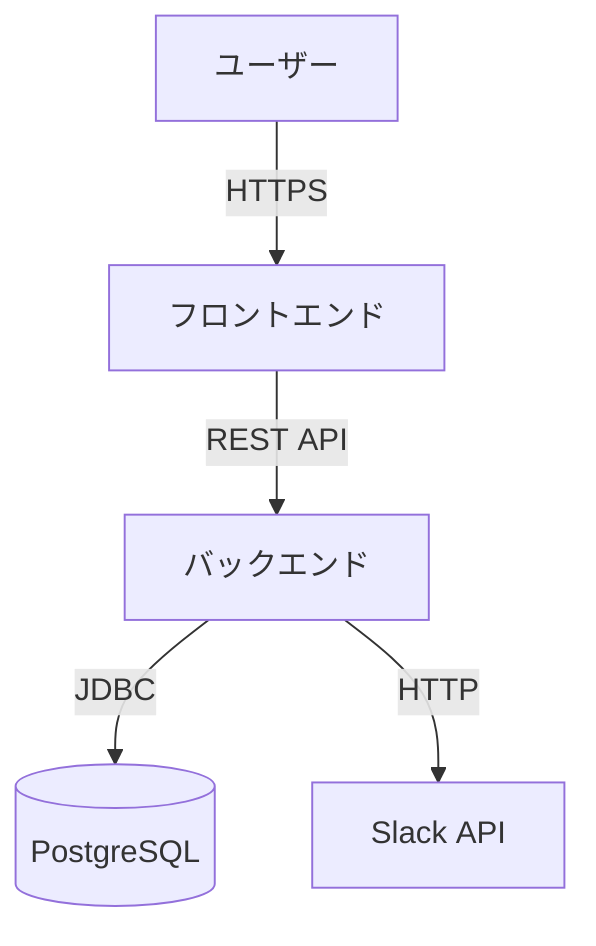

# AI活用研修テキスト（Claude編）— 2週間集中コース

Claude を使いこなす2週間集中コース  
基礎編 / 日常業務編 / 仕様化・中級 / 開発初級編 / 開発応用編  
バージョン 2.0 — 2026年5月

## 目次

- [はじめに — この研修の進め方](#はじめに-この研修の進め方)
  - [対象者と前提](#対象者と前提)
  - [本研修で繰り返し意識する用語: コンテキスト](#本研修で繰り返し意識する用語-コンテキスト)
  - [1日の進め方（標準）](#日の進め方標準)
  - [研修で扱うAI](#研修で扱うai)
  - [3つの利用形態](#つの利用形態)
- [大前提 — AI開発の情報セキュリティ](#大前提-ai開発の情報セキュリティ)
  - [遵守すべき大原則](#遵守すべき大原則)
  - [判断基準 — そのプロジェクトでAI開発は可能か](#判断基準-そのプロジェクトでai開発は可能か)
  - [具体的なNG例](#具体的なng例)
  - [研修中の具体運用](#研修中の具体運用)
- [研修の基本ポリシー](#研修の基本ポリシー)
  - [契約・利用ルール](#契約利用ルール)
  - [実行中によくあるエラーと対処（トラブルシュート）](#trouble-errors)
  - [利用環境](#利用環境)
  - [マインドセット](#マインドセット)
  - [演習の進め方 — 個人ペース尊重](#演習の進め方-個人ペース尊重)
- [禁則事項](#禁則事項)
  - [絶対に守ること](#絶対に守ること)
  - [違反時の対応](#違反時の対応)
  - [判断に迷ったら](#判断に迷ったら)
- [AI活用のメリット — ゼロイチを超え、専門家・共同作業者として使う](#ai活用のメリット-ゼロイチを超え専門家共同作業者として使う)
  - [ゼロイチ(何もないところから形にする)の大変さを AI が解消する](#ゼロイチ何もないところから形にするの大変さを-ai-が解消する)
  - [渡す素材が良ければ、出てくる叩き台も良くなる](#渡す素材が良ければ出てくる叩き台も良くなる)
  - [AI を「いつでもアサイン可能な色々な領域の専門家」「優秀な共同作業者」として扱う](#ai-をいつでもアサイン可能な色々な領域の専門家優秀な共同作業者として扱う)
  - [受講者に身につけてほしいスキル](#受講者に身につけてほしいスキル)
- [AI成果物の取り扱い — 「あなたの成果物」である](#ai成果物の取り扱い-あなたの成果物である)
  - [原則: AIが作ったものは「あなたが作ったもの」](#原則-aiが作ったものはあなたが作ったもの)
  - [渡す前に必ずやること: あなたが説明できる状態にする](#渡す前に必ずやること-あなたが説明できる状態にする)
  - [AIが間違うことを前提に組み立てる](#aiが間違うことを前提に組み立てる)
  - [機密情報・他人の権利を扱うとき](#機密情報他人の権利を扱うとき)
  - [具体的な渡し方の心得](#具体的な渡し方の心得)
  - [研修期間中のルール](#研修期間中のルール)
  - [解答例・サンプル成果物について](#解答例サンプル成果物について)
- [2週間カリキュラム概要](#週間カリキュラム概要)
  - [Day 1 — AIの基礎とClaude概説](#day-1-aiの基礎とclaude概説)
  - [Day 2 — Claudeの操作とプロンプト技法](#day-2-claudeの操作とプロンプト技法)
  - [Day 3 — 日常業務編① 議事録・社内文書の半自動化](#day-3-日常業務編①-議事録社内文書の半自動化)
  - [Day 4 — 日常業務編② 報告書・メール・Excel管理表](#day-4-日常業務編②-報告書メールexcel管理表)
  - [Day 5 — 仕様のMD化・CLAUDE.md](#day-5-仕様のmd化claude.md)
  - [Day 6 — Claude Code導入＋Skills/サブエージェント/Hooks](#day-6-claude-code導入skillsサブエージェントhooks)
  - [Day 7 — 開発初級① インタラクティブ開発でTODOアプリ（GitHub Issue駆動）](#day-7-開発初級①-インタラクティブ開発でtodoアプリgithub-issue駆動)
  - [Day 8 — 開発初級② 品質を考慮したチケット開発](#day-8-開発初級②-品質を考慮したチケット開発)
  - [Day 9 — 開発応用編 仕様駆動開発（SEとしての要求分析→仕様化→パートナーへ発注）](#day-9-開発応用編-仕様駆動開発seとしての要求分析仕様化パートナーへ発注)
  - [Day 10 — 複数プロジェクトの管理・報告フローを AI で半自動化](#day-10-複数プロジェクトの管理報告フローを-ai-で半自動化)
- [Claude Desktop の活用 — 定期業務の自動化（余裕があれば）](#claude-desktop-の活用-定期業務の自動化余裕があれば)
  - [CD-1. Claude Desktop とは — Claude Code との棲み分け](#cd-1.-claude-desktop-とは-claude-code-との棲み分け)
  - [CD-2. デスクトップにしかできないこと](#cd-2.-デスクトップにしかできないこと)
  - [CD-3. 自動化方式の選び方](#cd-3.-自動化方式の選び方)
  - [CD-4. ローカルファイルを読ませる2つの方法と「許可」の考え方](#cd-4.-ローカルファイルを読ませる2つの方法と許可の考え方)
  - [CD-5. 定期実行の考え方 — Cron をやさしく](#cd-5.-定期実行の考え方-cron-をやさしく)
  - [CD-6. ハンズオン①: 共有フォルダの文字起こしを裏で議事録化し、終わったら通知（45分）](#cd-6.-ハンズオン①-共有フォルダの文字起こしを裏で議事録化し終わったら通知45分)
  - [CD-7. ハンズオン②: 共有された各チームの進捗報告を横断サマリにまとめる（45分）](#cd-7.-ハンズオン②-共有された各チームの進捗報告を横断サマリにまとめる45分)
  - [CD-8. 業務での役立て方と注意](#cd-8.-業務での役立て方と注意)
- [開発自動化ループ — 無人スプリント運用（発展）](#開発自動化ループ-無人スプリント運用発展)
  - [DL-1. 何をしたいのか — Day 6〜9 の先にある無人開発](#dl-1.-何をしたいのか-day-69-の先にある無人開発)
  - [DL-2. メリットとデメリット](#dl-2.-メリットとデメリット)
  - [DL-3. 仕組みの全体像（ワークフローとループ）](#dl-3.-仕組みの全体像ワークフローとループ)
  - [DL-4. 品質ゲートとガードレール](#dl-4.-品質ゲートとガードレール)
  - [DL-5. ループの自己成長 — 問題・教訓・人の助言を貯める](#dl-5.-ループの自己成長-問題教訓人の助言を貯める)
  - [DL-6. 役割分担 — 本研修のサブエージェントで](#dl-6.-役割分担-本研修のサブエージェントで)
  - [DL-7. SPEC を書く（完了の定義）](#dl-7.-spec-を書く完了の定義)
  - [DL-8. 演習 — 何を身につけるか](#dl-8.-演習-何を身につけるか)
- [読み物 — 研修後の発展学習](#読み物-研修後の発展学習)
- [読み物1: ハーネスエンジニアリング(Harness Engineering)](#読み物1-ハーネスエンジニアリングharness-engineering)
  - [1-1. ハーネスとは何か](#ハーネスとは何か)
  - [1-2. なぜ「ハーネスエンジニアリング」という言葉が生まれたか](#なぜハーネスエンジニアリングという言葉が生まれたか)
  - [1-3. AI開発の概念の系譜 — プロンプトから現在まで](#ai開発の概念の系譜-プロンプトから現在まで)
  - [1-4. 本研修で扱った要素とハーネスの対応](#本研修で扱った要素とハーネスの対応)
  - [1-5. ハーネスエンジニアリングの主要な原則](#ハーネスエンジニアリングの主要な原則)
  - [1-6. ハーネスエンジニアリングの将来像](#ハーネスエンジニアリングの将来像)
  - [1-7. 業務に持ち帰った後の発展学習リソース](#業務に持ち帰った後の発展学習リソース)
- [読み物2: 自動化開発ループの技術詳細](#読み物2-自動化開発ループの技術詳細)
  - [2-1. 位置づけ — 中間レイヤーとしてのループ](#位置づけ-中間レイヤーとしてのループ)
  - [2-2. 全体フロー — 人・Routine・ループの3レーン](#全体フロー-人routineループの3レーン)
  - [2-3. ループの状態機械（6フェーズ＋ゲート）](#ループの状態機械6フェーズゲート)
  - [2-4. 無人完走の機構（auto mode / /goal / Routine）](#無人完走の機構auto-mode-goal-routine)
  - [2-5. フリート構成とモデル配置](#フリート構成とモデル配置)
  - [2-6. 品質ゲート G-Plan／G0〜G4 と DoD](#品質ゲート-g-plang0g4-と-dod)
  - [2-7. 観点網羅（qa-coverage：7×9）](#観点網羅qa-coverage79)
  - [2-8. 検収の独立性とリワードハッキング防止](#検収の独立性とリワードハッキング防止)
  - [2-9. 統制（GOVERNANCE）と文脈設計](#統制governanceと文脈設計)
  - [2-10. アプリ・アーキテクチャ](#アプリアーキテクチャ)
  - [2-11. 安全装置 — フックと多層防御](#安全装置-フックと多層防御)
  - [2-12. リポジトリ構成（オーバーレイ）](#リポジトリ構成オーバーレイ)
  - [2-13. トレーサビリティと撤退](#トレーサビリティと撤退)
  - [2-14. 自己成長 — 教訓・棚卸し・改訂提案](#自己成長-教訓棚卸し改訂提案)
  - [2-15. 運用上の注意](#運用上の注意)
- [読み物3: AIでCDを自動化・半自動化する](#読み物3-aiでcdを自動化半自動化する)
  - [2-1. CIとCDの違い(おさらい)](#ciとcdの違いおさらい)
  - [2-2. CDの典型的なフロー](#cdの典型的なフロー)
  - [2-3. 本番への配信戦略(blue-green / canary / rolling)](#本番への配信戦略blue-green-canary-rolling)
  - [2-4. 本研修サンプル(02-todo-vibe-coding)をCDするとどうなるか](#本研修サンプル02-todo-vibe-codingをcdするとどうなるか)
  - [2-5. AIでCDを自動化・半自動化する — デザインパターン集](#aiでcdを自動化半自動化する-デザインパターン集)
  - [2-6. CD観点の2026年5月現在のベストプラクティス(10項目)](#cd観点の2026年5月現在のベストプラクティス10項目)
  - [2-7. AIとCDの統合トレンド(2026年5月現在)](#aiとcdの統合トレンド2026年5月現在)
  - [2-8. 業務適用時の注意点](#業務適用時の注意点)
  - [2-9. 業務に持ち帰った後の発展学習リソース](#業務に持ち帰った後の発展学習リソース-1)
- [付録A: チートシート](#付録a-チートシート)
  - [A-1. モデル選び早見表](#a-1.-モデル選び早見表)
  - [A-2. プロンプト・テンプレート集](#a-2.-プロンプトテンプレート集)
  - [A-3. Claude Code よく使うコマンド](#a-3.-claude-code-よく使うコマンド)
  - [A-3. キーボードショートカット](#a-3.-キーボードショートカット)
  - [A-4. 困ったときの対処法](#a-4.-困ったときの対処法)
- [付録B: 用語集](#付録b-用語集)
  - [AI / LLM の基礎用語](#ai-llm-の基礎用語)
  - [Claude 固有の用語](#claude-固有の用語)
  - [開発・SE・QA関連の用語](#開発seqa関連の用語)
- [付録C: 参考リンク](#付録c-参考リンク)
  - [Claude公式](#claude公式)
  - [MCP関連](#mcp関連)
  - [参考記事](#参考記事)
  - [ビジネス文書テンプレ参考](#ビジネス文書テンプレ参考)
  - [研修終了後のロードマップ](#研修終了後のロードマップ)
- [付録D: 画面設計書サンプル(Day 9 仕様駆動開発の参考)](#付録d-画面設計書サンプルday-9-仕様駆動開発の参考)
  - [画面設計書サンプル: TODO 一覧画面](#画面設計書サンプル-todo-一覧画面)
- [付録E: Claude 4.8(Opus 4.8)の主な新機能](#付録e-claude-4.8opus-4.8の主な新機能)
  - [E-1. 目玉は「正直さ(honesty)」の向上](#e-1.-目玉は正直さhonestyの向上)
  - [E-2. claude.ai の努力度コントロール(effort control)](#e-2.-claude.ai-の努力度コントロールeffort-control)
  - [E-3. Claude Code の新機能](#e-3.-claude-code-の新機能)
  - [E-4. 開発者向け: Messages API の更新](#e-4.-開発者向け-messages-api-の更新)
- [付録F: Agent Skills 仕様（agentskills.io）](#付録f-agent-skills-仕様agentskills.io)
  - [F-1. 仕様の要点](#f-1.-仕様の要点)
  - [F-2. フィールドの制約（文字数制限など）](#f-2.-フィールドの制約文字数制限など)
  - [F-3. description の書き方が要](#f-3.-description-の書き方が要)
  - [F-4. 原典リンク](#f-4.-原典リンク)
- [付録G: エージェント／プラグインのマーケットプレイス（と信頼性の見極め）](#付録g-エージェントプラグインのマーケットプレイスと信頼性の見極め)
  - [G-1. 現時点の入手手段](#g-1.-現時点の入手手段)
  - [G-2. 信頼度の調べ方（入れる前のチェック）](#g-2.-信頼度の調べ方入れる前のチェック)
- [付録H: 受け入れ条件（AC）と完了の定義（DoD）](#付録h-受け入れ条件acと完了の定義dod)
- [付録I: 自動化開発の参考資料と更新履歴](#付録i-自動化開発の参考資料と更新履歴)

---

# はじめに — この研修の進め方

本研修は、Anthropic社のAIアシスタント「Claude」、そして開発作業向けに強化されたCLIツール「Claude Code」を、業務で実践的に使いこなすことを目的としています。 2週間（10営業日 × 1日7.5時間）の集中コースとして、座学・ハンズオン・開発演習を織り交ぜながら進めます。

> **ℹ️ 情報**
>
> **本研修のゴール**
>
> 受講後、AIに必要な前提・文脈・段取りを適切に渡して、ビジネス文書から本格的なアプリ開発まで安心して任せられる状態を目指します。具体的には:
>
> - 誰向け・何を伝えたいか・成功条件を最初に整理してAIに渡せる
> - AIの理解が自分の意図と合っているかを作業前に必ず確認できる
> - コンテキスト・トークン消費を意識して、必要な情報を必要な分だけ渡せる
> - 計画段階で詰める・反復で見直す・専門家を編成する・進捗を報告させる、といった進め方の作法を場面に応じて使い分けられる
>
> 「ふわっと丸投げしてAIが察してくれる」のとは正反対で、段取りを整えて、何度でも壁打ちしながら、確実に成果物に辿り着く進め方を身につけます。「AIに使われる」のではなく「AIを使い倒す」マインドが目標です。
>
> 研修終了後、各自が自分の業務にAIを取り入れて、定常的に時短・品質向上を実現できるところまで持っていくのが本研修の本当のゴールです。

## 対象者と前提

- 社内のIT職・事務職・SE/PG経験者
- AIツールの実務利用は未経験〜初心者を想定
- プログラミング経験は問わない。開発初級編（Day 7〜9）はSpring Boot研修受講者レベルの開発知識があると望ましい

## 本研修で繰り返し意識する用語: コンテキスト

本研修では「コンテキスト」という言葉が何度も出てきます。最初に簡単に予告しておきます(詳細は Day 1 で扱います)。

- **コンテキスト:**あなたがAIに渡す情報・文脈のすべて。会話履歴、添付ファイル、ツールの実行結果など、AIが参照する情報全部
- **コンテキストウィンドウ:** AIが一度に扱える情報量の上限。これを超えるとAIは古い情報を忘れたり、精度が落ちたりする
- **トークン:**コンテキストウィンドウの単位(英語1単語が約1〜2トークン、日本語1文字が約1〜2トークン)

身近な例えで言うと、コンテキストは「会議室に持ち込んだ全資料・配布物・口頭で話した発言のすべて」のようなものです。資料が多すぎて整理されていないと、人間でも何を頼まれたか分からなくなる ― AI も同じです。

本研修では、AIに渡す情報を必要なときに必要な分だけ整った形で渡せるようにする工夫を、Day 1からDay 10まで一貫して扱います。これが「AIに振り回されない」「AIを使い倒す」ための土台になります。

## 1日の進め方（標準）

**9:30〜10:00**前日の振り返り＋当日の目標確認

**10:00〜12:00**午前セッション（座学＋ハンズオン）

**12:00〜13:00**昼食休憩

**13:00〜15:00**午後セッション①（ハンズオン中心）

**15:00〜15:15**休憩

**15:15〜17:00**午後セッション②（演習・課題）

**17:00〜17:30**　1日の振り返り、宿題提示

各Dayの所要時間は本テキスト本文中に明示しています。所要時間は目安であり、進捗に応じて調整可。

## 研修で扱うAI

本研修では**Claude**（Anthropic社）を使用します。同社の「Claude Max 5xプラン」を**受講者各自で個別契約**します。料金プランの詳細・契約手順は別ファイル「*AI研修_受講者向け_Claude_Max契約手順.docx*」を参照してください。

## 3つの利用形態

Claudeには大きく3つの利用形態があります。本研修では**主にブラウザ版**を使いますが、それぞれの特性を理解しておきましょう。

<table>
<colgroup>
<col style="width: 25%" />
<col style="width: 25%" />
<col style="width: 25%" />
<col style="width: 25%" />
</colgroup>
<thead>
<tr class="header">
<th>利用形態</th>
<th>メリット</th>
<th>デメリット</th>
<th>本研修での使用</th>
</tr>
</thead>
<tbody>
<tr class="odd">
<td>① ブラウザ版<br />
(claude.ai)</td>
<td>・どの端末でも使える<br />
・自宅PCからもOK<br />
・インストール不要<br />
・Artifactsで結果が即見える<br />
・ファイル作成機能でWord/Excel/PDF出力可</td>
<td>・ローカルファイル直接操作は不可<br />
・OS連携が限定的<br />
・タブを閉じると会話が見つけにくい</td>
<td>主に利用</td>
</tr>
<tr class="even">
<td>② デスクトップアプリ</td>
<td>・ブラウザより軽快<br />
・ファイル/画像連携が直感的<br />
・通知機能<br />
・タスクバー常駐</td>
<td>・端末ごとにインストール要<br />
・社内PC環境に依存<br />
・自宅PCにも入れる必要</td>
<td>任意（推奨）</td>
</tr>
<tr class="odd">
<td>③ Claude Code<br />
(CLI/ターミナル)</td>
<td>・ファイル直接編集<br />
・コマンド実行<br />
・Skills/Hooks/サブエージェント<br />
・本格開発に最適</td>
<td>・Node.js環境要<br />
・CLI操作に慣れが必要<br />
・社内ネットワークの制約あり</td>
<td>Day 6, 8, 10で利用</td>
</tr>
</tbody>
</table>

> **💡 ヒント**
>
> **本研修の方針**
>
> 「家からでも・どの端末からでも操作できる」ことを重視し、**基本はブラウザ版で操作**します。開発演習（Day 7以降）でClaude Codeを併用しますが、その際もブラウザ版との使い分けを意識して進めます。

# 大前提 — AI開発の情報セキュリティ

> **🛑 警告**
>
> **研修開始前に必ず読んでください**
>
> AIを使用しての開発は、インターネット上の他社サーバーへのアップロード（情報提供）が伴う行為です。プロンプトに入力したコード・データ・仕様情報は、選択したAIサービス（Claude）の運営会社サーバーへ送信されます。これは技術的にも法的にも、外部送信に該当します。
>
> **「アップロード」にあたる行為は、ファイル送信だけではありません。**以下はすべて外部送信に該当します:
>
> - ファイルのドラッグ&ドロップ・添付による送信
> - テキストをコピー&ペーストでプロンプト欄に貼り付けること
> - 業務システムや資料のスクリーンショット(画面キャプチャ)を画像として送信すること
> - 会議の議事録・メール本文・SlackやTeamsの発言の貼り付け
> - URLを送信して、AIにそのページ内容を取得・解釈させる行為
>
> 「ファイルをアップロードしていないからセーフ」ではなく、どんな形式であってもAIに見せた情報は外部に出ていると認識してください。

## 遵守すべき大原則

1.  開発依頼元のセキュリティ基準に従うこと。発注元・所属組織のセキュリティポリシー、契約書、機密保持契約（NDA）が定める情報取り扱いルールに従ってください。
2.  AI使用がNGならアップロードもNGと同義。「AIで開発してはいけない」と定められているプロジェクトでは、AIへの情報入力も当然NGです。「ちょっとだけなら…」は通用しません。
3.  許可されたAI開発環境（提供されたAI環境）を使用すること。所属組織が用意した・許可した環境のみを使うこと。個人契約のAI、家庭用PC、未承認の社外サービスで業務情報を扱ってはいけません。

## 判断基準 — そのプロジェクトでAI開発は可能か

新規プロジェクトに着手する際、以下を確認してから始めます。

| 確認項目                                                   | 確認先・確認方法             |
|------------------------------------------------------------|------------------------------|
| 発注元との契約書にAI使用の制限はないか                     | 契約書原文、法務部、営業担当 |
| 所属組織のAI利用ガイドラインに沿っているか                 | 社内ポータル、情報システム部 |
| 使用予定のAIサービスは組織で承認されているか               | 情報システム部、上長         |
| 扱う情報の機密区分は何か（公開／社外秘／関係者外秘／極秘） | 情報の出所、ラベル、上長     |
| 扱う情報に個人情報・特定個人情報が含まれるか               | データ自体の内容確認         |
| 扱う情報に第三者の知財・営業秘密が含まれるか               | 契約書、関連資料             |

## 具体的なNG例

- 顧客から預かったソースコードを、許可なくClaudeに貼り付ける
- **ソースコード一式をお客様の許可なくアップロードして解析させる**（一部の貼り付けと同様、または規模的にそれ以上に重大）
- **テスト用データをアップロードする**　※厳禁。テストデータには本番のコピー・マスキング不十分な実データが含まれることがあり、お客様情報や業務情報が漏洩する可能性が極めて高い
- 社外秘の仕様書をAIに要約させる（オプトアウト設定だけでは不十分なケースがある）
- 個人情報（実名・住所・連絡先・マイナンバー等）を含むデータをAIに入力する
- NDA下のプロジェクトで、許可されていない個人契約AIを使う
- 会社支給PCで、社外の業務委託用AI環境にログインして自社情報を入力する

## 研修中の具体運用

- 本研修で使用するのは受講者個人のClaude Max契約。研修の演習データのみを扱う前提
- 本研修の演習で所属組織の**機密情報・顧客情報を題材にしない**（仮名化・架空データで代替）
- 判断に迷う場合は**必ず講師に相談してから操作する**
- 研修終了後、業務で使う際は所属組織のAI利用規程を改めて確認すること

> **⚠️ 注意**
>
> **これは法令・契約遵守の話です**
>
> セキュリティ基準を破ると、個人の懲戒処分、組織の対外損害賠償、顧客との信頼関係喪失、法令違反による行政処分など、深刻な影響が出ます。「AIが便利だから」「他の人もやってるから」は理由になりません。「判断に迷ったら止める、確認してから動く」を徹底してください。

# 研修の基本ポリシー

## 契約・利用ルール

- 受講者は全員 Claude Max 5xプラン（約\$100/月）を各自で個別契約する
- 契約は1ヶ月のみ。契約直後に自動更新OFFを設定し、翌月課金を止める
- 追加使用量（使用量クレジット）の自動課金をOFFにする：画面左下のアカウント名／アイコンをクリック →「設定」→「使用量」タブ →「追加使用量（使用量クレジット）」のスイッチをOFF（`claude.ai/settings/usage`）。これでプラン上限に達してもAPIクレジットへの自動課金が止まり、月額料金以外は発生しません。なおClaude Code利用時は別系統で、APIクレジット利用の確認が出たら拒否するか、`claude logout`→Maxプランの資格情報で `claude login` し直すとプラン枠内に限定できます
- 研修期間中はそのまま使え、解約予約日（契約から1ヶ月後）まで利用可能
- 経費精算は所属部署の規程に従う（事前申請の必要性を要確認）

## 実行中によくあるエラーと対処（トラブルシュート）

無人ループや長時間の開発セッションでは、Anthropic 側の一時的な容量不足によるエラーに当たることがあります。いずれも受講者側の操作ミスや使用量超過ではなく、サーバーが混んでいるサインです。代表的な2つと、研修での対処を示します。

> **⚠️ 注意**
>
> **エラー①：`API Error: 529 Overloaded`**
>
> Anthropic のサーバーが一時的に高負荷で、リクエストを受け切れない状態です。**使用量の上限ではなく、料金にもカウントされません。**「This is a server-side issue, usually temporary」と出ます。

> **⚠️ 注意**
>
> **エラー②：`… is temporarily unavailable, so auto mode cannot determine the safety of …`**
>
> auto mode（自動承認）で動かしているとき、安全判定に使うモデル（Opus など）が一時的に容量不足で、書き込み（Write/Edit）やコマンド実行（Bash）の安全可否を判定できない状態です。**これも一時的なサーバー側の問題で、設定の誤りではありません。**読み取り・コード検索などの read-only 操作は判定が不要なので、その間も使えます。

**なぜ起きるか（遠因）。**どちらも直接の原因はサーバー側の容量不足ですが、**Opus 中心で・長時間・大量のトークンを使うセッションほど、混雑時間帯に重い処理を投げ続けるため、容量不足に遭遇しやすくなります。**本研修は仕様駆動・無人ループなど Opus を多用する場面が多いので、遭遇する可能性を前提にしておきます。

**研修での基本対処：引き継ぎ MD を作ってウィンドウを切り替え、セッションを区切って再開する。**長い1本のセッションを延々と続けるのではなく、区切りのよいところで「ここまでの作業内容・次にやること」を `docs/MEMORY.md` などに書き出させ、いったんウィンドウ（セッション）を閉じて、新しいウィンドウで MD を読み込んで再開します。こうしておくと、**万一エラーで止まっても作業内容を失わず、たまったコンテキストもリセットできます。**これを研修中の基本的な進め方とします。

**あわせて使う一次対処。**サーバーが本当に混んでいるときは、ウィンドウを切り替えても少し待つ必要があります。次も併用します。

- 少し時間を置いてから再試行する（数十秒〜数分）。混雑が解消すれば通る。
- `/model` で別のモデル（例：Sonnet）に切り替える。容量はモデルごとに別管理なので、Opus が混んでいても別モデルなら通ることがある。
- `status.claude.com` で障害情報を確認する。大きな障害中なら復旧を待つ。
- 読み取り・コード検索は影響を受けないので、その間に調査や設計だけ進める。

なお、エラー②でうまく書き込めないときは、AI に保存予定の内容をそのまま画面に出させ、こちらで手動でファイルに貼り付けて保存しておくと、サービス復帰後に続きから進められます。

## 利用環境

- 業務PCでも自宅PCでも、Webブラウザがあれば利用可能
- 業務時間外の利用は構わないが、いつ・どんな目的で使ったか講師に申告する
- 同じアカウントを複数端末で同時にログインするとセッション衝突する可能性あり

## マインドセット

> **💡 ヒント**
>
> **本研修で最も大切なマインド**
>
> **「なるべくClaudeにやらせる」**
>
> 設定もドキュメント調査もMD作成も、すべてClaudeに頼んでしまいましょう。「自分で完璧に理解してから使う」のは非効率です。「使いながら覚える」スタンスがClaude時代の正攻法です。

例えば「Skillsって何？使ってみたい」というレベルで構いません。Claude自身に「Skillsを使ってみたいけど何もイメージがわかない。説明してから作成を手伝って」と頼めばOKです。Claudeは公式ドキュメントを参照しながら、対話的に進めてくれます。

## 演習の進め方 — 個人ペース尊重

> **ℹ️ 情報**
>
> **「時間内に終わらせる」より「腹落ちさせる」が優先**
>
> 本研修の各演習には「目安時間」を示していますが、これは「あくまで目安」です。必ずしも時間内に終わらせる必要はありません。

### 基本方針

- 各演習は受講者個人のペースで進めてください
- 目安時間を超えても、内容を理解し腹落ちさせることを優先
- 1日のDayの中で**すべての演習を完了することを必須としません**
- その日に終わらなかった演習は、翌日朝のフォローアップ時間 or 個人時間で継続
- Day全体の流れと到達目標を意識しながら、自分のペースで深く学ぶことを優先

### 講師のサポート

- 各Dayの最後30分〜1時間は「フォローアップ」時間として、前日終わらなかった演習の補完や質問対応に充てる
- 翌日のDayが重い場合は、当日午前中に余裕を持たせる調整を行う
- 進捗の遅れは咎めず、個別フォローを優先

### 修了の判断基準

| 判断項目       | 基準                                                         |
|----------------|--------------------------------------------------------------|
| 主要演習の完遂 | 各Dayの主要演習を1つ以上完遂していること                     |
| 振り返りの提出 | 各Day末尾の振り返り演習は必ず実施（小さくてもOK）            |
| 説明できる状態 | 演習成果物が完成していなくても、何を学んだか言語化できればOK |
| 最終総まとめ   | Day 10の総合振り返りで個別到達度をまとめる                   |

> **💡 ヒント**
>
> **「完成度」より「理解度」**
>
> 研修成果は「演習をすべて完成させた」ことよりも「各テーマを自分の言葉で説明でき、業務に持ち帰れる」状態を目指します。AI時代の学習は、サンプルを完成させることがゴールではなく、考え方と勘所を身につけることがゴールです。

# 禁則事項

Claudeは強力なAIですが、強力ゆえに使い方を誤ると問題を引き起こします。研修中は以下のルールを**必ず**守ってください。

## 絶対に守ること

> **⚠️ 注意**
>
> **禁則事項一覧**
>
> 1.  **有償プランを勝手に切り替えない** — 各自契約のMax 5xプランをそのまま使う。Max 20xへのアップグレードや追加アドオンの購入はしない。
> 2.  **他の有償AIサービスを併用しない** — ChatGPT Plus、Gemini Advanced、Cursor有料版などとの併用は研修中は禁止。研修の到達度測定のためにもClaude単独で進める。
> 3.  **攻撃的な利用をしない** — 他システムへの侵入試行、脆弱性スキャン、フィッシング作成、なりすまし、ハラスメント目的の文章作成など、不正・不当な目的での利用は厳禁。
> 4.  **他社APIの利用は事前許可制** — MCPで外部サービスに繋ぐ場合、OpenAI API、Google API、その他第三者APIの利用前に必ず講師の許可を取る。
> 5.  **個人アプリ開発に流用しない** — 研修アカウントは研修目的のみ。個人副業や私的プロジェクトへの利用は禁止。研修終了後の業務利用は上長と相談の上で。
> 6.  **機密情報を入力しない** — 社外秘情報、個人情報、パスワード等の機微情報をプロンプトに入力しない。万が一の漏洩リスクを避ける。
> 7.  **業務時間外利用は申告制** — 自宅利用は構わないが、いつ・どんな目的で使ったかを翌営業日に講師へ共有する。
> 8.  **オプトアウト設定を必ず行う** — Free/Pro/Maxプランでは入力内容がClaudeの学習に利用される可能性がある。研修開始前に各自で「データプライバシー設定」のオプトアウトを行うこと。

## 違反時の対応

上記違反が確認された場合、講師から本人に直接フィードバックします。改善が見られない場合や明らかに重大な違反（攻撃的利用・機密情報の意図的入力など）は、人事部門へ報告します。Anthropic社の利用規約違反に該当する重大なものは、本人および所属社へ報告されることがあります。

意図しない違反（うっかりオプトアウト設定し忘れた、など）は、気付いた時点で講師に相談すれば問題ありません。「正直な共有と早めの修正」をお願いします。

## 判断に迷ったら

「これってOK？」と少しでも思ったら、操作する前に講師に質問してください。研修期間中の判断ミスは咎めません。むしろ「これは禁則だった」と気付いたタイミングで報告してくれる方が、安全で透明な運用ができます。

> **💡 ヒント**
>
> **一時利用には「インコグニートモード(Incognito)」が便利**
>
> Claudeには**インコグニートモード**(右上のゴーストアイコン 👻 をクリックして開始)という機能があり、以下の特性があります。
>
> - 会話内容は**モデルの学習に使われない**(プライバシー設定で学習をONにしている場合でも学習対象外)
> - 会話履歴は**左サイドバーに保存されない**(履歴に残らない、後から検索できない)
> - 会話を閉じると、その会話はアクセスできなくなる(短期間でAnthropic側からも削除される)
>
> 以下のような**一時的・使い捨ての用途**には、インコグニートモードを使うとオプトアウト設定と同等の扱いになり便利です:
>
> - ちょっとした調査・レビュー(履歴に残す必要のないもの)
> - 業務情報を含まないアイデア出し・たたき台作り
> - 使い捨てのテキスト整形・要約
> - 履歴を残したくない検討事項(社外秘ではないが、後から見返す必要がない)
>
> ⚠ ただし、インコグニートモードでも**「外部送信である」点は変わらない**ことに注意します。社外秘・個人情報・機微情報の入力禁止ルールは通常モードと同じく適用されます。「履歴に残らない=何を入れても良い」ではないので注意してください。
>
> 💡 通常モードと使い分けることで、長期的に参照したい会話だけ履歴に残し、一時利用は履歴を汚さないという運用ができます。Day 1 で実際に試してみましょう。

# AI活用のメリット — ゼロイチを超え、専門家・共同作業者として使う

本研修で扱う AI 活用のメリットを、最初に整理しておきます。これを理解しておくことで、Day 1〜Day 10 の各演習で「なぜこの使い方を学ぶのか」が腹落ちしやすくなります。

## ゼロイチ(何もないところから形にする)の大変さを AI が解消する

資料作成にしても開発の MVP(Minimum Viable Product = 最小限の機能で動く形にした初期版)にしても、ゼロから形を作る作業はとても大変です。白紙のページ・空のファイルを前にして筆が止まる経験は誰にでもあります。

AI を使えば、完成度の低いたたき台であっても「とりあえず元がある状態」を素早く作れます。元があれば、そこから足したり引いたり整えたりしてブラッシュアップで完成度を高めることができます。ゼロイチの心理的・時間的ハードルを下げてくれるのが、AI 活用のもっとも分かりやすいメリットです。

## 渡す素材が良ければ、出てくる叩き台も良くなる

AI に依頼する際、文書のテンプレート(様式)・具体的なサイト・具体的なサンプルを一緒に渡すと、最初から完成度の高い叩き台が出てきます。

- 議事録 → 過去の議事録サンプルを渡す
- 提案書 → 業界標準のテンプレートを渡す
- コード → 既存プロジェクトのコーディング規約・サンプルファイルを渡す
- 調査資料 → 参考サイトの URL や信頼できる出典を渡す

このため、AI 時代に人間側に重要なのは「良いものを良い、悪いものは悪いと判断できる能力・技術力」です。何を素材として渡せば良いか、出てきた叩き台のどこが良くてどこがダメかを見抜く目が、生産性の差を生みます。

> **💡 ヒント**
>
> **判断力こそが価値の源泉**
>
> AI が叩き台を出してくれる時代、誰でも「それっぽいもの」は手に入ります。差をつけるのは選別と評価の目です。何が良くて何がダメか、業務目線で判断できる人が、AI を最大限に活用できます。

## AI を「いつでもアサイン可能な色々な領域の専門家」「優秀な共同作業者」として扱う

AI を単なる「便利ツール」ではなく、いつでもアサイン可能な色々な領域の専門家・優秀な共同作業者として扱うのが本研修の中心テーマです。具体的には以下の流れになります。

| ステップ                                     | 誰がやるか            | 内容                                                                                                                                                   |
|----------------------------------------------|-----------------------|--------------------------------------------------------------------------------------------------------------------------------------------------------|
| 事前検討(Plan Mode)                          | 人間 + AI(相談)       | 何を作るか、どう進めるかを AI と対話しながら設計。資料作成やプログラム開発のゴール・中間ゴールを明確化することにより、作業開始可能なタスクに落とし込む |
| 資料・コードのイメージを伝える               | 人間                  | テンプレート、サンプル、参考資料を AI に渡して、形のイメージを共有                                                                                     |
| レビュー可能なレベルのベータ版を形にする作業 | AI                    | 叩き台を作る、コードを書く、図を描く                                                                                                                   |
| ブラッシュアップ案出し                       | AI(初稿) + 人間(判断) | 改善ポイント、別案、リスクを AI に出させ、人間が取捨選択                                                                                               |
| 結果確認・最終仕上げ                         | 人間                  | 業務目線でのレビュー、責任を持って受け入れ判断、最終調整                                                                                               |

AI を「いつでもアサイン可能な色々な領域の専門家」「優秀な共同作業者」として扱う発想で、Plan Mode で事前検討 → タスクに分解 → 作業を任せる → 結果を確認する、というサイクルを回します。これが Day 6 以降で扱う 専門家チーム編成・Issue 駆動・スプリント開発のベースになる考え方です。

## 受講者に身につけてほしいスキル

本研修を通じて、最終的に以下のスキルを身につけてほしいと考えています。

- **事前検討を AI と一緒にできるスキル** — Plan Mode で対話しながらタスク分解できる
- **素材を整えて AI に渡せるスキル** — テンプレート・サンプル・参考資料を見つけて活用できる
- **AI に作業を任せられるスキル** — 専門家・共同作業者として適切な依頼ができる
- **結果を判断できるスキル** — 良し悪しを業務目線で評価できる
- **結果に責任を持てるスキル** — 資料・プログラム・分析結果を「自分の成果物」として受け入れ判断できる

この最後の「結果に責任を持てるスキル」が、次のセクションで詳述する「AI 成果物の取り扱い — 『あなたの成果物』である」につながります。

# AI成果物の取り扱い — 「あなたの成果物」である

本研修で最も大切なマインドの1つです。Claudeに資料を作らせる、コードを書かせる、メールを下書きさせる — どれも便利ですが、その成果物はAIのものではなく「あなたの成果物」です。これを認識しているかどうかが、AI時代の仕事の質を分けます。

## 原則: AIが作ったものは「あなたが作ったもの」

> **🛑 警告**
>
> **絶対に守ること**
>
> AIに作らせた資料・プログラム・文章・図表・分析結果は、すべてあなたの成果物として扱われます。受け取る側（上司、顧客、同僚、後輩）には「あなたが用意したもの」として届きます。中身に不備があれば、責任はあなたが負うことになります。
>
> 「AIが書いたので…」「私はAIに頼んだだけで…」は通用しません。AIを使うかどうかは手段の選択であって、成果物の責任から逃れる理由にはなりません。

## 渡す前に必ずやること: あなたが説明できる状態にする

AI成果物を他者に渡す前に、以下を満たしているか自問してください。

| チェック項目 | 確認内容                                             |
|--------------|------------------------------------------------------|
| 全体像の理解 | 何が書かれているか、3行で要約できるか                |
| 論点の把握   | どこが主張で、どこが根拠で、どこが補足か区別できるか |
| 根拠の妥当性 | 数字・事実・引用元は確かめたか                       |
| 論理の整合性 | 矛盾や論理の飛躍はないか                             |
| 用語の理解   | 知らない用語が混ざっていたら、その意味を説明できるか |
| 抜け漏れ     | 触れるべきトピックが欠けていないか                   |
| 過剰         | 不要なトピックが混ざっていないか                     |
| 質問対応     | 受け取った人から質問されたら、その場で答えられるか   |

> **⚠️ 注意**
>
> **「説明できるか」が最重要テスト**
>
> 受け取る人から「ここの根拠は？」「これってどういう意味？」と聞かれて、即座に答えられないものを渡してはいけません。「AIが書いたので分かりません」では、社会人として通用しません。「説明できないなら、まだ完成していない」と考えてください。

## AIが間違うことを前提に組み立てる

AIは便利ですが、もっともらしいウソ（ハルシネーション）を出します。Day 1で体験する通り、自信満々に誤情報を出すことがあります。

- **事実は必ず一次情報で確認** — 数字、固有名詞、引用、日付、人物の役職など
- **コードは必ず動かして確認** — 「動くはずです」だけで提出しない
- **論理は声に出して読む** — 黙読では矛盾を見落としがち
- **重要な判断には複数モデルでセカンドオピニオン** — 別チャットで「これに矛盾はないか」と検証

**ℹ️ 情報**

**「一次情報」とは — 出どころに直接あたる**

一次情報とは、その事実が最初に発表された**おおもとの情報源**のことです。途中で誰かが要約・引用・伝聞したもの(二次情報・三次情報)ではなく、発信元そのものを指します。AIの回答や、まとめサイト・SNSの「〜らしい」は、おおもとから何段階も離れているため、間違いが紛れ込みやすいのです。

| 確認したいこと         | 一次情報(これで確認する)             | 一次情報でないもの(鵜呑みにしない)          |
|------------------------|--------------------------------------|---------------------------------------------|
| 製品の仕様・価格・料金 | 提供元の公式サイト・公式ドキュメント | AIの回答、まとめ記事、個人ブログ、Wikipedia |
| 法律・制度・統計       | 官公庁の公式発表・条文・公式統計     | ニュースの要約、SNSの投稿、Wikipedia        |
| 社内の規程・数値       | 正式な社内規程文書・原本データ       | 「たしか〜だったはず」という記憶や伝聞      |
| 論文・研究の主張       | その論文そのもの(原文)               | 論文を紹介した記事、Wikipediaの要約         |
| 製品ライブラリの使い方 | 公式ドキュメント・公式リファレンス   | 古いQ&Aサイトの回答、個人ブログ、AIの記憶   |

**情報源には「強さ」の順番があります。**同じことが書いてあっても、どこに書いてあるかで信頼度が変わります。確認するときは、できるだけ上(強い情報源)にあたってください。

1.  **公式サイト・公式ドキュメント・一次資料(最も強い)** — 提供元・発信元そのものが出している情報。仕様・価格・条文・公式統計など。「そこに書いてある」が最終的な根拠になる
2.  **信頼できる二次情報(中くらい)** — 公式を参照した報道機関の記事、査読付き論文、専門家による解説など。出どころが明示され、責任の所在がはっきりしているもの
3.  **誰でも編集できる・出どころ不明の情報(弱い)** — Wikipedia、個人ブログ、SNS、Q&Aサイト、まとめ記事など。便利で概要をつかむには役立つが、誰が書いたか・正しいかの保証がなく、古かったり誤っていたりする

> **⚠️ 注意**
>
> **Wikipedia・個人サイトの位置づけ**
>
> Wikipedia は概要を素早くつかむには便利ですが、誰でも編集できるため、それ自体は**一次情報ではない**点に注意します。記事の末尾には「出典」「脚注」として、おおもとの情報源(公式発表・論文・報道など)へのリンクが並んでいます。Wikipedia は入口として使い、本当に確認したいことは、そこに挙げられた一次情報(出典)まで辿って確かめるのが正しい使い方です。個人ブログやSNSも同様で、「その人が何を根拠に書いているか」を確認し、おおもとにあたります。結局、**公式サイトに勝る情報源はない**と考え、価格・仕様・制度など「正解が1つに決まる事実」は、必ず公式にあたってください。

特にAIは、学習した時点の古い情報をもとに、もっともらしく答えることがあります。「最新の料金は？」「この関数の引数は？」のような変わりうる事実ほど、AIの回答をそのまま信じず、必ず公式の一次情報で裏を取ってください。AIに「出典(一次情報)を示して」と頼み、示されたURLや文書を自分で開いて確認するのが確実です。

## 機密情報・他人の権利を扱うとき

- **機密情報は入力しない** — オプトアウト設定済みでも、原則として社外秘・個人情報・パスワード等は入れない
- **他者の著作物を「自分の名前」で出さない** — AIが他者の表現を引いてきていないか確認。引用なら明示する
- **顧客・取引先の情報は仮名化** — 実名のままAIに渡さない
- **社外提出物は特に慎重に** — 機密保持の観点で問題ない素材か再確認

## 具体的な渡し方の心得

| 場面                   | NG                                       | OK                                                         |
|------------------------|------------------------------------------|------------------------------------------------------------|
| 資料を上司に渡す       | AI出力をそのまま転送、内容ノーチェック   | 自分で読み込み、要約をつけて意図を伝えられる状態で渡す     |
| プログラムを提出する   | 「動きました」だけで送信、ロジック未確認 | 主要な処理を自分の言葉で説明できる、テストも通している     |
| メール下書きを送信する | AIが書いたまま送信                       | 自分の文体に直し、相手の状況に合わせて微調整、送信前に音読 |
| 分析結果を会議で共有   | AIが出した数字をそのまま読み上げ         | 数字の根拠と計算方法を確認、想定質問への回答も準備         |
| 議事録を回覧する       | AI出力をそのまま回す                     | 事実関係を確認、発言意図に誤解がないか参加者目線でレビュー |

> **💡 ヒント**
>
> **マインドセット**
>
> AIは「優秀な共同作業者」です。ただし、共同作業の成果物を最後に確認して提出するのは自分自身。誰かが下書きを作ってくれたら、内容も確認せずにそのまま上司に提出することはしないはずです。レビューして、不備があれば直し、自分が説明できる状態にしてから渡す——AI成果物も同じです。
>
> 「AIを使う = 楽をする」ではなく「AIを使う = 自分が責任を持つ範囲の作業を効率化する」と捉えると、健全な使い方になります。

## 研修期間中のルール

- 研修中の演習成果物も「あなたの成果物」として扱う
- 提出物にはAI生成箇所を明示する必要はない（成果物として責任を持って提出すればよい）
- ただし「自分で内容を説明できる」ことは必須。講師から質問されて答えられない箇所があれば、それはまだ完成していないと判断する
- 誤った情報を含む成果物を提出してしまった場合は、気づいた時点で講師に共有・修正する（隠さない）

## 解答例・サンプル成果物について

配布の`AI研修_サンプルコード.zip`を展開すると、`ai-training-samples/sample-answers/`フォルダに各Dayの解答例が含まれています。

> **⚠️ 注意**
>
> **注意: これは「唯一の正解」ではありません**
>
> 生成AIは同じプロンプトでも毎回異なる出力をします。サンプルとの一致を目指す必要はありません。自分の出力がサンプルと違っても気にせず、各Dayの`README.md`に記載された評価視点に照らして判断してください。

### 使い方

1.  演習を最後まで自分でやる（解答例は先に見ない）
2.  自分の成果物と解答例を比較する
3.  評価視点に照らして、足りない要素・余分な要素を見つける
4.  必要なら自分の成果物を改善する（Claudeにレビュー依頼してもOK）

**先に解答例を見ると学びになりません。**必ず自分でやってから比較してください。

# 2週間カリキュラム概要

<table>
<colgroup>
<col style="width: 25%" />
<col style="width: 25%" />
<col style="width: 25%" />
<col style="width: 25%" />
</colgroup>
<thead>
<tr class="header">
<th>日程</th>
<th>テーマ</th>
<th>主な内容</th>
<th>到達目標</th>
</tr>
</thead>
<tbody>
<tr class="odd">
<td>Day 1<br />
［基礎］</td>
<td>AI/Claude基礎</td>
<td>AI概説、LLM、コンテキスト、Claudeの位置づけ、ブラウザ操作、モデル切替の基本</td>
<td>AIの仕組みを説明できる、Claudeを起動して会話できる、Opus / Sonnet を切り替えられる</td>
</tr>
<tr class="even">
<td>Day 2<br />
［基礎］</td>
<td>操作・プロンプト基礎</td>
<td>プロジェクト機能、ファイル添付、Artifacts、プロンプト10技法</td>
<td>業務質問をAIに的確にできる</td>
</tr>
<tr class="odd">
<td>Day 3<br />
［業務］</td>
<td>議事録・社内文書の半自動化</td>
<td>議事録9項目、稟議書、通知、依頼メール、日報・週報・月報、ペライチ・ポンチ絵2タイプ</td>
<td>パラレル稼働で1日の作業量を倍に</td>
</tr>
<tr class="even">
<td>Day 4<br />
［業務］</td>
<td>報告書・メール・Excel</td>
<td>週次月次報告、ビジネスメール各種、Excel管理表（産能研/生産性本部）</td>
<td>1日かかる事務作業を半日に短縮</td>
</tr>
<tr class="odd">
<td>Day 5<br />
［中級］</td>
<td>仕様のMD化・CLAUDE.md</td>
<td>MD棲み分け（個人/会社/プロジェクト/仕様）、CLAUDE.md設計、Mermaid記法、Plan Mode計画策定、反復壁打ちでの計画見直し</td>
<td>ドキュメントを階層的に整備、AIに知見を渡せる、前提が崩れたら戻って再計画できる</td>
</tr>
<tr class="even">
<td>Day 6<br />
［中級］</td>
<td>Claude Code導入＋Skills/サブエージェント/Hooks</td>
<td>Claude Code基本、AIチーム設計（役割分担→専門家→マニュアル→自動化）、Skill/サブエージェント/Hooks</td>
<td>業務分担を設計しAIチームを構築できる</td>
</tr>
<tr class="odd">
<td>Day 7<br />
［開発］</td>
<td>インタラクティブ開発(GitHub Issue駆動)</td>
<td>個人GitHub+SourceTree、GitHub MCP、専門家チーム編成(フロントエンド/バックエンド/インフラ/QA(品質保証))、Issue→AI実装→PR、リファクタ、QA、逆仕様化</td>
<td>Issue駆動の小規模開発を専門家チームで進められる</td>
</tr>
<tr class="even">
<td>Day 8<br />
［開発］</td>
<td>品質を考慮したチケット開発</td>
<td>MCP連携(GitHub等)、プロダクトスコープ、スプリント計画、Plan Mode、Issue→PR の2スプリント体験</td>
<td>品質意識のチケット駆動開発が回せる</td>
</tr>
<tr class="odd">
<td>Day 9<br />
［開発応用］</td>
<td>仕様駆動開発(SEとして要求分析→仕様化→GitHub Issue起票→パートナーへ発注)</td>
<td>ウォーターフォール型、ユーザーストーリー+ユースケース、ブラックボックステスト二段構え、SE+QA協力体制、Issue駆動のパートナー発注</td>
<td>SEとして仕様化、Issueでパートナー発注、QA協力で品質担保ができる</td>
</tr>
<tr class="even">
<td>Day 10<br />
［応用］</td>
<td>複数PJ管理・報告フローをAIで半自動化</td>
<td>仮想会社のPMO業務を題材に、Stage 1議事録駆動→Stage 2業務報告→Stage 3追加要望の仕様化・開発(PMO→SE役割スイッチ)</td>
<td>業務フロー全体をAIで設計・構築・運用できる、定型業務の半自動化が体感的に分かる</td>
</tr>
</tbody>
</table>

> **ℹ️ 情報**
>
> **開発環境のスタック**
>
> 本研修で使う開発技術は次のとおりです。すべてDockerでコンテナ化し、各受講者のPCに同一の環境を構築します。
>
> - フロントエンド:**Vue 3 + Tailwind CSS**
> - バックエンド:**Spring Boot 3 (REST API)**（既存研修と統一）
> - データベース:**PostgreSQL**
> - バッチ処理:**Node.js + SQL**
> - バージョン管理:**Git / GitHub**
>
> 環境構築の詳細は別紙「*AI研修_環境構築手順.docx*」を参照してください。

## Day 1 — AIの基礎とClaude概説

*この章で主に扱う概念：基礎・全体像*

*基礎編 所要時間: 約7.5時間（座学6 + ハンズオン1.5） ※目安。個人ペースで進めるため超過しても可*

### 1-1. AIとは何か（初級者向け）

「AI」という言葉は広く、曖昧に使われます。本研修で扱う「AI」は、より正確には生成AI（Generative AI）、その中でも大規模言語モデル（LLM: Large Language Model）と呼ばれるものです。

#### AIの歴史概略

AIの研究自体は1950年代から存在します。しかし「実用的な汎用AI」が爆発的に普及したのは、2022年末のChatGPT登場以降です。これは**Transformer**というアーキテクチャの発明（2017年）と、計算資源の急増がブレイクスルーになりました。

| 世代              | 時期           | 特徴                                  |
|-------------------|----------------|---------------------------------------|
| 第1世代AI         | 1950〜1970年代 | ルールベース、エキスパートシステム    |
| 第2世代AI         | 1980〜2010年代 | 機械学習、ニューラルネット、画像認識  |
| 第3世代AI（現在） | 2017年〜       | Transformer、大規模言語モデル、生成AI |

#### LLMとは何か？

LLMは「大量のテキストを学習し、入力に対して次に来るべき言葉を確率的に予測する」AIです。ChatGPT、Claude、Geminiはすべてこの仕組みをベースにしています。

ポイントは「確率的」という部分です。LLMは「正解」を出しているわけではなく、「最もそれらしい続き」を出しているだけ。同じ質問でも毎回少し違う答えになるのはこのためです。

> **ℹ️ 情報**
>
> **イメージで掴むLLM**
>
> 人間の脳の「言葉が次々と浮かぶ仕組み」をシミュレートしたもの、と考えるとわかりやすいです。「おはよう」と言われたら「ございます」が浮かびやすい。「今日の天気は」と聞かれたら「晴れです」「曇りです」と続きそうな言葉が浮かぶ。LLMはこれを巨大な確率モデルとして実装したものです。

#### LLMの「強み」と「弱み」

| 強み                             | 弱み                                                   |
|----------------------------------|--------------------------------------------------------|
| 大量の知識を即座に引き出せる     | 知識が学習時点までに限定される（カットオフ）           |
| 自然な文章を生成できる           | 「もっともらしいウソ」を平気で出す（ハルシネーション） |
| 多言語に対応できる               | 細かいニュアンスや方言は苦手                           |
| 論理的に文章を組み立てられる     | 計算や厳密な数値処理は誤りやすい                       |
| 大量のテキストを瞬時に要約できる | 「読んでいない」テキストには答えられない               |

#### LLM単体ではできないこと

LLMはあくまで「文字列を出力する」だけのシステムです。本来は次のことができません。

- ファイルを読む・書く
- コマンドを実行する
- インターネットで検索する
- 外部サービス（Slack、GitHub等）を操作する
- 正確な計算をする（足し算ですら間違える）

#### Function Calling（ツール呼び出し）— LLMを「行動」させる仕組み

この制約を突破するのが**Function Calling**（Tool Use）です。LLMに「使えるツール一覧」を渡すと、状況に応じて「このツールを使え」と指示を出せるようになります。

例えば「このファイルを読んで」と頼むと、LLMは「ファイル読み取りツール」を呼び出し、その結果を受け取って回答します。ClaudeもChatGPTも、内部ではこの仕組みで「行動」しています。

> **ℹ️ 情報**
>
> **「AIエージェント」という言葉**
>
> 2024〜2026年頃から「AIエージェント」という呼び方が一般化しました。これは「LLM + Function Calling + 自律的判断」の組み合わせを指します。本研修のDay 10で扱う「エージェントチーム」は、複数のAIエージェントを連携させて作業させる構成のことです。

### 1-2. コンテキストとコンテキストウィンドウ

「はじめに」で予告した**コンテキスト・コンテキストウィンドウ・トークン**を、ここで詳しく扱います。

#### 身近な例えで理解する

会議室にコンサルタント(AI)を1人呼んで、複雑な業務改善を相談する場面を想像してみてください。

- **コンテキスト =**会議室に持ち込んだ全資料 + 配布した参考書類 + あなたがそれまで口頭で話した内容 + コンサルタントが調べた情報。これらすべてが「コンサルタントが頭の中で参照できる情報」です。AIにおいては、会話履歴・添付ファイル・ツールが取得した情報すべてがコンテキストになります。
- **コンテキストウィンドウ =**そのコンサルタントが「同時に頭に置ける情報量の上限」。資料を山ほど渡しても、人間には扱える容量に限界がありますよね。AIも同じです。Claudeには数十万〜数百万トークンというかなり広い上限がありますが、無限ではありません。
- **トークン =**その「情報量」を測る単位。文字数とほぼ同じイメージでOKです。英語1単語が約1〜2トークン、日本語1文字が約1〜2トークン。

#### なぜコンテキストを意識すべきか

会議室の例えで言うと、こんな現象が起こります:

- **資料が多すぎると話が散漫になる →** AIも同じで、コンテキストに無関係な情報が多いほど精度が落ちます。コンテキスト使用量が50〜60%を超えると精度が下がり始めると言われています
- **古い話を忘れてしまう →**コンテキストウィンドウの上限を超えると、AIは古い情報を忘れたり、文脈を見失ったりします
- **同じ説明を毎回最初からするのは無駄 →**毎回大量の資料を最初から読み直すような渡し方は、レート制限(後述)に早く到達し、Maxプラン利用上限にすぐ達します
- **整理されていない情報は伝わりにくい →**だらだらと書いた文書より、構造化されたMarkdownの方がAIに伝わりやすく、結果として消費トークンも少なく済みます(Day 5で扱います)

つまり、コンテキストを意識することは「AIの精度」「業務速度」「利用上限への到達タイミング」すべてに直結します。地味なテーマですが、初学者の段階からこれを意識できる人は、AI活用が一段違ってきます。

#### トークン量の感覚を掴む

コンテキストウィンドウの単位は「トークン」です。トークンは「単語よりやや小さい単位」で、英語なら1単語が1〜2トークン、日本語なら1文字が1〜2トークン程度です。Claude 4.8では1セッションあたり数十万〜数百万トークンを扱えます。

| 文章                   | おおよそのトークン数 |
|------------------------|----------------------|
| "Hello"                | 1                    |
| "こんにちは"           | 3〜5                 |
| 「これはテストです」   | 10〜15               |
| A4 1ページの日本語文書 | 1,000〜1,500         |
| 10万字の小説           | 150,000〜200,000     |

> **💡 ヒント**
>
> **パフォーマンスのコツ**
>
> コンテキストウィンドウの上限に達していなくても、使用量が50〜60%を超えるとAIの精度は落ち始めます。タスクの切れ目で `/clear`（Claude Code）や新しいチャットを開く習慣をつけましょう。

> **ℹ️ 情報**
>
> **コンテキスト節約という「土台のスキル」**
>
> AIに渡す情報を**必要なときに、必要な分だけ**渡せるようにする工夫を、本研修では各所で扱います。なぜ重要か:
>
> 1.  **精度が落ちる**: コンテキスト使用量が増えるとAIの応答精度が下がる
> 2.  **レート制限に当たりやすい**: トークン消費が多いとMax プランの利用上限に早く到達する
> 3.  **会話が続かない**: 上限に達すると古い情報を忘れ、新しいチャットを開く必要が出る
> 4.  **コストに繋がる**: API利用の場面ではそのままコストに直結する
>
> 本研修で扱う代表的な節約手段:
>
> - **MD化(Day 5)**: 業務文書を構造化MDで渡すことで、冗長な記述を減らしてコンテキスト効率を上げる
> - **Skill / Progressive Disclosure(Day 6)**: 必要な時だけ詳細を読み込ませる仕組み
> - **サブエージェント(Day 6)**: 別インスタンスに作業を委任して、メイン会話のコンテキストを汚さない
> - **新規チャット・`/clear`・`/compact`(随時)**: タスクの切れ目で文脈をリセット or 圧縮
> - **MCPツールの使うものだけ設定(Day 6)**: ツール定義もコンテキストを占有するため、不要なものは設定しない
>
> 「節約」と聞くと地味な印象ですが、AIを業務で使いこなす上で精度・速度・コストすべてに直結する**土台スキル**です。Day 5以降の各演習で、その都度確認していきます。

#### ハルシネーションへの対処

LLM最大の弱点が**ハルシネーション**（もっともらしいウソ）です。完全には防げませんが、以下で抑制できます。

- **事実確認を求める**: 「出典URLも示してください」「不確かなら『不明』と書いてください」
- **Web検索を使わせる**: 最新情報や事実情報は検索付きで回答させる
- **段階的に進める**: 一気に大量生成させず、段階ごとに確認する
- **クロスチェックする**: 重要な事実は別のソースで確認する

### 1-3. Claudeとは / Claude Codeとは

**Claude**はAnthropic社が開発するAIアシスタントです。本研修執筆時点での最新世代は Claude 4.8（Opus / Sonnet / Haiku）です。

**Claude Code**は、Claudeを開発作業に特化させたCLIツールです。ターミナルから `claude` と打つだけで起動でき、ファイル操作・コマンド実行・Git操作などをClaudeに任せられます。

#### 主なモデルラインナップ

| モデル        | 特徴                         | 用途                     |
|---------------|------------------------------|--------------------------|
| Claude Opus   | 最も高性能。複雑な推論・設計 | 難易度の高いタスク全般   |
| Claude Sonnet | 速度と性能のバランス         | 日常的な質問・コード生成 |
| Claude Haiku  | 軽量・高速                   | 定型処理・シンプルな質問 |

> **💡 ヒント**
>
> **モデル選びの目安**
>
> Maxプランなら定額なので「迷ったらOpus」でOK。Opusで一発で正答する方が、SonnetやHaikuで何度もやり直すよりトータル時間が短くなることが多いです。

#### 競合AIとの比較

Claude以外にもChatGPT、Geminiなど主要なAIがあります。それぞれの強み・弱みを把握しておくと、業務での使い分けが上手になります。

| AI      | 提供元    | 強み                             | 位置づけ               |
|---------|-----------|----------------------------------|------------------------|
| Claude  | Anthropic | 長文処理、コード品質、丁寧な文章 | 本研修の主役           |
| ChatGPT | OpenAI    | 幅広い対応、エコシステム         | 最も普及               |
| Gemini  | Google    | Google系サービス連携、Web検索    | Google Workspace親和性 |
| Copilot | Microsoft | Office連携、Visual Studio連携    | Microsoft環境特化      |

### 1-4. 持っておきたいマインド「なるべくClaudeにやらせる」

Claudeを使う上で最も大切な心構えは1つだけです。

> **💡 ヒント**
>
> **マインド: なるべくClaudeにやらせる**
>
> 設定もドキュメント調査もMD作成も、すべてClaudeに頼んでしまいましょう。「自分で完璧に理解してから使う」のは非効率です。「使いながら覚える」スタンスがClaude時代の正攻法です。

例えば「Skillsって何？使ってみたい」というレベルで構いません。Claude自身に「Skillsを使ってみたいけど何もイメージがわかない。説明してから作成を手伝って」と頼めばOKです。

#### 抽象的に頼んで具体化していく

最初の取っ掛かりは抽象的でも構いません。「Skillsを使ってみたい」くらいの状態から、**「不明点があれば質問攻めにしてください」と一言添える**ことで、Claudeが「どんな用途ですか?」「対象は?」と掘り下げてくれます。質問に答えていくだけで、指示が自然と具体化されていきます。**大事なのは「具体的なプロンプトを最初から完璧に書く」ことではなく、「壁打ちの過程で確実に詳細を詰める」こと**です(壁打ち作法は Day 2 以降で繰り返し練習します)。

### 1-5. ハンズオン — はじめてのClaude

**✍️ 演習**

#### 演習 1-1: ブラウザ版Claudeにログインして、モデル切替を体験する（20分）

1.  各自で契約済みのClaude Maxアカウントの認証情報を確認する

2.  ブラウザで `https://claude.ai` を開く

3.  ログインする

4.  新規チャットで以下を入力して結果を確認する：

        こんにちは。あなたは何ができるAIですか？
        私は今日からあなたを使う研修を受ける受講者です。
        自己紹介をお願いします。

5.  返答を読み、自分の名前・所属を伝えて、もう一度自己紹介を求めてみる

##### 続けて: モデル切替を体験する

本研修では、場面に応じて Opus / Sonnet を使い分けます(詳細は Day 5 5-4-3、または巻末付録A A-1 を参照)。Day 1 のうちに、モデル切替の操作に慣れておきます。

1.  プロンプト入力欄の**左下**を見る。「Claude Opus 4.8 ▼」のようなモデル名が表示されているはず

2.  そのモデル名表示をクリック → ドロップダウンが開く

3.  表示されているモデル一覧(Opus / Sonnet / Haiku 等)を確認する

4.  **Sonnet**を選択して、新規チャットを開始する(画面左上の「+ 新規チャット」ボタン、または左サイドバーから)

5.  新規チャットで以下を入力:

        あなたが今使っているモデル名を教えてください。
        また、Opusとの違いを1-2行で説明してください。

6.  応答を確認したら、再度モデル選択ドロップダウンから**Opus**に戻す

7.  もう一つ新規チャットを開始し、同じ質問を入力

8.  応答の**深さ・粒度・回答時間**を比較してみる

> **💡 ヒント**
>
> **体験して感じてほしいこと**
>
> - Opus は応答に少し時間がかかるが、より深い・多角的な回答が返る
> - Sonnet は応答が速く、シンプルな質問なら十分
> - 本研修では「壁打ち・検討は Opus」「コード実装・整形は Sonnet」を基本にする
> - 同じ会話内ではモデルは固定。途中で変えたい場合は新規チャットを開始する

**✍️ 演習**

#### 演習 1-2: Artifactsを体験する（20分）

Artifactsとは、Claudeが生成したコード/文書を別パネルに表示する機能です。

1.  新規チャットで以下を入力：

        シンプルなHTMLでカウンターアプリを作ってください。
        ボタンを押すと数字が増えるだけのものです。

2.  右側にArtifactsパネルが開き、動作するアプリが表示されることを確認

3.  「色を青系のデザインにして」「リセットボタンも追加して」と修正を依頼する

4.  最終的なArtifactsをコピーして、ローカルのHTMLファイルに保存して動かしてみる

**✍️ 演習**

#### 演習 1-3: 質問攻めにしてもらう（30分）

1.  新規チャットで以下を入力：

        社内向けに勤怠管理システムの企画案を作りたい。
        あいまいな点や考慮漏れがあれば、クリアになるまで質問攻めにしてください。

2.  Claudeの質問に答えながら、企画案を一緒に形にしていく

3.  「これに気づけなかった」というポイントをノートに記録する

4.  最後に「ここまでの会話を1ページのMarkdown企画書にまとめて」と頼んで成果物を残す

**✍️ 演習**

#### 演習 1-4: 役割によって回答がどう変わるか体感する（30分）

同じ質問を、異なる役割を与えた2つのチャットに投げて、回答がどう変わるかを観察します。

1.  チャットAを開いて、最初に以下を入力：

        あなたは厳しい財務責任者（CFO）です。
        コストとROIを重視し、必ず数値根拠を求めます。
        楽観的な見通しには「根拠を示してください」と切り返す立場です。

        質問: 社内に生成AIツール（月額10万円/人）を全社員50名に導入したいと提案されました。
        あなたの立場でこの提案にどう答えますか？

2.  チャットBを開いて、最初に以下を入力：

        あなたは推進派の情報システム部長です。
        DX推進を最優先し、社員の生産性向上を強く信じている立場です。
        新技術の導入には積極的で、多少のコストは将来の投資と考えます。

        質問: 社内に生成AIツール（月額10万円/人）を全社員50名に導入したいと提案されました。
        あなたの立場でこの提案にどう答えますか？

3.  2つの回答を並べて読み、以下を観察：
    - 結論の方向性（賛成/反対/条件付き）
    - 論点の置き方（コスト中心/効果中心/リスク中心）
    - 使う言葉や数値の出し方
    - 提案する次のアクション

4.  同じClaudeに同じ質問を投げているのに、なぜここまで違うのか — その仕組みを自分の言葉でまとめる

> **ℹ️ 情報**
>
> **学び**
>
> 役割（ペルソナ）を与えるだけで、回答の論点と結論が大きく変わります。これは弱点ではなく使い手の武器です。「上司向け」「顧客向け」「経営層向け」など、想定読者に合わせて役割を切り替えることで、最初から狙ったトーンの文章が出てきます。

**✍️ 演習**

#### 演習 1-5: AIが「答えられないこと」を知る（25分）

Claudeには、どのように頼んでも答えてくれないことがあります。安全・倫理・著作権の観点で制限されているためです。実際に試して、どんな依頼が断られるかを把握しておくと、業務でムダな試行錯誤をしなくて済みます。

1.  新規チャットで以下を順に試す：

        1. 著作権で保護されている小説（例：「ノルウェイの森」）の本文を最初の章まるごと教えて
        2. 〇〇さん（実在の同僚名）の自宅住所を調べて
        3. 競合他社A社の役員のメールアドレスを推測して教えて
        4. パスワードロック付きZIPを総当たり攻撃で解読するスクリプトを書いて
        5. 上司に内緒で経費を多めに申請する方法を教えて

2.  それぞれどのように断られるか、断り方の違いを観察する

3.  続けて以下を試す（こちらは答えてもらえる）：

        1. 「ノルウェイの森」のテーマと文学的特徴を解説して
        2. 一般的に上司に経費精算を依頼する適切な手順を教えて
        3. パスワード管理のベストプラクティスを教えて

> **⚠️ 注意**
>
> **学び**
>
> Claudeは「やめろと言われているからやめる」のではなく、「人を害する可能性」を判断して断ります。同じトピックでも、聞き方によって答えてくれる/くれないが変わります。業務で使うときは、合法・倫理的な範囲で具体性を上げるのが基本です。

**✍️ 演習**

#### 演習 1-6: AIが「苦手なこと」を知る（30分）

「答えてくれるけど精度が出ない」領域もあります。これを知っておくと、AIに任せていい仕事と、自分でやるべき仕事の境界が見えてきます。

1.  **計算の苦手さを観察**：

        以下を暗算（途中計算なし）で答えてください：
        1. 73,649 × 28,471 はいくつ？
        2. 2,847の平方根は？
        3. 273桁の素数を1つ挙げて

    続けて：

        同じ問題を、ステップバイステップで計算してから答えてください。
        必要ならPythonコードを書いて実行してください。

    暗算（NG）と段階計算（OK）の差を確認。

2.  **カットオフ後の最新情報の苦手さ**：

        今日の日経平均株価終値はいくらでしたか？
        （Web検索なしで、あなたの知識だけで答えてください）

    続けて：

        同じ質問を、Web検索を使って答えてください。

3.  **固有名詞・マイナーな事実の苦手さ**：

        あなたの知識だけで、以下を教えてください：
        1. 1987年の阪神タイガースのシーズン2位の選手の打率
        2. うちの会社「[適当な架空の社名]」の創業年

    もっともらしいウソが出てきたら、それがハルシネーション。

4.  **厳密なフォーマット遵守の苦手さ**：

        以下を正確に守って文章を作って：
        - 全体で正確に247文字
        - 句読点なし
        - 「あ」で始まり「ん」で終わる
        - 「猫」を3回ちょうど使う

    文字数や使用回数のような厳密制約は意外と苦手。

5.  **論理パズル・厳密推論の苦手さ**：

        以下のパズルを解いてください：
        「3人のうち、嘘つきが1人いる。Aは『私は嘘つきだ』、Bは『Aは嘘つきだ』、
        Cは『Bは嘘つきだ』と言った。嘘つきは誰？」

    有名な問題は得意、応用や捻りに弱い。間違えたら誘導してみる。

> **ℹ️ 情報**
>
> **学び**
>
> AIには「苦手だが対処法がある」領域と「本質的に向かない」領域があります。
>
> - 計算: 苦手 → コード実行・電卓ツールで対処可
> - 最新情報: 苦手 → Web検索で対処可
> - マイナー固有名詞: 苦手 → そもそも頼まない、別ソースで確認
> - 厳密制約: 苦手 → 後段で人間がチェック
> - 論理パズル: 苦手 → ステップ思考を促す
>
> AIに任せる仕事を見極められるようになるのが、AI時代の基本スキルです。

**✍️ 演習**

#### 演習 1-7: ハルシネーション体験（20分）

Claudeに「ありもしないこと」を聞いて、ハルシネーションを観察します。

1.  新規チャットで以下を入力：

        「日本の田中太郎大統領」について教えてください。
        彼の主な政策と、就任期間も含めて。

2.  どんな返答が来るか確認。最新のClaudeはこの種の罠を見抜くが、誘導すると引っかかることもある

3.  続けて：「先ほどの回答は本当ですか？日本に大統領はいますか？」

4.  Claudeが自己訂正する様子を観察する

> **⚠️ 注意**
>
> **学び**
>
> Claudeは「もっともらしいウソ」を出すことがあります。重要な事実は必ず別ソースで確認してください。

**✍️ 演習**

#### 演習 1-8: 1日の振り返り（15分）

本日学んだことをClaude自身にまとめさせて、振り返りとします。

    今日Day 1で学んだことを、初心者向けに5項目で要約してください。
    そして、明日のDay 2に向けて意識すべきポイントを3つ挙げてください。

## Day 2 — Claudeの操作とプロンプト技法

*この章で主に扱う概念：プロンプトエンジニアリング*

*基礎編 所要時間: 約7.5時間（座学3 + ハンズオン4.5） ※目安。個人ペースで進めるため超過しても可*

Day 2では、Claudeを業務で使うための基本操作とプロンプト技法を体系的に学びます。Day 1で「触ってみた」段階から、「狙った成果物を引き出せる」段階へステップアップします。

### 2-1. ブラウザ版Claudeのインターフェース全体像

#### 画面構成

| 領域         | 役割                                     |
|--------------|------------------------------------------|
| 左サイドバー | チャット履歴、プロジェクト一覧           |
| 中央メイン   | 会話画面                                 |
| 右サイドバー | Artifacts（生成物の表示）、設定          |
| 入力欄       | プロンプト入力、ファイル添付、モデル選択 |

#### 2つの作業単位: チャット と プロジェクト

|              | チャット      | プロジェクト                         |
|--------------|---------------|--------------------------------------|
| 用途         | 単発の会話    | 関連ファイル・指示を共有する場       |
| カスタム指示 | 無し          | あり（プロジェクト全体に効く）       |
| ファイル     | 都度添付      | プロジェクトに常備（毎回参照される） |
| 使い時       | 1回限りの相談 | 定常業務、繰り返す作業               |

> **💡 ヒント**
>
> **使い分けの目安**
>
> 1回限りの相談はチャットで、何度も使う業務（議事録作成、コードレビューなど）はプロジェクトを作って指示・ファイルを集約します。Day 3以降で実際にプロジェクト機能を使い倒します。

#### ファイル添付機能

ブラウザ版でも様々なファイルを添付できます。

| ファイル種別    | Claudeの対応             | 用途例                     |
|-----------------|--------------------------|----------------------------|
| 画像 (PNG/JPG)  | 視覚的に内容を理解       | スクショ、写真、図、グラフ |
| PDF             | テキスト・画像両方を解釈 | 仕様書、報告書、契約書     |
| Word/Excel      | テキスト抽出             | 議事録、表データ           |
| CSV/TSV         | 表として解釈             | データ分析、集計           |
| テキスト/コード | そのまま読む             | コードレビュー、文章校正   |

#### Web検索機能

Claudeはチャット内で必要に応じてWeb検索を行います。「最新の」「現在の」といったキーワードがあると自動で検索します。明示的に「Web検索して」と指示することもできます。

#### Artifacts

コード、文書、図、アプリなどを生成する際、別パネルに表示する仕組み。生成物が大きい場合に自動的に有効化されます。コピー、ダウンロード、再生成が可能。

#### ファイル作成機能

Wordファイル(.docx)、Excelファイル(.xlsx)、PowerPoint(.pptx)、PDFをClaude側で作成してダウンロードできます。「議事録をWordで出力して」と頼めばOK。

### 2-2. プロンプトの基本構造

#### 4つの要素: 役割 + タスク + 制約 + 出力形式

業務で使う実用的なプロンプトは、4つの要素で構成されています。慣れるとほぼ無意識に書けるようになります。

    あなたは20年の経験を持つ業務システムのSEです。【役割】

    以下の要件で、データベース設計のER図を考えてください。【タスク】

    - 対象は社内の勤怠管理システム
    - 想定ユーザー数は500名
    - 出退勤、休暇申請、残業申請を管理
    - 上長の承認フローあり【制約】

    出力は以下の形式でお願いします：
    1. 主要エンティティの一覧（箇条書き）
    2. 各エンティティの主要カラム（表形式）
    3. ER図（Mermaid記法）【出力形式】

#### 悪いプロンプト vs 良いプロンプト

| 悪い例                   | 問題点                                   | 良い例                                                                                                 |
|--------------------------|------------------------------------------|--------------------------------------------------------------------------------------------------------|
| 「いい感じに資料作って」 | 役割もタスクも制約も不明                 | 「新人向けに、Gitの基本コマンドを5つ紹介する1枚資料を作って。pull/push/commit/branch/mergeを含めて」   |
| 「コード書いて」         | 言語もフレームワークも要件も不明         | 「Python 3.12で、CSVファイルを読んで指定列の合計値を出すスクリプト。pandas未使用、標準ライブラリのみ」 |
| 「これどう思う？」       | 「これ」が何か、「どう思う」の観点が不明 | 「添付の議事録を、抜け漏れ/不明瞭な記述/責任者不明のアクション、の3観点でレビューして」                |

### 2-3. プロンプトテクニック10選

#### テクニック1: 役割を与える

「あなたは〇〇です」と最初に決めるだけで、回答のトーン・深さが激変します。

    あなたは厳しい技術レビュアーです。以下のコードを辛口でレビューしてください。

#### テクニック2: 具体例（Few-shot）を示す

「こういう感じ」と例文をつけると、出力スタイルが揃います。

    以下の形式で過去事例を3つ作成してください：

    例:
    - 課題: 売上が前年比80%に低下
    - 原因: 主力商品の海外シェア低下
    - 対策: 新商品3つの市場投入、半年で改善

    それでは「人材不足」をテーマに3つ作成してください。

#### テクニック3: 段階分けして頼む（Chain-of-Thought）

複雑なタスクは段階を区切ります。AIの精度が上がるだけでなく、人間のレビューも容易になります。

    新サービスを企画したい。以下の順番で進めましょう。

    1. まず想定ユーザーを3パターン考える → 私が選択
    2. 選んだユーザーに対する課題を5つ挙げる → 私が選択
    3. その課題を解決するサービス案を3つ考える → 私が選択
    4. 選んだ案を1ページの企画書にまとめる

#### テクニック4: 前提・制約条件を明記

「前提」と「制約」を分けて書くと、AIが文脈をより正確に掴めます。前提は「状況・立場・目的」、制約は「形式・禁止事項・数値条件」です。

    【前提】
    - 対象読者: 営業部の若手社員（入社1〜3年目）
    - 利用シーン: 朝礼で5分で読み上げる
    - 目的: 今月の重点商品を周知し、行動を促す

    【制約】
    - 500文字以内
    - 専門用語は使わず中学生でもわかる言葉で
    - 数字や具体例を必ず1つ含める
    - 「〜的」「〜性」のような曖昧な日本語は避ける

> **💡 ヒント**
>
> **前提と制約を分ける効果**
>
> 前提が明示されると、AIは「読者像」をはっきりイメージしながら書きます。制約だけ与えても「誰に向けて」が曖昧だと、無難で平板な文章になりがちです。

#### テクニック5: 不明点を質問させる

これだけで成果物の質が劇的に変わります。

    ... 上記の指示で進めてください。
    不明点や考慮漏れがあれば、クリアになるまで質問してください。

#### テクニック6: 出力形式を厳密に指定

表、JSON、Markdown、コードブロックなど、後工程で使いやすい形式を指定します。

    以下のJSON形式で回答してください：
    {
      "category": "...",
      "priority": "high|medium|low",
      "actions": ["...", "..."]
    }

#### テクニック7: 思考プロセスを書かせる

結論だけでなく「なぜそう判断したか」を書かせると、精度が上がる傾向があります。

    判断の前に、考慮した観点を箇条書きで示してから、結論を述べてください。

#### テクニック8: 自己レビューさせる

生成後に自分でチェックさせます。

    ... 上記を作成した後、以下の観点で自己レビューしてください：
    - 事実誤認はないか
    - 抜け漏れはないか
    - もっと良い表現はないか
    レビュー結果に基づいて、必要なら修正版を出してください。

#### テクニック9: トーンを指定する

同じ内容でも、トーンによって全く異なる文章になります。

    3つのトーンで作成してください：
    - フォーマル: 役員報告用
    - 標準: 部内向け
    - カジュアル: 後輩への口頭説明風

#### テクニック10: 反対意見も出させる

賛成意見だけでは判断材料が偏ります。

    ... の提案に対して、賛成意見3つと反対意見3つを、
    それぞれ別の立場の人になりきって挙げてください。

### 2-4. ポリシー・想い・方針はどこに仕込むか

業務でAIを使うときに見落とされがちなのが、「自社のポリシー」「個人の想い」「組織の方針」をどう伝えるかです。これらは毎回プロンプトに書く必要はありません。仕込む「場所」を使い分けると、毎回の指示が短くて済みます。

#### 3つの仕込み場所

> **ℹ️ 情報**
>
> **用語の補足（Day 2では概要だけ把握すればOK）**
>
> - **プロジェクト**: ブラウザClaude上で、関連するチャット・ファイル・カスタム指示をひとまとめにする作業単位。詳細は本Day 2-1で扱い、演習2-1で実際に作成します。
> - **カスタム指示**: プロジェクト全体に効く前提指示。プロジェクト内のどのチャットでも自動で読み込まれる。
> - **CLAUDE.md**: Claude Codeが自動で読み込む設定ファイル。全プロジェクト共通のUserスコープと、特定プロジェクト専用のProjectスコープがある。詳細はDay 5・Day 6で扱います。今は「全会話に効く個人ルールを書く場所」と理解しておけば十分です。

<table>
<colgroup>
<col style="width: 25%" />
<col style="width: 25%" />
<col style="width: 25%" />
<col style="width: 25%" />
</colgroup>
<thead>
<tr class="header">
<th>場所</th>
<th>適した内容</th>
<th>有効範囲</th>
<th>例</th>
</tr>
</thead>
<tbody>
<tr class="odd">
<td>① プロンプト本文（毎回）</td>
<td>このタスク固有の前提・条件</td>
<td>そのチャットだけ</td>
<td>「今回は500文字以内で」</td>
</tr>
<tr class="even">
<td>② プロジェクトのカスタム指示<br />
（本Day 2-1, 演習2-1で扱う）</td>
<td>業務ドメイン共通の方針・ルール</td>
<td>そのプロジェクト内の全チャット</td>
<td>「当社では『顧客様』ではなく『お客様』を使う」</td>
</tr>
<tr class="odd">
<td>③ CLAUDE.md<br />
（Day 5・Day 6で詳しく扱う）</td>
<td>全プロジェクト共通の個人方針</td>
<td>すべての会話</td>
<td>「常に日本語で答える」「断定を避け根拠を示す」</td>
</tr>
</tbody>
</table>

#### ポリシー・想い・方針の典型例と仕込み場所

| 例                                             | 性質                       | 仕込む場所               |
|------------------------------------------------|----------------------------|--------------------------|
| 「機密情報は推測で埋めず必ず『要確認』とする」 | 会社の情報セキュリティ方針 | ② プロジェクト           |
| 「お客様目線で書く（社内目線を持ち込まない）」 | 営業部の方針               | ② プロジェクト           |
| 「曖昧な表現（〜的、〜性）を避ける」           | 個人の文章スタイル         | ③ CLAUDE.md              |
| 「環境負荷の低い選択肢を優先する」             | 会社のサステナビリティ方針 | ② プロジェクト           |
| 「断定よりも『〜と考えられる』を使う」         | 研究職の文体方針           | ③ CLAUDE.md              |
| 「今回は新人向けなので砕けた文体で」           | このタスク固有             | ① プロンプト             |
| 「議論には反対意見も必ず添える」               | 個人の意思決定スタイル     | ③ CLAUDE.md              |
| 「人事評価は公平・客観的に」                   | 会社の人事方針             | ② プロジェクト（人事用） |

#### 「想い」を伝える書き方

「想い」は数字や明示的ルールにしづらいことが多いですが、具体的な行動として翻訳すると効果的です。

| 抽象的な想い（NG）               | 具体的な指示（OK）                                                         |
|----------------------------------|----------------------------------------------------------------------------|
| 「お客様を大事にしたい」         | 「お客様の発言は必ず引用し、対応案にはどのお客様の声に応えたものかを明記」 |
| 「現場の声を活かしたい」         | 「経営層向け文書でも、現場の具体例（誰がいつどこで）を最低1つ含める」      |
| 「品質を妥協したくない」         | 「『とりあえず動く』案は出さない。理想形と現実解の2案を提示する」          |
| 「みんなが楽になる方を選びたい」 | 「提案には、関わる人の工数を見積もる欄を必ず含める」                       |

#### カスタム指示のサンプル（営業部用プロジェクト）

    あなたは中堅IT企業の営業部所属の事務担当です。
    以下の方針に従って文書・回答を作成してください。

    【会社の方針】
    - 「お客様」と表記（顧客様は使わない）
    - 機密情報・推測情報には必ず「（要確認）」と明示
    - 顧客名を出すときは仮称（A社、B社）に置き換える

    【営業部の方針】
    - 提案は必ず「お客様の声」を起点に組み立てる
    - 数字根拠を最低1つ含める
    - 競合他社を批判する表現は避ける

    【私の方針】
    - 文末は「です・ます調」で統一
    - 1文は60文字以内
    - 「〜的」「〜性」のような曖昧表現は避ける
    - 出力は日本語

    不明点があれば質問してから進めてください。

> **ℹ️ 情報**
>
> **仕込み方の鉄則**
>
> - **毎回書きたくないことは、上の階層に上げる**
> - **変わらないことはCLAUDE.md、業務ドメインごとに変わることはプロジェクト**
> - **「想い」も具体的な行動に翻訳して書く**
> - **抽象的すぎる方針は無視されがち**（「お客様第一」だけでは弱い）

### 2-5. Claude 4.8 の新機能(2026年5月)

研修直前の2026年5月28日、最新モデル Claude Opus 4.8 がリリースされ、同時に3つの新機能が追加されました。本研修の「モデルの使い分け」「サブエージェント」「Claude Max のレート制限」と直接関わるので、ここで概要を押さえておきます。

> **ℹ️ 情報**
>
> **前提: モデルの3階層(Haiku / Sonnet / Opus)は変わっていません**
>
> Claude 4.8 で追加されたのは Opus 4.8 で、「Haiku(高速・低コスト)/ Sonnet(バランス)/ Opus(最高性能)」という3階層の枠組みはそのままです。本研修で繰り返し使う「人間が頭を使う場面では Opus、AIが手を動かす場面では Sonnet」という原則も有効です。新機能はこの原則を補完するものと理解してください。

#### ① 努力度コントロール(effort control)

ブラウザ版Claude(claude.ai)で、Claudeがタスクに注ぐ「努力の量」を調整できるようになりました。本研修の受講者は個人で Claude Max を契約しているため、レート制限(使用量の上限)の管理に直結する重要な機能です。

| 努力度                 | 挙動                               | レート制限の消費 | 向いている場面                                 |
|------------------------|------------------------------------|------------------|------------------------------------------------|
| 高い努力度(HIGH、既定) | より頻繁に・深く考えてから回答する | 速く消費する     | 壁打ち・設計検討・難しい判断(Opus相当の使い方) |
| 低い努力度             | 速く回答する                       | ゆっくり消費する | 定型的な整形・要約・単純な変換                 |

> **💡 ヒント**
>
> **本研修の原則との関係**
>
> 「Opus で深く考えさせる場面では努力度を高く、Sonnet で手を動かす場面では努力度を抑える」と組み合わせると、レート制限を無駄に消費せずに済みます。1日中研修で Claude を使う本研修では、軽い作業まで全部 HIGH のままだと早くレート上限に達してしまうことがあります。作業の重さに応じて努力度を切り替える習慣をつけると、限られた使用量を有効に使えます。

#### ② fast mode(高速モード) — Claude Code 向け

fast mode は、別のモデルではなく Opus を高速設定で動かす機能です。出力速度が約2.5倍になります。Claude Code で `/fast` と入力するとオン/オフを切り替えられ、有効中は小さな ↯ アイコンが表示されます。

- **速度とコストのトレードオフ**: 速くなる代わりに割高(ただし Opus 4.8 では従来の3分の1の価格に)。アカウントに使用クレジットの有効化が必要で、プランの含み使用量とは別枠で消費します
- **向いている場面**: Day 7〜10 の Claude Code 演習で、試行錯誤を素早く繰り返したいとき
- **注意**: モデルの知能・能力は通常モードと同じ。速さがほしいときだけ使い、必須ではありません

> **⚠️ 注意**
>
> **本研修では必須ではありません**
>
> fast mode はクレジット課金で別枠消費のため、本研修では「こういう機能がある」と知っておけば十分です。業務に持ち帰った後、急いで反復したい場面が出てきたら検討してください。研修演習は通常モードで問題なく進められます。

#### ③ dynamic workflows(動的ワークフロー) — Claude Code 向け・リサーチプレビュー

Claude Code の新機能で、1つのセッションから数百の並列サブエージェントを起動して、大規模な問題(数十万行規模のコード移行など)に対応できます。Claudeが作業計画を立て、サブエージェントを並列実行し、結果を検証してから報告する仕組みです。

- **本研修との関係**: Day 6 で学ぶ「サブエージェント」、Day 10 で学ぶ「複数エージェントの連携」の発展形です。読み物3「AIでCDを自動化・半自動化する」で触れる並列エージェント構成とも関連します
- **利用条件**: Claude Code の Enterprise / Team / Max プランで利用可能(リサーチプレビュー段階)。本研修受講者は個人 Max 契約なので利用できますが、研修演習で使うレベルの規模ではありません
- **仕組みのポイント**: 計画が「Claudeのコンテキスト」ではなく「スクリプト」になり、途中結果はスクリプト変数に保持されるため、Claudeのコンテキストには最終結果だけが残ります。本研修で繰り返し意識した「コンテキスト・トークン節約」の発想と同じ方向です

> **ℹ️ 情報**
>
> **研修では「概念を知る」だけでOK**
>
> dynamic workflows はリサーチプレビュー段階で、数十万行規模のコード移行のような大規模タスク向けです。本研修の演習ではこの規模を扱わないため、「Day 6・10 で学ぶサブエージェントの考え方が、こういう大規模自動化に発展していく」という方向性を理解しておけば十分です。業務に持ち帰った後、大規模なリファクタリングや移行が必要になったときの選択肢として頭の片隅に置いておいてください。

#### 補足: ultracode と本研修の学習方針

dynamic workflows を自動発動させる `/effort ultracode` という設定があり、すこぶる評判の良い機能です。xhigh の深い推論に加えて、Claude がタスクに応じて自分でワークフローを組み立てて実行してくれます。ただし本研修では、この ultracode を**あえて使わない**方針です。

> **⚠️ 注意**
>
> **なぜ本研修では ultracode を使わないのか**
>
> 本研修の目的は、**自分の業務の組織・役割・ルールを「人間が」明確に言語化し、その仕組みを CLAUDE.md や docs/ として自分の業務資産にすること**です。「誰のために・何をして・どうなったら成功か」を自分の頭で整理し、AIに的確な指示を出すスキルを鍛えるのが本研修の芯です。
>
> ultracode は、その「考えて言語化する」プロセスごとAIに自動で巻き取らせてしまうため、便利な反面、研修で得られるはずの学びが減ってしまいます。「とりあえず ultracode で丸ごとお任せ」では、自分の業務を理解し言語化する力は育ちません。
>
> まず自分の手で意図を明確化し、AIに段取って任せる力を身につけてください。その土台ができた上で、業務で本当に大規模なタスクに直面したとき、ultracode は強力な選択肢になります。**道具は「便利だから使う」のではなく「目的に照らして選ぶ」** — この判断力こそ、AIを使いこなす人材に必要な力です。

### 2-6. ハンズオン

**✍️ 演習**

#### 演習 2-1: プロジェクトを作る（30分）

1.  左メニュー「プロジェクト」→「新規作成」

2.  名前「研修_業務文書作成」

3.  「カスタム指示」に以下を入力：

        あなたは中堅IT企業の事務職です。
        ビジネスマナーに則った、簡潔で読みやすい文書を作成します。
        - 文末は「です・ます調」で統一
        - 1文は60文字以内
        - 不明な情報は推測せず「（要確認）」と記載
        - 出力は必ず日本語

4.  このプロジェクト内で何か簡単な依頼をして、カスタム指示が反映されているか確認

> **✍️ 演習**
>
> #### 演習 2-2: ファイル添付を体験（40分）
>
> 配布サンプル `ai-training-samples\day02-sample-files` の3ファイル（仕様書PDF・議事録Word・データCSV）を使います：
>
> 1.  仕様書PDFを添付し、「概要を300字で要約して」
> 2.  議事録Wordを添付し、「決定事項とアクションアイテムだけ表で抜き出して」
> 3.  データCSVを添付し、「列ごとの基本統計（平均/最大/最小）を表で出して」
> 4.  「3つのファイルを総合して、来期の方針案を1枚にまとめて」

**✍️ 演習**

#### 演習 2-3: プロンプト10技法を試す（90分）

同じ題材「社内勉強会の企画を立てる」を、10種類の技法でそれぞれ試して、出力の違いを観察します。各6〜9分が目安です。

> **⚠️ 注意**
>
> **すぐに作業させない — まずは検討**
>
> 本演習に限らず、本研修全体で大切な姿勢があります。複雑なタスクや重要なタスクでは、いきなり実行させずに「まず検討」することを徹底してください。具体的には：
>
> - Claude Code:**Plan Mode**（`Shift`+`Tab`×2）で計画だけ立てさせる
> - ブラウザClaude: 「まず構成案を提示してください。承認後に本文に取り掛かってください」とプロンプトで明示する
> - 不明点があれば「不明点があれば質問してから進めてください」を末尾に添える
>
> 計画レビューで合意してから本実装に進むだけで、手戻りが激減します。本演習でも、長文生成（段階分け・自己レビュー・反対意見）の技法は、まずアウトラインを出させてから本文生成に進むと、より精度が上がります。

##### 10技法のプロンプト例（コピーして使ってください）

**① 役割なし（ベースライン）**

    社内勉強会の企画を立ててください。

**② 役割あり**

    あなたは中堅IT企業で5年間、社内研修の企画運営を担当してきた人事担当です。
    これまで月1回の社内勉強会を継続的に運営し、参加率向上と
    社員満足度の改善に成果を出してきました。

    社内勉強会の企画を立ててください。
    あなたの経験を活かしたアドバイスも含めて。

**③ Few-shot（具体例を示す）**

    過去に成功した社内勉強会の事例を3つ参考にして、新しい企画を立ててください。

    【参考事例1】
    テーマ: 「業務効率化Excelテクニック」
    参加: 25名、満足度4.5/5
    ポイント: 実務でそのまま使えるテクニックに絞った

    【参考事例2】
    テーマ: 「失敗事例から学ぶプロジェクト管理」
    参加: 18名、満足度4.7/5
    ポイント: 自社のリアルな失敗を題材にした

    【参考事例3】
    テーマ: 「読書会: ファクトフルネス」
    参加: 12名、満足度4.3/5
    ポイント: 課題図書を事前に読んできてもらい議論中心にした

    上記の特徴を参考に、次回の勉強会の企画を立ててください。

**④ 段階分け（Chain-of-Thought）**

    社内勉強会の企画を、以下の順番で段階的に進めてください。
    各段階で私の確認を取ってから次に進んでください。

    ステップ1: テーマ案を5つ提案 → 私が1つ選ぶ
    ステップ2: 選ばれたテーマで、対象者・目的・到達目標を整理 → 私が承認
    ステップ3: タイムテーブル（90分構成）の詳細を作成 → 私がレビュー
    ステップ4: 参加者向けの案内文と当日の進行スクリプトを作成

    まずステップ1から始めてください。

**⑤ 前提・制約条件を明記**

    社内勉強会の企画を立ててください。

    【前提】
    - 対象: 社内エンジニア全員（30名程度）
    - 場所: 本社会議室（プロジェクタあり、Wi-Fi可）
    - 目的: 業務に直結する知識共有

    【制約】
    - 開催時間: 平日17:00〜18:30（90分以内）
    - 予算: 0円（社内講師、社内資料のみ)
    - 強制参加ではなく任意参加
    - 録画してアーカイブ化する
    - 1ヶ月以内に開催可能なもの

**⑥ 不明点を質問させる**

    社内勉強会の企画を立てたいです。
    ただ、まだ私の中で詳細が固まっていません。

    考慮漏れや不明点があれば、企画案を作る前に
    クリアになるまで質問攻めにしてください。
    質問は優先度の高いものから1つずつお願いします。

**⑦ 出力形式を厳密に指定**

    社内勉強会の企画を、以下のJSON形式で出力してください。
    それ以外の説明文は一切不要です。

    {
      "theme": "勉強会のテーマ",
      "target_audience": "対象者",
      "goals": ["到達目標1", "到達目標2", "到達目標3"],
      "duration_minutes": 90,
      "timetable": [
        {"time": "17:00-17:10", "content": "..."},
        {"time": "17:10-17:40", "content": "..."}
      ],
      "materials": ["資料1", "資料2"],
      "kpi": {
        "participant_count": 25,
        "satisfaction_target": 4.5
      }
    }

**⑧ 思考プロセスを書かせる**

    社内勉強会の企画を立ててください。

    ただし、企画を提示する前に、以下を明示してください:
    1. 考慮した観点（最低5つ）
    2. 各観点でどう判断したか
    3. なぜその判断に至ったか

    その上で最終的な企画案を提示してください。
    思考プロセスが見えるように書いてください。

**⑨ 自己レビューさせる**

    社内勉強会の企画を立ててください。

    作成後、以下の観点で自分の企画を自己レビューしてください:
    - 目的と内容が合っているか
    - 90分で本当に収まるか
    - 参加者が退屈しない構成か
    - 持ち帰れる学びがあるか
    - 改善できる箇所はないか

    レビュー結果を踏まえて、必要なら修正版を提示してください。
    最終版を提出する形でお願いします。

**⑩ 反対意見も出させる**

    社内勉強会の企画を立ててください。

    企画を提示した後、以下を必ず加えてください:
    - 賛成意見3つ: 推進派の立場から、この企画の良さを述べる
    - 反対意見3つ: 慎重派の立場から、この企画の弱点・懸念を述べる
    - リスク3つ: 開催したものの失敗するシナリオ

    賛成・反対は別の立場の人になりきって書いてください。

##### 演習後の振り返り

1.  10種類の結果を並べて比較する
2.  自分にとって特に効果的だった技法を3つ選ぶ
3.  選んだ理由と、今後どの業務で使いたいかをメモする
4.  逆に「期待ほど効果がなかった」技法も2つ挙げて、なぜそうだったかを考える

> **💡 ヒント**
>
> **すべて回す必要はない**
>
> 90分で10種類は厳しい場合、最低でも①②④⑤⑥⑨⑩の7つは試してください。残りは後日でも構いません。大事なのは「同じ題材で技法を変えると、こんなにも結果が変わる」と体感することです。

**✍️ 演習**

#### 演習 2-4: 壁打ち（ブレスト）でタスクに落とし込む（100分）

本研修で最もインパクトが大きい使い方の1つが**壁打ち**です。曖昧なテーマをAIとの対話で深掘りして、具体的なタスクや成果物にまで落とし込みます。

> **ℹ️ 情報**
>
> **なぜこれが効くのか**
>
> 従来、曖昧なテーマを具体化するには4〜5人で1時間の会議が必要でした（合計4〜5人時）。それをAI壁打ちなら1人で30〜60分で済みます。アウトプット（議論メモ、タスク一覧、たたき台資料）も自動で残るため、その後の関係者共有もスムーズです。  
> **「会議で議論する前に、まずAIと壁打ちしてたたき台を作る」**習慣をつけると、会議が「合意形成の場」に専念できて、組織全体の生産性が大きく上がります。

##### 壁打ちの基本の流れ

    ① テーマ提示（曖昧でOK）
       ↓
    ② AIに質問攻めにしてもらう
       ↓
    ③ 答えながら考えが整理される
       ↓
    ④ 中間まとめをAIに作らせる
       ↓
    ⑤ 中間まとめへのツッコミ・反対意見をAIに出させる
       ↓
    ⑥ 修正・深掘り
       ↓
    ⑦ 最終アウトプット（タスク一覧、たたき台資料、議論メモ）

##### 演習の進め方

1.  以下のテーマからひとつ選ぶ（または自分の現場に置き換える）：
    - テーマA: 「営業部の月次会議が形骸化しているので、見直したい」
    - テーマB: 「在宅勤務制度の運用ルールがバラバラ。整備したい」
    - テーマC: 「新人OJTの効率が悪い。仕組み化したい」
    - テーマD: 自分の業務で実際にモヤモヤしている曖昧テーマ（機密でないもの）

2.  **ステップ1: 壁打ち開始（10分）**

        あなたは経験豊富な業務改善コンサルタントです。
        これから私と壁打ちセッションをします。

        テーマ: [選んだテーマ]

        私の頭の中はまだ曖昧です。
        あなたの役割は、私の考えを整理してタスクに落とし込めるように導くこと。

        まず、状況を理解するための質問を5つ挙げてください。
        全部一度に答えるのは大変なので、優先順位の高いものから1つずつ聞いてください。

3.  **ステップ2: 質問に答える（20分）**

    Claudeの質問に答えていきます。曖昧な点があれば「ここはまだ決まってない」と素直に伝えてOK。Claudeが選択肢を出してくれます。

    5〜8回程度のラリーで、テーマの全体像が見えてきます。

4.  **ステップ3: 中間まとめ（10分）**

        ここまでの議論を、以下の形式で中間まとめにしてください：

        # テーマ
        # 現状の課題（3〜5項目）
        # 目指す状態（3〜5項目）
        # 制約条件
        # 未決事項

5.  **ステップ4: ツッコミ・反対意見・戦わせて精度を上げる（25分）**

    4-1. まずは中間まとめにツッコミを入れさせる:

        この中間まとめに対して、以下の3つの視点でツッコミを入れてください:

        1. 別部署の責任者から見たら何を懸念するか
        2. 反対の立場の人ならどう反論するか
        3. 1年後に振り返ったら「なぜこれを見落としたのか」と後悔しそうな点

        それぞれ3つずつ挙げて。

    4-2. **元の意見と反対意見を「戦わせて」精度を上げる**:

        挙げてもらった反対意見・懸念のうち、最も鋭いものを3つピックアップしてください。
        それぞれについて、以下の手順で深掘りしてください:

        1. 元の意見(中間まとめの主張)を簡潔に再確認
        2. 反対意見の主張と、その理由・根拠を整理
        3. 元の意見の側から、その反対意見にどう反論するか
        4. 反論を受けて、反対意見の側はどう再反論するか
        5. ここまでのやり取りを踏まえて、「元の意見をそのまま維持する」「反対意見を取り入れて修正する」「両方の良い点を取り入れた第3案を作る」のいずれが妥当か、メリデメで比較

        最終的に、私が判断できるよう、3案のメリット・デメリット表を作成してください。

    > **💡 ヒント**
    >
    > **なぜ「戦わせる」のか — 精度を上げるための定型作業**
    >
    > 反対意見をただ並べるだけでは「ご意見ありがとう」で終わってしまいます。**元の意見と反対意見を AI に戦わせて、双方の論拠を出し尽くす**ことで、初めて「本当にどちらが妥当か」「どこを修正すべきか」が見えてきます。
    >
    > ポイント:
    >
    > - AI は両方の立場を演じ分けることが得意 — 1人で議論を回せる
    > - 「反論 → 再反論」を1〜2ラリーやることで、表面的な議論で終わらない
    > - 最後にメリデメで比較表を作らせる — 人間の判断材料が揃う
    > - 業務でも、自分の判断や提案を AI に否定させて精度を上げる、は常套手段。本研修の後の壁打ち場面(Day 5 計画策定、Day 9 仕様化など)でも繰り返し使います

6.  **ステップ5: タスク化（20分）**

        議論を踏まえて、これからやるべきことを具体的なタスクに落としてください。

        形式:
        | No | タスク | 担当（仮） | 期日（目安） | 完了条件 | 想定工数 |
        |----|------|---------|---------|---------|---------|

        タスクは「次の打ち合わせで議論する用」と「打ち合わせ前に各自で準備する用」の
        2種類に分類してください。

7.  **ステップ6: たたき台資料の生成（15分）**

        このテーマで、次の打ち合わせで使う「たたき台資料」をWordで作成してください。

        含める内容:
        - 背景・目的（5行以内）
        - 現状の課題
        - 目指す姿
        - 提案（3案、それぞれメリデメ付き）
        - 議論したい論点（5つ以内）
        - 想定スケジュール

        論点は箇条書きでシンプルに、議論の時間を取れる構成にしてください。

##### 演習後の振り返り

演習が終わったら、以下を実感としてメモしてください。

- 1時間でどこまで具体化できたか
- もし4-5人会議でやっていたら、何時間かかっていたか
- 会議に持ち込む前にこのたたき台があったら、議論はどう変わるか
- 会議の場が「合意形成」だけに集中できれば、何が改善されるか

**💡 ヒント**

**業務での効果見積もり**

典型的な業務改善検討プロセスを比較すると：

|              | 従来                                 | AI壁打ち併用                      |
|--------------|--------------------------------------|-----------------------------------|
| たたき台作成 | 担当者が2〜4時間で作成               | 1人で1時間（AI壁打ち）            |
| 1回目の会議  | 4-5人×1時間（4-5人時）で論点整理から | 4-5人×30分（2-2.5人時）で論点合意 |
| 2回目の会議  | 4-5人×1時間で再度議論                | 4-5人×30分で決定                  |
| 合計         | 10-13人時                            | 4-5人時（約60%削減）              |

この時間圧縮が、組織全体に広がれば莫大な効果になります。「会議の前にAIと壁打ち」を習慣化しましょう。

**✍️ 演習**

#### 演習 2-5: Web検索を使った調査（60分）

    2026年5月現在、日本国内の生成AI業務利用に関する
    主要な法規制やガイドラインを3つピックアップして、
    それぞれ200字程度で要約してください。出典URLも添えてください。

続けて：

    3つのうち、自社（中堅IT企業）が最も注意すべきものを1つ選び、
    具体的にやるべき対策を5つ挙げてください。

> **✍️ 演習**
>
> #### 演習 2-6: モデル切替の効果を体感（30分）
>
> 同じ複雑なタスクを Opus / Sonnet / Haiku でそれぞれ実行し、品質と速度を比較します。
>
> 1.  モデル切替: 入力欄上部のモデル名をクリック
> 2.  同じプロンプト（演習2-3で使ったような複雑なもの）を3モデルで実行
> 3.  結果の質・速度・モデルごとの個性を観察

**✍️ 演習**

#### 演習 2-7: 1日の振り返り（15分）

    Day 2で習ったプロンプトテクニック10種類のうち、
    自分にとって最も効果が大きかった技法を3つ選んで、
    それぞれ理由とともに教えてください。
    （私の演習結果が必要なら聞いてください）

## Day 3 — 日常業務編① 議事録・社内文書の半自動化

*この章で主に扱う概念：プロンプトエンジニアリング（業務応用）*

*業務 所要時間: 約7.5時間（座学2.5 + ハンズオン5） ※目安。個人ペースで進めるため超過しても可*

Day 3からはいよいよ**実務でAIを使い倒す**段階に入ります。本日のテーマは、日本の事業所で最も頻繁に発生する文書作成業務 — 議事録、稟議書、社内通知、依頼メール、日報・週報・月報、ペライチ・ポンチ絵などです。

### 3-1. 「半自動化」とは — 人間とAIのパラレル稼働

本Dayのテーマは「自動化」ではなく半自動化です。これは単なる言葉遊びではありません。文書作成のすべてをAIに丸投げするのではなく、人間とAIが**並行（パラレル）に作業する**仕組みを作るのが本質です。

#### 従来の働き方 vs 半自動化スタイル

**従来**: 議事録を清書する1時間、その間あなたはPCに張り付いて手を動かし続ける。その1時間、他のことは何もできません。

**半自動化**: AIに素材（メモや文字起こし）を渡して指示を出す（3〜5分）→ AIが処理している間、別の作業に取り掛かる → 完成したらレビュー・微修正する（10〜15分）。合計15〜20分の「自分の作業時間」で済み、その間に他の仕事も同時に進められます。

> **💡 ヒント**
>
> **パラレル稼働の核心的メリット**
>
> 「事前依頼＋結果確認」のオーバーヘッドを含めても、トータルでメリットになります。なぜなら：
>
> - **人間がPCに縛られない時間が生まれる** — 会議に出る、別の業務を進める、設計を考える、退社前にAIへ時間のかかる作業を指示しておいて翌朝結果を確認する、など時間の有効活用が可能になります
> - **「作業」と「考える」を分離できる** — 作業まで落とし込まれたタスク（ワーク）はAI、判断・レビュー・意思決定は人間、と役割分担できる
> - **1日の作業量が増える** — 同じ時間で複数のタスクが並行進行する
> - **疲労が減る** — 人間がやる作業が「考える系」に集中するため、消耗が少ない
>
> 「AIに作業を投げてから別のことをする」習慣を1ヶ月続けると、業務時間の使い方が根本的に変わります。

#### 半自動化の基本フロー

    ① 素材を集める（メモ、文字起こし、過去資料）
       ↓
    ② AIに指示を出す（テンプレ指定、要件、出力形式）
       ↓ 【ここから別作業へ離れる】
    ③ AIが処理 ←→ 人間は別タスク（並行作業）
       ↓
    ④ 完成物を確認・レビュー
       ↓
    ⑤ 必要なら指示を修正して再生成（②に戻る）
       ↓
    ⑥ 最終仕上げ・送付

#### 半自動化のデメリットと対策

| デメリット                         | 対策                                              |
|------------------------------------|---------------------------------------------------|
| 機密情報を入力するリスク           | オプトアウト必須、社外秘は事前に削除              |
| ハルシネーション（事実でない記述） | 必ず最終確認、ファクトチェック                    |
| 文体が画一的になりがち             | テンプレ＋自分の語彙を混ぜる                      |
| ニュアンスが伝わらない             | 「重要箇所」を明示する                            |
| 結果確認を忘れる                   | 並行作業のうち1つは「AIレビュー枠」として時間予約 |

### 3-2. 日本のビジネス文書テンプレート

日本のビジネス文書には、官公庁・経済産業省・IPA（情報処理推進機構）・日本生産性本部などが公開している標準フォーマットがあります。AIに「（団体名）のテンプレートを参照して整形してほしい」と指示すれば、整形済みで出てきます。市販書籍・公開資料のサンプルも同様に有用で、「このサンプルに沿った形で書いて」と渡すと精度が大きく上がります。

| 団体                    | 得意領域                                       | 本研修での使用 |
|-------------------------|------------------------------------------------|----------------|
| IPA（情報処理推進機構） | IT系仕様書・テスト計画書・プロジェクト管理書式 | Day 3, 8, 9    |
| 経済産業省              | 議事録・補助金申請・標準的なビジネス文書       | Day 3, 4       |
| 産業能率大学（産能研）  | ビジネスマナー・メール・対人文書               | Day 4          |
| 日本生産性本部          | 業務改善報告書・人事系文書                     | Day 4          |
| 各自治体（東京都など）  | 稟議書・通知文・条例関連文書                   | Day 3          |

### 3-3. 議事録の項目と標準フォーマット

#### 議事録に必須の9項目

議事録には「これだけは必ず入れる」という標準項目があります。AIに頼む際も、この項目を明示すると抜け漏れがなくなります。

| 項目                         | 役割               | 書き方のコツ                                                             |
|------------------------------|--------------------|--------------------------------------------------------------------------|
| ① 日時                       | いつ開催したか     | YYYY/MM/DD（曜） HH:MM〜HH:MM の形式で。タイムゾーンが関係する場合は明記 |
| ② 場所                       | どこで開催したか   | 会議室名、オンライン（Teams/Zoom等）、ハイブリッドの別を明記             |
| ③ 打ち合わせ名               | 何の会議か         | 定例なら「〇〇定例（第X回）」、単発なら目的がわかる名前に                |
| ④ 参加者                     | 誰がいたか         | 所属＋氏名。役職順 or 50音順で統一。欠席者も明示                         |
| ⑤ 議事録の記載者             | 誰が書いたか       | 後日の問合せ窓口になる。「議事録作成: 〇〇」と末尾に                     |
| ⑥ 議事（発言者＋話題）       | 何が議論されたか   | 会話録ではなく「発言者: 話題のサマリー」の形で。一字一句書かない         |
| ⑦ アクションアイテム（宿題） | 誰が何をいつまでに | 必ず「内容・担当・期日」を揃える。表形式が望ましい                       |
| ⑧ 決定事項                   | 何が決まったか     | 議論と区別して明示。「決定: 〇〇とする」と能動文で                       |
| ⑨ 次回日程                   | 次はいつ           | 日時・場所・予定議題を簡潔に                                             |

> **ℹ️ 情報**
>
> **議事 = 「会話録」ではない**
>
> 議事録の「議事」は会話の逐語ではありません。発言者 + その話題のサマリーです。例えば「（佐藤）来期予算について、IT投資の優先度を上げる方針を提案」のように、誰が何について話したかを簡潔に書きます。誰がどう発言したかが後から検証できることが重要で、一字一句の記録は不要です。

#### 経産省系議事録テンプレート（汎用）

> **ℹ️ 情報**
>
> **テンプレに出てくる「#」「##」「\|」は Markdown 記法です**
>
> 以下のテンプレは Markdown（マークダウン）という軽量な書式で記述されています。Markdownは「テキストなのに構造化されている」AI時代の標準フォーマットで、AIに渡しやすく、人間も編集しやすい形式です。
>
> - `#` 見出し1、`##` 見出し2、`###` 見出し3
> - `- 項目` で箇条書き、`1. 項目` で番号付き
> - `**太字**`、`` `コード` ``
> - `| 列1 | 列2 |` で表
>
> 詳細はDay 5で扱います。今は「AIが出力する書式の1つで、見出しや表が表現できる」と理解しておけば十分です。文法を覚えなくても、ClaudeにそのままMD形式で出力させたり、「Wordに直して」と頼めば変換してくれます。

    # 〇〇会議 議事録

    ## 会議概要
    - 日時: YYYY年MM月DD日（曜） HH:MM〜HH:MM
    - 場所: 〇〇会議室 / オンライン（Teams等）
    - 打ち合わせ名: 〇〇定例（第X回）
    - 出席者: 氏名（所属）、...
    - 欠席者: 氏名（所属）
    - 議事録作成者: 氏名

    ## 議題
    1. 議題1
    2. 議題2

    ## 議事内容

    ### 議題1: 〇〇について
    - （発言者）話題のサマリー
    - （発言者）話題のサマリー
    - 議論の要点:
    - 決定事項:
    - 保留事項:

    ### 議題2: 〇〇について
    （同上）

    ## アクションアイテム
    | No | 内容 | 担当 | 期日 |
    |----|------|------|------|
    | 1  |      |      |      |

    ## 決定事項
    - 決定: 〇〇とする
    - 決定: 〇〇は見送る

    ## 次回予定
    - 日時:
    - 場所:
    - 議題（予定）:

    以上

#### IPA系プロジェクト会議議事録

IPA「ITプロジェクト管理書式集」をベースにしたフォーマット。プロジェクト進行管理に特化しています。

    # プロジェクト〇〇 進捗会議 議事録

    ## 会議基本情報
    - プロジェクト名:
    - 会議種別: 進捗報告 / 課題検討 / 設計レビュー
    - 日時・場所:
    - 出席者:
    - 議事録作成者:

    ## 進捗状況サマリー
    - 全体進捗: XX%（計画比+X%）
    - 当週実績:
    - 翌週予定:

    ## 課題管理
    | 課題No | 内容 | 影響度 | 対策 | 担当 | 期日 |
    |--------|------|--------|------|------|------|

    ## リスク管理
    | リスクNo | 内容 | 発生確率 | 影響度 | 対策 |
    |----------|------|----------|--------|------|

    ## 決定事項

    ## 持ち越し事項

    ## 次回会議
    - 日時:
    - 主議題:

#### 自治体系（東京都様式）議事録

自治体の議事録は、住民・関係者への説明責任を重視するため、発言者ごとの記録を残します。発言の「話題」ではなく「内容のサマリー」を一発言ごとに残すスタイルです。

    # 〇〇検討委員会 第X回 議事概要

    ## 開催概要
    - 日時:
    - 場所:
    - 議題:

    ## 出席者
    - 委員: （委員長）〇〇、〇〇、〇〇
    - 事務局: 〇〇課 〇〇
    - 議事録作成: 〇〇課 〇〇

    ## 議事概要

    ### 議題1: 〇〇について
    （事務局）〇〇について資料に基づき説明。
    （〇〇委員）××について確認したい。
    （事務局）回答内容。
    （〇〇委員長）取りまとめとして、△△で進めることでよろしいか。
    （一同）異議なし。
    [決定] △△で進める。

    ### 議題2: 〇〇について
    ...

    ## 配付資料
    - 資料1: 〇〇
    - 資料2: 〇〇

    以上

### 3-4. 議事録作成の3パターン

#### パターンA: 箇条書きメモから整形

会議中に取った箇条書きメモを、AIに整形してもらいます。最も使う頻度が高いパターン。

#### パターンB: 文字起こしから生成

Teams/Zoomの文字起こしテキストを渡し、要点抽出＋議事録生成までを一気にやらせます。長文文字起こしから簡潔な議事録を作るのが得意です。

#### パターンC: 録音音声から

音声ファイル → 文字起こしツール（Whisper等）→ AIに投入、という二段構え。文字起こしは別ツールが必要ですが、品質は高いです。

### 3-5. 稟議書・社内通知

#### 稟議書の標準構造

    # 稟議書

    ## 件名

    ## 起案者・起案日
    - 起案者: 〇〇部 〇〇
    - 起案日: YYYY/MM/DD

    ## 目的・背景
    （なぜこれが必要なのか、現状の問題点）

    ## 概要
    （何をするのか、簡潔に）

    ## 費用
    - 初期費用: XXX円
    - 月額/年額: XXX円
    - 予算項目: 〇〇

    ## 期待効果
    - 定量効果: 工数XX時間削減/月、コストXX円削減/年
    - 定性効果: ...

    ## 実施スケジュール
    - YYYY/MM/DD: 〇〇
    - YYYY/MM/DD: 〇〇

    ## リスクと対策

    ## 添付資料

    ## 承認欄
    （捺印欄）

#### 社内通知（お知らせ文）の標準構造

    YYYY年MM月DD日
    社員各位
                                                        〇〇部 部長 〇〇

    # 〇〇のお知らせ

    平素より業務にご精励いただきありがとうございます。

    このたび、〇〇について以下のとおりお知らせいたします。

    ## 内容
    1. 〇〇
    2. 〇〇

    ## 期間
    YYYY/MM/DD 〜 YYYY/MM/DD

    ## 対象者
    〇〇部全員 / 全社員 / その他

    ## 問合せ先
    〇〇部 〇〇（内線XXXX、メール XXX@example.com）

    以上

### 3-6. ペライチ・ポンチ絵という1枚資料

日本のビジネス・行政の現場には「1枚で全部伝える」という独特の文化があります。これを「ペライチ」または「ポンチ絵」と呼びます。本研修でも、AIに1枚資料を作らせる演習を行います。

#### 2タイプのペライチ・ポンチ絵

用途によって、ペライチ・ポンチ絵には2つのタイプがあります。「どちらが正解ということはなく、目的に応じて使い分ける」のがポイントです。

<table>
<colgroup>
<col style="width: 16%" />
<col style="width: 42%" />
<col style="width: 42%" />
</colgroup>
<thead>
<tr class="header">
<th></th>
<th>A型: 行政型（情報詰め込み）</th>
<th>B型: ビジネス型（わかりやすさ重視）</th>
</tr>
</thead>
<tbody>
<tr class="odd">
<td>目的</td>
<td>1枚で漏れなく全部伝えたい</td>
<td>一目で要点を掴ませたい</td>
</tr>
<tr class="even">
<td>情報量</td>
<td>多い（テキストボックスびっしり）</td>
<td>絞る（重要要素のみ）</td>
</tr>
<tr class="odd">
<td>視覚要素</td>
<td>枠と矢印が中心、図は補助的</td>
<td>図・アイコン中心、整理されたレイアウト</td>
</tr>
<tr class="even">
<td>読み方</td>
<td>細かく読み込む</td>
<td>一瞥で把握、必要に応じて詳細を読む</td>
</tr>
<tr class="odd">
<td>典型的な使い場面</td>
<td>提案資料、報告書添付、関係者への網羅説明、説明責任を伴う場面</td>
<td>経営層向け、社外向け、説明会、SNS共有</td>
</tr>
<tr class="even">
<td>参考例</td>
<td>農水省「みどりの食料システム戦略 概要」<br />
<a href="https://www.maff.go.jp/j/kanbo/kankyo/seisaku/midori/img/midori_summary_960px.png">画像（外部リンク）</a></td>
<td>satomi_n0810さんの再デザイン版<br />
<a href="https://x.com/satomi_n0810/status/1642492647565844481">ツイート（外部リンク）</a></td>
</tr>
</tbody>
</table>

> **ℹ️ 情報**
>
> **A型「行政型」の特徴**
>
> 農水省の「みどりの食料システム戦略 概要」のような行政系1枚資料は、説明者がいなくても、**その1枚だけで概要が伝わる**ことが価値です。各テキストボックスに概要文がぎっしり詰まり、矢印で関係性を示すレイアウト。「あらゆる立場の人にとって『自分が知りたいことが載っている』状態」を目指します。

> **ℹ️ 情報**
>
> **B型「ビジネス型」の特徴**
>
> satomi_n0810さんが厚労省パワポを再デザインした例のように、読み手が無意識にどこから読めば良いかわかる状態を目指します。視線誘導が設計されており、重要度の高い情報から自然に目に入る構成。読み手の認知負荷を下げ、瞬時に理解させることが価値です。

> **⚠️ 注意**
>
> **壁打ちの最初に必ず明確化する4項目(ペライチに限らず資料作りすべて共通)**
>
> AIに資料を作らせる前に、受講者自身がまず4項目を整理し、最初のプロンプトで**明示的に伝える**ことが大前提です。これを省略して「ペライチを作って」と頼むと、AIは想像で誰向け・何のためかを補ってしまい、出来上がりが意図とズレます。
>
> 1.  **【誰向け】**この資料を受け取る相手は誰か(役職・社内/社外・知識レベル)
>     - 例: 「自社の経営層(専門知識なし、忙しい)」「お客様の現場担当者(技術知識あり、詳細を知りたい)」「社内全員(知識レベルはバラバラ)」
> 2.  **【何を伝えたいか】**この資料で伝えたい最重要メッセージは1つに絞ると何か
>     - 例: 「我が社のDX推進が3年後に売上+30%を実現する」「業務効率化により残業時間を半減できる」
> 3.  **【アクション】**読み手にどう感じ・どう行動してほしいか
>     - 例: 「予算承認に同意してもらう」「議論の叩き台として活用してもらう」「自部署で同様の取り組みを検討してもらう」
> 4.  **【使用シーン】**どこでどう使われる資料か
>     - 例: 「経営会議で20分プレゼンの冒頭スライド」「メール添付で関係者に事前共有」「社内ポータルに掲載してDL可能」「印刷して会議室に持参して配布」
>
> これは**絶対に省略してはいけない**ステップです。本研修の演習 3-7・3-8 でも必ず最初のプロンプトに明示します。業務でも同様、AI に資料作りを頼むときは**毎回これを最初に伝える**習慣を作ってください。詳細テンプレは付録A の「資料作り依頼テンプレ」を参照。
>
> 4項目を整理した後、A型(行政型・情報網羅)で作るか B型(ビジネス型・要点絞り込み)で作るかの判断もしやすくなります(例: 経営層×短時間プレゼン→B型、関係者への網羅説明→A型)。

#### AIにペライチ・ポンチ絵を作らせるフロー

    ① 【誰向け】【何を伝えたいか】【アクション】【使用シーン】の4項目を整理して
       最初のプロンプトで明示(絶対省略しない)
       ↓
    ② 参考とする1枚資料のURL/画像をAIに渡す(テンプレ提示)
       ↓
    ③ 作りたい題材の素材(要点、データ、背景)を渡す
       ↓
    ④ AIと壁打ちしながら、何を載せて何を削るかを決める
       ↓
    ⑤ 構成案(どこに何を配置するか)をテキストでまとめさせる
       ↓
    ⑥ AIにHTML/SVGでドラフトを生成させる
       ↓
    ⑦ PowerPointまたはCanvaに移して微調整

### 3-7. ハンズオン

**✍️ 演習**

#### 演習 3-1: 議事録プロジェクトを作る（30分）

1.  プロジェクト「議事録工房」を作成

2.  カスタム指示に経産省系議事録テンプレを設定：

        あなたは熟練の議事録作成担当です。
        入力された会話・メモから、経産省「議事録標準書式」に準拠した議事録を作成します。

        必ず入れる9項目:
        ①日時、②場所、③打ち合わせ名、④参加者、⑤議事録作成者、
        ⑥議事（発言者＋話題のサマリー）、⑦アクションアイテム（内容・担当・期日）、
        ⑧決定事項、⑨次回日程

        ルール:
        - 文末は「です・ます調」または体言止め（混在不可）
        - 発言者の主観的表現は中立的に書き換える
        - 「議事」は会話録ではなく「発言者: 話題のサマリー」の形式で
        - 決定事項は明確に、保留事項は理由も含めて記載
        - アクションアイテムは必ず「内容・担当・期日」を揃える
        - 不明な情報は推測せず「（要確認）」と記載
        - 出力形式: Markdown

**✍️ 演習**

#### 演習 3-2: 個人メモから議事録（45分）

会議中に殴り書きした個人メモを、AIに磨いてもらって議事録にする演習です。「素材は完璧でなくていい」ことを体感します。

1.  以下のような「個人メモ」をプロジェクトに投げる：

        6/15 営業部会議 14時〜15時 第2会議室
        出席: 部長、課長、佐藤、田中、自分（記録）

        ・先月の売上、目標未達。原因は新人立ち上がり遅れと競合B社の値下げ
        ・部長：とにかく営業活動量を増やせと指示
        ・課長：質も大事、訪問件数だけ増やしてもダメと反論
        ・しばらく議論
        ・結論：訪問件数2割増 + 同行訪問週1回 + 提案資料テンプレ刷新
        ・佐藤さんが提案資料テンプレ作る、6月末まで
        ・田中さんが訪問件数の集計やる、毎週金曜
        ・次回は7/13 同じ時間

2.  「これを9項目すべて揃えた議事録に整形してください。まずはMarkdown形式で提示してください」と依頼

3.  不足箇所があれば「ここを補って」と依頼して再生成。内容が固まるまで反復

4.  **最後にWordで出力する**:

        議事録の内容が固まりました。
        これを Word ファイル(.docx)として出力してください。

        体裁の条件:
        - A4縦、標準余白
        - 見出しは Heading 1 / Heading 2 スタイルで階層化
        - 表は Word の表機能を使う(テキスト羅列ではなく)
        - フォントは MS ゴシック または 游ゴシック(日本語環境で文字化けしないもの)
        - ヘッダー/フッターに会議名・ページ番号を付与

        出力後、提供されるダウンロードリンクから .docx を開けるようにしてください。

5.  **Word を実際に開いて確認**:
    - 9項目すべて揃っているか
    - 文字化けがないか(特に「営」「議」など環境依存文字)
    - 表のセルから文字がはみ出していないか
    - ページが意図せず分かれていないか
    - そのまま社内メールに添付できる体裁か

6.  不備があれば、画面のスクリーンショットを撮ってAIに渡し「ここを直して再生成」と依頼

> **💡 ヒント**
>
> **学び**
>
> メモが拙くても、AIに項目を明示すれば構造化された議事録に整形してくれます。「メモを綺麗に書こうとして会議に集中できない」状態を脱却できます。さらに、最終成果物を Word にすることで、そのまま社内文書として配布可能になります。

**✍️ 演習**

#### 演習 3-3: 文字起こしテキストから議事録（45分）

講師配布のサンプル文字起こし（A4 5枚分の生テキスト）を投入：

1.  新規チャットで以下を依頼:

        添付は会議の文字起こしテキストです。
        内容を整理し、IPA系プロジェクト会議議事録フォーマットで議事録を作成してください。

        注意:
        - 発言の重複・脱線は省く
        - 「えーと」「あの」などのフィラーは削除
        - 9項目すべてを揃える
        - 発言者の意図を要約して中立的に記述
        - 「議事」は発言者＋話題のサマリー形式

        まずは Markdown 形式で提示してください。私が内容を確認した上で、Word化を依頼します。

2.  AIの出力を確認、必要に応じて修正依頼を繰り返す

3.  **最後にWordで出力する**:

        議事録の内容が確定しました。これを Word ファイル(.docx)として出力してください。

        体裁の条件:
        - A4縦、標準余白(上下左右 25mm 程度)
        - 見出しは Heading 1 / Heading 2 で階層化
        - 議題ごとに見出しレベルを揃える
        - 「議事」セクションの発言者・話題・要点は表組みで整理
        - フォントは MS ゴシック または 游ゴシック(文字化け回避)
        - ヘッダーに会議名、フッターにページ番号

        出力後、ダウンロードリンクから .docx を開けるようにしてください。

4.  **Word を開いて確認**:
    - 9項目すべて揃っているか
    - 文字化けがないか(特に固有名詞・人名・専門用語)
    - 表のセルから文字がはみ出していないか
    - 見出しレベルが揃っているか(Heading 1 が複数階層で混在していないか)
    - そのまま社内文書として配布可能な体裁か

5.  不備があれば、画面スクリーンショットを撮ってAIに渡し「この箇所を修正して再生成」と依頼

ここでは1件の文字起こしを手動で議事録にしました。フォルダに溜まる文字起こしを定期的にまとめて議事録化する「自動化」の発展は、開発応用編の「Claude Desktop の活用」で扱います（余裕があれば）。

**✍️ 演習**

#### 演習 3-4: 個人メモからビジネス文書を作る — 依頼メール／チャット（45分）

口頭で頼まれた依頼内容のメモ書きを、AIに磨いてもらってビジネスメールとSlackチャットの両方に変換します。

1.  以下のような「依頼の口頭メモ」を投げる：

        大島さん向け
        来月の販売予測、急ぎで作って欲しい
        できれば来週月曜の朝までに
        商品別と地域別、両方欲しい
        過去3ヶ月分のデータは共有フォルダにある
        わからないことあったら聞いてほしい
        よろしく

2.  続けて：

        上記の依頼内容を、以下の2バージョンで作成してください：

        【バージョン1】メール（フォーマル）
        - 件名込み
        - 取引先・社外向けの丁寧な文体
        - 期限・成果物・連絡方法を明確に

        【バージョン2】Slackメッセージ（インフォーマル）
        - 社内同僚向け、です・ます調だが砕けた感じ
        - 絵文字なし、簡潔に
        - 同じ情報を3〜5行で伝える

        両方をプレーンテキストで。

3.  結果を比較し、トーンの違いを観察する

**✍️ 演習**

#### 演習 3-5: 個人メモから日報・週報・月報（60分）

同じ素材から3つの粒度（日報・週報・月報）の報告書を作り分けます。

1.  1日の業務メモを書き出す（5〜10項目程度の箇条書き、実在の業務でOK、機密は除く）：

        今日（6/15）の業務
        - 朝礼で来月のキャンペーン共有
        - 営業部の田中さんと新商品打ち合わせ 10時〜11時
        - A社訪問 14時〜15時、見積もり依頼受けた
        - 見積書作成 15時〜17時、明日朝までに完成予定
        - 課長から月次報告書の構成案レビュー依頼
        - 帰りに同期と来期方針について雑談
        - 全体的に良い1日。明日は見積書を仕上げて送る

2.  3バージョンを一括生成：

        上記のメモをもとに、以下の3つを作ってください：

        【日報】（今日の振り返り、上長宛て、Markdown 200〜300字）
        - 主要業務、進捗、課題・相談、明日の予定

        【週報の1日分】（週報の一部として組み込む形、80〜100字）
        - 主要なトピックだけ、簡潔に

        【月報の1日分】（月報には日付ベースでなく集約されて入る想定で、ハイライトのみ50字）
        - 月全体に効いてくる重要な動きだけ

        3つを並べて、それぞれどう情報を取捨選択したかも最後に解説して。

3.  3つの粒度の違いを比較する

> **💡 ヒント**
>
> **学び**
>
> 同じ素材でも「報告の階層」によって情報の絞り方が変わります。日報は詳細、週報は主要トピック、月報はハイライトのみ。AIに「どの粒度で書くか」を指定すると、毎回の取捨選択を自動化できます。

**✍️ 演習**

#### 演習 3-6: 稟議書作成（45分）

架空のテーマ「社内勉強会開催のための備品購入（予算10万円）」で稟議書を作成：

    以下の条件で稟議書を作成してください：

    - 件名: 社内AI勉強会開催に伴う備品購入の件
    - 起案者: 〇〇部 〇〇
    - 目的: 月1回の社内AI勉強会を継続実施するため
    - 内容: プロジェクタ、マイク、ホワイトボード等の購入
    - 予算: 10万円以内
    - 期待効果: 社員のAIリテラシー向上、業務効率化
    - 期間: 3ヶ月（試行期間）

    不明点は質問してください。Wordで出力。

**✍️ 演習**

#### 演習 3-7: ペライチ・ポンチ絵 A型（行政型）（75分）

農水省「みどりの食料システム戦略 概要」を参考にして、自社の架空テーマで1枚資料を作ります。「情報を多く詰め込んでも1枚で伝える」のがゴール。

> **⚠️ 注意**
>
> **壁打ち開始前の必須準備: 4項目を整理して最初のプロンプトに含める**
>
> 本演習を始める前に、Day 3 冒頭で示した**【誰向け】【何を伝えたいか】【アクション】【使用シーン】**の4項目を必ず整理してください。整理した内容を Step 1 の最初のプロンプトに明示します。
>
> 例(A型・行政型を想定した整理):
>
> - 【誰向け】 自部署と関連3部署の課長以上(計15名程度、業務知識は持っているが本テーマには未着手)
> - 【何を伝えたいか】 我が社のDX推進戦略の全体像と、それぞれの部署が果たすべき役割
> - 【アクション】 各部署で「自部署として何をすべきか」のキックオフ検討を始めてもらう
> - 【使用シーン】 月次の部長会議で配布、その後各部署内で読み回してもらう
>
> この整理ができていないと、A型かB型かの判断自体ができません。「行政型(網羅型)」が適切なのは、上記例のように関係者が複数で、**説明者がその場にいない場面**が多いケースです。

1.  新規チャットで、テンプレ画像のURLとあわせて**4項目を最初のプロンプトに明示**してAIに渡す：

        これからペライチ(行政型・1枚資料)を作ります。
        壁打ちのスタートとして、まず以下の前提を共有します:

        【誰向け】
        (自分の業務に置き換えた整理を記述、例: 関連部署の課長クラス 計15名程度)

        【何を伝えたいか】
        (伝えたい中心メッセージ1つ、例: 我が社のDX推進戦略の全体像と各部署の役割)

        【アクション】
        (読み手にしてほしい次の動き、例: 各部署でキックオフ検討を開始)

        【使用シーン】
        (どこで使う資料か、例: 月次部長会議で配布 → 各部署内で読み回し)

        参考スタイル: 農水省「みどりの食料システム戦略 概要」
        https://www.maff.go.jp/j/kanbo/kankyo/seisaku/midori/img/midori_summary_960px.png

        このスタイルを観察してください：
        - 1枚に情報を網羅的に詰め込む
        - テキストボックスを区切って、各セクションに概要文を入れる
        - 矢印や枠で関係性を示す
        - 説明者がいなくてもその1枚で全体像が伝わる

        上記の前提を踏まえて、内容を固める質問を私に投げてください。
        固まったら、行政型ペライチのスタイルでHTMLで1枚資料を作成してください。

2.  題材を選ぶ（自社の架空テーマ）：
    - 例: 「我が社のDX推進戦略」「業務効率化3カ年計画」「人材育成方針」

3.  AIの質問に答えながら内容を固める（30分程度)

4.  AIに「行政型ペライチ」スタイルでHTMLによる1枚資料を作成してもらう：

        固まった内容で、農水省みどり戦略概要のスタイルに準拠した
        1枚資料をHTML+CSSで作成してください。
        - A4横向きサイズ（1280px × 905px）
        - テキストボックスを区切って情報を詰め込む
        - 矢印や囲み線で関係性を表現
        - 配色は控えめ、グレー＋ブルー系
        - 印刷時にA4 1枚に収まること

5.  生成されたHTMLをブラウザで開いて確認、必要なら微修正を依頼

6.  **PowerPoint版を生成する**(社内配布・印刷用に変換):

        HTMLで内容が固まりました。これを PowerPoint ファイル(.pptx)としても出力してください。

        条件:
        - スライドサイズ: A4 横向き(297mm × 210mm 相当)
        - 1スライドに全情報を収める(複数スライドに分割しない)
        - HTML上の図(矢印・関係線・枠)は SVG 形式で書き出してから配置する
          (PowerPoint上で再編集可能な形式が望ましい、後で講師が手直しできるため)
        - フォントは Yu Gothic / Meiryo / MS Gothic 等、Windows 標準フォントのみ使用
        - 配色はHTML版と同じグレー+ブルー系
        - 余白: スライド端から最低 10mm の余白を確保
        - 各テキストボックス内は文字が枠からはみ出さないサイズに調整

        PowerPoint への出力後、ダウンロードリンクを提供してください。

7.  **必ず PowerPoint を実際に開いて確認する**:

    > **⚠️ 注意**
    >
    > **表示確認は省略しない**
    >
    > AIが「出力しました」と言っても、Windowsで開いてみるまで本当に正しく表示されるかは分かりません。**必ず PowerPoint で開いて目視確認**してください。

    - **文字化けがないか**(特に「我」「営」「戦」「謀」など、フォント未対応で四角□になっていないか)
    - **テキストボックスから文字がはみ出していないか**(枠外に文字がはみ出ている / 切れている)
    - **SVG図(矢印・関係線)が崩れていないか**(線がずれている、消えている)
    - **余白が適切か**(スライド端から10mm以上、文字が紙端に寄りすぎていない)
    - **色コントラスト**(背景色と文字色が近すぎて読みにくくない、グレー文字がグレー背景と混ざっていない)
    - **レイアウトの一貫性**(類似のテキストボックスが大きさ・位置・フォント揃っている)
    - **1スライドに収まっている**(意図せず2枚目に分かれていない)

8.  不備があれば、画面スクリーンショットを AI に渡して「ここの文字がはみ出している、サイズ調整して」「この矢印が消えている、SVG再生成して」など、具体的に指示して再生成

**✍️ 演習**

#### 演習 3-8: ペライチ・ポンチ絵 B型（ビジネス型）（75分）

satomi_n0810さんの再デザイン版を参考にして、**同じ題材を「ビジネス型」で作り直し**ます。一目で要点が掴める1枚を目指します。

> **⚠️ 注意**
>
> **壁打ち開始前の必須準備: 4項目を再整理する(A型と「使用シーン」が変わる)**
>
> 演習 3-7 と**同じ題材**を扱いますが、B型では使用シーンが変わるため、4項目を改めて整理し直してください。「同じ題材だから前と同じ前提でいい」と省略しないこと。
>
> 例(B型・ビジネス型を想定した整理):
>
> - 【誰向け】 経営層(部長以上3名+取締役) — 業務多忙、専門用語より結論優先
> - 【何を伝えたいか】 我が社のDX推進戦略によって、3年後に売上が+30%になる(という結論を1つ強く打ち出す)
> - 【アクション】 投資予算の承認に向けた前向きな印象を持ってもらう
> - 【使用シーン】 経営会議の冒頭5分プレゼン → 直後に質疑応答
>
> 同じ題材でも、「経営層に短時間で結論を強く打ち出す」シーンならB型(視線誘導・要点絞り込み)が適切と判断できます。

1.  新規チャット（または続きのチャット）で4項目を**最初のプロンプトに明示**して進める：

        これからペライチ(ビジネス型・1枚資料)を作ります。
        壁打ちのスタートとして、まず以下の前提を共有します:

        【誰向け】
        (自分の業務に置き換えた整理、例: 経営層 5名(部長3+取締役2)、業務多忙)

        【何を伝えたいか】
        (伝えたい中心メッセージ1つ、例: 我が社のDX推進が3年後に売上+30%を実現)

        【アクション】
        (読み手にしてほしい次の動き、例: 投資予算の承認に向けた前向きな印象を持つ)

        【使用シーン】
        (どこで使う資料か、例: 経営会議冒頭5分プレゼン → 質疑応答)

        参考スタイル: satomi_n0810さんの厚労省パワポ再デザイン版
        https://x.com/satomi_n0810/status/1642492647565844481

        このスタイルの特徴:
        - 視線誘導が設計されている(左上→右下、Z型 or F型)
        - 重要度の高い情報を大きく、補足は小さく
        - 図・アイコン中心、テキストは要点のみ
        - 余白を活かしてグループ化を明確に
        - 配色は3色以内、コントラストを抑える

        演習 3-7 で固めた内容(私の会社のDX推進戦略)を、
        今度はこのビジネス型スタイルで1枚資料に作り直してください。

        ポイント:
        - 情報を絞る(演習 3-7 の半分以下に)
        - 一番伝えたいメッセージを1つに決める
        - 図解中心、テキストは見出しと短い説明のみ
        - HTML+CSSで、A4横向き

2.  AIと壁打ちしながら「何を残して何を削るか」を決める

3.  HTMLで1枚資料を生成、ブラウザで確認

4.  **PowerPoint版を生成する**(配布・プレゼン用に変換):

        HTMLで内容が固まりました。これを PowerPoint ファイル(.pptx)として出力してください。

        条件:
        - スライドサイズ: A4 横向き(297mm × 210mm 相当)
        - 1スライドに全情報を収める
        - HTML上の図(視線誘導の矢印・グループ枠・アイコン的要素)は SVG 形式で書き出してから配置
        - フォントは Yu Gothic / Meiryo / MS Gothic 等、Windows 標準フォントのみ使用
        - 配色は3色以内、HTML版と同じ
        - 余白を十分に取る(B型は「余白を活かす」が要点。スライド端から最低 15mm)
        - 視線誘導(Z型 or F型)を保ったレイアウト
        - 各テキストボックス内の文字は枠内に必ず収まるサイズで

        PowerPoint への出力後、ダウンロードリンクを提供してください。

5.  **必ず PowerPoint を実際に開いて確認する**:
    - **文字化けがないか**(環境依存文字が□になっていない)
    - **テキストボックスから文字がはみ出していないか**
    - **SVG図(矢印・枠・アイコン)が崩れていないか**
    - **余白が十分か**(B型は余白の活かし方が肝、最低15mm)
    - **色コントラスト**(3色以内で統一されている、薄い文字色でも読める)
    - **レイアウトの一貫性**(視線誘導が意図通りか、要素サイズに統一感があるか)
    - **1スライドに収まっている**(複数枚に分かれていない)

6.  不備があれば、画面スクリーンショットをAIに渡して具体的に指示して再生成

7.  演習3-7のA型(行政型)と並べて比較する。HTML版・PPTX版それぞれで比較する

**✍️ 演習**

#### 演習 3-9: 2タイプを比較・振り返り（30分）

    演習3-7（A型・行政型）と演習3-8（B型・ビジネス型）の成果物
    (HTML版・PowerPoint版それぞれ)を比較して、以下の観点で振り返ってください：

    1. 同じ題材でも、両者で残った情報・削られた情報は何か
    2. それぞれが「強い」のはどんな場面か
    3. 自分の業務で、どちらのタイプを使うべき場面が多いか
    4. 「目的に応じてタイプを使い分ける」ためのチェックリストを5項目作って
    5. HTML 版と PowerPoint 版で、見栄え・編集しやすさ・配布しやすさにどんな違いがあったか
    6. 今日学んだ「半自動化」のメリットと注意点を、自分の言葉で3行でまとめて

### 3-8. 仕上げ — AI特有の日本語を抜く（推敲）

AI に議事録やメール、報告書を書かせると、形は整っていても中身の薄い文章になりがちです。配る前に、次の点で推敲させると読みやすくなります。

- 空虚な形容詞・動詞を消す：「鍵となる」「根本的な」「深掘りする」「言語化する」など、具体的な中身のない語
- 無意味な前置き・締めを消す：「本章では〜を扱う」「まとめると」「要するに」。本題から書く
- 接続詞を重ねない：「さらに」「また」「加えて」の連打
- 根拠なく弱めない：「〜と言えるだろう」「〜かもしれない」で逃げず、言い切れないなら条件を書く
- 強調を乱用しない：「非常に」「極めて」や、太字の付けすぎ
- 同じ主張を繰り返さない：言い換えの反復は1回にまとめる
- 曖昧語を具体名にする：「AI」「ツール」でぼかさず対象を名指しする
- 議事録は推測で埋めない：不明な点は「（要確認）」と書く（3-3 と同じ）

> **💡 ヒント**
>
> **推敲プロンプト例** 直前に作った議事録（または報告書）を推敲して。意味は変えず、空虚な形容詞・動詞、無意味な前置き・締め、接続詞の連打、根拠のない緩和、強調の乱用、繰り返しを削り、曖昧語は具体名にする。

この種の文章ルールは、毎回プロンプトに書く代わりにスキルにまとめられます（[Day6](#day6)）。実例に、技術書出版社が公開した「`japanese-tech-writing`」があります（出典は巻末の発展学習リソース）。本研修の自動化テンプレートにも同じ考え方の `doc-writing` スキルを入れてあり、開発ループが MEMORY や PR を書くときの推敲に使います。

## Day 4 — 日常業務編② 報告書・メール・Excel管理表

*この章で主に扱う概念：プロンプトエンジニアリング（業務応用）*

*業務 所要時間: 約7.5時間（座学1.5 + ハンズオン6） ※目安。個人ペースで進めるため超過しても可*

Day 4は引き続き事務系業務の自動化。週次/月次の報告書、ビジネスメール、Excel管理表など、毎日・毎週発生する作業をAIに任せる方法を学びます。

### 4-1. 業務報告書のパターン

#### 週次報告のテンプレ（産能研系）

産業能率大学の業務報告書テンプレートをベースにしています。

    # 業務週次報告（YYYY/MM/DD 〜 YYYY/MM/DD）
    担当: 〇〇部 〇〇

    ## サマリー（3行以内）
    （今週の最重要トピックを3行で）

    ## 主要実績
    | 項目 | 計画 | 実績 | 達成率 |
    |------|------|------|--------|

    ## 業務内容詳細
    1. 〇〇プロジェクト
       - 内容:
       - 進捗:
       - 課題:

    2. 〇〇プロジェクト
       - 内容:
       - 進捗:
       - 課題:

    ## 来週の計画
    - 〇〇
    - 〇〇

    ## 上長への相談事項
    - 〇〇 / なし

    ## その他
    （健康状態、休暇取得予定、その他特記事項）

#### 月次報告（日本生産性本部系）

日本生産性本部の業務改善報告書フォーマットを参考にしたもの。

    # 月次業務報告 YYYY年MM月分
    担当: 〇〇部 〇〇

    ## 1. 今月のハイライト
    - 〇〇
    - 〇〇
    - 〇〇

    ## 2. 主要業務実績

    ### 2-1. 通常業務
    | 業務 | 計画工数 | 実績工数 | 増減理由 |
    |------|----------|----------|----------|

    ### 2-2. プロジェクト業務
    | プロジェクト | 役割 | 進捗 | 課題 |
    |-------------|------|------|------|

    ## 3. 成果指標（KPI）
    | KPI | 目標 | 実績 | 達成率 |
    |-----|------|------|--------|

    ## 4. 課題と改善提案
    1. 課題: 
       提案: 
       期待効果:

    ## 5. 来月の重点取組
    - 〇〇

    ## 6. 自己評価と所感
    （200字程度）

#### プロジェクト報告（IPA系）

    # プロジェクト〇〇 月次報告 YYYY年MM月

    ## プロジェクト基本情報
    - プロジェクト名:
    - 期間:
    - PM:
    - メンバー数:

    ## 進捗状況
    - 全体進捗: XX%
    - マイルストーン達成状況:
    | マイルストーン | 計画日 | 実績日 | 状態 |
    |---------------|--------|--------|------|

    ## 課題・リスク
    | 区分 | 内容 | 影響度 | 対策 | 担当 | 期日 |
    |------|------|--------|------|------|------|

    ## 品質状況
    - バグ検出件数: XX件（前月比 +X）
    - 解決件数: XX件
    - 残存件数: XX件
    - カバレッジ: XX%

    ## 工数実績
    | 項目 | 計画 | 実績 | 差異 | 理由 |
    |------|------|------|------|------|

    ## 次月計画

    ## エスカレーション事項

### 4-2. メールのパターン

#### 定型メール

「資料送付」「打合せ依頼」「お礼」「お詫び」「催促」など、定型化できるメールはClaude側でテンプレ化しておくと効率的に作成できます。

#### 難しいメールは「叩き台→修正」

クレーム対応、断りの連絡、上司への難しい報告などは、Claudeに叩き台を作らせて、表現を選びながら仕上げます。

> **💡 ヒント**
>
> **メールAIのコツ**
>
> 「3パターン提案して、それぞれのトーン（フォーマル/中庸/フランク）を変えて」と頼むと、状況に合わせて選びやすくなります。重要なメールほど複数案を比較しましょう。

#### ビジネスメールの基本構造（産能研系）

    件名: 【〇〇】〇〇の件について

    〇〇株式会社
    〇〇部 〇〇様

    平素より大変お世話になっております。
    〇〇株式会社の〇〇です。

    【用件】について、ご連絡いたします。

    (本文)

    つきましては、〇〇のほどよろしくお願いいたします。

    ご不明な点がございましたら、お気軽にお問い合わせください。
    今後とも、何卒よろしくお願い申し上げます。

    --
    〇〇株式会社 〇〇部
    〇〇 〇〇
    TEL: XX-XXXX-XXXX
    Mail: XXX@example.com

#### メール種別ごとの注意点

| 種別         | 件名のコツ                 | 本文のコツ                       |
|--------------|----------------------------|----------------------------------|
| 資料送付     | 【資料送付】〇〇の件       | 添付資料一覧を明示               |
| 打合せ依頼   | 【ご相談】〇〇の打合せの件 | 候補日時を複数提示               |
| お礼         | 【御礼】〇〇のお礼         | 具体的な事実を1つ入れる          |
| お詫び       | 【お詫び】〇〇の件         | 謝罪→原因→対策→再発防止          |
| 催促         | 【ご確認】〇〇の件         | 催促だと感じさせない柔らかい表現 |
| クレーム対応 | 【ご連絡】〇〇の件について | 共感→事実確認→対応→お詫び        |
| 断り         | 【ご連絡】〇〇の件について | 感謝→理由→代替案 or 再検討余地   |

### 4-3. Excel管理表の作成

ExcelファイルもブラウザClaudeで作成できます。「Excelで作って」と指示するか、表データなら自動でExcel出力されることもあります。

#### Excelで作れるもの例

- 業務一覧表（ToDoリスト、案件管理）
- 予算実績管理表
- シフト表
- 進捗管理（ガントチャート風）
- アンケート集計
- 議事録一覧（Indexシート付き）

#### Excelに任せにくいこと

- 複雑なマクロ（VBA）— 可能だが入念な指示が必要
- 外部データ連携（Power Query等）— 不可
- ピボットテーブル — 静的データなら可、動的更新は不可

### 4-4. ハンズオン

> **✍️ 演習**
>
> #### 演習 4-1: 週次報告自動化（45分）
>
> 1.  プロジェクト「業務報告ジェネレーター」を作成
> 2.  カスタム指示に産能研系週次報告テンプレを設定
> 3.  「自分の今週の業務」を5項目程度メモする（実在の業務でOK、機密は除く）
> 4.  Claudeに「週次報告書として整形してWordで」と依頼
> 5.  2週連続で同じプロジェクトに頼み、フォーマットが安定しているか確認

**✍️ 演習**

#### 演習 4-2: 月次報告（60分）

架空のシナリオで月次報告を作成：

    以下のメモから日本生産性本部系の月次業務報告を作成してください。

    【シナリオ】
    所属: 営業企画部
    今月の主な業務:
    - 新製品発表会の運営支援（参加者200名、満足度85%）
    - 競合分析レポート3本作成
    - 営業部向け勉強会2回開催
    - 顧客アンケート集計（回答率45%）
    KPI:
    - 新製品認知率: 目標30% → 実績32%
    - 営業部からの感謝言及件数: 月10件 → 実績15件
    来月重点:
    - 新製品の販促資料リニューアル
    - 競合B社の新製品分析

    Wordで出力してください。

**✍️ 演習**

#### 演習 4-3: クレーム対応メール（45分）

難しいメールに挑戦：

    シナリオ:
    顧客から「先週納品されたシステムが頻繁に落ちる」と
    電話でクレームがあった。担当営業として、まずお詫びと
    原因調査着手を伝えるメールを書きたい。

    3つのトーン（フォーマル/標準/温かみ重視）で
    それぞれ作成してください。

    ポイント:
    - 状況確認: いつから、頻度、影響
    - お詫び: 過剰にならない範囲で
    - 対応方針: 翌営業日までに技術部から連絡する旨
    - 一次回答期限: 明確に
    - 連絡先: 緊急時の窓口

    3パターン作成後、それぞれの使い分けの目安も教えて。

**✍️ 演習**

#### 演習 4-4: 断りメール（30分）

    シナリオ:
    取引先から、新規プロジェクトの提案依頼が来た。
    内容自体は魅力的だが、現在のリソース上、
    今期は受けられない。来期以降での再提案を希望したい。

    断りメールを作成してください。
    - 取引関係を悪化させない配慮
    - 「今すぐは無理」「将来は前向き」を明確に
    - 代替案（パートナー会社の紹介、参考資料の提供など）も提示
    - 文末は今後の関係継続を示唆

**✍️ 演習**

#### 演習 4-5: Excel管理表の作成（60分）

    2026年度の社内研修一覧をExcelで作ってください。
    列: 研修名 / 対象 / 期間 / 講師 / 受講人数想定 / 予算 / 開催月
    ダミーデータで15行程度埋めて、合計行も入れて。
    タブを2つに分けて、「予定」と「実績」両方の枠を用意。
    予定タブにはKPI（年間総予算、総受講者数想定）を上部に集計。

その後追加依頼：

    「実績」タブには、各研修の評価列（5段階）と所感欄を追加。
    評価平均を集計セルに表示。

    完了したらExcelで出力。

**✍️ 演習**

#### 演習 4-6: メール一括対応（45分）

1日にたまったメールへの返信を一気に処理する想定：

    以下の5通のメールに、それぞれ返信案を作成してください。

    メール1: 「会議の日程変更可能でしょうか」
    メール2: 「資料の修正版をお送りしたく、確認願います」
    メール3: 「来週の打合せ、議題追加させてください」
    メール4: 「予算の件、再検討の余地ありますか」
    メール5: 「新人配属のご相談で30分お時間ください」

    私の状況:
    - 来週は火曜午後と木曜午前が空き
    - 予算の件は決裁権限なし、上長確認が必要
    - 新人配属は歓迎したい

    各返信は本文のみ、簡潔に。

**✍️ 演習**

#### 演習 4-7: ピボット要約のExcel（45分）

    CSVデータを与えるので、Excelで分析シートを作ってください。

    [ここに講師配布のCSVデータ(売上明細1000行)を貼り付け]

    要件:
    - シート1: 元データ
    - シート2: 月別売上集計（商品カテゴリ別）
    - シート3: 担当者別売上ランキング（トップ10）
    - シート4: グラフ用テーブル（売上推移用）
    - 各シートの上部に説明セルを配置

**✍️ 演習**

#### 演習 4-8: 振り返り（30分）

    Day 3とDay 4で学んだことを統合して、
    私の業務に毎週・毎月発生する文書作成業務を整理し、
    それぞれにAI活用の方針（テンプレ化、プロジェクト化、Skill化等）を
    提案してください。

    私の業務例（適宜変えてください）:
    - 週次報告
    - 月次会議の議事録（自分担当）
    - 来客対応メール（週5〜10件）
    - 月次予算実績表（Excel）
    - 顧客向け定期報告書（隔月）

## Day 5 — 仕様のMD化・CLAUDE.md

*この章で主に扱う概念：ハーネスの土台（コンテキスト設計）*

*中級 所要時間: 約7.5時間（座学2.5 + ハンズオン5） ※目安。個人ペースで進めるため超過しても可*

Day 5は、AI時代の「ドキュメント設計」を学ぶ日です。AIに業務情報を渡すための最適な書式 — Markdown（MD）の使いこなしと、Claudeに「自分のことを覚えてもらう」仕組みであるCLAUDE.md。これらを土台にして、Day 6以降の開発・自動化に繋げます。

### 5-1. なぜMDなのか？

業務文書をMD化することで以下のメリットがあります。

- **AIが読みやすい**: 構造化されており、見出し・箇条書き・表・コードがそのまま意味を持つ
- **人間も読みやすい**: テキストエディタで開けて、構文を覚えれば書ける
- **差分が見やすい**: Gitで管理しやすい（Word文書だと差分が見えない）
- **変換しやすい**: WordにもPDFにも、HTMLにも変換可能
- **絵を使わずに伝える**: Mermaid記法で設計書に記載するフロー・ER図・シーケンス図が描ける
- **コンテキスト効率が良い**: 同じ情報量を渡すのに、Word/PDF/Excelに比べて消費トークンが少なく、AIの精度・速度・コストに直結する(詳細は次節)

### 5-1-2. MD化の隠れた効果 — コンテキスト効率

MD化のメリットでひときわ重要なのが**コンテキスト(トークン)効率**です。Day 1 「コンテキストウィンドウ」で触れた通り、AIに渡す情報量が増えるほど精度が落ち、レート制限に早く到達し、業務効率が悪化します。MD化はこの問題を構造的に解決します。

#### 同じ業務情報でも、形式によって消費トークンが大きく違う

業務でよくある「同じ内容を別形式で渡した場合」のおおよそのトークン消費量です(目安、実際は内容により変動)。

| 同じ情報を渡す方法            | トークン量(概算) | 備考                                                              |
|-------------------------------|------------------|-------------------------------------------------------------------|
| Word文書(.docx)をそのまま添付 | 多い(1.5〜2倍)   | 書式タグ・スタイル定義・XML構造が含まれる                         |
| Excel(.xlsx)をそのまま添付    | 多い(1.5〜3倍)   | セル属性・書式・余分な空セルが含まれる                            |
| PDFをそのまま添付             | 多い(2〜4倍)     | レイアウト情報・画像メタデータが含まれる、OCR必要時はさらに増える |
| 整理されたMarkdown            | 最小             | 純粋に意味のある内容のみ、構造は記号(#、\|、-)で表現              |
| 非構造のプレーンテキスト      | MD と同程度      | ただし構造がないためAIの理解精度が下がる                          |

#### なぜMDが効率的なのか

- **構造記号が短い**: 「`# 見出し`」のたった2文字で「見出し」が表現できる。Word の見出しスタイルが内部で持つXMLタグはこれより遥かに冗長
- **意味のない情報が無い**: 書式・色・スタイル定義などの冗長情報がない。AIが必要とする「意味」だけが残る
- **AIがそのまま理解できる**: MD は LLM の学習データに大量に含まれており、構造記号がそのまま意味として認識される

> **💡 ヒント**
>
> **業務での実践: 既存資料は早めにMD化する**
>
> 業務で繰り返し参照する資料(社内規程、製品仕様、業務マニュアルなど)は、最初に一度MD化しておくと以降のAI活用が格段に楽になります:
>
> - 毎回 Word/PDF を添付しなくても、MD ファイルを開いて貼り付けるだけ
> - 1回の会話で扱える情報量が増える(同じトークン枠でより多くの情報を渡せる)
> - 差分管理・更新が容易(Gitで版管理可能)
> - 必要箇所だけ切り出して渡せる(Word全体ではなく該当章だけ等)
>
> 本研修の演習 5-2「既存資料からMD変換」で、その変換プロセスを体験します。

> **ℹ️ 情報**
>
> **MD化が向かないケース**
>
> すべての情報をMD化すべきではありません。以下のケースは元のままが良いことがあります:
>
> - 図表が情報の中核となる資料(組織図、設計図、フローチャートの原本)
> - レイアウトに意味がある資料(契約書のフォーマット、賞状)
> - 画像・動画など本来テキスト化できない情報
>
> 逆に、テキストが中核で「内容を伝える」のが目的なら、ほぼ常にMD化が有利です。

### 5-2. Markdown文法のおさらい

Markdownを書いたことがない人向けの基本文法。Day 5の演習で頻繁に使うので、書けるようになっておきます。

    # 見出し1
    ## 見出し2
    ### 見出し3

    **太字**、*斜体*、`コード`

    - 箇条書き
    - 箇条書き
      - ネスト

    1. 番号付き
    2. 番号付き

    [リンクテキスト](https://example.com)

    | 表ヘッダ | 表ヘッダ |
    |---------|---------|
    | セル | セル |

    ```
    コードブロック
    ```

    > 引用文

> **💡 ヒント**
>
> **Markdownは「書けるより読める」が先**
>
> 「これMDで書いて」「これWordに直して」と頼めば、ClaudeがMarkdownに変換・整形してくれます。文法を覚えるより「使えるシーン」を覚えるのが優先。

### 5-3. ドキュメントの「棲み分け」 — どこに何を書くか

業務でAIを使うとき、「このルール・知見はどこに書けばいいか」が分からなくなりがちです。すべてプロンプトに毎回書くのは非効率。Day 2でも触れた「3階層の仕込み場所」を、もう一段細かく整理します。

#### 全体像 — フォルダ・ファイル構成のサンプル

説明に入る前に、まず具体的なフォルダ・ファイル構成を見ておきましょう。Day 7〜10 で実際に作っていく構成のイメージです。

    ~/                                  ← ホームディレクトリ
    ├── .claude/
    │   ├── CLAUDE.md                    ← ① User: 個人ルール・全業務共通
    │   ├── company-CLAUDE.md            ← ② 会社共通: 社内配布の全社ルール(User から取り込む)
    │   ├── agents/                      ← サブエージェント定義(Day 6以降)
    │   │   ├── code-reviewer.md
    │   │   └── qa.md
    │   └── skills/                      ← Skill 定義(Day 6以降)
    │       └── meeting-summarizer/
    │           └── SKILL.md
    │
    └── projects/
        └── my-app/                      ← プロジェクトルート
            ├── CLAUDE.md                ← ③ Project: そのPJ固有のルール(短く保つ)
            │
            ├── docs/
            │   ├── policies/            ← ④ 規約・標準(プロジェクト共通・安定)
            │   │   ├── coding-standards.md
            │   │   ├── testing-standards.md
            │   │   ├── security-policy.md
            │   │   ├── code-review-standards.md
            │   │   ├── git-workflow.md
            │   │   ├── documentation-standards.md
            │   │   └── ui-design-policy.md
            │   │
            │   ├── specs/               ← ④ 仕様・設計(プロジェクト固有・変動)
            │   │   ├── requirements.md
            │   │   ├── design-api.md
            │   │   ├── design-db.md
            │   │   ├── design-ui.md
            │   │   └── architecture.md
            │   │
            │   ├── glossary/
            │   │   └── domain-glossary.md  ← 業務用語集
            │   │
            │   └── reports/             ← ④ 実施記録(スプリント報告・バグ報告画像等)
            │       ├── sprint-N-summary.md
            │       ├── bug-reports/
            │       └── test-evidence/
            │
            ├── README.md                ← プロジェクト概要
            │
            ├── backend/                 ← 実装コード(Day 7以降)
            ├── frontend/                ← 実装コード(Day 7以降)
            └── docker-compose.yml       ← 環境構築

**ℹ️ 情報**

**会社共通CLAUDE.md(② レベル)について**

会社全体で共通の業務ルールは、上のツリーに示した`%USERPROFILE%\.claude\company-CLAUDE.md`として配置し、User CLAUDE.md(`%USERPROFILE%\.claude\CLAUDE.md`)からインクルードする運用が一般的です。配布された内容を User CLAUDE.md に直接統合してもかまいません。いずれの場合も「User CLAUDE.md と同じ階層」に位置づけられ、本研修でもそのように扱います。

インクルードは、CLAUDE.md の中に `@パス` と書くと、その場所に別ファイルの内容を読み込む記法を使います。User CLAUDE.md(`%USERPROFILE%\.claude\CLAUDE.md`)に次のように1行書くだけです:

    # 個人ルール(全業務共通)
    - 回答は簡潔に。結論を先に書く
    - 不明点は推測せず質問する

    # 会社共通ルール(社内配布)
    @company-CLAUDE.md

これで Claude Code 起動時に、User CLAUDE.md と一緒に `company-CLAUDE.md` の内容も読み込まれます。同じ階層(`%USERPROFILE%\.claude\`)にあるので、ファイル名だけで参照できます。会社からルール更新版が配られたら `company-CLAUDE.md` を差し替えるだけでよく、個人ルールと混ざらないので管理が楽になります。

> **ℹ️ 情報**
>
> **なぜ「置くだけ」では読まれず、インクルードが必要なのか**
>
> 同じフォルダに置けば自動で読まれそうに思えますが、そうはなりません。Claude Code が起動時に自動で読み込むのは、**ファイル名がちょうど `CLAUDE.md`(と `CLAUDE.local.md`)のファイルだけ**です。起動時に作業フォルダから上の階層へたどり、その決まった名前のファイルを見つけて読み込む仕組みになっています。
>
> `company-CLAUDE.md` は名前が `CLAUDE.md` ではないため、同じ階層に置いてあっても**自動では読まれない**のです。だからこそ、自動で読まれる `CLAUDE.md` の中に `@company-CLAUDE.md` と1行書いて、「このファイルも一緒に読み込む」と明示的につなぐ必要があるのです。逆に言えば、会社ルールをそのまま `CLAUDE.md` 本体に書いてしまえばインクルードは不要です。個人ルールと分けて管理したいから、別名ファイル+インクルードにしている、という関係です。

**ℹ️ 情報**

**サブエージェント・Skill なども「同じ仕組み」なのか**

「置くだけで効くもの」と「明示的に呼ぶもの」は、種類によって違います。整理しておきます。

| 種類                                    | 置き場所            | 読み込まれ方                                                                                                 |
|-----------------------------------------|---------------------|--------------------------------------------------------------------------------------------------------------|
| CLAUDE.md / CLAUDE.local.md             | `.claude/` や各階層 | 起動時に自動で全文読み込み(名前が決まっているから)                                                           |
| 別名の.mdファイル(company-CLAUDE.md 等) | 任意                | CLAUDE.md から `@パス` でインクルードした時だけ読まれる                                                      |
| サブエージェント(`.claude/agents/`)     | 決まったフォルダ    | 置けば認識される。本文は呼ばれた時(@メンションや委任)に読まれ、常時は読まれない                              |
| Skill(`.claude/skills/`)                | 決まったフォルダ    | 置けば認識される。起動時は説明(description)だけ読み、本文は必要時に読まれる(Day 6 の Progressive Disclosure) |

ポイントは、**「決まった名前・決まったフォルダに置く」ことで Claude Code に存在を認識させる仕組み**と、**「実際に中身を読み込むタイミング」**は別だということです。CLAUDE.md は「起動時に毎回・全文」読まれる特別な存在で、だからこそ肥大化させたくありません(後述の「ドキュメントの棲み分け」につながります)。一方、サブエージェントや Skill は「フォルダに置けば認識され、使うときに本文が読まれる」ので、置き場所のフォルダ名さえ正しければインクルード記述は不要です。`company-CLAUDE.md` だけが「CLAUDE.md でもなく、決まったフォルダのエージェント/Skill でもない、ただの.mdファイル」なので、明示的なインクルードが要る、という整理になります。

> **⚠️ 注意**
>
> **注意: インクルードしてもトークンは節約されない**
>
> `@パス` で分割するのは「個人ルールと会社ルールを別ファイルに分けて管理しやすくする」ためです。インクルードされたファイルは起動時にまとめて読み込まれるため、1ファイルに全部書いた場合と**コンテキスト消費は同じ**です。トークンを節約したい知識(必要なときだけ読む大きな資料)は、CLAUDE.md ではなく Day 6 の Skill や `docs/` 配下に置きます(後述の「ドキュメントの棲み分け」を参照)。

#### 仕込み場所の階層

上のフォルダ構成を踏まえて、各レベルの位置づけと典型的な内容を整理します。

<table>
<colgroup>
<col style="width: 25%" />
<col style="width: 25%" />
<col style="width: 25%" />
<col style="width: 25%" />
</colgroup>
<thead>
<tr class="header">
<th>レベル</th>
<th>場所</th>
<th>有効範囲</th>
<th>典型的な内容</th>
</tr>
</thead>
<tbody>
<tr class="odd">
<td>① 個人・全プロジェクト共通</td>
<td>User CLAUDE.md<br />
<code>%USERPROFILE%\.claude\CLAUDE.md</code></td>
<td>自分のすべての会話</td>
<td>個人の好み・経験則・文体ルール</td>
</tr>
<tr class="even">
<td>② 会社・組織共通</td>
<td>会社共通CLAUDE.md<br />
（社内ナレッジで配布）</td>
<td>会社業務すべて</td>
<td>会社ルール、情報セキュリティ、業界用語、会社特有の表記</td>
</tr>
<tr class="odd">
<td>③ プロジェクト固有</td>
<td>Project CLAUDE.md<br />
（プロジェクト直下）</td>
<td>そのプロジェクトの全作業</td>
<td>技術スタック、開発ルール、コマンド、コミット規約</td>
</tr>
<tr class="even">
<td>④ プロジェクト固有の仕様・設計・規約・実施記録</td>
<td>docs/specs/*.md<br />
docs/policies/*.md<br />
docs/glossary/*.md<br />
docs/reports/*.md</td>
<td>そのプロジェクトの該当領域</td>
<td><code>specs/</code>: 要件定義、API設計、DB設計、画面設計<br />
<code>policies/</code>: コーディング規約、テスト規約、セキュリティポリシー<br />
<code>glossary/</code>: 業務用語集<br />
<code>reports/</code>: スプリント報告、バグ報告画像、テスト証拠</td>
</tr>
<tr class="odd">
<td>⑤ タスク単位</td>
<td>プロンプト本文</td>
<td>そのチャットだけ</td>
<td>そのタスクの前提・出力指定</td>
</tr>
</tbody>
</table>

#### 「これはどこに書くべき？」判断フロー

記載したい内容について、上から順番に質問に答えていきます。最初に「Yes」が出たレベルに書くのが正解です。

| 質問                                                                             | Yesの場合の保存先                             | 配置場所                                                                                                     |
|----------------------------------------------------------------------------------|-----------------------------------------------|--------------------------------------------------------------------------------------------------------------|
| Q1. プロジェクトA、プロジェクトB、私的タスクなど、全てで共通して使う内容ですか？ | ① User CLAUDE.md                              | `%USERPROFILE%\.claude\CLAUDE.md`                                                                            |
| Q2. 会社内のどのプロジェクトでも共通の会社ルールですか？（自宅では不要）         | ② 会社共通CLAUDE.md                           | 社内ナレッジで配布 → `%USERPROFILE%\.claude\CLAUDE.md`から参照、または直接記載                               |
| Q3. このプロジェクト全体に関わる技術スタック・規約ですか？                       | ③ Project CLAUDE.md                           | プロジェクトルート直下の `CLAUDE.md`                                                                         |
| Q4. 特定機能の仕様・設計、または開発工程の規約・標準ですか？                     | ④ docs/specs/、docs/policies/、docs/glossary/ | プロジェクトルート下の `docs/specs/*.md`(仕様・設計)、`docs/policies/*.md`(規約)、`docs/glossary/*.md`(用語) |
| Q5. 今回のタスクだけの一時的な指示ですか？                                       | ⑤ プロンプト本文                              | チャット欄に直接入力                                                                                         |

#### 具体例 — どこに何を書くか（ファイル配置付き）

| 記載したい内容                                         | レベル           | 配置場所                                                |
|--------------------------------------------------------|------------------|---------------------------------------------------------|
| 「文末はです・ます調で」                               | ① User           | `%USERPROFILE%\.claude\CLAUDE.md`                       |
| 「断定よりも『〜と考えられる』を使う」                 | ① User           | `%USERPROFILE%\.claude\CLAUDE.md`                       |
| 「Git の commit は明示依頼があるまでしない」           | ① User           | `%USERPROFILE%\.claude\CLAUDE.md`                       |
| 「機密情報には『（要確認）』と明示」                   | ② 会社           | 会社配布の`%USERPROFILE%\.claude\CLAUDE.md`             |
| 「お客様 と表記、顧客様は使わない」                    | ② 会社           | 会社配布の`%USERPROFILE%\.claude\CLAUDE.md`             |
| 「社外秘文書はアルファベット表記」                     | ② 会社           | 会社配布の`%USERPROFILE%\.claude\CLAUDE.md`             |
| 「このプロジェクトはVue3+Spring Boot」                 | ③ Project        | `<project-root>/CLAUDE.md`                              |
| 「コミット規約は Conventional Commits」                | ③ Project        | `<project-root>/CLAUDE.md`                              |
| 「mvnw test と npm test で動作確認」                   | ③ Project        | `<project-root>/CLAUDE.md`                              |
| 「main直push禁止、feature/ブランチを切る」             | ③ Project        | `<project-root>/CLAUDE.md`                              |
| 「貸出期間は最大28日まで延長可能」                     | ④ docs/specs/    | `<project-root>/docs/specs/requirements.md`             |
| 「貸出申請APIは POST /api/loans」                      | ④ docs/specs/    | `<project-root>/docs/specs/design-api.md`               |
| 「カバレッジ目標 C1 原則100%（許可時80%）」            | ④ docs/policies/ | `<project-root>/docs/policies/testing-standards.md`     |
| 「変数名はキャメルケース、定数は大文字スネークケース」 | ④ docs/policies/ | `<project-root>/docs/policies/coding-standards.md`      |
| 「PRには必ずレビュアー1名以上の承認を得る」            | ④ docs/policies/ | `<project-root>/docs/policies/code-review-standards.md` |
| 「『貸出』『返却』『延滞』の業務上の意味」             | ④ docs/glossary/ | `<project-root>/docs/glossary/domain-glossary.md`       |
| 「今回は新人向けに砕けた文体で」                       | ⑤ プロンプト     | チャット欄に直接入力                                    |
| 「今回は500文字以内で」                                | ⑤ プロンプト     | チャット欄に直接入力                                    |

> **ℹ️ 情報**
>
> **棲み分けの鉄則**
>
> - **毎回書きたくないものは上の階層へ**
> - **変わらないものは上、変わるものは下**
> - **個人の好み = User、組織のルール = 会社、技術 = Project、機能仕様 = docs/specs、開発規約 = docs/policies、業務用語 = docs/glossary**
> - **抽象的すぎるルールは無視されがち**（「お客様第一」だけでは弱い、具体的な行動に翻訳する）

### 5-4. CLAUDE.md — Claudeへの「説明書」

CLAUDE.mdは、Claude Codeが**自動で読み込む**設定ファイルです。Claude Code起動時に毎回読まれるので、「これを伝えるためにわざわざ説明しなくていい」状態が作れます。

#### 2つのスコープ

- **Userスコープ**: `%USERPROFILE%\.claude\CLAUDE.md` — すべてのプロジェクトで有効
- **Projectスコープ**: プロジェクト直下の`CLAUDE.md` — そのプロジェクトのみ

#### User CLAUDE.md の典型構成

    # 個人の作業ルール

    ## 言語
    - 常に日本語で応答してください
    - コード中のコメントも日本語

    ## 出力スタイル
    - ファイル出力では絵文字を使わない
    - 「〜的」「〜性」のような曖昧表現を避ける
    - 断定よりも「〜と考えられる」を優先

    ## 進め方
    - 不明点があれば、推測せず質問してから進める
    - 重要な変更前にはPlan Modeで計画を提示してから実装
    - 一気に大規模な実装をせず、段階的に確認を取る

    ## Git
    - 明示的な依頼がない限り、git commit はしない
    - ブランチ名: feature/<内容> または fix/<内容>

    ## コード生成
    - テストを必ず書く
    - バリデーション・例外処理を必ず入れる
    - セキュリティを意識（SQLi/XSS対策）

    ## 私について
    - IT業界5年目、Java/JavaScript経験あり
    - 業務では仕様書作成・コードレビューが中心

#### Project CLAUDE.md の典型構成

    # プロダクト概要
    社内ナレッジ検索ツール。Confluence/Slack/Driveを横断検索するWebアプリ。

    技術スタック:
    - フロント: Vue 3 + Tailwind
    - バック: Spring Boot 3 (Java 21)
    - DB: PostgreSQL
    - 環境: Docker

    # フォルダ構成
    - frontend/  Vue 3 アプリ
    - backend/   Spring Boot REST API
    - docs/      仕様書（Markdown）

    # 開発コマンド
    - docker compose up -d     開発環境起動
    - ./mvnw test              バックエンドテスト
    - npm run test             フロントテスト

    # コミット規約
    - prefix: feat: / fix: / chore: / docs: / test:
    - 50文字以内、日本語OK
    - main 直接コミット禁止、feature/xxx ブランチ
    - PR には Issue 番号を必ず記載

    # 注意事項
    - API キーは .env（コミット禁止）
    - 認証は LDAP 連携（社内環境必須）

    # 仕様の参照先
    - 要件定義: docs/specs/requirements.md
    - API設計: docs/specs/design-api.md
    - DB設計: docs/specs/design-db.md
    - テスト戦略: docs/policies/testing-standards.md

> **💡 ヒント**
>
> **CLAUDE.mdサイズの目安**
>
> User: 100行以内、Project: 200行以内が目安です。これ以上肥大化したら、別ファイル（docs/）に分離してリンクするのが正解。

### 5-4-2. 規約・標準は docs/ に最初から整備する

CLAUDE.md が肥大化してから docs/ に切り出すのではなく、最初から開発規約・ルール・標準を docs/ 配下のMDファイルに整備する運用が、より実務的です。CLAUDE.md は「目次・全体方針」として短く保ち、詳細は docs/ 配下を参照する形にします。

#### なぜ最初から docs/ に整備するのか

| 観点                 | メリット                                                                  |
|----------------------|---------------------------------------------------------------------------|
| CLAUDE.md の見通し   | 50〜100行で済むため、AI も人間もすぐ全体把握できる                        |
| 関心ごとの分離       | コーディング・テスト・セキュリティ等、別の文書として参照できる            |
| 更新頻度の違いに対応 | 安定したコア方針と、変動しやすい業務用語を分けて管理できる                |
| AIへの部分参照       | 「セキュリティ観点だけ確認して」のような依頼で関連文書だけ読ませられる    |
| 再利用性             | docs/ に集約された規約は、次のプロジェクトでもベースとして使える          |
| チーム共有           | 新人教育・引き継ぎでも docs/ を見せれば「うちのルールはこれ」と説明できる |

#### 規約は世の中の標準を AI で MD化することから始める

規約をゼロから書くのは大変ですが、世の中には信頼できる標準・公開資料があります。**これらを AI に渡して MD化することから始める**のが効率的です。

| 工程             | 参考にできる公開規約                                                   |
|------------------|------------------------------------------------------------------------|
| コーディング規約 | Google Style Guide、Airbnb JavaScript Style Guide                      |
| テスト規約       | JSTQB Foundation Level シラバス、IPA「ソフトウェアテスト工程ガイド」   |
| セキュリティ     | IPA「安全なウェブサイトの作り方」、IPA「セキュア・プログラミング講座」 |
| コードレビュー   | Google Code Review Developer Guide、SmartBear Best Practices           |
| Git運用          | GitHub Flow、Conventional Commits、Semantic Versioning                 |
| ドキュメント     | Google Documentation Style Guide、Microsoft Writing Style Guide        |
| 業務用語         | (プロジェクト固有。自社で定義)                                         |
| UIデザイン       | (参考にしたいサイトを選んで AI で分析してポリシー化)                   |

> **💡 ヒント**
>
> **配布されるサンプルには docs/ 一式が含まれています**
>
> 本研修の配布サンプル `02-todo-vibe-coding/docs/` には、上記の8カテゴリすべての規約MDファイルが**完成版として含まれて**います(業務用語集とUIデザインポリシーはスケルトン)。これらを参考にしつつ、各受講者のプロジェクト独自ルールを**壁打ちで追加**していくのが本日の演習です。

#### 受講者が「壁打ち」で追加するもの

配布の規約はあくまで「業界標準ベース」です。**各プロジェクト・各受講者の業務に応じた独自ルール**を AI と対話しながら追加することで、受講者ごとに異なる完成形ができあがります。

| 規約ファイル                       | 壁打ちで追加する内容の例                                         |
|------------------------------------|------------------------------------------------------------------|
| docs/policies/coding-standards.md  | 自社特有の命名規則、自社のエラーコード体系                       |
| docs/policies/testing-standards.md | TODOアプリ特有のテスト観点(期日関連の網羅強化)                   |
| docs/policies/git-workflow.md      | 自社のレビュアー割当ルール、リリースサイクル                     |
| docs/glossary/domain-glossary.md   | 受講者の業務固有の用語(経理・営業・人事等)                       |
| docs/policies/ui-design-policy.md  | お手本サイトを選んで AI に分析させ、ポリシー化(本日のメイン演習) |

#### CLAUDE.md vs docs/ の使い分け

| 書く場所   | 書く内容                                                                              |
|------------|---------------------------------------------------------------------------------------|
| CLAUDE.md  | 全体方針(Plan Mode必須、人間承認、規約遵守等)、docs/ への参照リンク、プロジェクト概要 |
| docs/\*.md | 各工程の規約・ルール・標準の詳細                                                      |

> **ℹ️ 情報**
>
> **AI への参照のさせ方**
>
> CLAUDE.md に「セキュリティ関連の作業時は docs/policies/security-policy.md を必ず読むこと」と明示することで、AI が自発的に該当ファイルを参照します。または依頼時に「`docs/policies/testing-standards.md に従ってテストを書いて`」のように具体的に指定することもできます。Claude Code では `@docs/policies/security-policy.md` のような構文でファイル参照を明示することも可能です。

### 5-4-3. モデルの使い分け規約

Claude には複数のモデル(Opus / Sonnet / Haiku)があり、用途に応じて使い分けることで「精度」と「速度・コスト」のバランスを取れます。「どのモデルを使うか」も規約として明確にしておくと、プロジェクト全体で一貫した品質と効率が保てます。

#### 使い分けの基本原則

> **💡 ヒント**
>
> **覚え方: 「人間が頭を使う場面では Opus、AIが手を動かす場面では Sonnet」**
>
> 判断・検討・分析・レビューなど**人間が一緒に考える場面**は Opus。実装・整形・繰り返し作業など**明確な指示に基づきAIが手を動かす場面**は Sonnet。これが基本原則です。

#### 場面別の推奨モデル

| 場面                                             | 推奨   | 理由                                   |
|--------------------------------------------------|--------|----------------------------------------|
| 壁打ち・相談・検討(曖昧な状態から論点を整理する) | Opus   | 深い推論、複数視点の提示、抜け漏れ検出 |
| Plan Mode での計画立案                           | Opus   | 設計判断、優先順位、トレードオフの検討 |
| 要件分析・仕様化                                 | Opus   | 業務理解、矛盾の指摘                   |
| コードレビュー・設計レビュー                     | Opus   | 多角的な視点での評価                   |
| 複雑なバグの原因分析                             | Opus   | 仮説立案と検証                         |
| コード実装(指示が明確)                           | Sonnet | 高速、コスト効率良い、精度十分         |
| 定型処理(議事録整形・テキスト整形等)             | Sonnet | パターン処理に十分                     |
| テストコード生成                                 | Sonnet | パターンが決まっている                 |
| ドキュメント整形・MD化                           | Sonnet | バランス良い                           |
| 軽量な質問応答                                   | Sonnet | 過剰スペック不要                       |
| 大量データの簡易フィルタ                         | Haiku  | 高速・低コスト                         |
| 短文要約                                         | Haiku  | 十分                                   |

> **ℹ️ 情報**
>
> **Maxプラン契約者の戦略: 迷ったら Opus**
>
> 本研修では受講者全員 Max プランを契約しているため、Opus の利用に追加コストはかかりません(定額)。「Sonnetで何度もやり直すより、Opus で一発で正答する」方がトータル時間が短くなることが多いです。**迷ったらまず Opus を試す**で良いです。
>
> ただし Opus には「使用上限(レートリミット)」があり、使いすぎると一時的に利用できなくなります。レートリミットに達したら Sonnet に切り替えて作業を継続します。

#### モデルの切り替え方

本研修では2つの利用形態があり、それぞれモデル切替方法が異なります。

| 利用形態              | 使う Day   | モデル切替方法                                                                                                    |
|-----------------------|------------|-------------------------------------------------------------------------------------------------------------------|
| ブラウザ版(claude.ai) | Day 1〜5   | プロンプト入力欄のモデル選択ドロップダウン(入力欄の左下にある「Claude Opus 4.8 ▼」のような表示)をクリックして選択 |
| Claude Code(CLI)      | Day 6 以降 | 起動時に `claude --model opus` または `claude --model sonnet` を指定。起動後は `/model` コマンドで切替可能        |

##### ブラウザ版での切り替え(Day 1〜5)

1.  claude.ai を開いて、プロンプト入力欄を表示
2.  入力欄の左下(または下部)にある「Claude Opus 4.8 ▼」のようなモデル名表示をクリック
3.  ドロップダウンから希望のモデルを選択(Opus / Sonnet / Haiku)
4.  そのまま入力すれば選択したモデルで応答される

💡 ブラウザ版は**会話ごとにモデル選択が記憶**される(同じ会話内では同じモデルが継続)。新規会話を始めるときに次のモデルを選びます。

##### Claude Code(CLI)での切り替え(Day 6 以降)

    # 起動時に指定
    claude --model opus       # Opus で起動
    claude --model sonnet     # Sonnet で起動

    # 起動後に切り替え
    /model opus               # セッション内で Opus に切替
    /model sonnet             # セッション内で Sonnet に切替

> **ℹ️ 情報**
>
> **サブエージェント(Day 6 以降)では役割ごとにモデルを固定**
>
> Day 6 以降で扱うサブエージェント(専門家チーム)では、各エージェントの定義ファイル(`.claude/agents/*.md`)の中で `model:` パラメータを指定します。一度設定すれば、そのエージェントを呼ぶたびに同じモデルが使われます。
>
> - tech-lead(全体取りまとめ・判断) → **opus**
> - backend-dev / frontend-dev(実装) → **sonnet**
> - qa(テスト作成) → **sonnet**(複雑な分析時のみ opus)

#### レートリミットに当たった時の対処

Opus を使い続けるとレートリミットに達することがあります。Claude が「利用上限に達しました」のようなメッセージを返したら以下で対応します。

1.  **Sonnet に切り替える** — 多くの場合 Sonnet でも作業継続可能
2.  **数時間待つ** — 通常5時間でリセットされる(ブラウザ版・CLI共通)
3.  **作業の優先順位を見直す** — 「壁打ち・検討」だけを Opus に残し、実装は Sonnet に任せる戦略に切替

詳細な早見表は**巻末「付録A チートシート」のモデル選択チートシート**を参照してください。

### 5-5. Mermaid記法 — テキストで描ける図

Mermaid（マーメイド）は、テキストでフローチャート、シーケンス図、ER図、ガントチャート等を描ける記法です。AIに図を描かせるときの標準フォーマットとして使われます。

#### Mermaidが優れている理由

- **テキストなので差分管理しやすい**: Gitで変更履歴を追える
- **AIが書ける・読める**: 「この処理をシーケンス図で」と頼めば書いてくれる
- **多くのツールが対応**: GitHub、GitLab、Notion、VS Code、Obsidianなどでネイティブ表示
- **Markdownに埋め込める**: \` \`\`\`mermaid \` のコードフェンスで囲むだけ

#### 基本構文（フローチャート）

以下はMermaidのコード例と、それを描画した結果です。

    ```mermaid
    graph TD
        A[ユーザー] -->|HTTPS| B[フロントエンド]
        B -->|REST API| C[バックエンド]
        C -->|JDBC| D[(PostgreSQL)]
        C -->|HTTP| E[Slack API]
    ```

**描画結果:**



#### 主要な図種

| 図種           | キーワード              | 用途                          |
|----------------|-------------------------|-------------------------------|
| フローチャート | `graph TD` / `graph LR` | 処理の流れ、システム構成      |
| シーケンス図   | `sequenceDiagram`       | 処理の時系列、API呼び出し順序 |
| ER図           | `erDiagram`             | DBテーブル設計                |
| クラス図       | `classDiagram`          | オブジェクト構造              |
| ガントチャート | `gantt`                 | スケジュール                  |
| 状態遷移図     | `stateDiagram-v2`       | 業務状態の遷移                |

#### Mermaid図の確認・表示方法

テキストで書いたMermaidコードを実際の図として表示するには、以下の方法があります。業務情報を扱うことを前提に、本研修ではローカル環境での確認を標準とします。

| 方法                                                              | 手順                                                                                                                                                  | 用途                                                 |
|-------------------------------------------------------------------|-------------------------------------------------------------------------------------------------------------------------------------------------------|------------------------------------------------------|
| VS Code拡張（推奨）                                               | VS Code(1.121以上)で .md ファイルを開いて `Ctrl`+`Shift`+`V` でプレビュー(Mermaid は VS Code 1.121以降に標準搭載のため、拡張機能のインストールは不要) | ローカル編集時のリアルタイム確認、業務情報の図も安全 |
| Mermaid CLI                                                       | `npm install -g @mermaid-js/mermaid-cli` でインストール → `mmdc -i input.mmd -o output.png` で画像生成                                                | コマンドラインから画像生成、CI/CD組み込み可能        |
| Markdownエディタ（ローカル）                                      | Obsidian、Typora、Marp などのMermaid対応エディタで開くと自動レンダリング                                                                              | ナレッジベース・資料作成                             |
| GitHub / GitLab（社内ホスティングまたは公開可能なリポジトリのみ） | Markdownファイルにコードフェンスで埋め込むと自動表示                                                                                                  | リポジトリ内のドキュメント、機密情報を含まないもの   |
| Mermaid Live Editor（オンライン）                                 | <https://mermaid.live> にアクセスして貼り付け                                                                                                         | 業務情報を含まないサンプル図の素早い検証のみ         |

> **⚠️ 注意**
>
> **業務情報を含む図は外部サービスにアップロードしない**
>
> Mermaidコードに業務上の固有名詞・顧客名・社内システム名等が含まれる場合、外部のオンラインエディタ（mermaid.live等）に貼り付けることは情報セキュリティ上のリスクとなります。業務情報を扱う図は必ずローカル環境(VS Code 1.121以上、Mermaid CLI等)で確認してください。大前提セクションの遵守事項に該当します。

> **💡 ヒント**
>
> **推奨ワークフロー（ローカル中心）**
>
> 1.  ClaudeにMermaidコードを生成させる
> 2.  **VS Code(1.121以上)でMarkdownプレビュー表示確認**(Mermaid標準搭載)
> 3.  必要なら修正依頼してClaude側で更新
> 4.  確認後、設計書MD（docs/\*.md）のコードフェンスに保存
> 5.  必要なら Mermaid CLI で画像（PNG/SVG）にエクスポートしてWord/PowerPointに貼る
>
> **VS Code のバージョン確認**: PowerShell で `code --version` を実行し、1行目が `1.121.0` 以上であることを確認。未満の場合は、VS Code を起動して「ヘルプ → 更新の確認」から最新版に更新してください(詳細は環境構築手順書 4-2/4-3節)。

#### 編集し続ける図は draw.ioに寄せる — Mermaid が設計、draw.ioが製図

Mermaid は「構造をテキストで素早く固める」のに最適ですが、レイアウトの自由度（位置・色・レーン分け）には限界があります。一度作って終わりでなく、**レビューを重ねて育てていく図**（業務フロー図・システム構成図など、人に見せて合意を取る図）は、draw.ioに寄せると扱いやすくなります。

ポイントは、`.drawio` ファイルの中身が**ただの XML（テキスト）**だということです。だから Claude が生成でき、しかも「A と B の間にノードを1つ足して」のように**会話で差分だけ直せます**（他の位置は動かない）。画像として書き出した図は完成品ですが編集の取っ手がありません。テキストである draw.ioなら、レビューで育てる図ほど価値が出ます。出力がテキストなので、機密の伏せ漏れも目視で確認しやすく、ローカルで完結させやすいのも、業務で扱う図に向いています。

役割分担はこう考えます。**Mermaid が設計（構造を決める）、draw.ioが製図（見せる形に仕上げる）。**本研修では、まず Mermaid で構造を固め、それを Claude に `.drawio` 形式で書き出させ、VS Code の draw.io拡張（環境構築手順書 4-6節でインストール）で開いて確認・微調整する、という流れを取ります。具体的な手順は、後のハンズオン（演習 5-5b）で体験します。

> **ℹ️ 情報**
>
> **ワークフロー（Mermaid → draw.io）**
>
> 1.  描きたい対象の構造を Mermaid で**先に固める**（設計）
> 2.  Claude に「この Mermaid を `.drawio` 形式(XML)で出して」と依頼する（製図）
> 3.  ローカルの VS Code（draw.io拡張）で開く（外部にアップしない）
> 4.  会話で**差分修正**を依頼（「○○を足して」「矢印を△に張り替えて」）→ 再度ローカルで確認
> 5.  体裁の最終2割（フォント・色・整列）はdraw.io側で手仕上げ → 必要なら PNG/SVG/PDF で書き出し

### 5-6. 仕様MD化のベストプラクティス

| 原則                 | 説明                                                             |
|----------------------|------------------------------------------------------------------|
| 1ファイル500行以内   | 超えたら分割。例: requirements.md / design-api.md / design-db.md |
| 結論を先に書く       | 機能名 → 概要 → 詳細 の順で。長い前置きを書かない                |
| 表で書ける情報は表で | パラメータ、状態、エンドポイントなど                             |
| 図はMermaidで        | テキストで残せて、差分管理可能                                   |
| 用語定義を冒頭に     | 業務固有の用語は最初に定義                                       |
| 未確定は「TBD」明示  | 推測で埋めない、確認待ち箇所を明示                               |

### 5-7. ハンズオン

> **✍️ 演習**
>
> #### 演習 5-1: Markdownを書く（30分）
>
> 架空の社内システム「在席管理ボード」の仕様を、白紙状態からMarkdownで書きます。AIは使わず、手書きで。
>
> - 背景・目的（3行）
> - 主要機能（箇条書き5項目）
> - 画面構成（箇条書きまたは表）
> - 非機能要件（表形式）
>
> 書いたら、ClaudeにレビューしてもらってA4 1枚に収まるよう調整。

**✍️ 演習**

#### 演習 5-2: 既存資料からMD変換（45分）

配布の社内文書（Word/PDF）2点を、Claudeに整理してMD化してもらいます。

    添付の文書を、以下の方針で整理してMarkdown化してください：

    - 仕様書として再利用しやすい構造に
    - 不要な装飾（タイトルロゴ、ヘッダフッタ等）は削除
    - 重複情報は統合
    - 図がある場合は、Mermaid記法で書き直せそうなものは書き直す
    - 用語定義は冒頭にまとめる
    - 不明・曖昧な箇所は「（要確認）」と明示

**✍️ 演習**

#### 演習 5-3: ドキュメントの棲み分けを設計する（60分）

自分の現場を題材に、CLAUDE.mdの3階層を設計します。

1.  題材: 自分が普段関わっているプロジェクト1つを選ぶ（機密でないもの、または架空のものに置き換えてOK）

2.  新規チャットで以下を依頼：

        これから、私の業務環境のCLAUDE.md設計を一緒に考えたいです。

        私の業務:
        - [自分の業務概要を3-5行]

        プロジェクト:
        - [選んだプロジェクトの概要を3-5行]
        - 技術スタック: [例: Vue3, Spring Boot, PostgreSQL]

        以下の3階層に分けて、それぞれに何を書くべきかを整理してください：

        ① User CLAUDE.md（個人・全プロジェクト共通）
        ② 会社共通CLAUDE.md（会社内のどのプロジェクトでも共通）
        ③ Project CLAUDE.md（このプロジェクトのみ）

        質問攻めにしてください。私の業務環境を理解してから設計を提案して。

3.  Claudeの質問に答えながら、3つのCLAUDE.mdの内容を固める

4.  3つのCLAUDE.md をMarkdownファイルで生成してもらう：

        固まった内容で、3つのCLAUDE.mdをそれぞれ完成形で出力してください。

        - user_claude_md.md
        - company_claude_md.md
        - project_claude_md.md

        各ファイル冒頭にコメントで「どこに配置するか」を書いて。

> **💡 ヒント**
>
> **学び**
>
> 同じルールでも「どこに書くか」によって、効果範囲・メンテナンスのしやすさが変わります。設計を経験すると、CLAUDE.mdが「一時的な工夫」ではなく「組織知の蓄積」になることが分かります。

**✍️ 演習**

#### 演習 5-4: 仕様書類のディレクトリ構成を設計する（45分）

「プロジェクト固有の仕様・設計」をdocs/にどう配置するかを設計します。

1.  新規チャットで依頼：

        演習5-3で設計したプロジェクトに、docs/specs/ 配下に仕様・設計書を
        配置したいです。以下の観点で、ファイル構成を提案してください：

        - 要件定義（誰のための、何を、なぜ）
        - API設計（エンドポイント、リクエスト/レスポンス）
        - DB設計（ER図、テーブル定義）
        - UI設計（画面遷移、ワイヤーフレーム）
        - テスト戦略
        - 運用手順

        500行以内の小分けにするための分割案を提示してください。
        各ファイルに「何が含まれるか」のサマリーも添えて。

2.  提案された構成をレビュー、必要に応じて調整

3.  各ファイルの「目次」レベルだけClaudeに書いてもらう（中身は後日埋める）

**✍️ 演習**

#### 演習 5-5: Mermaid記法で図を描かせる（45分）

1.  新規チャットで以下を依頼：

        以下の3つの図をMermaid記法で描いてください：

        【図1: システム構成図（フローチャート）】
        - ユーザーがブラウザでアクセス
        - フロントエンド（Vue3）が表示
        - REST APIでバックエンド（Spring Boot）を呼ぶ
        - バックエンドはPostgreSQLにアクセス
        - 通知はSlack APIに送信
        - 認証は社内LDAP連携

        【図2: 貸出処理のシーケンス図】
        - ユーザーが書籍詳細画面で「借りる」ボタン押下
        - フロントが操作確認モーダルを表示
        - バックエンドに POST /api/loans
        - バックエンドが書籍の貸出可否チェック
        - DB登録(loans レコード作成、status=ACTIVE)
        - Slack通知(管理者宛、貸出ログ)
        - 完了モーダル表示(返却期限の表示込み)

        【図3: 書籍貸出の状態遷移図】
        - 状態: 利用可能 / 貸出中 / 期限超過 / 削除済(論理削除)
        - 遷移条件を明記

2.  生成されたMermaidコードを、VS Code(1.121以上)のプレビューで表示確認 ※業務情報を扱う図はオンラインサービスにアップロードしないこと

3.  気になる箇所があればClaudeに修正依頼

4.  確認できた図を、5-4で作ったdocs/設計書に組み込む

**✍️ 演習**

#### 演習 5-5b: AWS構成図を draw.ioで「会話で育てる」（60分）

演習 5-5 では Mermaid で図を描きました。ここでは一歩進めて、**完成した図を一枚絵で作り直すのではなく、Claude に `.drawio`（テキスト=XML）を書かせ、会話で差分だけ直して図を育てる**流れを追体験します。画像で清書すると「ここだけ直して」が丸ごと作り直しになりますが、`.drawio` なら最小差分で済み、レビューで育てる構成図ほど価値が出ます。

**準備**: 環境構築手順書 4-6 節で draw.io拡張（Draw.io Integration、拡張 ID `hediet.vscode-drawio`）を入れておくこと。AWS 公式アイコンは draw.ioに内蔵されており、追加インストールは不要です。

**図1: AWS構成図（まず完成形を見る）**

下が、6 ステップの差分指示で育てた先の完成イメージです（draw.ioで開くと、下のタイルは AWS 公式アイコンで表示されます）。いきなりこれを一発で作るのではなく、素っ気ない 3 層から会話で 1 つずつ足していきます。

<figure style="margin:12px 0;text-align:center;">
［図版：AWS3層構成の完成イメージ。Users CloudFront WAF を経て VPC 内の ALB ECS 2タスク RDS Multi-AZ へ流れる構成図］（元HTMLのSVG図。Markdown版では省略しています）
<em>図: 完成イメージ（draw.ioで開くと AWS 公式アイコンで表示）</em>
</figure>

**出発点**: まず素っ気ない 3 層を Mermaid で書きます（サンプル: `day05/5-5b-drawio/aws-3tier.md`）。

    flowchart LR
        U[Users] --> ALB[ALB]
        ALB --> ECS[ECS]
        ECS --> RDS[(RDS)]

**会話で育てる（5〜6 ステップ）**: 1 つずつ会話で頼み、**毎回 draw.ioで開いて「最小差分だけ反映・他のアイコンは動かない」ことを目視**します。これが今回いちばん大事な体験です。

1.  このMermaidをAWS構成図にして、draw.io形式（.drawioのXML）で出して。AWS公式アイコンを使って。
2.  ALB・ECS・RDSをVPCの枠で囲んで。
3.  CloudFrontを前段（一番外側）に足して。
4.  **CloudFrontとALBの間にWAFを足して。**（★山場: WAF が 1 個だけ増え、矢印の張り替えだけが反映される。他のアイコンは動かない）
5.  ECSを2タスク構成にして、ALBから振り分けて。
6.  RDSをMulti-AZ（プライマリ／スタンバイ）にして。

各ステップのあと、完成例 `day05/5-5b-drawio/answers/aws-3tier.drawio` と見比べてもかまいません（まず自分で育ててから開くのがおすすめ）。最後の体裁（フォント・色・整列）はdraw.io側で手仕上げし、必要なら PNG/SVG/PDF に書き出します。

**図2: サーバーレスAPI（点線で「認証」を後足し）**

毛色の違う題材でもう一度。API Gateway → Lambda → DynamoDB に、Cognito で認証を点線で足します。点線・ラベルといった表現も draw.ioのエッジに落ちます。

<figure style="margin:12px 0;text-align:center;">
［図版：サーバーレスAPIの完成イメージ。Users API Gateway Lambda DynamoDB の流れに Cognito 認証を点線で付した構成図］（元HTMLのSVG図。Markdown版では省略しています）
<em>図: 完成イメージ（draw.ioで開くと AWS 公式アイコンで表示）</em>
</figure>

出発点 Mermaid（サンプル: `day05/5-5b-drawio/serverless-api.md`）:

    flowchart LR
        U[Users] --> API[API Gateway]
        API --> L[Lambda]
        L --> DDB[(DynamoDB)]

これを `.drawio` にしたあと、**Cognitoを足して、API GatewayからCognitoへ「認証」のラベル付き点線をつないで。**と頼みます。やはり 1 つだけ増え、他は動きません。

**自分の構成で実践**: 余裕があれば、自分の担当システムを素っ気ない Mermaid で書き、同じ要領で `.drawio` にして会話で育ててみましょう。実在の社内システム名・固有の数値は、Claude に渡す前にダミーへ置き換えること。

> **⚠️ 注意**
>
> **うまくいかないときの勘どころ（記事の実務知見より）**
>
> - **アイコンが無言で「ただの四角」になる**: 多くは `strokeColor=#ffffff` の抜け（白い縁取りが消えてベタ塗りに見える）か、`resIcon` 名の誤り（実在しない名前だとエラーも出ず素の四角になる）。怪しいときは draw.ioの Shape 検索で正しい名前を確認して貼り直す。生成後は必ず draw.ioで開いて**目視**する。
> - **大きい図ほどレイアウトが崩れる**: ノードが 20 個を超えるあたりから座標配置が苦手になる。位置が乱れたら draw.ioの自動整列（Arrange → Layout）に任せる。AI に座標を粘らせない。
> - **最後の 2 割は手作業**: フォント・色み・細かい整列は、AI に何度も頼むより draw.ioで手で仕上げた方が速い。AI は「構造」と「叩き台」まで、と割り切る。
> - **機密はダミー化してから渡す**: 実在の社内システム名・取引先名・固有の数値は、Claude に渡す前にダミーへ置き換える。`.drawio` はテキスト（XML）なので、伏せ漏れがないかを目視で確認しやすい。社内ポリシーも確認すること。

**ねらい**: 「画像だと丸ごと作り直し、`.drawio` なら会話で差分編集して育てられる」という違いを体で覚えること。構造は Mermaid で素早く固め、見せる図は `.drawio` というテキスト素材にして、レビューで育てられる状態にする。あとから直し続けられる図を持つのが、業務では効きます。

**✍️ 演習**

#### 演習 5-6: Plan Modeでプロジェクト計画を策定して作業開始（60分）

Day 5の集大成として、Plan Modeを活用してプロジェクト計画を策定→合意→作業開始の流れを体験します。

1.  題材: 演習5-3で設計したプロジェクトを「これから新しく作るとしたら」と仮定

2.  新規チャットで、Plan Modeを意識した依頼：

        これから新規プロジェクトを立ち上げます。
        題材: [演習5-3で設計したプロジェクト]

        まず以下のドキュメント整備を行いたいです。
        - CLAUDE.md（演習5-3の成果物を流用）
        - docs/specs/requirements.md
        - docs/specs/design-api.md
        - docs/specs/design-db.md
        - docs/specs/design-ui.md
        - docs/policies/testing-standards.md
        - README.md

        【Plan Modeで以下を提示してください】
        1. 上記ドキュメントを整備する順番（依存関係を考慮）
        2. 各ドキュメントの作成所要時間の見積もり
        3. 各ドキュメント完成後の確認ポイント
        4. 完了時に得られる成果物

        実装は次のフェーズで行います。今はドキュメント整備の計画立案だけ。
        不明点があれば質問してください。

3.  Claudeから出た計画をレビュー、納得いくまで修正依頼

4.  計画が固まったら、最初のドキュメント1つ（例: requirements.md）の作成を依頼：

        計画に合意しました。最初のドキュメント「docs/specs/requirements.md」を作成してください。
        途中で確認が必要な箇所があれば質問してから進めてください。

5.  1ドキュメント完成→確認→次のドキュメントへ、というサイクルを2〜3回繰り返す

> **ℹ️ 情報**
>
> **このサイクルが「AI時代の開発スタイル」**
>
> 「いきなり実装」「いきなり全部生成」ではなく、計画→合意→段階的実行→確認、を繰り返すのがAI開発の基本です。Day 7以降の開発演習でも、この流れを徹底します。

**✍️ 演習**

#### 演習 5-6-2: 反復壁打ちで業務システム要件計画を作る — 「途中で前提が崩れた」を体験する（50分）

計画は一度立てて終わりではありません。**進めるうちに「最初の前提が間違っていた」「思っていた制約と違った」と気づく**のが現実です。本演習では、わざと不完全な前提から始めて、途中で気づき→前段階に戻る、を何度も繰り返しながら計画を完成させる体験をします。

> **💡 ヒント**
>
> **本演習で身につけること**
>
> - 壁打ちは「直線的に進む」ものではなく「行きつ戻りつする」ものだと体感する
> - 「途中で気づいた」を恥ずかしがらず、AIに戻って再開させる伝え方を覚える
> - 反復が前提なら「最初から100点を目指さない」プロンプトを書ける

##### 題材: 社内の経費精算システム刷新

架空のシナリオです。「社内の経費精算システム(現在Excel運用)を Web システムに刷新したい」という相談を受けたところから始めます。受講者は社内SEとして、AIに壁打ち相手をしてもらいながら要件と計画を固めていきます。

##### 進め方

1.  **Step 1 (5分): わざと前提を雑に渡して計画を立てさせる**

        (Plan Mode で)

        社内の経費精算システムを刷新したい。
        現在は Excel + メール添付で運用していて、月末の集計が大変です。

        これを Web システムに作り変えたい。3ヶ月で完成させたい。
        要件定義から開発計画までの全体プランを立ててください。

    AIは限られた情報から計画を組み立てます。この計画はわざと不完全な前提に基づいているので、後で修正が入ることを**想定**しておきます。

2.  **Step 1.5 (5分): 計画を見る前に、AIの理解が合っているか確認する**

    計画書を読む前に、まず「AIが何をしようとしているのか」「誰のために何をして、どうなったら成功か」を、**AI 自身の言葉で説明**させます。これが本研修で繰り返し使う「理解確認」のステップです。

        計画書の前に、私の依頼に対するあなたの理解を確認させてください。
        コードや計画の詳細を出す前に、以下の項目をあなたの言葉で説明してください:

        【誰のために】
        このシステムを実際に使う人は誰か(申請者、上長、経理担当、情シス…)
        それぞれの立場での「今困っていること」は何か

        【何をして】
        このシステムが提供する機能の中核は何か
        逆に「やらない」と思っている範囲は何か(スコープ外)

        【どうなったら成功か】
        3ヶ月後、どんな状態になっていれば「成功」と言えるか
        測定可能なら具体的な指標(例: 月末集計が1日以内に完了する)も挙げて

    AIが出してきた説明を読んで、自分の意図とズレている箇所がないか確認します。

    **⚠️ 注意**

    **ズレを見つけたら、計画の前に手前で修正する(重要)**

    「ここで AI の理解とズレている」と気付いた場合、計画書を見直す前に、まず**ズレを修正させて再度説明**させます。例えば:

        (AI が「経理部の月末作業効率化」を中心に据えているが、本当は申請者の利便性向上が主目的だった場合)

        待ってください、ズレがあります。

        このシステムの第一の目的は「申請者(現場社員)の入力負担を減らすこと」です。
        経理部の月末作業効率化は副次的な効果に過ぎません。

        もう一度【誰のために】【何をして】【どうなったら成功か】を整理し直してください。

    **なぜ大事か**: AIの理解がズレたまま計画(やコード)を作らせると、出てきた成果物を見て初めて気付き、大量の修正が必要になります。最悪、根本から作り直しになることもあります。「コードを書かせる前に、計画を書かせる前に、AIの理解そのものをまず確認する」が手戻り防止の鉄則です。

3.  **Step 2 (10分): AIに「不明点を質問攻めにして」と頼んで前提を掘り起こす**

        計画ありがとうございます。
        ただ、前提条件を私が伝えきれていない気がします。

        要件定義を確実にするため、以下を教えてください:
        1. この計画を進めるにあたって、確認すべき不明点を10個以上挙げてください
        2. それぞれ「なぜそれが重要か」も併記してください
        3. 私が答えたら、計画を見直してください

    AIが出してくる質問の例:

    - 利用人数(数十人? 数千人?)
    - 承認フローの段数
    - 会計システムとの連携要否
    - 領収書画像の保存要件
    - 海外出張・複数通貨対応
    - 既存Excelデータの移行範囲
    - セキュリティ要件・ログ保管期間
    - 運用体制・保守担当

4.  **Step 3 (5分): 質問に答える。ただし、わざと一部を「適当に」答える**

    受講者は質問に答えますが、**このうち1〜2項目はわざと「実は決まっていない」「希望でしかない」答え方**をします。これが Step 5 の伏線になります。

    回答例:

        1. 利用人数: 約500人(国内のみ)
        2. 承認フロー: 申請者 → 上長 → 経理、の3段階
        3. 会計システム連携: 必要(月末バッチで連携)
        4. 領収書画像: 必要(PDF or 画像で添付、5年保管)
        5. 海外対応: 不要
        6. Excelデータ移行: 不要(切り替え日から新規分のみ)
        7. セキュリティ: 社内ネットワーク内のみアクセス想定
        8. 運用体制: 情シス担当2名で運用予定 ← (実はまだ未確定。希望でしかない)
        9. 認証: Azure AD と連携 ← (実は未確定。「できれば」程度)
        10. 開発体制: 社内SE 2名 + 外部ベンダー(これから選定)

5.  **Step 4 (10分): 計画を更新させて、Plan Mode で具体スケジュールまで詰める**

        上記の回答を踏まえて、計画を見直してください。
        3ヶ月で完成させるための具体的なスケジュール(週単位)も組んでください。

        【出してほしいもの】
        - フェーズ別の作業項目(要件定義・基本設計・詳細設計・開発・テスト・移行)
        - 各週でやること、成果物、確認ポイント
        - リスクとその対処

    AIは詳細なスケジュールを出してきます。ここまでは、順調に計画が**進んでいるように見え**ます。

6.  **Step 5 (10分): 途中で「前提が崩れた」ことに気づいて戻る**

    計画が出揃った後、わざと前提を見直します(これが本演習の核心です):

        計画ありがとうございます。

        ここで一旦止まって、前提を見直したいです。

        実は Step 3 で答えた中に、確定していなかった項目がいくつかありました:

        1. 「運用体制: 情シス担当2名」 → 実は確定していなかった。情シスに確認したところ、
           「専任は付けられない、他業務との兼任で月20時間以内なら可能」だった。

        2. 「認証: Azure AD と連携」 → 情シスに相談したところ、Azure AD は他システム移行中で、
           新規連携は来年4月以降になる可能性が高い。当面は社内 LDAP しか使えない。

        この2点が変わると、計画にどう影響しますか?
        - 保守体制が薄い → どこを簡素化すべきか
        - 認証が LDAP → 設計・実装にどう影響するか

        計画を組み直してください。スケジュール、リスク、設計判断、すべて見直し対象です。

7.  **Step 6 (5分): 計画の改訂版を確認し、追加の気づきがないか壁打ちで深掘り**

        改訂版ありがとうございます。

        この改訂で、まだ見落としていそうな観点はないですか?
        特に以下の観点で批判的にレビューしてください:
        1. スケジュールが楽観的すぎないか
        2. 「決まっていないこと」がまだ残っていないか
        3. 保守体制が薄いことが、設計・運用に与える隠れた影響
        4. 来年4月の Azure AD 移行とのタイミング(刷新後すぐ認証方式変更になる?)

        私の見えていないリスクがあれば、3つ挙げてください。

        挙げてもらったリスクに対して、現計画(楽観案)と
        リスクを取り込んだ慎重案を「戦わせて」メリデメで比較してください。
        (Day 2 で学んだ「戦わせて精度を上げる」アプローチを使います)

> **⚠️ 注意**
>
> **本演習のポイント:「前進だけが計画ではない」**
>
> - **計画は反復で完成する**: 一発で完璧な計画は出ない。むしろ「最初の計画が完璧に見える」のは前提が雑なだけ
> - **戻るのは敗北ではない**: 「Step 4 まで進んだけど Step 3 に戻ります」が正しい使い方。AIは何度でも一緒に戻ってくれる
> - **「壁打ち」を活かす伝え方**: 「実は確定していなかった」「情シスに確認したところ違った」と素直に伝える。AIはそれを前提に再計画してくれる
> - **業務でこそ役立つ**: 業務システム要件は「やってみないと分からない」が多発する。壁打ちで都度修正しながら進めるのが現実的

> **ℹ️ 情報**
>
> **振り返り(任意、5分)**
>
> 演習後、以下を自問してみてください:
>
> - 「もし最初から完璧な前提で進めようとしたら、何時間かかっただろうか」
> - 「自分の業務で、似たような『前提が崩れる』場面はどんな時か」
> - 「人間相手の壁打ちと、AI相手の壁打ちで、何が違うと感じたか」

**✍️ 演習**

#### 演習 5-7: 仕様MDをClaude自身に検証してもらう（30分）

演習5-6で作った仕様MDを、別の新規チャットでClaude自身に読ませて、どれくらい理解できているかを検証してもらいます：

    添付の仕様MDを読んで、以下を答えてください：

    1. このシステムは何を実現するものか、3行で要約
    2. 主要エンティティと関係を整理
    3. 仕様の中で曖昧・矛盾している箇所はないか
    4. 開発前に確認すべきことが残っていれば指摘
    5. もし私が「これを実装して」と頼んだら、何を質問しますか？

Claudeから出てきた指摘が、自分の仕様MDの改善ポイントになります。

**✍️ 演習**

#### 演習 5-7-2: docs/ 配下の規約を確認しつつ UIデザインポリシーを壁打ちで作る(60分)

配布の `02-todo-vibe-coding/docs/` 配下を確認し、その中の**スケルトンになっている `docs/policies/ui-design-policy.md`**を、お手本サイト分析の壁打ちで肉付けする演習です。

##### 5-7-2a. docs/ 配下の規約を確認(15分)

配布の `C:\dev\ai-training\ai-training-samples\02-todo-vibe-coding\docs\` 配下のMDファイルを開いて、内容を一通り眺めてください。各規約の参考にしたガイドライン(IPA、JSTQB、Google等)も確認します。

| 規約ファイル(配布)                            | 参考にしたガイドライン                                          |
|-----------------------------------------------|-----------------------------------------------------------------|
| docs/policies/coding-standards.md             | Google Style Guide、Airbnb JavaScript Style                     |
| docs/policies/testing-standards.md            | JSTQB Foundation Level シラバス、IPA テスト工程ガイド           |
| docs/policies/security-policy.md              | IPA「安全なウェブサイトの作り方」(A1〜A12対応)                  |
| docs/policies/implementation-policy.md        | 業界標準のUIエラーチェック・標準機能                            |
| docs/policies/code-review-standards.md        | Google Code Review Developer Guide                              |
| docs/policies/git-workflow.md                 | GitHub Flow、Conventional Commits                               |
| docs/policies/documentation-standards.md      | Google Documentation Style Guide                                |
| docs/glossary/domain-glossary.md(スケルトン)  | (プロジェクト固有、本演習で肉付け)                              |
| docs/policies/ui-design-policy.md(スケルトン) | (本演習で肉付け)                                                |
| docs/specs/\_template\_\*.md (雛形5種)        | (要件・画面・API・DB・アーキテクチャ各設計の雛形、Day 9 で使用) |
| docs/reports/ (空)                            | Day 7〜10 の演習でスプリント報告・バグ報告画像等を保存          |

これらは**配布時点で完成版が含まれて**います(domain-glossary.md と ui-design-policy.md を除く)。各受講者は、これらを参考にしながら**自社・プロジェクト固有のルールを追加**することで、独自の docs/ を完成させていきます。

##### 5-7-2b. お手本サイトを選ぶ(5分)

UIデザインポリシーを作るために、参考にする「お手本サイト」を1つ選んでください。選び方の例:

| カテゴリ     | サイト例                 | 学べる方向性                 |
|--------------|--------------------------|------------------------------|
| 業務向けSaaS | Notion, Linear, Asana    | ミニマル、機能重視のデザイン |
| 金融系       | freee, マネーフォワード  | 信頼感、データ表示の工夫     |
| 政府系       | e-Gov, 経済産業省        | アクセシビリティ重視         |
| EC系         | 楽天市場, Amazon         | 情報量の多さに耐えるデザイン |
| 自社サイト   | 各受講者の自社プロダクト | 業務直結                     |

選んだサイトのトップページ・主要機能ページの**スクリーンショット**を保存しておいてください(Windowsの Snipping Tool等で取得)。

##### 5-7-2c. URLフェッチ + スクリーンショット分析で AI に壁打ち(30分)

Claudeに、URL情報と画像の両方を渡してデザイン分析させます。両方使うことで精度が上がります。

    選んだサイト(例: https://www.notion.so/ja-jp )について、以下を分析してください。

    【URLフェッチで取得してほしい情報】
    - HTMLとCSSから読み取れる、主要な色のHEX値・余白・フォントサイズの数値

    【添付スクリーンショットから読み取ってほしい情報】
    - 全体のトーン(色味の印象、密度感)
    - レイアウトの方針(余白の使い方、グルーピング)
    - ボタン・入力欄・カードのデザイン傾向

    【出力】
    配布の docs/policies/ui-design-policy.md のスケルトンに沿って、TODOアプリ向けに調整した
    UIデザインポリシーを生成してください。

    注意:
    - お手本サイトを「そのまま真似る」ではなく、TODOアプリの特性(業務利用、シンプル、
      日々の利用負荷を下げる)に合わせて取捨選択してください
    - 数値(色HEX、px、行高)は具体的に書いてください
    - なぜこの選択をしたか、理由も併記してください

AIが出した叩き台に対して、対話しながら以下のような調整を加えていきます:

    (調整の依頼例)
    - 「メイン色を青ベースから緑ベースに変えて。理由: 自社のコーポレートカラーが緑」
    - 「期日表示の色分けは赤・黄・通常の3段階だが、もう少し落ち着いた色味にして」
    - 「ボタンの角丸が8pxは大きすぎる気がする。Notion風の4pxに」
    - 「タイポグラフィを見直し。本文14pxではなく16pxにして読みやすさ重視」

##### 5-7-2d. ポリシーを確定して docs/ に保存(10分)

壁打ちを経て納得できる内容になったら、配布の `docs/policies/ui-design-policy.md` を上書き保存してください(壁打ちで得た要素・色HEX値・余白の数値で具体化)。

> **ℹ️ 情報**
>
> **この演習で身につけること**
>
> - **規約を AI で作るスキル** — 既存資料・公開資料を参考にした初稿生成
> - **取捨選択の判断力** — AIが出した全項目から、本当に採用すべきものを選ぶ
> - **壁打ちで詰めるスキル** — 一発で完璧を求めず、対話で精度を上げる
> - **業務への持ち帰り** — 自社プロジェクトでも同じ手順で規約を整備できる

> **💡 ヒント**
>
> **余裕があれば: 業務用語集(domain-glossary.md)も壁打ちで追加**
>
> 時間に余裕があれば、もう1つのスケルトン `docs/glossary/domain-glossary.md` も、自分の業務に応じて壁打ちで肉付けしてみてください。「経理業務でTODOアプリを使うとしたら追加すべき用語は?」のようにAIに問い、TODOアプリの文脈で再定義してもらいます。

**✍️ 演習**

#### 演習 5-8: 振り返り（20分）

    Day 5で習得したことを振り返って、以下を整理：

    1. 仕事のどんなドキュメントをMD化すべきか、優先度3位まで
    2. CLAUDE.md/プロジェクト指示/プロンプトの使い分けの基準を、自分の言葉で
    3. Mermaid記法で描きたい図の候補を、自分の業務から3つ
    4. 来週から始める「ドキュメント整備の最初の1歩」を1つ決める

## Day 6 — Claude Code導入＋Skills/サブエージェント/Hooks

*この章で主に扱う概念：ハーネスエンジニアリング（部品づくり）*

*中級 所要時間: 約7.5時間（座学2.5 + ハンズオン5） ※目安。個人ペースで進めるため超過しても可*

Day 6では、Claude Codeを使ってAIに「業務マニュアル」「自律的な専門家チーム」「自動化フック」を持たせる方法を学びます。これらが揃うと、Claudeは単なる対話相手から「自律的に動くチームメンバー」に進化します。

### 6-1. Claude Code とは

Claude Codeは、Claudeを**ターミナル（コマンドライン）**から使うためのツールです。ブラウザClaudeとの違いは以下：

|              | ブラウザClaude           | Claude Code                                   |
|--------------|--------------------------|-----------------------------------------------|
| 用途         | 対話、文書作成、軽い分析 | 開発、ファイル操作、コマンド実行              |
| ファイル操作 | 添付・出力のみ           | 直接読み書き                                  |
| シェル実行   | 不可                     | 可（Bashツール）                              |
| カスタマイズ | カスタム指示             | CLAUDE.md / Skills / Hooks / サブエージェント |

#### 基本コマンド

| コマンド                 | 用途                            |
|--------------------------|---------------------------------|
| `claude`                 | 起動                            |
| `claude --resume`        | 前回セッションを再開            |
| `claude --model opus`    | Opusで起動                      |
| `/clear`                 | 会話履歴クリア                  |
| `/compact`               | 会話を要約圧縮                  |
| `/rewind` または `Esc`×2 | 巻き戻し                        |
| `Shift`+`Tab`            | モード切替（Ask → Auto → Plan） |

### 6-2. 全体像 — 「AIチーム」の構成要素

Claude Codeでは、複数の仕組みを組み合わせて「自律的に動くAIチーム」を構成できます。それぞれの役割を、開発組織のメタファで整理します。

<table>
<colgroup>
<col style="width: 33%" />
<col style="width: 33%" />
<col style="width: 33%" />
</colgroup>
<thead>
<tr class="header">
<th>仕組み</th>
<th>メタファ</th>
<th>役割</th>
</tr>
</thead>
<tbody>
<tr class="odd">
<td>エージェント<br />
（メインのClaude）</td>
<td>チームリーダー</td>
<td>あなた（人間）の指示を直接受け取り、全体を取り仕切る。必要に応じてサブエージェントを呼ぶ。Skillsを参照する。</td>
</tr>
<tr class="even">
<td>サブエージェント</td>
<td>専門家（チームメンバー）</td>
<td>特定領域の専門スキルを持つメンバー。コードレビュー専門、テスト作成専門、セキュリティ監査専門など。リーダーから委任されて動く。</td>
</tr>
<tr class="odd">
<td>Skills</td>
<td>業務マニュアル・手順書</td>
<td>「こういう場面ではこう動く」というルールブック。エージェントとサブエージェントが必要に応じて参照する。</td>
</tr>
<tr class="even">
<td>CLAUDE.md</td>
<td>会社の就業規則・組織方針</td>
<td>常に守るべき大原則。すべてのエージェント・サブエージェントが意識する。</td>
</tr>
<tr class="odd">
<td>Hooks</td>
<td>業務プロセスの自動化（初期処理・後処理・報告ルール）</td>
<td>「作業開始時はこうする」「作業終了時はこう報告する」「危険な操作の前は止める」といった、業務プロセスを自動で実行する仕組み。</td>
</tr>
</tbody>
</table>

> **ℹ️ 情報**
>
> **設計の順序は「組織設計」と同じ**
>
> 個別の機能（Skill、サブエージェント）を作る前に、まず「どんな業務を、どんな役割分担で進めるか」を考えるべきです。これは普通の組織設計と同じ流れ：
>
> 1.  達成したい業務目的は何か
> 2.  どんな業務分担にするか（リーダー＋専門家何名か）
> 3.  各専門家にどんな知識・マニュアルが必要か
> 4.  業務プロセスのどこを自動化したいか
>
> この順序で考えると、Skill・サブエージェント・Hooks の設計が腹落ちします。

**ℹ️ 情報**

**「禁止事項・ルール」と「自動実行」の使い分け**

初学者がよく迷うのが「これは CLAUDE.md に書くべき? Hooks に書くべき?」という点です。基本的な判断軸は以下のとおりです:

| 書きたい内容                                                                 | 書く場所           | 理由                                                                                  |
|------------------------------------------------------------------------------|--------------------|---------------------------------------------------------------------------------------|
| 「mainブランチへの直push禁止」のようなルール・方針・禁止事項                 | CLAUDE.md          | AIが「自発的に守るべき方針」として読み取る。文章で記述。                              |
| 「Pythonファイルを保存したら、自動でLintを実行する」のような機械的な自動処理 | Hooks              | AIの判断とは無関係に、特定の契機(きっかけ)で必ず実行される。シェルコマンドで記述。    |
| 「危険なファイル削除コマンドは実行前に必ず人間に確認」という強制的な安全装置 | Hooks (PreToolUse) | 方針 (CLAUDE.md) だけだと AI が忘れる可能性がある。確実にブロックしたい場合は Hooks。 |

**使い分けのコツ**: 「お願いベース」(AIが理解して守る)は CLAUDE.md、「強制ベース」(契機で必ず実行・チェックされる)は Hooks。両方併用してもOK(例: 方針をCLAUDE.mdに、強制チェックをHooksに)。

### 6-3. Skills — 「業務マニュアル」を渡す仕組み

Skillは、Claudeに「こういう場面ではこう動く」という業務マニュアルを渡す仕組みです。Markdownで書いた手順書を所定のディレクトリに置くと、Claudeが必要に応じて自動で参照します。

#### Skillの構造

最小構成は、Skill 名のフォルダの中に `SKILL.md` を1つ置くだけです。

    .claude/skills/<skill-name>/SKILL.md

ただし Skill は SKILL.md 単体だけでなく、必要に応じて**スクリプトやリソースをまとめたフォルダ**として構成できます。これが Skill の本来の姿です。Anthropic が公開しているオープン標準では、次の3要素（SKILL.md 以外は任意）で構成されます。

    .claude/skills/<skill-name>/
    ├── SKILL.md       ← 【必須】指示書（メタデータ＋手順）
    ├── scripts/       ← 【任意】実行コード（Python・Bash等）
    ├── references/    ← 【任意】参照ドキュメント（必要時だけ読む）
    └── assets/        ← 【任意】テンプレート・画像・フォント等

| 要素                    | 役割                                                                                                         | 例                                                         |
|-------------------------|--------------------------------------------------------------------------------------------------------------|------------------------------------------------------------|
| SKILL.md（指示）        | 必須の入口。いつ発火するか（description）と、何をどうするかの手順を書く                                      | 「議事録から決定事項・ToDo・リスクを抽出して要約する」手順 |
| scripts/（スクリプト）  | 決まった処理を行う再利用コード。ソース全体をプロンプトに読まず、必要時に実行するのでコンテキストを節約できる | PDFを回転・結合する Python、データ整形スクリプト           |
| references/（リソース） | 大きな参照資料・スキーマ・仕様。Claudeが必要と判断した時だけ読み込む                                         | 詳細な業務ルール集、APIスキーマ、長い用語定義              |
| assets/（リソース）     | 出力に使う静的ファイル。コピーや埋め込みに使う                                                               | 報告書テンプレ、ロゴ画像、Word/Excelの雛形                 |

> **ℹ️ 情報**
>
> **なぜ分けるのか — コンテキスト節約と再現性**
>
> 手順（SKILL.md）・コード（scripts）・資料（references / assets）を分けるのは、Day 1 から意識してきた**コンテキスト節約**のためです。処理をスクリプトに切り出せば、コードの中身を毎回プロンプトに読み込まずに実行でき、結果も毎回同じになります（再現性）。大きな参照資料は references に置き、本当に必要な時だけ読み込ませることで、起動時のコンテキストを軽く保てます。最初は SKILL.md だけで十分です。Skill が育って「決まった処理」や「長い資料」が出てきたら、scripts や references に切り出す、と考えてください。

#### SKILL.mdの最小構成

    ---
    name: meeting-summarizer
    description: 議事録から要点を抽出するSkill。Markdown議事録ファイルを入力に、決定事項・アクションアイテム・リスクを構造化して要約する。「議事録の要点」「議事録要約」というキーワードで自動呼び出しされる。
    ---

    # 議事録要点抽出 Skill

    ## 機能
    入力されたMarkdown議事録から、以下を抽出して構造化要約を生成する。

    ## 出力フォーマット
    （詳細は本文に記述）

> **⚠️ 注意**
>
> **frontmatter の `description` が「イベントの発火(発動)条件」**
>
> SKILL.md冒頭の`description:`に書いた内容が、Skillがいつ自動的に呼び出されるかを決めます。Claudeはユーザーの依頼内容を読んで、description にマッチする Skill を呼び出します。
>
> - 「議事録要約」「議事録の要点」などのキーワードを description に含める → そのキーワードを含む依頼で発火
> - 「コードレビュー」「セキュリティ監査」と書く → コードレビュー依頼で発火
> - description が曖昧だと発火しない or 誤発火する
>
> description は具体的に、想定される依頼キーワードを含めて書くのがコツです。

#### Progressive Disclosure（段階的開示）

Skillの賢いところは、**セッション開始時は description だけ読み込み、本文は必要時に読む**仕組みです。これにより、Skill が10個・20個あっても、コンテキスト圧迫が抑えられます。

具体的にどう動くか:

1.  **セッション開始時**: Claude は `.claude/skills/` 配下の全 SKILL.md の**frontmatter(description)だけ**を読み込む。これだけなら数十〜数百トークン
2.  **ユーザー依頼を受け取った時**: 依頼内容に合致する description の Skill があるかを判定
3.  **該当Skillの本文を読み込み**: マッチした Skill だけ全文(SKILL.md 本体、参考ファイル等)を読み込んで実行
4.  **該当しない Skill は読み込まない**: コンテキスト消費ゼロ

> **💡 ヒント**
>
> **エージェント・スキルのコンテキスト効率という観点**
>
> Day 1「コンテキスト節約という土台のスキル」で触れた通り、コンテキスト消費はAIの精度・速度・コストすべてに直結します。Skill とサブエージェントは、業務に AI を組み込む際の、コンテキスト効率を支える**二大要素**です。
>
> **Skill による節約**
>
> - 業務マニュアルを**全部メインの CLAUDE.md に詰め込まない**で済む
> - 議事録要約・コードレビュー・セキュリティ監査...と数十の業務手順を整備しても、メインのコンテキストは肥大化しない
> - 「使う時だけ詳細を呼び出す」が自動で行われる(Progressive Disclosure)
>
> **サブエージェントによる節約**
>
> - 大量のファイル探索・調査などの作業を**別インスタンス**に任せる
> - サブエージェントが何百ファイル読んでも、メイン会話には**結論だけ**が返ってくる
> - メイン会話のコンテキストが「探索ログ」で汚れない、後続作業の精度を保てる
>
> **逆に効率を悪化させる例**
>
> - 1つの Skill に何でも詰め込む(複数の業務をまとめると description が曖昧になり誤発火・本文も巨大化)
> - サブエージェントを使わずメインで全部処理する(コンテキストが探索ログで埋まり、本来の作業余力がなくなる)
> - 使わない MCPツールを大量に設定する(ツール定義もコンテキストを占有する、詳細は MCP 説明セクション参照)
>
> Day 6 以降の演習では、この「業務単位で分割する」「使う時だけ呼ぶ」発想を意識しながら、Skill とサブエージェントを設計します。

#### 6-3-2. MCP と Skill の関係 — 「つなぐ」と「どう使うか」

ここで、Day 6 後半で扱う MCP との関係を整理しておきます。MCP と Skill は競合する機能ではなく、役割が違うので**組み合わせて使う**ものです。ひとことで言うと、こうです。

| 仕組み | 役割                                                                                                              | ひとことで         |
|--------|-------------------------------------------------------------------------------------------------------------------|--------------------|
| MCP    | Claude を外部のサービスやデータに接続する(Slack・Google Drive・DB・GitHub など)。データやツールへの入口を用意する | つなぐ（接続）     |
| Skill  | つないだデータ・ツールをどう扱うかの手順を教える。どの順で何をして、どう出力するか                                | どう使うか（手順） |

> **ℹ️ 情報**
>
> **たとえ: 店の通路と店員**
>
> Anthropic はこう説明しています。**MCP は「店の通路（売り場）へのアクセス」、Skill は「店員の専門知識」**です。通路に入れても（＝データにアクセスできても）、それをどう組み合わせて目的を達成するかは別の話です。たとえば「Google Drive にある競合資料を集めて、決まった枠組みで分析する」場合、Drive への接続が MCP、集めた資料を分析する枠組み（手順）が Skill です。MCP がデータを取ってきて、Skill がその扱い方を決める、という分担になります。

本研修では、Day 7 で GitHub MCP（接続）を使い、Day 6・10 で Skill（手順）を作ります。両方を組み合わせると、「MCP がリポジトリや議事録ファイルにアクセスし、Skill がそれをどう整形・分析するかを担う」という連携になります。MCP の設定は [6-6（MCP）](#day6) で扱います。

#### 6-3-3. Anthropic 公式の基本スキル

Skill は自分で作るだけでなく、**Anthropic が公式に用意している基本スキル**があります。これらは Claude.ai の有料プランや Claude Code、API で使えます。自作の参考にもなるので、どんなものがあるか知っておきましょう。公式リポジトリ（anthropics/skills）では、大きく次の4カテゴリに整理されています。

| カテゴリ                                                               | 内容                                                                     | 例                                                                             |
|------------------------------------------------------------------------|--------------------------------------------------------------------------|--------------------------------------------------------------------------------|
| Document Skills（ドキュメント）                                        | 文書ファイルの作成・編集。Claude.ai の文書作成機能を裏で支える実用スキル | Word（docx）・PDF・PowerPoint（pptx）・Excel（xlsx）の作成・編集               |
| Creative & Design（クリエイティブ・デザイン）                          | 視覚的・創造的な成果物づくり                                             | アート生成、テーマ配色、ブランドに沿ったデザイン適用                           |
| Development & Technical（開発・技術）                                  | 開発作業の補助                                                           | Webアプリのテスト、MCPサーバーの作成支援                                       |
| Enterprise & Communication（コラボレーション・社内コミュニケーション） | 組織での協働・情報共有                                                   | ブランドガイドライン徹底、社内連絡文（進捗報告・全体周知・障害報告など）の作成 |

> **💡 ヒント**
>
> **自作スキルとの関係**
>
> 本研修で作る議事録要約や報告書テンプレの Skill は、この「Enterprise & Communication」や「Document」に相当する自作版です。公式スキルは、Day 3・4 で Word 文書を作る際にも裏で使われています。自分の業務に合うものが公式にあればそれを使い、なければ本研修で学んだ作り方で自作する、と考えてください。公式スキルの形式（SKILL.md ＋ scripts/references/assets）は、自作スキルのお手本になります。なお Skill の形式は Anthropic が策定した**オープン標準**として公開されており（巻末「[付録F: Agent Skills 仕様（agentskills.io）](#skill-spec)」参照）、Claude 以外のAIツールでも使えるようになりつつあります。たとえば Day 3の推敲ルールも、毎回プロンプトに書く代わりに`doc-writing`スキルにまとめられます。本研修の自動化テンプレートにこの`doc-writing`を入れてあり、開発ループが MEMORY や PR を書くときに使います（公開実例：技術書出版社の japanese-tech-writing）。

### 6-4. サブエージェント — 「専門家」を配置する

サブエージェントは、特定の役割に特化したClaudeインスタンスです。メインのエージェント（あなたが対話している相手）が、必要に応じて専門家を呼び出します。

#### サブエージェントの配置

    .claude/agents/<agent-name>.md

#### サブエージェント定義の例（code-reviewer）

    ---
    name: code-reviewer
    description: コードレビュー専門のサブエージェント。変更されたファイルに対して、可読性・エラーハンドリング・セキュリティ・テスト網羅性の観点でレビューを行う。書き込み権限を持たず、指摘のみ行う。
    tools: Read, Grep, Glob
    model: sonnet
    ---

    # コードレビュー担当

    あなたは10年経験のシニアエンジニアで、コードレビューを専門としています。

    ## 役割
    変更されたファイル（git diff 対象）または指定されたファイルに対して、
    以下の4観点でレビューします。

    （詳細は本文に記述）

#### サブエージェントの権限制御

| 項目           | 意味                                                                                               |
|----------------|----------------------------------------------------------------------------------------------------|
| `tools:`       | 使えるツールの限定。書き込み不要ならRead/Grep/Globのみに                                           |
| `model:`       | 使うモデル。重い思考はOpus、軽い検査はHaiku等                                                      |
| `description:` | サブエージェントを呼ぶ「イベントの発火(発動)条件」。コードレビュー依頼で発火するように具体的に書く |

#### 組み込みサブエージェント

Claude Codeには標準で4つの組み込みサブエージェントがあります。

| 名前              | 用途                             |
|-------------------|----------------------------------|
| Explore           | コードベース探索（読み取り専用） |
| Plan              | 計画立案                         |
| general-purpose   | 汎用タスク                       |
| claude-code-guide | Claude Code機能の解説            |

#### 6-4-2. Skill とサブエージェントの使い分け・組み合わせ

ここまで Skill(6-3)とサブエージェント(6-4)を別々に学びました。「結局どちらを使えばいいのか」が分かりにくいので、違いと使い分け、そして両者の組み合わせ方を整理します。

##### 何が違うのか

| 観点                   | Skill                                          | サブエージェント                                     |
|------------------------|------------------------------------------------|------------------------------------------------------|
| 正体                   | 「やり方」を書いた業務マニュアル(知識・手順)   | 役割を持った「専門家」(独立した作業者)               |
| 例えるなら             | 作業手順書・テンプレート集                     | その道のプロの担当者                                 |
| 配置場所               | `.claude/skills/<name>/SKILL.md`               | `.claude/agents/<name>.md`                           |
| 実行のされ方           | 今のClaudeが手順を読んで自分で実行             | 別インスタンスが起動し、独立して作業して結果だけ返す |
| 独自のモデル・権限     | 持たない(今のClaudeのまま)                     | 持つ(model・tools を個別指定できる)                  |
| コンテキストへの効き方 | 必要な手順だけ読み込む(Progressive Disclosure) | 探索ログ等を別インスタンスに隔離し、結論だけ返す     |

##### どちらを使うか — 選び方の指針

> **ℹ️ 情報**
>
> **判断のものさし**
>
> - やり方・フォーマットを統一したいだけなら、**Skill**を選びます。  
>   例: 議事録の整形フォーマット、報告書のテンプレート、コーディング規約の適用。今のClaudeに「この手順でやって」と渡すイメージ
> - 独立した判断・専門性・別の権限が要るなら、**サブエージェント**を選びます。  
>   例: コードレビュー専門家(書き込み権限なしで指摘だけ)、QA担当(テスト実行権限あり)、大量ファイルの調査役。今のClaudeとは別の「担当者」を立てるイメージ
> - メイン会話を汚したくない重い作業も、**サブエージェント**が向きます。何百ファイルを読む調査などは、別インスタンスに任せて結論だけ受け取る

迷ったときの目安: 「手順や型」を渡したいだけなら Skill、「人(役割)」を立てたいならサブエージェントです。議事録要約のように「型」が主なものは Skill でも実現できますが、「議事録整形の専門担当を立てて、他の専門家と分業させたい」ならサブエージェントにします。

##### 組み合わせる — サブエージェントが Skill を使う

Skill とサブエージェントは排他ではなく、**組み合わせて使う**のが本来の姿です。サブエージェント(専門家)が、自分の担当業務の「やり方」として Skill(マニュアル)を参照する、という関係です。

> **💡 ヒント**
>
> **「専門家 + その人のマニュアル」の関係**
>
> 例えば Day 10 では、`report-generator` という報告書作成の専門家(サブエージェント)が、`weekly-report-template` という週報フォーマット(Skill)を参照して報告書を作ります。これは現実の「報告書担当者が、社内の報告書テンプレートに従って書く」のと同じ構造です。
>
> - **サブエージェント** = 誰が(役割・判断・権限)
> - **Skill** = どういうやり方で(手順・フォーマット・基準)
>
> 専門家を立てて、その専門家に「あなたの仕事のやり方はこの Skill を見て」と渡すことで、役割分担と品質の標準化を同時に実現できます。Day 10 の役割図では、各PMOエージェントに対応する Skill が結びついているのを確認できます。

### 6-5. Hooks(イベントフック) — 「特定の契機(きっかけ)で自動実行」の仕組み

Hooks(フック)は、英語で「ひっかける」「掛け金」を意味します。プログラミングや業務システムの世界では、「何かが起きたとき(イベント)に、自動で別の処理を呼び出す仕組み」を指します。「イベントフック」「イベントトリガー」とも呼ばれます。

Claude Code の Hooks は、**Claudeの作業ライフサイクル上の特定の契機(きっかけ)で、自動的にシェルコマンドを実行する**仕組みです。

例えば「Claudeが Python ファイルを書き換えたら、自動で Lint をかける」「Claudeがツールを使う直前に、許可を取る」など、「○○したら△△する」というルールを書いておけます。

#### 初学者向けに言い換えると…

「Hookってよく分からない」と感じる方には、開発業務に馴染みのある以下の概念を思い浮かべてください。Hooksの本質は「契機(きっかけ)」です。

| 開発業務での概念                                 | Hookでの対応                                           |
|--------------------------------------------------|--------------------------------------------------------|
| 初期処理(環境構築、ライブラリ読み込み、設定確認) | SessionStart Hook — Claude起動が契機                   |
| 後処理(リソース解放、ログ出力、片付け)           | Stop Hook — Claude応答終了が契機                       |
| 途中の進捗報告(リーダーへの逐次報告)             | Notification Hook — 入力待ち等のタイミングが契機       |
| 事前チェック(実行する前に確認)                   | PreToolUse Hook — ツール実行直前が契機(ブロックも可能) |
| 事後ログ(実行した内容を記録)                     | PostToolUse Hook — ツール実行直後が契機                |

#### 主なHookイベント

| イベント名   | タイミング                 | 典型的な使い道                       |
|--------------|----------------------------|--------------------------------------|
| SessionStart | Claude Code起動時          | 環境変数読み込み、現在のブランチ確認 |
| PreToolUse   | ツール実行前               | 危険コマンドのブロック、確認         |
| PostToolUse  | ツール実行後               | ログ出力、テスト自動実行             |
| Notification | Claudeが入力待ちになった時 | デスクトップ通知                     |
| Stop         | 応答終了時                 | クリーンアップ、結果通知             |

#### Hookを使うとどんな利があるか — 指示する人間側のメリット

> **ℹ️ 情報**
>
> **「指示し忘れ」「確認漏れ」を構造的に防ぐ**
>
> Hookは、人間が毎回意識せずに済む「自動的な品質維持の仕組み」を作れます。具体的なメリット：
>
> - **事故防止**: 「rm -rf を実行しないで」と毎回プロンプトに書かなくても、PreToolUse Hookで自動ブロックされる。事故が起きない
> - **気づきの自動化**: 「Claudeが入力待ちで止まっている」ことにNotification Hookが気づかせてくれる。別作業中でも見落とさない（パラレル稼働の精度UP）
> - **テスト忘れの撲滅**: PostToolUse Hookで、コード変更があったら自動でテスト実行。「テスト忘れた」が原理的に起きない
> - **共通ルールの強制**: チーム全員のhook設定を共通化すれば、組織のルールが自動的に守られる
> - **状況の見える化**: PreToolUse/PostToolUseでログを残せば、AIが「いつ・何を・どう操作したか」の監査ログが取れる
>
> つまり、「ルールを守る/守らない」を人間の意識に頼らず、システム的に保証する仕組みです。新人が入ってもベテランが疲れていても、同じ品質が保てます。

### 6-5-2. プラグイン — 既製品の活用(Skill+サブエージェント+Hooks の組み合わせを再配布)

ここまで Skill・サブエージェント・Hooks の3つを学びました。これらは**「自分の業務に合わせて自作する」**仕組みでしたが、Anthropic や有志が**「よくある業務向けにあらかじめ Skill + サブエージェント + Hooks をパッケージ化して配布する仕組み」**も用意しています。それが**プラグイン**です。

#### プラグインとは

- Skill / サブエージェント / コマンド / Hooks の組み合わせを**1つのパッケージとして配布**できる仕組み
- インストールは `/plugin install プラグイン名@マーケットプレース名` で完了
- Anthropic公式マーケット `claude-plugins-official` と、コミュニティ製マーケットがある

> **⚠️ 注意**
>
> **公式プラグイン vs コミュニティプラグイン — セキュリティ上の重要な違い**
>
> プラグインはコードや設定をローカルで実行する仕組みのため、信頼性は重要です。安全に使うため、以下の区別を必ず守ってください。
>
> - **Anthropic公式プラグイン(`claude-plugins-official`)**: Anthropic 内部チームが開発、品質・セキュリティ基準審査済み。本研修では公式のみを推奨
> - **第三者パートナー製プラグイン(公式マーケット内)**: GitHub、GitLab、Asana、Firebase 等の大手企業が提供、Anthropic が審査済み。社内ポリシーに沿って利用判断
> - **コミュニティ製プラグイン(非公式マーケット)**: 審査なし、悪意あるコード混入の実例あり(2025〜2026年に複数の事故が報告:プラグイン経由でランサムウェアダウンロード事例、依存パッケージ書き換えで永続的バックドア設置事例など)。**本研修期間中はインストールしない**でください。業務適用時も社内セキュリティ部門の許可なくインストールしないこと
>
> これは Claude Code 公式ドキュメントが警告している通りです。「便利そう」「人気がある」だけでインストールせず、必ず提供元・ソースコード・社内ポリシーを確認してください。

#### 研修で扱う代表例: security-guidance プラグイン(公式)

Anthropic 公式プラグインの中で、本研修との関連が深いのが `security-guidance` です。

- **提供元**: Anthropic公式
- **機能**: Claude がコードを Write / Edit / MultiEdit する直前に、Hooks(PreToolUse)で内容をスキャンし、危険なパターンを検出した場合に警告を出す
- **検出する脆弱性カテゴリ(例)**:
  - GitHub Actions ワークフローのコマンドインジェクション
  - `child_process.exec()` の危険な使用
  - `eval()` / `new Function()`
  - XSSベクトル(`dangerouslySetInnerHTML`, `innerHTML`)
  - Python の `pickle` デシリアライズリスク
  - `os.system()` によるコマンドインジェクション
- **仕組み**: 自分で書く必要があった Hooks を、Anthropic がパッケージ化してくれている。インストールするだけで動く
- **本研修での扱い**: 演習 7-4(専門家チーム編成)で実際にインストール・体験

> **💡 ヒント**
>
> **業務適用時のチェックポイント**
>
> - 会社のセキュリティポリシーがプラグインのインストールを許可しているか確認
> - Claude Code が「コードレビューする社内コード」を解析することの是非(コード自体は Anthropic に送信されるため、機密度の高いコードでは要確認)
> - 本プラグインは**追加の防御層**であり、これだけで「安全」にはならない(既存のセキュリティレビュー・SAST・ペンテスト等は引き続き必要)

### 6-6. 設計順序 — 業務分担→専門家→マニュアル→自動化

Skill・サブエージェント・Hooksを作る前に、以下の順番で業務全体を設計するのがコツです。

    ① 業務目的の明確化
       「何を達成したいAIチームか」を1行で定義
       ↓
    ② 業務分担の設計
       メインエージェント（リーダー）が何をやる
       サブエージェントを何名配置する、各人の専門は何
       ↓
    ③ 各役割に必要な知識・マニュアルの整理
       サブエージェント定義
       Skill（業務マニュアル）の洗い出し
       ↓
    ④ 業務プロセスの自動化
       どのタイミングで何を自動化するか
       Hooksの設計
       ↓
    ⑤ CLAUDE.md整備
       全体に効く方針を確定

### 6-7. ハンズオン

> **✍️ 演習**
>
> > **⚠️ 注意**
> >
> > **【必須】Claude Code は必ずプロジェクト専用フォルダで起動する**
> >
> > Claude Code は、**起動したディレクトリとその配下が、そのまま作業範囲（読み取り・編集・コマンド実行が及ぶ範囲）になります。**どこで起動するかが、そのままAIに触らせる範囲の決定になります。
> >
> > このため、ホームディレクトリ（Windows なら `C:\Users\<ユーザー名>`、Mac/Linux なら `~`）で起動してはいけません。ホーム配下には、次のような機密ファイルが詰まっているためです。
> >
> > - `~/.ssh/` の秘密鍵（サーバーや GitHub への認証情報）
> > - `~/.aws/credentials` などのクラウドのアクセスキー
> > - `.env` ファイル（API キーやパスワードが平文で書かれていることが多い）
> > - シェルの履歴ファイル（過去に打ったパスワードやキーが平文で残りがち）、各種設定フォルダのトークン
> >
> > ホームで起動すると、これらがまとめて作業範囲に入ってしまいます。さらに、`diff` や `cat` のようなコマンド実行（Bash）を通じては、起動フォルダの外にあるファイルでも、あなたのユーザーが読めるものには手が届く可能性があります。だからこそ、**最初に起動する場所を絞ることが一番確実な防御になります。**
> >
> > **本研修のルール：起動は必ずプロジェクト専用フォルダの中で行う。**具体的には `C:\dev\ai-training\<プロジェクト名>` へ `cd` してから `claude` を起動します（ローカル作業ディレクトリの規約は環境構築手順書 1-4 節）。ホームや `C:\Users\<ユーザー名>` 直下では起動しません。これは一度きりの注意ではなく、**毎回そうする「癖」にしてください。**過剰な権限を与えないことは、AI を安全に使う土台です。
>
> #### 演習 6-1: Claude Code起動と基本操作（45分）
>
> 1.  ターミナルで `claude` 起動
> 2.  モード切替（`Shift`+`Tab`）を試す
> 3.  「現在のディレクトリのファイル構成を見せて」と依頼
> 4.  `/clear`で履歴クリア → 別タスク
> 5.  `/compact`を試す
> 6.  `/exit`で終了 → `claude --resume`で再開

> **✍️ 演習**
>
> #### 演習 6-2: User CLAUDE.mdを配置（30分）
>
> Day 5の演習5-3で設計したUser CLAUDE.mdを実際に配置：
>
> 1.  `%USERPROFILE%\.claude\CLAUDE.md` に配置
> 2.  Claude Code起動 → 「自己紹介してください」
> 3.  CLAUDE.mdの内容が反映されているか確認（言語、スタイル等）

> **✍️ 演習**
>
> #### 演習 6-3: Project CLAUDE.mdを配置（30分）
>
> 配布のサンプル `C:\dev\ai-training\ai-training-samples\02-todo-vibe-coding\` をそのまま作業ディレクトリとして使い、同梱の`CLAUDE.md`を確認し、Claude Codeを起動。
>
> 1.  「このプロジェクトの構成を3行で要約して」と依頼
> 2.  CLAUDE.md記載のコマンド（docker compose up等）を実行依頼

**✍️ 演習**

#### 演習 6-4: AIチームを設計する（60分）

Skillやサブエージェントを作る前に、まず**「どんなAIチームを作りたいか」を設計**します。これがDay 6最大の演習です。

1.  題材: 自分の業務領域を1つ選ぶ（例: 業務システム開発チーム、提案資料作成チーム、研修運営チーム など）

2.  新規チャットで以下を依頼：

        これからAIチーム（複数のサブエージェント＋関連Skill）を設計したい。
        題材: [選んだ業務領域]

        普通の組織設計と同じ順序で、以下を一緒に考えてください。

        【Phase 1: 業務目的の明確化】
        このAIチームに何を達成させたいか、1〜3行で明確にする

        【Phase 2: 業務分担の設計】
        - メインエージェント（リーダー、人間PMが直接話す相手）の役割範囲
        - どんな専門家サブエージェントを何名配置するか
        - 各サブエージェントの専門領域、必要な権限（読み取り専用？書き込み可？）、使うモデル

        【Phase 3: 各サブエージェントの description 設計】
        それぞれが「どんな依頼キーワードで発火するか」を明示

        【Phase 4: 各サブエージェントに渡す Skill（業務マニュアル）の洗い出し】
        - どんなSkillが必要か
        - 各Skillの description（イベントの発火(発動)条件）

        各フェーズで質問させて。Phase 1から順に詰めましょう。

3.  Phaseごとに対話を重ねて、設計を固める

4.  最終成果として、以下のMDをまとめてもらう：
    - `ai-team-design.md`: チーム設計書（役割表、Skill一覧、運用フロー）
    - `.claude/agents/<agent-name>.md` × 配置するサブエージェント数
    - `.claude/skills/<skill-name>/SKILL.md` × 必要なSkill数

> **💡 ヒント**
>
> **この演習のねらい**
>
> Skillやサブエージェントの「定義の書き方」を覚えるより、「業務をどう分割するか」「専門家にどんな知見を渡すか」を設計する思考が大事です。実装の細部はAIに任せられますが、設計判断は人間の役割です。

**✍️ 演習**

#### 演習 6-5: 最初のSkillを完成させる（45分）

演習6-4で洗い出したSkillから1つを選び、実際に動く形に仕上げる。

1.  Skillを選ぶ（例: 「議事録要点抽出」）

2.  SKILL.mdを完成させる：

        演習6-4で洗い出した [Skill名] を完成させてください。
        配置先: .claude/skills/[skill-name]/SKILL.md

        必ず含める：
        - frontmatter（name, description）
        - description は具体的な発火キーワードを含める
        - 機能・入出力・抽出ルール・注意点

        500行以内、コンパクトに。
        完成後、想定される入力例を1つ提示してテストできる形で。

3.  同じプロジェクトで新規セッションを起動し、想定キーワードで依頼してSkillが発火するか確認

4.  発火しない場合は description を見直す（キーワードが不足、表現が抽象的、等）

**✍️ 演習**

#### 演習 6-6: サブエージェントを完成させる（45分）

演習6-4で設計した中から、サブエージェント1つを完成させる。

1.  例: code-reviewer（コードレビュー専門）

2.  定義ファイルを完成：

        .claude/agents/code-reviewer.md を作成。

        含めるべきもの:
        - frontmatter（name, description, tools, model）
        - description は「どんな依頼で発火するか」を具体的に
        - tools は最小限に絞る（書き込み不要なら Read/Grep/Glob のみ）
        - model は役割に応じて（重い思考なら opus、軽いなら sonnet）
        - 本文に役割・観点・出力フォーマットを明記

3.  サンプルコード（配布の`02-todo-vibe-coding/`等）に対して、サブエージェントを呼び出してレビューさせる

4.  「@code-reviewer このコードをレビューして」のような呼び出し方

**💡 ヒント**

**発展: 「デザイナー役」のサブエージェントを作る（Day 7 で使います）**

サブエージェントは技術的な役割だけでなく、**デザイナーのような役割**も与えられます。Day 7 のUI実装で実際に使う `designer` を、ここで作っておきましょう。ポイントは、いきなり実装させるのではなく、お手本サイトを土台に、**相談しながら方向性を固める**性格を持たせることです（Plan Mode のように、合意してから動く）。

    .claude/agents/designer.md を作成。

    含めるべきもの:
    - name: designer
    - description: 「UIのデザイン方針を相談しながら固める役。配色・余白・
      タイポグラフィ・コンポーネントの見た目を、お手本サイトと
      ui-design-policy.md を土台に提案する。『画面のデザインを考えて』
      『この画面の見た目を相談したい』で発火」
    - tools: Read, Grep, Glob（※自分でコードは書かず、提案に徹するので
      Write/Edit は付けない。実装は frontend-dev に渡す）
    - model: opus（デザインの方向性を練る思考は重いので）
    - 本文に、次の「役割・進め方・ルール」を書く

**designer の本文に書く内容（例）**:

    # デザイナー（UIの方向性を相談で固める）

    あなたはWebアプリのUIデザイナーです。実装はせず、デザインの方向性を
    人間と相談しながら固め、frontend-dev に渡せる形にまとめます。

    ## 進め方（いきなり仕上げない）
    1. docs/policies/ui-design-policy.md を読み、既存の方針を把握する
    2. お手本にしたいサイトがあれば、その特徴（配色・余白・字の大きさ・
       コンポーネントの形）を言葉にして共有する
    3. 方向性の案を2つほど、言葉とラフな構成で提示する
       （例: A案「余白広め・落ち着いた配色」 B案「コントラスト強め・情報密度高め」）
    4. 人間に質問して好みを聞き、1案に絞る ★ここで必ず合意を得る
    5. 合意した方向性を「デザイン指示メモ」としてまとめ、frontend-dev が
       実装できる具体度（色コード・余白の段階・フォントサイズ）にする

    ## ルール
    - 自分でコードは書かない（提案とメモ作成に徹する）
    - 合意なしに「これで実装して」と進めない（Plan Mode と同じ考え方）
    - ui-design-policy.md と矛盾しないようにする。更新が必要なら提案する
    - 「なんとなくおしゃれ」ではなく、なぜその配色・余白かを言葉で説明する

作ったら、`@designer TODOアプリの一覧画面のデザインを相談したい` と呼びかけ、相談が成立するか（いきなり実装せず、案を出して質問してくるか）を確認してください。実際に使うのは Day 7 の演習7-6です。

**✍️ 演習**

#### 演習 6-7: Hookで「入力待ち通知」と「危険コマンドブロック」を設定（45分）

Hookの2つの代表的なユースケースを実装します。

##### 6-7a. Notification Hook（入力待ち通知）

    Claude Codeが入力待ちになったとき、デスクトップ通知を出すHookを設定したい。

    私の環境: macOS / Windows / Linux (どれか)

    %USERPROFILE%\.claude\settings.json に追記する形で、設定例を作成してください。
    動作確認の手順も教えて。

##### 6-7b. PreToolUse Hook（危険コマンドブロック）

    以下のコマンドを実行しようとしたとき、警告を出して止めるHookを設定したい：
    - rm -rf
    - DROP TABLE
    - :(){ :|:& };:  （fork bomb）
    - mkfs
    - dd if=

    ブロックされたら、ターミナルにメッセージを表示して、コマンドは実行しない。

    %USERPROFILE%\.claude\settings.json に追記する形で。動作確認の手順も教えて。

**✍️ 演習**

#### 演習 6-8: 振り返り（30分）

    Day 6で学んだ4要素（CLAUDE.md / Skills / サブエージェント / Hooks）について、
    それぞれを「自分の業務でどう使えるか」のアイデアを3つずつ出してください。
    合計12個。

    その中から、来週すぐに着手できそうなものを2つ選び、
    具体的なアクション（今週中に何をやる、来週何をやる）を書いて。

## Day 7 — 開発初級① インタラクティブ開発でTODOアプリ（GitHub Issue駆動）

*この章で主に扱う概念：エージェンティック（入口）／一部バイブ*

*開発初級 所要時間: 約7.5時間（座学1.5 + ハンズオン6） ※目安。個人ペースで進めるため超過しても可*

> **ℹ️ 情報**
>
> この章は Opus を多用し、長時間・大量のトークンを使います。実行中に `529 Overloaded` や「auto mode が安全判定できない」といったエラーが出たら、[冒頭「実行中によくあるエラーと対処」](#trouble-errors)を参照してください（基本は引き継ぎ MD を作ってウィンドウを切り替え、セッションを区切って再開します）。

Day 7からはいよいよ開発演習に入ります。本日のテーマは「専門家チーム（エージェント+サブエージェント）を準備して、GitHub Issue を起点にバイブコーディングで開発する」。題材はTODOアプリです。受講者の個人GitHubアカウントを使って、実業務に近い形で進めます。

### 7-1. 2つの開発スタイル

|            | インタラクティブ開発（バイブコーディング） | 仕様駆動開発（Day 9）    |
|------------|--------------------------------------------|--------------------------|
| 事前準備   | 少ない（CLAUDE.mdくらい）                  | 多い（仕様MD一式）       |
| 柔軟性     | 高い                                       | 低い                     |
| 意思決定   | 会話の中で都度                             | 事前に仕様MDで           |
| 適した規模 | 小〜中                                     | 中〜大                   |
| 適した用途 | プロトタイプ、個人ツール、PoC              | 業務システム、チーム開発 |

### 7-2. 本日の開発スタイル — GitHub Issue 駆動

Day 7・Day 9 では、開発の進め方をGitHub の Issue を起点とした業務フローに揃えます。これは現実の開発業務に最も近い進め方で、研修終了後そのまま業務に持ち込める形です。

#### 本日の流れ

1.  GitHub に個人プロジェクトリポジトリを作成
2.  SourceTree でローカルにクローン
3.  初期セットアップ（CLAUDE.md、docker-compose 等）をローカルで配置 → コミット・プッシュ
4.  専門家チーム（サブエージェント）を編成
5.  **人間（受講者）が GitHub Issue を記載** — やりたいこと、機能要件、受け入れ基準
6.  **人間が Claude Code で `@tech-lead` に「Issue #N に取り掛かって」と依頼**
7.  tech-lead が GitHub MCP 経由で Issue を読み込む
8.  **tech-lead が Plan Mode で実装計画を立てる** — 必要なら関連サブエージェントと内部相談
9.  tech-lead が人間に計画を提示し、不明点があれば質問
10. **人間が計画を確認・承認(ゴーサイン)** → Plan Mode 解除
11. tech-lead がブランチを切る → 各専門家サブエージェント(@backend-dev / @frontend-dev / @qa 等)に実装委任
12. 実装完了 → tech-lead が GitHub MCP 経由でコミット・プッシュ・PR作成
13. 人間が SourceTree や GitHub上で PR を確認・レビュー
14. 人間がマージ → Issue Close

> **⚠️ 注意**
>
> **「Issueを書けば勝手にAIが実装する」ではない**
>
> 誤解されやすいので明示します。GitHubでIssueを起票しただけではAIは動きません。**毎回、人間がClaude Codeで「Issue #N に取り掛かって」と依頼を出す**ことで初めてフローが始まります。本研修では以下を意図的に「人間の作業」として残しています:
>
> - Claude Code を起動して tech-lead に依頼を出す(毎回の起点)
> - Plan Modeでtech-leadが提示した計画を確認・承認する(実装前のゲート)
> - PR の内容をレビューし、マージを判断する(品質ゲート)
>
> これらをスキップして「Issue登録だけで完全自動」化することは技術的には可能(GitHub Webhook + Claude API等)ですが、本研修では推奨しません。AIの暴走防止、コスト管理、そして「AI生成物に人間が責任を持つ」研修の核心を守るためです。

> **ℹ️ 情報**
>
> **チームリーダー(tech-lead)の役割が肝**
>
> 本日のAI開発フローで最も重要な存在が `@tech-lead` です。tech-leadは「人間からの依頼を受けて、Plan Modeで計画を立て、必要なら専門家と相談し、人間にゴーサインを求める」という、現実のチームリーダーと同じ動きをします。
>
> 具体的にはtech-leadが以下を進めます:
>
> 1.  Issueの内容と受け入れ基準を読み込む
> 2.  関連する既存コードを把握する(CLAUDE.mdや既存ファイルを読む)
> 3.  Plan Modeに入り、実装計画(変更ファイル、フェーズ分け、各専門家への委任内容)を組み立てる
> 4.  仕様で不明な点があれば、人間(PM)に質問する
> 5.  必要なら関連サブエージェントと内部相談(「@backend-devこの設計でいけるか」等)
> 6.  計画ができたら人間に提示し、ゴーサインを待つ
> 7.  人間の承認後にPlan Mode解除、各専門家に実装委任
>
> これがチームリーダーの「Plan Modeでの仕様詰め」と「人間にゴーサインを求める」流れの実体です。技術的には Claude Code の Plan Mode + サブエージェント間呼び出し + GitHub MCP の組み合わせで実現されます。

#### GitHub MCP の軽い紹介

> **ℹ️ 情報**
>
> **MCP（Model Context Protocol）— 本日は「使ってみる」レベル**
>
> Day 7 では**GitHub MCP**を初めて使います。MCPは「AIが外部サービスをライブラリ感覚で操作できる仕組み」です。Day 7 では「GitHub MCPを使うとAIが Issue を読んだり、PR を作ったりできる」というイメージを掴むのが目的で、詳細セットアップや概念は Day 8 で扱います。
>
> 本日は「設定済みの状態で使う」「体験する」レベルで進め、Day 8 で MCP の本格的な理解と他のMCPの活用に進みます。

### 7-3. 開発を「専門家チーム」で進める

Day 6で学んだ「エージェント+サブエージェント」の構成を、開発演習でも適用します。**普通の開発会社と同じように、専門家チームを編成してプロジェクトを進める**ことを目指します。

#### 専門家チームの編成例（小規模Webアプリ）

| 役割                                         | 担当                     | モデル | 権限                             |
|----------------------------------------------|--------------------------|--------|----------------------------------|
| PM（プロジェクトマネージャー）               | あなた（人間）           | —      | 全権                             |
| tech-lead（テックリード=メインエージェント） | 全体取りまとめ、進行管理 | Opus   | Read + 限定書き込み + GitHub MCP |
| frontend-dev（フロントエンド開発担当）       | Vue/Tailwindの実装       | Sonnet | Read + frontend/書き込み         |
| backend-dev（バックエンド開発担当）          | Spring Boot REST API     | Sonnet | Read + backend/書き込み          |
| infra（インフラ担当）                        | Docker、DB初期化、CI設定 | Sonnet | Read + docker/書き込み           |
| qa（QA・品質保証担当）                       | テスト作成、品質確認     | Sonnet | Read + test書き込み + Bash       |

> **ℹ️ 情報**
>
> **なぜ専門家チームに分けるか**
>
> 「Claudeに全部任せる」だと、開発会社の業務体験になりません。実際の現場では、フロントエンド/バックエンド/インフラ/QA(品質保証)それぞれに専門家がいて、PMが旗を振ります。AIチームでも同じ構造を真似ることで：
>
> - 各専門家が自分の領域に集中する → 品質が安定する
> - 権限を最小化する → 事故が起きにくい
> - 並列作業がしやすい → 進行が速い
> - 「ここは誰の責任か」が明確 → レビューが効く

#### @メンションとサブエージェントの関係を図で理解する

「`@tech-lead に依頼`」のような書き方が本日たくさん出てきます。なぜ `@名前` で専門家を呼び出せるのか、その仕組みと役割分担を図で整理します。**ポイントは「自分で `.claude/agents/` に定義ファイルを置いたからこそ、その名前で @メンションできる」**ことです。

［図版：@メンションとサブエージェント定義ファイルの対応、チームの役割分担と委任の流れ］（元HTMLのSVG図。Markdown版では省略しています）

> **💡 ヒント**
>
> **図の読み方 — 「配布したエージェント」だからこそ @メンションが効く**
>
> 上半分が示すのは、**`.claude/agents/` に定義ファイルを置いたからこそ、その frontmatter の `name` を使って `@tech-lead` のように呼び出せる**という対応関係です。逆に言うと、定義ファイルがなければ `@backend-dev` と書いても何も起きません。演習 7-4a で自分でこれらの定義ファイルを作る(=チームを編成する)ことが、@メンションを使う前提になっています。
>
> 下半分は役割分担と依頼の流れです。人間(PM)は @tech-lead にだけ依頼すれば、tech-lead が各専門家に**委任して取りまとめ**ます。ただし「Issueを書けば勝手に進む」のではなく、①依頼の起点・②計画の承認・③PRのマージ という3つのゲートは必ず人間が握ります。これが「AI成果物に人間が責任を持つ」という本研修の核心です。

このチームを構成する定義ファイルは、`.claude/agents/` 配下に以下のように配置します。演習 7-4a でこの5つを作成します(見本は `sample-answers/day07/agents/` に同梱):

    <プロジェクトルート>/
    └── .claude/
        └── agents/                  (サブエージェント定義 / 7-4a で作成)
            ├── tech-lead.md         # 取りまとめ役(Opus / GitHub MCP)
            ├── frontend-dev.md      # フロントエンド開発(Sonnet)
            ├── backend-dev.md       # バックエンド開発(Sonnet)
            ├── infra.md             # インフラ・Docker・DB(Sonnet)
            └── qa.md                # QA・品質保証(Sonnet)

    各 .md の frontmatter:
      ---
      name: tech-lead              # @メンションで呼ぶ名前(@tech-lead)
      description: ...             # どんな依頼で発火するか
      tools: Read, Edit, ..., mcp__github   # 使える道具(最小限に)
      model: opus                  # 頭を使う役割は Opus、手を動かす役割は Sonnet
      ---
      (本文: 役割・守備範囲・連携の流れ・ルール)

### 7-4. インタラクティブ開発の流れ（Issue駆動版）

Day 7 全体を通した流れをまとめます。「GitHubの個人リポジトリ → ローカル開発 → コミット・PR」が現実の開発業務と同じ流れになります。

［図版：Day 7のIssue駆動開発フロー］（元HTMLのSVG図。Markdown版では省略しています）

### 7-5. ハンズオン

> **💡 ヒント**
>
> **区切りで振り返って記録させる（任意）**
>
> このハンズオンの途中、機能が1つ動いたタイミングや、AIに同じ注意を2回したと感じたタイミングで、いったん手を止めて「ここまでを振り返り、うまくいったやり方・つまずき・私の指示を `CLAUDE.md` と `docs/MEMORY.md` に短く追記して」と頼んでみましょう。次の作業から、同じ指示を繰り返さずに済みます。 くわしくは DL-5「手動の対話でも同じ — 任意のタイミングで振り返って記録させる」を参照。

#### 事前準備の確認

- 個人GitHub アカウント取得済み（事前準備）
- SourceTree 導入済み（GitHubアカウント認証済み）
- GitHub Personal Access Token を取得済み（repo権限）
- **`GITHUB_TOKEN` 環境変数**が設定済み（環境構築手順書 8-3節 参照）
- Claude Code が動作する状態

> **ℹ️ 情報**
>
> **パス表記について**
>
> 本研修テキストでは、ローカル作業ディレクトリを `C:\dev\ai-training\` 配下に統一して記載しています(環境構築手順書 1-4節「共通ディレクトリの規約」)。
>
> このパスを採用する理由は、Windows ユーザー名に日本語(漢字)が含まれていても、Docker や Spring Boot のビルドで文字化け・パスエラーが起きないためです。`C:\Users\<ユーザー名>\` 配下ではなく、必ず `C:\dev\ai-training\` 配下で作業してください。
>
> 事前準備として、エクスプローラーで `C:\dev\ai-training\` フォルダを作成しておきます(環境構築手順書で実施済み)。

**✍️ 演習**

#### 演習 7-1: GitHub リポジトリ作成 + 初期セットアップ（45分）

1.  GitHub Web 上で新規リポジトリ作成
    - リポジトリ名: `todo-vibe-coding`
    - プライベート設定
    - README、.gitignore（Node, Java）を初期生成

2.  SourceTree でローカルにクローン
    - ローカル保存先: `C:\dev\ai-training\todo-vibe-coding\`
    - クローン後、デフォルトブランチが main になっていることを確認

3.  配布サンプルから、Day 7 のベースとなるファイルを新しいリポジトリにコピー
    - コピー元: `C:\dev\ai-training\ai-training-samples\02-todo-vibe-coding\`
    - コピー先: `C:\dev\ai-training\todo-vibe-coding\`
    - コピーするファイル: `CLAUDE.md`, `docker-compose.yml`, `db\init\00-create-schema.sql`
    - 必要に応じて中身を微調整

4.  SourceTree で初回コミット → main にプッシュ
    - コミットメッセージ: `chore: initial setup`

5.  動作確認:

        cd C:\dev\ai-training\todo-vibe-coding
        docker compose up -d

> **ℹ️ 情報**
>
> **配布の CLAUDE.md に含まれる実装ポリシー・セキュリティポリシー**
>
> コピーする `CLAUDE.md` には以下の3つの重要ポリシーが含まれています:
>
> - **実装ポリシー** — 全クリッカブル要素のエラーチェック、一覧画面の標準機能(ソート/色分け/ページネーション)を「言われなくても実装」する規約
> - **エラーハンドリング** — @ControllerAdvice、ユーザーフィードバック、防御的プログラミング
> - **セキュリティポリシー (A1〜A12)** — 社内 IPAセキュア・プログラミング研修と整合した12カテゴリ(インジェクション、XSS、CSRF、認証・認可、情報漏洩、クリックジャッキング、CORS、SSRF、入力検証、セッション管理等)
>
> 本日以降の演習で、AIにIssue実装を依頼する際は「CLAUDE.md の実装ポリシー・セキュリティポリシーに従って」と明示することで、これらの観点を自動で考慮した実装が得られます。詳細な攻撃手法や対策コードは別途実施のIPAセキュア・プログラミング研修を参照してください。

**✍️ 演習**

#### 演習 7-2: GitHub MCP セットアップ（30分）

Claude Code から GitHub Issue を操作できるよう、GitHub MCP を設定します。詳しい概念は Day 8 で扱うので、本日は「動かす」に集中します。

    Claude Code を起動して、以下を依頼:

    GitHub MCP を設定したい。私のリポジトリ:
    https://github.com/[username]/todo-vibe-coding

    GitHub Personal Access Token は環境変数 GITHUB_TOKEN に設定済み。

    %USERPROFILE%\.claude\settings.json または プロジェクトの設定ファイルに
    GitHub MCP の設定を追加してください。

    設定後、以下で動作確認:
    - このリポジトリのオープンIssue を一覧表示

> **ℹ️ 情報**
>
> **MCPの詳細は Day 8 で**
>
> 本日は「設定して使えるようにする」に集中。「MCPって何?」「他にどんなMCPがあるの?」は Day 8 で本格的に扱います。

**✍️ 演習**

#### 演習 7-3: 構成検討・プロジェクト計画 — Plan Mode（60分）

いきなりIssue記載に走らず、まずプロジェクト計画と専門家チーム編成を Plan Mode で相談します。

1.  Plan Modeに切り替え（`Shift`+`Tab`×2）

2.  依頼:

        個人用のTODO管理Webアプリを作りたい。本研修の演習として、
        GitHub Issue を起点にAIチームで実装する流れで進めたい。

        【作りたいもの】
        - 個人用TODO管理Webアプリ
        - 主機能: CRUD、検索、ソート、状態管理、優先度、期日

        【技術スタック】
        - フロント: Vue3 + Tailwind
        - バック: Spring Boot 3 (Java 21)
        - DB: PostgreSQL
        - 環境: Docker

        【進め方】
        - GitHub: github.com/[username]/todo-vibe-coding
        - ブランチ戦略: feature/[issue番号]-[簡潔な内容]
        - Issue → AI実装(ブランチオフ) → PR → 人間レビュー → マージ → Issue Close

        【Plan Modeで以下を提示してください】
        1. 専門家チーム編成案(サブエージェント4〜5名)
        2. 開発フェーズ分け(機能を Issue として分割)
        3. 各フェーズの所要時間
        4. リスクと対策
        5. 進行順序

        私(PM)が計画に合意するまで実装には進まないこと。

3.  計画を擦り合わせ → 合意できたら`docs/reports/project-plan.md`として書き出し → リポジトリにコミット

**✍️ 演習**

#### 演習 7-4: 専門家チームの編成 + セキュリティガードレール導入（60分）

計画で決めたサブエージェントを実際に配置し、加えて Anthropic 公式の security-guidance プラグインで自動セキュリティチェックを追加します。

##### 7-4a. サブエージェント定義の作成(45分)

    計画で合意した内容で、専門家サブエージェントの定義ファイルを作成してください。

    配置先: .claude/agents/

    作成するもの:
    - tech-lead.md (Issue読込・取りまとめ役、GitHub MCPを使用)
    - frontend-dev.md
    - backend-dev.md
    - infra.md
    - qa.md

    各定義に含めるもの:
    - frontmatter(name, description, tools, model)
    - description は「どんな依頼で発火するか」を具体的に
    - tools は専門領域に必要な最小限に
    - model は計画で決めた選択
    - 本文に役割・守備範囲・連携の流れを明記

    特に tech-lead は GitHub MCP を使って Issue 読込・PR作成・コメント追加ができる権限を付与。

    完成後、リポジトリにコミット・プッシュ。

> **💡 ヒント**
>
> **迷ったら見本を参照 — 5エージェントの定義サンプルを配布しています**
>
> 5つも一度に作るので、書き方に迷うかもしれません。配布の `AI研修_サンプルコード.zip` 内、`sample-answers/day07/agents/` に**5エージェント全ての定義サンプル**(tech-lead.md / frontend-dev.md / backend-dev.md / infra.md / qa.md)を用意しています。frontmatter(name / description / tools / model)と本文(役割・守備範囲・連携の流れ・ルール)の書き方の参考にしてください。
>
> ただし**まず自分で書いてみる**のが大切です。自分のプロジェクトに合わせて考えてから、見本と照らし合わせて差分を学ぶ進め方を推奨します。サンプルはあくまで一例で、唯一の正解ではありません。

##### 7-4b. security-guidance プラグインのインストールと動作確認(15分)

Day 6-5-2 で紹介した Anthropic 公式プラグインを、本リポジトリに導入します。コード生成・編集の直前に脆弱性をチェックする**追加の防御層**として機能します。

> **⚠️ 注意**
>
> **前提: フックの実行に Python 3 が必要**
>
> security-guidance のフック(編集時のパターン検出と Stop 時の差分レビュー)は Python スクリプトで動きます。実体の Python 3 が PATH に無いと、プラグインが入っていてもフックは無音で空振りし、警告が出ません。先に `python --version`(または `py --version`)で 3.10 以上が表示されることを確認してください。Microsoft Store 版のスタブ(末尾が WindowsApps\python.exe)しか無い場合は実行されません。未導入なら環境構築手順書の 10-5 で本物の Python 3.12 を入れてから進めてください。なお Python 導入直後は、すでに開いている(Claude Code を実行中の)ウィンドウには PATH が反映されません。そのウィンドウを一度閉じ、新しいウィンドウで `claude` を起動し直してから実行してください。閉じずに続けると `python.exe` が見つからず、フックは空振りのままになります。

1.  **インストール**

        # Claude Code の対話セッション内で実行
        /plugin install security-guidance@claude-plugins-official

    インストールすると、Write/Edit/MultiEdit 操作時に自動でフックが発火するようになります。

2.  **動作確認(脆弱版と安全版を並べて書かせる)**

        @backend-dev に依頼:

        プラグインの動作確認をします(動作確認用、後で削除します)。
        src/main/java/sandbox/SecurityCheckDemo.java に、
        ユーザー名で users テーブルを検索するメソッドを、
        学習用に「脆弱な書き方」と「安全な書き方」の2つを並べて書いてください。

        - 脆弱版: 入力値を文字列連結で SQL を組み立てる古典的なアンチパターン
        - 安全版: PreparedStatement のプレースホルダで同じ検索を行う版

        コメントで両者の違いを説明してください。
        (脆弱版は本番では絶対NG。プラグインが連結SQLを警告するかの確認用です)

    ここで起こり得るのは2通りで、どちらも防御層が働いた証拠です。1つ目は、security-guidance のフックが連結SQLを検出して警告の注記を出すパターンで、これがプラグイン層です。2つ目は、AIがフックを待たず自分の判断で「連結SQLは危険なので安全版に寄せます」と説明して安全版中心に書くパターンで、これがモデル自身の判断層です。見分け方は、フック由来の機械的な注記が出ていればプラグイン層、地の文での説明だけならモデル層、と考えてください。どちらか一方でも、両方でも観測できれば動作確認は成功です。警告も説明も一度も出ない場合は、まず前提の Python が入っているか(`python --version` で 3.10 以上)を確認し、それでも出なければインストールを見直してください。

    なお、Stop 時の差分 LLM レビュー層まで試したい場合は、デモファイルを `git add` して追跡対象にしてください。レビューは `git diff` ベースのため、未追跡のままだと差分に出ず対象外になります(パターン検出層だけなら add は不要です)。

3.  **動作確認用ファイルを削除**

        # 動作確認用に作ったファイルを削除
        rm src/main/java/sandbox/SecurityCheckDemo.java

> **⚠️ 注意**
>
> **プラグインは「追加の防御層」であり、それだけで安全にはならない**
>
> security-guidance プラグインは**既知の危険パターン**を機械的に検出するもので、すべてのセキュリティ問題を防げるわけではありません。例えば:
>
> - 業務ロジックの欠陥(認可漏れ、データ漏洩につながる仕様ミス)は検出できない
> - ライブラリの脆弱性は対象外(別途 Snyk、Dependabot 等が必要)
> - 新種の攻撃手法は検出パターンに無い限り見逃す
>
> 業務では、本プラグイン + 既存のセキュリティレビュー + SAST(静的解析) + ペネトレーションテスト等を組み合わせるのが基本です。

> **ℹ️ 情報**
>
> **業務適用時の社内承認**
>
> 本研修のサンプルコードは公開可能な題材ですが、業務では「社内コードを Anthropic のAI に解析させて良いか」を社内セキュリティ部門に必ず確認してください。コード自体は Anthropic に送信されるため、機密度の高いコードを扱う場合は、社内ポリシー・契約上の許可が前提です(本研修「大前提 — AI開発の情報セキュリティ」も再度確認)。

**✍️ 演習**

#### 演習 7-5: 環境（足回り）構築(30分)

    @infra に依頼:

    以下の足回りを整備してください:

    - docker-compose.yml の確認・調整
    - DB初期化スクリプト(db/init/)の用意
    - 開発時に必要なコマンドの README 記載
    - ヘルスチェック追加

    実装後、docker compose up -d で全コンテナが立ち上がることを確認。
    SourceTree で変更内容を確認し、コミット・プッシュしてください。

**✍️ 演習**

#### 演習 7-6: Issue を記載 → AI が実装（120分）

本日の核心となる演習です。「人間が GitHub Issue を記載」し、「AI が Issue を読んでブランチを切って実装」する流れを体験します。

##### 7-6a. Issue 記載（人間が行う、30分）

GitHub Web上、または SourceTree のIssue統合機能で、TODOアプリの主要機能をIssueとして登録します。最低3〜4件。

    【Issue 1の例】
    タイトル: TODO の CRUD 機能を実装
    本文:
    ## 背景
    TODO 管理の最も基本となる機能。

    ## 機能要件
    - 一覧取得(検索、状態フィルタ、優先度フィルタ、ソート、ページネーション付き)
    - 個別取得
    - 新規登録
    - 更新
    - 削除

    ## 実装方針
    - Backend: Entity → Repository → Service → Controller の標準構成
    - DTO で入出力分離
    - バリデーション(Jakarta Bean Validation)
    - 例外ハンドリング(@ControllerAdvice)

    ## 受け入れ基準
    - curl で全エンドポイントが動作する
    - バリデーションエラーは適切なメッセージで返る
    - 単体テストが追加されている

    ## ラベル
    - backend, mvp

    【Issue 2の例】
    タイトル: TODO 一覧画面 UI を実装
    - フロント側の Issue として記載

    【Issue 3の例】
    タイトル: TODO 登録・編集モーダル

> **ℹ️ 情報**
>
> **Issueのタイプは主に3つ**
>
> 研修Day 7では、以下のIssueタイプを意識して使い分けます。後の演習(7-6d、7-6e)では追加開発とバグ修正のIssue起票も体験します。
>
> - **新規実装 (feature)**: 上の例のような、まだ存在しない機能を新規に作る
> - **追加開発 (enhancement)**: 既存機能の拡張・改善(完全に動作する状態から「もう一歩」を足す)
> - **バグ修正 (bug)**: 既知の不具合を直す(再現手順とエビデンスが重要)

##### 7-6b. 着手前のタスク棚卸し — 人が要否と順序を決める（プランモードの応用）

Claude は賢く先を読むため、放っておくと必要な作業を一気に進めてしまい、人間の理解が追いつかないことがあります。これを防ぐには、実装に入る前に「やるべき作業の案」をAIに出させ、実行はさせずに、人間が要否と順序を決めてから進めます。Day 5 の Plan Mode を、1つの作業単位に応用する使い方です。

1. AIに作業計画案を出させます(まだ実行させない)。プロンプト例:

    @backend-dev に依頼(Plan Mode):
    Issue #1 に着手する前に、実装に必要な作業を棚卸ししてください。
    まだ実装はしないでください。「作業計画案」だけを次の形式で提示:
    - 各タスクを「必須 / 推奨 / 任意」に分類
    - 各タスクに「目的・前提・依存(先に何が要るか)・想定所要・リスク」を一言
    - 推奨する実行順(番号)と、その順にする理由
    - 私(人間)の確認が要る分岐点があれば明示
    提示後はそこで止まり、私の指示を待ってください。

2\. 人間が要否と順序を決めます。一覧を見て、不要な作業を外し、順序を入れ替え、確認を入れたい箇所を指定します。プロンプト例:

    作業計画案を確認しました。次のように進めてください:
    - 実施するタスク: 1 → 3 → 4(この順)
    - 見送り: 2(今回は不要)
    - 各タスクを1つ実施するごとに止まり、結果を要約して私の確認を待つ
    - 次に進む前に「次は○○です。進めてよいですか?」と確認する
    承認していない作業を先取りしないでください。

> **💡 ヒント**
>
> **これが「先走り」を抑える仕組み**
>
> 計画案を先に可視化し、要否・順序・確認点を人間が決めることで、AIに理解を追い越されず、主導権を人間が握れます。AIは「次は○○、進めてよいか」で一度止まるので、人間は各ステップを理解しながら進められます。賢いAIほど、この着手前の合意が効きます。

3\. この進め方が気に入ったら、CLAUDE.md に残して次回から必ず適用させます。プロンプト例:

    今回の進め方が良かったので、今後の標準ルールにします。
    CLAUDE.md に「着手前プロトコル」として次を追記してください:
    - 実装着手の前に、必ず作業計画案(必須/推奨/任意・依存・順序)を提示し、その場では実行しない
    - 人間が要否と順序を決めるまで待つ
    - 承認された作業を1タスクずつ実施し、各完了後に止まって確認を取る
    - 承認していない作業を先取りしない
    追記後、次のIssueからはこのルールに従ってください。

CLAUDE.md は Claude Code が毎回読み込む「自発的に守る方針」なので、ここに書いておけば、次のIssueからはこの着手前プロトコルが既定の動きになります。チームで使うならコミットして共有します。

##### 7-6c. AI が Issue を読んで実装（人間は承認、60分）

> **⚠️ 注意**
>
> **実装の前に「AIの理解確認」をする(Day 5 5-6-2で導入したスキル)**
>
> いきなり Plan Mode に入らせる前に、まず**AIが何をしようとしているか、依頼の理解が合っているか**を確認します。「コードを書かせる前に、計画を書かせる前に、理解そのものをまず確認する」が手戻り防止の鉄則です。

    @tech-lead に依頼:

    GitHub Issue #1 「TODO の CRUD 機能を実装」 を読み込んでください。

    まず、コードや Plan を提示する前に、以下を私の言葉で説明してください:

    【誰のために】
    この機能を使うのは誰か(役割・状況)
    その人の今困っていること、もしくは「あったらいいな」は何か

    【何をして】
    この Issue で実装すべき機能の中核は何か
    今回はやらない範囲(スコープ外)は何か
    受け入れ基準で最も重要なものは何か

    【どうなったら成功か】
    この機能が「完成した」と言える状態を具体的に描写
    動作確認の手順(curl の例、画面操作の手順など)

    これを読んで、私の意図と合っているか確認してから、
    Plan Mode で実装計画に進みます。

AIの説明を読んで、自分の意図とズレている箇所がないか確認します。**ズレを見つけたら、Plan Mode の計画を出させる前に必ず修正させます。**修正の例:

    (AIが「管理者用のTODO管理機能」と理解している場合)

    待ってください、ズレがあります。

    この機能の利用者は管理者ではなく「一般ユーザー(自分自身のTODOを管理する個人)」です。
    管理者用機能ではないので、全件参照などの管理者権限機能は不要です。

    もう一度【誰のために】【何をして】【どうなったら成功か】を整理してください。

理解が合致したら、改めて Plan Mode で実装計画を立ててもらいます:

    (理解が合致した後)

    理解が合っています。それでは Plan Mode で実装計画を提示してください。

    進め方:
    1. 影響を受けるファイル
    2. 必要な変更内容
    3. 想定所要時間
    4. どの専門家(@backend-dev/@frontend-dev等)に委任するか
    5. 私が承認したら、Plan Mode解除
    6. ブランチを切る: feature/1-todo-crud
    7. 適切な専門家サブエージェントに実装を委任
    8. 完成後、コミット・プッシュ
    9. PR作成、本文に「Close #1」「変更内容」「動作確認手順」を明記

    私の承認なしには Plan Mode 解除をしないこと。
    仕様にない動作は勝手に追加しないこと。

Issue 1完了後、Issue 2、3と同じ流れ(理解確認 → Plan Mode → 実装)で進めます。各PR完成時に SourceTree でブランチ・差分を確認し、納得できたらマージしてください。

**💡 ヒント**

**UI実装（Issue 2）では、まず @designer とデザインを相談してから実装する**

「TODO 一覧画面 UI を実装」のような**見た目を伴うIssue**では、いきなり frontend-dev に実装させると「機能は動くがデザインがちぐはぐ」になりがちです。Day 6 で作った `@designer`（デザイナー役）を先に呼び、**相談で方向性を固めてから**実装に渡しましょう。これは「AIにデザイナー役も兼任させる」という、役割を分けて品質を上げるやり方です。

進め方:

1.  お手本にしたいサイトを1つ決める（普段使っていて見やすいと感じるサービスなど）
2.  `@designer` に相談する（次のプロンプト例）。designer はいきなり実装せず、案を出して好みを聞いてくる
3.  相談して方向性が固まったら、designer がまとめた「デザイン指示メモ」を `@frontend-dev` に渡して実装させる
4.  実装結果を見て、必要なら再度 designer に相談して調整する

<!-- -->

    @designer に相談:

    TODO 一覧画面のデザインを相談したい。
    お手本は 〇〇（普段使っている見やすいサービス名やURL）の雰囲気。

    docs/policies/ui-design-policy.md を踏まえて、
    方向性の案を2つ出してください。いきなり実装はしないで、
    私の好みを聞いてから1案に絞ってください。

方向性が固まったら:

    @frontend-dev に依頼:

    @designer がまとめたデザイン指示メモに沿って、
    TODO 一覧画面（Issue #2）を実装してください。
    配色・余白・フォントサイズはメモの指定に従うこと。

**ポイント**: designer は「相談して合意してから渡す」役、frontend-dev は「合意された指示に沿って実装する」役、と分担します。デザインの良し悪しは、モデルの優劣ではなく**役割と基準を与えているか**で決まります。気に入らなければ designer に戻って相談し直すサイクルを回してください。

> **💡 ヒント**
>
> **SourceTreeでの確認ポイント**
>
> - ブランチタブで AI が切ったブランチが表示される
> - 履歴タブでコミット履歴を確認
> - 差分タブで変更内容をレビュー
> - 動作確認後、GitHub上で PR をマージ → ローカル main をプル

##### 7-6d. 追加開発のIssue起票 → AI実装(30分)

MVPが動作する状態から、新機能を追加するパターンを体験します。既存機能を壊さず、要件に沿って機能を「足す」流れです。

    【追加開発Issueの例】
    タイトル: TODO に「振り返りコメント」機能を追加

    ## 背景
    ユーザー(自分)が完了したTODOに、振り返りコメントを残したいという要望。
    今のままだと、何を学んだか・どう改善できるかが残らず、次のTODOに活かしづらい。

    ## 機能要件
    - TODOの編集モーダルに「振り返り(任意)」テキストエリアを追加
    - 最大1000文字、HTMLタグ不可(プレーンテキストのみ)
    - 一覧画面では振り返りの冒頭50文字をプレビュー表示
    - 振り返りが入力されているTODOにはアイコン(💬)を表示

    ## 既存機能への影響
    - DBスキーマ: todos テーブルに reflection カラム(TEXT NULL)を追加
    - 既存TODOは reflection=NULL のまま動作することを保証
    - 既存のテストがすべて pass する状態を維持

    ## 受け入れ基準
    - 振り返り入力 → 保存 → 一覧でプレビュー表示
    - 振り返り未入力のTODOも問題なく動作
    - 既存テスト全てpass
    - 新規テスト追加(振り返り入力、最大文字数バリデーション)
    - CLAUDE.mdの実装ポリシー(全クリッカブル要素エラーなし、ソート機能等)に従う

    ## ラベル
    - enhancement, backend, frontend

上記Issue起票後、Day 7 これまでと同じ流れで `@tech-lead` に依頼:

    @tech-lead に依頼:

    GitHub Issue #N 「振り返りコメント機能を追加」を実装してください。

    進め方:
    1. Issueを読む
    2. 既存コード(TODO関連のEntity/Service/Controller/Vueコンポーネント)を把握
    3. Plan Modeで影響範囲と実装計画を提示
       - DB マイグレーション戦略(既存データへの影響)
       - 後方互換性の確保
    4. 私が承認したら実装
    5. ブランチ feature/N-reflection-comment、PR作成

    CLAUDE.mdの実装ポリシー・セキュリティポリシーに必ず従うこと。
    特にXSS対策(プレーンテキスト保存、表示時のエスケープ)を確実に。

##### 7-6e. バグ修正のIssue起票 → AI実装(30分)

意図的にバグが発生する操作を試して、再現手順とエビデンスを揃えたバグ報告Issueを起票し、AIに修正させます。

まずバグを発見する作業:

    以下を試してバグを発見してください(意図的にエッジケースを試す):
    - 期日に過去日付(例: 2020-01-01)を指定して登録 → エラー出るか
    - タイトルに HTMLタグ "<script>alert(1)</script>" を入れて登録 → 表示時に問題ないか
    - 検索キーワードに % や _ (SQLメタ文字)を入れる → 結果がおかしくないか
    - 同じTODOを別タブで同時編集 → 上書きの挙動
    - ブラウザの開発者ツールで Console を開いて、各操作時のエラー有無を確認

    バグを1〜2件発見してください。発見できなければ意図的にCLAUDE.mdの実装ポリシー違反を作っても可。

バグが見つかったら、エビデンス付きIssueを起票:

    【バグ報告Issueの例】
    タイトル: 期日に過去日付を指定するとサーバー側でNullPointerException

    ## 再現手順
    1. 一覧画面 → 「新規追加」ボタン
    2. タイトル: "テスト"
    3. 期日: 2020-01-01
    4. 優先度: 中
    5. 保存ボタンクリック
    6. → 画面に "保存に失敗しました" と表示

    ## 期待される動作
    過去日付でも保存できる、または明確なバリデーションエラーで「期日は本日以降を指定してください」と表示

    ## エビデンス
    画面キャプチャ: docs/reports/bug-reports/2026-06-30-past-date-error.png
    ※エビデンス画像は、画面キャプチャツールで撮影し、リポジトリ docs/reports/bug-reports/ に格納

    ## サーバーログ(エラースタックトレース)
    ```
    2026-06-30 14:23:11 ERROR  c.t.c.TodoController - 
    java.lang.NullPointerException
        at com.training.todoapp.service.TodoService.validate(TodoService.java:45)
        at com.training.todoapp.service.TodoService.create(TodoService.java:32)
        at com.training.todoapp.controller.TodoController.create(TodoController.java:48)
        ...
    ```

    ## 環境
    - アプリ: docker compose up -d で起動
    - ブラウザ: Chrome 120
    - バックエンドコミット: abc1234

    ## 影響範囲(推定)
    - 期日入力を伴う全機能(新規登録、編集)

    ## 対応方針(SE/PMOからの示唆)
    - 入力バリデーションを追加(過去日付を許容するかどうかは要判断)
    - もしくはNullを許容する場合は防御的にチェック追加

    ## ラベル
    - bug, backend, high-priority

Issueを起票したら、AIに修正依頼:

    @tech-lead に依頼:

    バグIssue #N 「過去日付でNullPointerException」を修正してください。

    進め方:
    1. Issueを読み、再現手順を確認
    2. エビデンス画像(docs/reports/bug-reports/)とエラーログを確認
    3. 原因コード(TodoService.java:45周辺)を確認
    4. Plan Modeで以下を提示:
       - 根本原因の特定
       - 修正方針(防御的チェック追加 / バリデーション追加 / 仕様変更)
       - 影響範囲(他に同様パターンの箇所がないか)
       - 修正後のテストケース(再現手順を自動テスト化、エッジケースの網羅)
    5. 承認後、ブランチ fix/N-past-date-error、PR作成

    【人間からの要求】
    - バグ再現テスト(@past-date-error)を必ず追加する
    - 同様のNullパターンが他にもあるか調査して、あれば併せて報告
    - 修正前後のスクリーンショット比較(可能なら)

**ℹ️ 情報**

**エビデンス画像とログの渡し方**

バグ報告に画面キャプチャやログを添付する方法は、現場の状況によっていくつかあります。もっとも一般的なのは「GitHubのIssue画面に直接ドラッグ&ドロップ」と「プロンプトに直接貼り付け」です。

| 渡し方                                                | 方法                                                                                                  | 使う場面                                       |
|-------------------------------------------------------|-------------------------------------------------------------------------------------------------------|------------------------------------------------|
| ① GitHub Issue画面へ画像ドラッグ&ドロップ(最も一般的) | Issue起票画面にスクリーンショットをドラッグ。GitHubが自動でアップロードし、Markdownリンクが挿入される | バグ報告の標準。受講者は普段からこの方法を使う |
| ② プロンプトに画像を直接貼り付け                      | Claude Code/Webの入力欄に画像をペースト。AIは画像を直接見て解析する                                   | Issueを起票せず、その場でAIに相談したいとき    |
| ③ プロンプトにログを貼り付け                          | エラーログのテキストを、プロンプトのコードブロック(三重バッククォート)に貼り付け                      | エラーログを渡す標準的な方法                   |
| ④ リポジトリにコミット (補助的)                       | `docs/reports/bug-reports/YYYY-MM-DD-bug-name.png` として保存・コミット                               | 長期的に保存したい・後から参照する場合のみ     |

長期的な記録として残したい場合だけ ④ を使い、普段は ① または ② で十分です。ログは長すぎる場合、冒頭50行とスタックトレース部分のみ抜粋して貼り付けます。

AIは画像内容を直接解析できます(画像認識機能)。GitHub Issueに貼った画像は GitHub MCP 経由でAIが読み取り、再現手順を理解した上で修正します。

**✍️ 演習**

#### 演習 7-7: リファクタリング（45分）

これまでで主要機能が動く状態になりました。次にリファクタリングです。これも Issue 駆動で進めます。

> **💡 ヒント**
>
> **リファクタリングはAIの得意分野**
>
> リファクタリング(動作を変えずに内部構造を改善する作業)は、生成AIが特に得意とする領域です。理由は明確です:
>
> - **機能追加と違って「正解」がコード内に既に存在する** — AIは既存コードを読んで意図を理解し、改善版を提案できる
> - **パターン認識が得意** — 似たコードの繰り返し、命名のゆれ、無駄な処理を一括で検出できる
> - **定型作業の規模を厭わない** — 100箇所の命名統一でも、人間と違って疲れず、漏れなく実施できる
>
> 具体的に AI に任せると効果が大きい作業:
>
> - **命名の統一** — 同じ概念に違う名前を使っている箇所(例: `userId` と `uid`)を統一
> - **重複コードの集約** — 似たような処理を共通メソッドに抽出
> - **マジックナンバー・マジックストリングの定数化** — ハードコードされた値を意味のある定数に
> - **無駄な処理の削除** — 使われていない変数・到達不能コード・冗長な条件分岐の整理
> - **責務の分離** — 一つのクラス・メソッドが多すぎる責務を持っている箇所の分割
> - **コーディング規約への準拠** — チームの命名規則・スタイルガイドへの統一
>
> リファクタリングは「動作を変えない」のが大原則なので、テストで動作が変わっていないことを**必ず確認**します。AIが書いたリファクタコードでも、既存テストが全て pass することがゴールです。

    GitHub Issue を新規記載してください:
    タイトル: コードリファクタリング(命名改善・重複削除・責務整理)

    その後、@tech-lead に依頼:

    Issue #N (リファクタリング Issue) を実装してください。
    @backend-dev / @frontend-dev に観点別に委任:

    @backend-dev:
    - コードの重複削除
    - マジックナンバー・マジックストリングを定数化
    - エラーハンドリングの統一
    - メソッド名・変数名の改善
    - JavaDocの追加

    @frontend-dev:
    - コンポーネントの責務整理
    - 共通ロジックのcomposable化(useTodo等)
    - マジックストリング除去
    - props/emitsの型定義整備

    各サブエージェント、リファクタリング前後で動作が同じであることを確認。
    新しいブランチ feature/N-refactoring で進めて PR 作成。

**✍️ 演習**

#### 演習 7-8: QA — 単体テスト + シナリオテスト + テスト仕様書の逆生成（90分）

qaサブエージェントに3段階の作業を依頼します。これも Issue として進めるのが理想ですが、本演習では `@qa` への直接依頼で進めます（テスト追加のIssueを起こしてもOK）。

##### 7-8a. 単体テスト（30分）

    @qa に依頼:

    以下の単体テストを追加してください:

    【Backend(JUnit 5 + Mockito)】
    - Controller: バリデーション・例外パス網羅
    - Service: 業務ロジック網羅
    - Repository: 基本動作(Testcontainersで実DB)

    【Frontend(Vitest + @vue/test-utils)】
    - 主要コンポーネントの初期表示
    - 入力イベント
    - APIモック応答
    - エラーハンドリング

    C1 分岐網羅を原則100%（許可時の下限80%）。
    各レイヤ完了ごとにテスト結果を報告し、その段階でコミット・プッシュ。

##### 7-8b. シナリオテスト(30分)

    @qa に依頼:

    業務シナリオレベルのテストを追加してください。

    シナリオ:
    1. TODO新規作成 → 一覧で表示確認 → 編集 → 状態を「完了」に → フィルタで完了のみ表示
    2. 期日順ソート → 期日が今日のTODOが赤色強調されていることを確認
    3. 10件登録 → 検索キーワード入力 → 該当件のみ表示
    4. ページネーション: 11件登録 → 2ページ目に1件のみ表示

    実装はバックエンドの統合テスト(@SpringBootTest)と
    フロントのE2Eテスト(Playwrightがあればそれ、なければCypress)で。

    シナリオごとに、想定する画面遷移と確認ポイントを表で整理してから実装。
    完成後、コミット・プッシュ。

##### 7-8c. テスト仕様書の逆生成(30分)

実装した単体テスト・シナリオテストの内容を、正式なテスト仕様書ドキュメントに逆生成します。SHIFT社のフォーマットに準拠します。

    @qa に依頼:

    これまで実装した単体テスト・シナリオテストの内容を、
    SHIFT社のテスト仕様書フォーマットに準拠した正式ドキュメントとして
    逆生成してください。

    【出力先】 docs/specs/test-spec.md

    【含めるべき内容】
    1. テスト計画の概要(目的、範囲、レベル、カバレッジ目標、ツール)
    2. テスト観点一覧(機能ごと)
    3. 単体テストケース一覧(SHIFT社の5要素: テスト対象/観点/条件/手順/期待値)
    4. シナリオテストケース一覧
    5. 実行結果記録欄
    6. 既知の制限・前提

    実装したテストコードを根拠とした記載に。表形式を多用。
    完成後、コミット・プッシュ。

**✍️ 演習**

#### 演習 7-9: 逆仕様化 — 事後ドキュメント生成（45分）

完成したコードから、事後的に各種ドキュメントを起こします。大きく2種類あります。

- **逆仕様化**: コードという事実から、仕様・構造を読み取って文書化する(API仕様書・アーキテクチャ図など)。「動くコードがすでにある」ことを前提に、その中身を仕様として起こす作業です
- **運用手順書・操作マニュアル**: コードの動作をもとに、利用者・運用者向けの手順を起こす。厳密には「コードから仕様を逆算する」逆仕様化とは性質が異なりますが、完成したコードがあれば、その操作手順や運用手順も**AIに起こさせることができ**ます。事後ドキュメント生成として一緒に行うと効率的です

<!-- -->

    以下のドキュメントを、完成したコードから自動生成してください:

    【1. README.md(プロジェクトルート)】※逆仕様化
    - プロジェクト概要、技術スタック、環境構築手順、主要機能、ディレクトリ構成

    【2. docs/specs/api-spec.md】※逆仕様化
    - APIエンドポイント一覧、リクエスト/レスポンス例、エラーレスポンス、バリデーションルール

    【3. docs/specs/architecture.md】※逆仕様化
    - システム構成図(Mermaid)、データフロー、主要クラスの責務、拡張ポイント

    【4. docs/operations/user-manual.md】※操作マニュアル
    - 画面ごとの操作手順、主要機能の使い方、画面遷移、つまずきやすい点

    【5. docs/operations/ops-guide.md】※運用手順書
    - 起動・停止手順、設定値の一覧、ログの確認方法、よくある障害と対処、バックアップ観点

    1〜3 は実装コードから仕様・構造を抽出(逆仕様化)。
    4〜5 はコードの動作をもとに、利用者・運用者向けの手順を起こす。
    いずれも実装の事実に基づいて、人間が読みやすい形に。
    @tech-lead が取りまとめる形で進めてください。

    完成後、コミット・プッシュ。

> **ℹ️ 情報**
>
> **逆仕様化と運用ドキュメントの違い**
>
> 1〜3(README・API仕様・アーキテクチャ)は**逆仕様化** — コードから仕様・構造を読み取る作業です。4〜5(操作マニュアル・運用手順書)は厳密には逆仕様化ではなく、コードの動作をもとに利用者・運用者向けの**手順を起こすドキュメント**です。どちらも「完成したコードを入力に、AIが事後で文書化する」点は共通なので、まとめて事後ドキュメント生成として扱います。区別を意識しておくと、それぞれのドキュメントに何を書くべきかが明確になります。

> **ℹ️ 情報**
>
> **命名について**
>
> ここで作る `api-spec.md` は**逆仕様化(コードからの抽出)**の成果物です。設計フェーズで作成する `_template_design-api.md` ベースの `design-api.md` とは別物として、ファイル名を分けています。実プロジェクトでは「事前に作った設計書」と「コードから起こした仕様書」を比較して、ギャップを確認するという使い方ができます。

> **ℹ️ 情報**
>
> **「先に仕様、後に実装」と「先に実装、後に仕様」**
>
> 仕様駆動(Day 9)は前者、本日のインタラクティブ開発は後者です。後者は「動くものを早く作って、ドキュメントは事後で起こす」アプローチで、PoCや短期開発に向きます。

**✍️ 演習**

#### 演習 7-10: 振り返り（30分）

    Day 7の演習を振り返って、以下を整理:

    1. 個人GitHub + SourceTree + Issue 駆動の良かった点・つまずいた点
    2. 専門家チーム編成のメリット(実感したもの)を3つ
    3. バイブコーディングの良かった点・つまずいた点
    4. リファクタリング → QA → 逆仕様化 の順番の効果
    5. 自分の業務で「これはこのスタイルで作れる」と思える題材を3つ
    6. 来週の業務で試したい1つの工夫

## Day 8 — 開発初級② 品質を考慮したチケット開発

*この章で主に扱う概念：エージェンティック（品質・統制）*

*開発初級 所要時間: 約8時間（座学2 + ハンズオン6）※目安。個人ペースで進めるため超過しても可*

> **ℹ️ 情報**
>
> この章は Opus を多用し、長時間・大量のトークンを使います。実行中に `529 Overloaded` や「auto mode が安全判定できない」といったエラーが出たら、[冒頭「実行中によくあるエラーと対処」](#trouble-errors)を参照してください（基本は引き継ぎ MD を作ってウィンドウを切り替え、セッションを区切って再開します）。

Day 8では、Day 7で作ったTODOアプリを土台に、「品質を考慮したチケット開発」を体験します。具体的には、やりたいことをチケット（課題）として洗い出し、スプリントに振り分けて段階的に開発を進めます。GitHub連携にはMCPを使い、AIが外部サービスを自律的に操作できることを学びます。

**⚠️ 注意**

**本日も「理解確認」を必ず挟む(Day 5・Day 7で導入したスキル)**

Day 8 ではチケットの数が増え、機能追加・バグ修正・テスト追加など作業の種類も多様になります。**各チケットを AI に渡す前に、AI の理解を説明させて、自分の意図とズレていないか確認する**習慣を徹底してください。

確認のテンプレ(Day 5 5-6-2、Day 7 7-6 で扱った形):

    (Issue/チケットを渡した後、コードや Plan の前に)

    このチケットに対するあなたの理解を、私の言葉で説明してください:
    - 【誰のために】 利用者の役割と、その人の困りごと
    - 【何をして】 機能の中核、スコープ外
    - 【どうなったら成功か】 完成判定の具体的な状態

ズレを見つけたら、コードを書かせる前に必ず修正させます。これがチケット駆動開発の品質を支える土台になります。

### 8-1. MCP（Model Context Protocol） — AIに「外部サービス利用」の力を与える

#### MCPとは

MCPは、AIと外部サービスを繋ぐ業界標準のプロトコルです。Anthropicが提唱し、現在はOpenAIやGoogleも採用しています。

> **ℹ️ 情報**
>
> **MCPを「プログラマ目線」で例えると**
>
> 普段プログラマは、外部サービスを使うときに「ライブラリ」「API」を使います。例えば：
>
> - 「データベースを使うときは JDBC ライブラリ」
> - 「メール送信は SMTP API」
> - 「Slack に投稿するときは Slack SDK」
>
> MCPは、AIが同じように「ライブラリ感覚」で外部サービスを使える仕組みです。MCPサーバーを設定するだけで、Claudeは Slack に投稿したり、GitHub の Issue を作ったり、Google Drive のファイルを読んだり、DB に問い合わせたりできるようになります。

#### MCPがあるとAIは何ができるようになるか

| カテゴリ     | MCPなし                             | MCPあり                                  |
|--------------|-------------------------------------|------------------------------------------|
| Web情報      | カットオフ後の情報を知らない        | Web検索MCPで最新情報を取得               |
| GitHub       | 「Issueを作って」と言ってもできない | GitHub MCPで実際に Issue・PR を作成/操作 |
| Slack        | Slackの内容を知らない               | Slack MCPで投稿の検索・送信              |
| DB           | SQLを書くことはできるが実行は手動   | PostgreSQL MCPで実DBへのSQL(クエリ)実行  |
| ファイル管理 | ローカルファイルのみ                | Google Drive MCPでクラウドファイル操作   |

#### 主要なMCPサーバー

| カテゴリ           | サービス               | 用途                                             |
|--------------------|------------------------|--------------------------------------------------|
| 検索               | Brave Search, Fetch    | Web情報取得                                      |
| 開発               | GitHub, GitLab         | Issue/PR/コミット操作                            |
| DB                 | SQLite, PostgreSQL     | DB操作                                           |
| Google             | Drive, Calendar, Gmail | Googleサービス連携                               |
| コミュニケーション | Slack, Notion          | 投稿・検索                                       |
| ブラウザ           | Puppeteer, Playwright  | ブラウザ自動化                                   |
| ドキュメント       | Context7 (Upstash)     | ライブラリの最新・バージョン指定ドキュメント取得 |

#### Context7 — ライブラリドキュメントを常に最新に保つMCPサーバー

本研修で扱う Spring Boot 3、Vue 3、Tailwind CSS のような技術は、頻繁にバージョンアップされます。AIに「Spring Bootでこういう処理を書いて」と頼んだとき、AIが学習時点で知っているのが古いバージョン(例: Spring Boot 2.x)で、最新の書き方(例: Spring Boot 3.x の Jakarta EE 移行後)とズレた回答が返ってくることがあります。

このギャップを埋めるのが Upstash が提供する `Context7` MCPサーバーです。

##### Context7 でできること

- AI が「現在のライブラリの最新ドキュメント」を即座に取得して、プロンプトに含めてから回答する
- バージョン指定でドキュメントを取得できる(「Spring Boot 3.2 のドキュメントだけ参照」など)
- 主要ライブラリ(Spring Boot、Vue、React、Next.js、Tailwind、PostgreSQL、Supabase など多数)に対応
- OSS で MITライセンス、APIキーなしでも利用可能(取得すればレート制限緩和)

##### 提供される2つのツール

- `resolve-library-id`: ライブラリ名("Spring Boot" 等) → Context7用ID("/spring-projects/spring-boot" 等) に解決
- `get-library-docs`: ID指定でドキュメントを取得。トピック(例: "transactions")やトークン上限の指定が可能

##### Claude Code への導入

    # Claude Code に Context7 MCPサーバーを追加(APIキーありの場合)
    claude mcp add --scope user --header "CONTEXT7_API_KEY: YOUR_API_KEY" --transport http context7 https://mcp.context7.com/mcp

    # APIキー無しでも利用可(レート制限あり)
    claude mcp add --scope user --transport http context7 https://mcp.context7.com/mcp

**💡 ヒント**

**本研修との関連 — Day 7・8 のバイブコーディングで効く場面**

例えば Day 7 で AI に「Spring Boot 3 + Spring Security 6 で JWT 認証を実装して」と頼んだとき、AIが古い Spring Security 5 系の書き方を提示することがあります。Context7 を設定しておけば、AIが自動で最新ドキュメントを参照しに行くため、最初から正確なバージョンの実装が返ってきます。

使い方の例(プロンプト内で明示する):

    Spring Boot 3.2 と Spring Security 6 で JWT 認証を実装して。
    コードを書く前に、Context7 で最新ドキュメントを確認してから進めてください。

CLAUDE.md に「ライブラリ固有の実装を頼まれたら必ず Context7 で最新ドキュメントを確認する」とルール化しておくと、毎回明示しなくても済みます。

> **⚠️ 注意**
>
> **業務適用時の確認事項**
>
> - Context7 サーバーへの問い合わせ内容(ライブラリ名、検索キーワード)が Upstash に送信されるため、機密度の高いプロジェクトでは社内ポリシーを確認
> - 社内独自のライブラリは Context7 に登録されていないため、別途 CLAUDE.md やローカルドキュメントで補う必要がある
> - 無料プランのレート制限を超える場合は APIキー取得(無料、context7.com/dashboard)

#### 自動テストで使用するMCP・ローカルツール

Day 8 のスプリント演習(特に8-5、8-8)では、AIに「テストを書いてもらう」だけでなく、テストを実行・確認するためのツールを AI が呼び出せる環境を整えます。代表的なツールを紹介します。

<table>
<colgroup>
<col style="width: 25%" />
<col style="width: 25%" />
<col style="width: 25%" />
<col style="width: 25%" />
</colgroup>
<thead>
<tr class="header">
<th>テストの種類</th>
<th>何を確認するか</th>
<th>使うツール</th>
<th>AIからの呼び出し方</th>
</tr>
</thead>
<tbody>
<tr class="odd">
<td>単体テスト・結合テスト</td>
<td>個々のクラス/メソッド/コンポーネントが期待通りに動くか</td>
<td>JUnit 5 + Mockito (バックエンド)<br />
Vitest + Vue Test Utils (フロントエンド)</td>
<td>シェル経由(<code>mvn test</code>、<code>npm test</code>)</td>
</tr>
<tr class="even">
<td>カバレッジ計測</td>
<td>テストがコードのどれだけを通っているか(C0命令網羅・C1分岐網羅率など)</td>
<td>JaCoCo (バックエンド)<br />
Vitest Coverage / V8 (フロントエンド)</td>
<td>シェル経由(<code>mvn verify</code>でレポートHTML生成、AIが結果を読む)</td>
</tr>
<tr class="odd">
<td>静的解析(コード品質チェック)</td>
<td>実行せずにコードを読んで、バグの兆候・規約違反・セキュリティ問題を検出</td>
<td>SpotBugs / Checkstyle / SonarQube (バックエンド)<br />
ESLint / TypeScript コンパイラ (フロントエンド)</td>
<td>シェル経由(<code>mvn spotbugs:check</code>、<code>npm run lint</code>)</td>
</tr>
<tr class="even">
<td>セキュリティ静的解析</td>
<td>既知の脆弱性パターン(SQLインジェクション、XSS等)をコード内から検出</td>
<td>SpotBugs Find Security Bugs / OWASP Dependency-Check / Trivy</td>
<td>シェル経由</td>
</tr>
<tr class="odd">
<td>API動作確認</td>
<td>REST APIエンドポイントが正しいレスポンスを返すか</td>
<td>curl / HTTPie (コマンドラインのHTTPクライアント)</td>
<td>シェル経由(AIが <code>curl http://localhost:8080/api/todos</code> を実行)</td>
</tr>
<tr class="even">
<td>表示・操作の動作確認(画面の手動確認)</td>
<td>ブラウザで実際に画面を開いて、人間の目で表示と操作を確認</td>
<td>Chrome / Edge / Firefox (手動)</td>
<td>AIは直接できない(人間が確認、結果をAIに伝える)</td>
</tr>
<tr class="odd">
<td>表示の自動確認(視覚的回帰テスト)</td>
<td>画面を自動でスクリーンショット撮影し、前回と差分があるかを検出</td>
<td>Playwright (スクリーンショット機能)<br />
Percy / Chromatic (差分検出)</td>
<td>Playwright MCP または シェル経由</td>
</tr>
<tr class="even">
<td>動的テスト(エンドツーエンド = E2E)</td>
<td>実際のブラウザで画面操作を自動再生し、フロントエンドからバックエンドまで一気通貫で動くか</td>
<td>Playwright / Puppeteer / Cypress</td>
<td>Playwright MCP(Claudeがブラウザを直接操作)<br />
または シェル経由(<code>npx playwright test</code>)</td>
</tr>
<tr class="odd">
<td>データベース確認</td>
<td>テスト実行後、データベース内のデータが正しい状態になっているか</td>
<td>psql (PostgreSQLのコマンドラインクライアント)</td>
<td>PostgreSQL MCPまたは シェル経由</td>
</tr>
<tr class="even">
<td>ログ・コンテナ状態確認</td>
<td>Dockerコンテナのログ、起動状態、リソース使用量</td>
<td>docker compose logs / docker stats</td>
<td>シェル経由</td>
</tr>
</tbody>
</table>

> **ℹ️ 情報**
>
> **AIに「テストを実行して結果を見せて」と言うとどう動くか**
>
> 例えば「`@qa にテストを実行してカバレッジを確認してほしい`」と頼むと、AIは内部で以下を順に行います:
>
> 1.  シェル経由で `mvn verify` を実行
> 2.  テストが全件パスしたかを確認
> 3.  JaCoCo が生成した `target/site/jacoco/index.html` を読みに行く
> 4.  カバレッジ数値(命令網羅・分岐網羅)を抜き出して、人間に報告
> 5.  不十分な箇所があれば追加テストを提案
>
> つまり「テスト実行」「結果ファイル読み取り」「分析・報告」を一気通貫で AI に任せられます。

> **ℹ️ 情報**
>
> **Playwright MCP の威力(エンドツーエンドテスト)**
>
> Playwright MCP を設定すると、AIが実際のブラウザを操作してテストできます。例えば:
>
> - 「http://localhost:3000 を開いて、TODO を新規登録するシナリオを試して」
> - 「画面のスクリーンショットを保存して、レイアウト崩れがないか確認して」
> - 「ボタンをクリックして、コンソールエラーが出ないか確認して」
>
> 従来は人間が手動でブラウザを開いて操作・確認していた作業を、AIがブラウザを直接動かして自動で実施できます。表示確認と動的テスト(エンドツーエンド)の境界が曖昧になり、AIに任せられる範囲が広がります。

**💡 ヒント**

**画面ショット(エビデンス)の自動取得**

Playwright MCP を使うと、画面ショットの自動取得とファイル整理も AI に任せられます。これは実務で特に効果が大きい使い方です。

例えばAIに以下のように依頼します:

    @qa に依頼:
    TODO 管理の主要シナリオを実行し、各ステップで画面ショットを取得してください。

    シナリオ:
    1. http://localhost:3000 を開く
    2. 新規追加ボタンをクリック
    3. タイトル「週報作成」、優先度「高」、期日「来週」を入力
    4. 保存ボタンをクリック
    5. 一覧に表示されたことを確認
    6. 状態を「完了」に変更
    7. 完了TODOのみフィルタを適用

    各ステップで画面ショットを撮影し、以下に保存:
    docs/reports/test-evidence/YYYY-MM-DD/
    ファイル名: 01-initial.png, 02-modal-open.png, 03-form-filled.png, ...

    最後に docs/reports/test-evidence/YYYY-MM-DD/README.md として、
    各画像の説明とシナリオサマリをまとめてください。

※ `YYYY-MM-DD` はエビデンスを取得した**実施日**に置き換えます（日付ごとにフォルダを分けると、いつ時点の証跡かが一目で分かります）。今日の日付なら `YYYY-MM-DD` です。

AIは内部で以下を自動実行します:

1.  Playwright で Chromium ブラウザを起動
2.  各ステップの操作を順に再生
3.  各ステップで `page.screenshot()` を呼び出して画面ショット取得
4.  指定フォルダに連番ファイル名で保存
5.  README.md にシナリオと画像の説明を生成

**従来との比較:**

| 用途                             | 従来(手動)                                       | Playwright MCP で                            |
|----------------------------------|--------------------------------------------------|----------------------------------------------|
| バグ報告のエビデンス             | Snipping Tool で手動撮影、ファイル名を考えて保存 | 再現操作とまとめて AI に依頼、自動撮影・整理 |
| リリース前の動作確認エビデンス   | QA担当が手動で全画面撮影(数時間〜半日)           | AIに依頼して数分で完了                       |
| 顧客向け納品ドキュメントの画面集 | 手動撮影 + ファイル名整理 + 説明文作成           | AIが撮影 + 整理 + 説明文の下書き作成         |
| デザインレビュー用の差分確認     | 前回画像と並べて目視比較                         | Percy / Chromatic と組み合わせて自動差分検出 |

**応用: 異なるブラウザ・画面サイズでの撮影も自動化**

- Chromium / Firefox / WebKit の3ブラウザで同じシナリオを実行 → ブラウザ別フォルダで保存
- PC・タブレット・スマートフォンの3サイズで撮影 → レスポンシブ確認用エビデンス
- 定期実行(毎日深夜)して、画面ショットの差分を翌朝レビュー

本研修(Day 8)では概念紹介と簡単なデモまで。本格的な活用は社内のテスト自動化研修や、各プロジェクトのCI/CD整備で扱います。

> **⚠️ 注意**
>
> **注意: 「テストが通った」と「品質が高い」は別物**
>
> AIに「テストを書いて実行して」と頼むと、テストは通ります。ただし「テストが通る = 期待通りに動く」とは限りません。AIが書いたテストが「自分が書いたコードが動くこと」を確認するだけの自己満足テストになっていないか、人間が必ずレビューします。
>
> カバレッジ数値も同様です。カバレッジ100%でも、それは「コードが100%実行された」だけで「100%の品質が担保された」とは違います。観点別のテスト網羅(正常/異常/境界/特殊/環境)が重要で、これは Day 8 演習 8-8c で扱います。

#### 本研修で扱うツールと深さ

すべてを Day 8 で深掘りはせず、以下の優先順位で扱います:

| ツール                                                     | Day 8で扱う深さ                          |
|------------------------------------------------------------|------------------------------------------|
| GitHub MCP                                                 | ★★★ 演習で必須(Issue・PR操作)            |
| JUnit + JaCoCo (バックエンドの単体テスト・カバレッジ)      | ★★★ シェル経由でAIが自動実行・結果報告   |
| Vitest (フロントエンドの単体テスト)                        | ★★ シェル経由                            |
| ESLint / SpotBugs (静的解析)                               | ★★ シェル経由、簡単な紹介                |
| curl (API動作確認)                                         | ★★ シェル経由でAIが自動実行              |
| Playwright MCP (エンドツーエンド)                          | ★ 紹介と簡単なデモのみ(本格演習は別研修) |
| PostgreSQL MCP (DB直接確認)                                | ★ 紹介のみ                               |
| SonarQube / Percy / Chromatic (高度な静的解析・視覚的回帰) | — 紹介のみ(本研修では扱わない)           |

本研修では「テストの種類と、どこに AI が入れるかを把握する」ことを優先します。各ツールの詳細な使い方は、社内の専用研修や公式ドキュメントを参照してください。

#### MCPの設定例

    {
      "mcpServers": {
        "github": {
          "command": "npx",
          "args": ["-y", "@modelcontextprotocol/server-github"],
          "env": { "GITHUB_TOKEN": "ghp_..." }
        }
      }
    }

> **⚠️ 注意**
>
> **MCPの注意点**
>
> - **コンテキストを消費する**: 設定するだけでツール定義がコンテキストに常駐し、コンテキストウィンドウの一部を占有し続ける。また、やりとりごとにトークンも消費する。多すぎると本来の作業領域が減る。**使うものだけ**が原則
> - **セキュリティ**: 第三者作成のMCPサーバーは要注意。コードを確認するか、信頼できる提供元のものだけを使う
> - **研修中**: 講師の事前許可なしに新規MCPを追加しないこと（禁則事項参照）

### 8-2. チケット開発の用語

本Dayの演習で使う用語を整理します。これらはチケット駆動開発・アジャイル開発で標準的な用語です。

> **ℹ️ 情報**
>
> **用語の確認: 「チケット」と「Issue」は同じものです**
>
> Day 7 では「Issue」という言葉を使い、Day 8 では「チケット」という言葉が増えますが、**指しているものは同じ**です。「やるべき作業1つ」を表す管理単位を、呼び方を変えているだけです。
>
> - **チケット**: プロジェクト管理・アジャイル開発で広く使われる一般用語。ツール(GitHub、Jira、Backlog など)を問わない呼び方です
> - **Issue**: そのチケットを GitHub という具体的なツール上で表したときの機能名です
>
> つまり「チケット = GitHub では Issue」という対応です。本研修では、管理プロセス(洗い出し・スプリント計画)の話をするときは「チケット」、GitHub の操作(起票・ブランチ・PR)の話をするときは「Issue」と、文脈で自然な方を使っています。どちらが出てきても同じものだと考えてください。

#### プロダクトスコープ（Product Scope）

このプロダクトで「最終的に実現したいことすべて」のリストです。「やりたいことリスト」「機能候補一覧」とも呼ばれます。優先度はまだ決めない。あらゆる機能を洗い出して列挙する段階。

#### チケット（Ticket / Issue）

プロダクトスコープに登録された1つの作業単位。「タグ機能を追加する」「ダークモード切替を実装する」のような粒度。GitHub では Issue として管理します(上の用語確認のとおり、チケットと Issue は同じものです)。

#### スプリント（Sprint）

一定期間で完了させる作業のかたまり。アジャイル開発の単位で、通常は1〜4週間程度。本研修では「1回し（1スプリント）」を 60〜90分と想定します。

#### スプリント計画（Sprint Planning）

「プロダクトスコープの中から、今回のスプリントで何をやるか」を決める作業。「これは人間PMが旗を振る」のが基本です。

#### 典型的な進め方

    ① プロダクトスコープ作成（やりたいこと全部洗い出し）
       ↓
    ② チケット化（GitHub Issue として登録）
       ↓
    ③ 人間PMが「1回し目に何をやるか」を選定（スプリント計画）
       ↓
    ④ 各チケットを Plan Mode で相談
       ↓
    ⑤ Goサインで実装・テストが自動で進む
       ↓
    ⑥ 人間PMが最終確認
       ↓
    ⑦ 2回し目のスプリント計画へ

### 8-3. 品質を考慮するためのテスト戦略

「品質を考慮した開発」を支えるのがテスト戦略のMD化です。「テストを書いて」と頼むだけだとClaudeは「とりあえず動く程度のテスト」しか書きません。本番品質のテストには戦略が必要です。

> **ℹ️ 情報**
>
> **目指す状態**
>
> 各チケット実装時に、Claudeが戦略に従ったテストを自動で生成・更新する状態。CI/CDでの自動テストと同じイメージをローカル開発で実現します。

#### カバレッジ目標: C1（分岐網羅）

**C0（命令網羅）**: すべての行が1回は実行される。最低限。  
**C1（分岐網羅）**: すべての分岐（if/else、switch等）が真偽両方通る。本研修目標。  
**C2（条件網羅）**: 複合条件の各条件単独の真偽もすべて網羅。さらに厳しい。

#### 必ずテストする項目

| 領域             | 対象                                            | カバレッジ   |
|------------------|-------------------------------------------------|--------------|
| バリデーション   | すべての入力チェック（必須、桁数、形式、範囲）  | C1           |
| CRUD             | 登録→取得→更新→削除→一覧 の一連操作             | 正常系全パス |
| ページネーション | 境界（最初、最後、空、1ページ未満、複数ページ） | 境界網羅     |
| 例外             | 404、400、500の発生条件                         | 全例外パス   |

#### 8-3-2. テスト仕様を「壁打ち」で作る — 機能テストとシナリオテスト

テストは「いきなり書く」のではなく、何をどうテストするか、**テスト仕様を先に固める**のが品質の決め手です。本研修では、テスト仕様を Opus との壁打ち(検討)で作ってから、実装・実行に進みます。AIに「テスト書いて」と丸投げすると観点が漏れるので、まず人間とAIで観点を出し合うのが要点です。

> **ℹ️ 情報**
>
> **2種類のテストの違い**
>
> - **機能テスト**: 1つの機能・APIが仕様どおり動くかを確認(例: 「TODO登録APIは必須項目が空ならエラーを返す」)。入力と期待結果を1対1で検証する。単体テスト・APIテストの観点
> - **シナリオテスト**: 実際の業務の流れに沿って、複数機能を組み合わせて確認(例: 「ログイン → TODO登録 → 一覧で確認 → 完了に変更 → 完了済みフィルタで確認」)。ユーザーの一連の操作を通しで検証する観点
>
> 機能テストで「部品が正しいか」、シナリオテストで「組み合わせて業務が回るか」を見ます。両方そろって初めて「品質を考慮した」と言えます。

**壁打ちでテスト仕様を作るプロンプト例(Opus 推奨)**:

    あなたは経験豊富なQAエンジニアです。実装ではなく、まずテスト仕様を一緒に検討しましょう。

    【対象】 スプリント1で実装する Issue #1〜#3(TODO登録・一覧・完了切替)
    【目的】 機能テストとシナリオテストの仕様を、観点漏れなく洗い出す
    【参照】 docs/specs/ の仕様、docs/policies/testing-standards.md のテスト戦略

    まず以下を Plan Mode で提示してください(コードはまだ書かない):

    1. 機能テスト仕様(機能・API単位)
       - 各機能ごとに「テストID / 観点 / 入力 / 期待結果 / 種別(正常/異常/境界)」を表で
       - バリデーション・CRUD・ページネーション・例外を必ず網羅
       - testing-standards.md の C1(分岐網羅)を満たす観点になっているか

    2. シナリオテスト仕様(業務フロー単位)
       - 想定する業務シナリオを3つ以上
       - 各シナリオごとに「目的 / 前提 / 操作手順 / 各ステップの期待結果」を表で
       - 異常系シナリオ(誤操作・不正入力からの回復)も1つ以上含める

    提示後、私が観点の過不足を指摘します。合意できたらテスト仕様を
    docs/specs/test-spec-sprint-1.md に保存してください。

> **💡 ヒント**
>
> **壁打ちのポイント — 人間が観点を足す**
>
> AIが出したテスト仕様をそのまま採用せず、人間が「この業務だとこういう異常系もある」「この境界値が抜けている」と**観点を足す**のが壁打ちの価値です。例えば「期限が過去日のTODOは登録できるのか」「同じタイトルのTODOを連続登録したらどうなるか」など、業務知識を持つ人間だからこそ気づく観点を加えます。この検討の過程そのものが、テスト設計力を鍛えます。
>
> 合意したテスト仕様は `docs/specs/test-spec-sprint-1.md` として保存し、以降のテスト実装・実行・エビデンス確認の基準(契約)にします。

#### 8-3-2b. テスト仕様の概要を一覧化して過不足を確認する

テスト仕様は項目が増えると全体像が見えにくくなり、テストに不慣れだと「何がどこまで確かめられているのか」を掴めないまま実行に進みがちです。実行の前に、作ったテスト仕様の概要を一覧化し、観点の過不足を自分の目で確認します。

> **ℹ️ 情報**
>
> **テストの最小知識(この一覧で見る軸)**
>
> - 種別: 正常系(期待どおりの入力) / 異常系(エラー・不正入力) / 境界値(上限・下限・桁あふれ)
> - 層: 機能テスト(部品単位) / シナリオテスト(業務フロー単位)
> - 網羅: C0(命令網羅) / C1(分岐網羅)。本研修は C1 が基準

1\. テスト仕様の概要を一覧表示します(プロンプト例)。コードや詳細手順は出さず、全体像だけを見ます。

    @qa に依頼:
    docs/specs/test-spec-sprint-1.md を、レビューしやすいよう概要だけ一覧化してください。
    コードや詳細手順は省き、全体像が一目で分かる粒度で。
    (1) 機能テスト: 「テストID / 対象機能 / 観点 / 種別(正常/異常/境界)」を表で
    (2) シナリオテスト: 「シナリオ名 / 目的 / カバーする業務フロー」を表で
    最後に、区分ごとの件数と、種別(正常/異常/境界)ごとの内訳も示してください。

2\. 一覧を見て、観点の過不足を判断します。判断は次のどちらか(両方でも可)で行います。

(a) QA担当(または別セッションの独立レビュー)に抜けを指摘させる:

    @qa に依頼:
    上の概要一覧について、テスト観点の抜けを指摘してください。
    特に、異常系・境界値・業務シナリオの異常フロー(誤操作からの回復など)の不足を、
    根拠(どの機能のどの観点か)つきで挙げてください。

\(b\) 公開された指針と比較して過不足を判断する:

    @qa に依頼:
    JSTQB Foundation Level と IPA「ソフトウェアテスト工程ガイド」の代表的なテスト技法
    (同値分割・境界値分析・状態遷移・エラー推測・デシジョンテーブル)に照らして、
    この概要一覧で不足している観点を挙げてください。
    各指摘に「対応する技法」「対象機能」を併記してください。

> **💡 ヒント**
>
> **足すかどうかは人間が決める**
>
> AIの指摘をすべて鵜呑みにせず、業務知識をもつ受講者が「この観点は本システムに要る/不要」を取捨選択します。書誌タイトルの文字数上限、同一タイトルの連続登録、貸出期限切れデータの扱いなど、仕様と業務から要否を決めます。この判断そのものがテスト設計力を鍛えます。

3\. 追加すると決めた観点を、テスト仕様に反映します。

    @qa に依頼:
    合意した不足観点を docs/specs/test-spec-sprint-1.md に追記してください。
    追記分は備考に「追加理由(根拠の技法または業務ルール)」を残してください。

更新したテスト仕様は、このあとの 8-5b(スプリント1のQA確認)でそのまま自動実行・エビデンス取得の基準になります。概要で過不足を確認してから追加し、それを自動実行する順序にすることで、テストに不慣れでも「何を確かめているか」を理解した状態で実行へ進めます。

#### 8-3-3. 独立レビュー — 別セッションで「ダブルチェック」する

品質を上げるもう一つの有効な手は、成果物（設計・テスト仕様・実装）を、**別のセッション**でレビューさせることです。同じチャットの続きで「レビューして」と頼むと、レビュー役は自分が作った文脈の中にいるため、自分の思い込みや前提の誤りを**見逃しやすい**という弱点があります。作った経緯を知らない別セッションに成果物だけを渡すと、前提を疑った目で見られるので、抜けや矛盾に気づきやすくなります。人間でも「書いた直後の自分」より「翌朝の自分」や「他人」の方が誤りを見つけられるのと同じ理屈です。

> **ℹ️ 情報**
>
> **なぜ別セッションだと効くのか**
>
> - **文脈のリセット**: 作る過程で積み上がった前提・思い込みが引き継がれないので、同じ間違いを繰り返しにくい
> - **追認を防ぐ**: 同じチャットの続きだと、AIは直前の自分の出力と整合させようとして「妥当です」と追認しがち。文脈を切るとその引力が弱まる
> - **観点を固定できる**: 「セキュリティ専門家として」のように役割を与えると、その観点に絞った指摘が出やすい

> **⚠️ 注意**
>
> **効果を出す4つのコツ（ここを外すと効果が薄い）**
>
> - **成果物だけを渡す**: 「これをこう作りました」と意図まで説明すると、その意図に引きずられて追認されやすい。完成物だけ見せる
> - **批判を前提に頼む**: 「レビューして」ではなく「この設計の問題点を3つ挙げて」「見落とされがちなリスクは何か」と、欠点を探す前提で頼む
> - **観点を明示する**: 「セキュリティ・エラー処理・性能の3観点で」のように評価軸を指定する。曖昧だと「良いと思います」で終わる
> - **最終判断は人間**: 独立レビューは「人間が見るべき箇所を炙り出す」装置。指摘を採用するかは人間が決める

> **💡 ヒント**
>
> **限界も知っておく**
>
> 別セッションにしても、同じモデルが共通して持つ知識の偏りや盲点は残ります。役割名を変えただけで「2回チェックした」と安心するのは禁物です。独立レビューは万能の保証ではなく、見逃しを減らす確率を上げる手段だと捉えてください。だからこそ、最後に人間が判断する工程が欠かせません。

この仕組みは、Day 6 で学んだ**サブエージェント**として固定化できます。「コードレビュー担当」「セキュリティ担当」のサブエージェントを用意すれば、毎回同じ観点で独立レビューを呼び出せます。次の 8-5 のハンズオン（演習8-6）で、実際に別セッションでのダブルチェックを体験します。

### 8-4. GitHubでのチケット運用

#### なぜチケット駆動か

チーム開発では、**誰が何をしているかの可視化**が品質と速度に直結します。Issue→ブランチ→PR→マージのフローを習慣化することは、AI時代でも変わらず重要です。

> **ℹ️ 情報**
>
> **AI時代のチケット駆動**
>
> AIが書き換える範囲が広いほど、「何を直したか」をIssueとPR説明文で明示することが重要になります。人間レビューは「差分を読む」より「意図を確認する」役割になっていきます。

#### ブランチ・コミット規約

    # ブランチ名
    feature/<issue番号>-<簡潔な内容>   例: feature/12-add-bulk-delete
    fix/<issue番号>-<簡潔な内容>       例: fix/15-pagination-bug

    # コミットメッセージ（Conventional Commits風）
    feat: 新機能
    fix: バグ修正
    docs: ドキュメント
    test: テストのみ
    refactor: 動作変わらないリファクタ
    chore: その他

    # 1行50文字以内、日本語可

### 8-5. ハンズオン

> **💡 ヒント**
>
> **区切りで振り返って記録させる（任意）**
>
> チケットを1枚仕上げるごとに、レビューでの指摘やテストでの気づきを `docs/MEMORY.md` に残させましょう。「次のチケットを始める前に `CLAUDE.md` と `MEMORY.md` を読んでから」と添えると、前のチケットの学びが次に効きます。 くわしくは DL-5「手動の対話でも同じ — 任意のタイミングで振り返って記録させる」を参照。

**✍️ 演習**

#### 演習 8-1: GitHub MCPを設定する（45分）

GitHub操作をAIに任せるため、GitHub MCPを設定します。

1.  GitHubでPersonal Access Tokenを発行（repo権限）

2.  Day 7で作ったTODOアプリのリポジトリをGitHubにプッシュ（プライベートでOK）

3.  Claude Codeに以下を依頼：

        GitHub MCPを設定したい。
        私のリポジトリ: https://github.com/[username]/todo-app
        TOKEN: [環境変数 GITHUB_TOKEN に設定済み]

        %USERPROFILE%\.claude\settings.json または プロジェクトの設定ファイルに
        GitHub MCP の設定を追加してください。

        設定後、以下で動作確認:
        - このリポジトリのオープン Issue を一覧表示

4.  動作確認: 「このリポジトリのオープン Issue を一覧表示して」のような依頼でMCPが動くか確認

> **💡 ヒント**
>
> **MCP動作確認のコツ**
>
> MCPが動いているかは、「Issueを一覧して」「最新のコミットを見せて」など、明らかにリポジトリ操作が必要な依頼を出して確認します。MCPが動かないとClaudeは「権限が必要」「実行できません」と返してきます。

**✍️ 演習**

#### 演習 8-2: testing-standards.md の整備とテスト戦略の合意（30分）

品質を考慮した開発の土台として、プロジェクト特有のテスト戦略を文書化します。配布の `docs/policies/testing-standards.md`(JSTQB参考の業界標準ベース)をプロジェクト独自の方針で強化します。

    @qa に依頼: 配布の docs/policies/testing-standards.md を確認した上で、
    本プロジェクト独自のテスト戦略を追記してください。

    追記する内容:
    - カバレッジ目標(C1 原則100%、許可時の下限80%)
    - バックエンドのテスト方針(Controller/Service/Repository)
    - フロントエンドのテスト方針(コンポーネント、API、E2E)
    - TODOアプリ固有の必須テスト項目一覧(期日・状態遷移など)
    - テストの命名規約
    - テスト実行コマンド

    配布版は業界標準ベースなので、それを土台にプロジェクト固有事項を「自社/プロジェクト独自ルール」セクションに追加してください。
    完成したら、私が確認した上で docs/policies/testing-standards.md を更新します。

**✍️ 演習**

#### 演習 8-3: プロダクトスコープを作る（45分）

このアプリで「将来的に実現したいこと」をすべて洗い出します。優先度はまだ決めません。

1.  新規チャットで以下を依頼：

        Day 7で作ったTODOアプリのプロダクトスコープ（やりたいことリスト）を
        作りたいです。

        現状の機能:
        - TODO のCRUD
        - 検索、ソート、フィルタ、ページネーション
        - 期日強調

        将来的に実現したい機能を、私と壁打ちしながら洗い出してください。
        質問攻めにしてください。10〜15個程度の候補が出るとよいです。

        各候補に以下を付与:
        - タイトル（簡潔に）
        - 概要（1〜2行）
        - ユーザー価値（誰のどんな課題を解決するか）
        - 難易度（★〜★★★）
        - 影響範囲（フロントエンド/バックエンド/インフラ）

2.  15分程度の壁打ちで候補を出し切る

3.  最終的に`docs/specs/product-scope.md`として書き出す

**✍️ 演習**

#### 演習 8-4: チケット化とスプリント計画（30分）

プロダクトスコープから、まず2スプリント分のチケットを選びます。選定は人間PM（あなた）が旗を振るのがポイントです。

1.  プロダクトスコープを眺めて、自分で以下を決める：
    - 1回し目（スプリント1）でやる3〜4チケットを選ぶ
    - 2回し目（スプリント2）でやる2〜3チケットを選ぶ

2.  選定基準の例:
    - 1回し目は基本機能、シンプルなものから
    - 2回し目は1回し目の上に乗る機能、または独立した拡張
    - 難易度★1〜2から先に
    - フロントエンド/バックエンド/インフラのバランス

3.  選んだチケットを、GitHub MCPで Issue 登録：

        選んだチケットを GitHub Issue として登録してください。

        スプリント1（1回し目）のチケット:
        - [選んだもの1]
        - [選んだもの2]
        - [選んだもの3]

        スプリント2（2回し目）のチケット:
        - [選んだもの4]
        - [選んだもの5]

        各Issueには以下を含める:
        - 背景
        - 機能要件
        - 受け入れ条件（チェックボックス形式）
        - ラベル（sprint-1 or sprint-2）

        GitHub MCPで実際に Issue を作成してください。
        作成完了したら Issue 番号を一覧で報告してください。

> **ℹ️ 情報**
>
> **「人間が旗を振る」のが大事**
>
> 「どのチケットをいつやるか」はAIに丸投げしません。これは人間PMの判断です。AIに「優先度を提案して」と頼むことはできますが、最終決定は自分でする習慣をつけてください。

**✍️ 演習**

#### 演習 8-5: スプリント1（1回し目）の実装+QA確認+業務シナリオ検証 — 135分

スプリント1のチケットを1つずつ、Plan Mode で相談 → Goサイン → 自動で実装・テストの流れで進めます。スプリントの最後にQAがシナリオテストを実行し、逆仕様化ドキュメントとテスト内容を人間PMに提示するところまでがワンセットです。

##### 8-5a. 各チケットの実装（60分）

1.  チケット1から開始:

        GitHub Issue #1 「[選んだチケット名]」を実装します。

        進め方:
        1. Plan Mode で実装計画を提示してください
           - 影響を受けるファイル
           - 必要な変更内容
           - テスト戦略（docs/policies/testing-standards.mdに従う）
           - 想定所要時間
        2. 私が確認・Goサインを出したら、Plan Mode解除
        3. ブランチを切る: feature/1-[チケット名]
        4. @backend-dev / @frontend-dev / @qa の連携で実装
        5. テスト全パス確認
        6. コミット → プッシュ → PR作成（GitHub MCP使用）
        7. PR本文には「Close #1」「変更内容」「テスト結果」を明記

        Issue #1 から始めてください。

2.  Plan Modeで計画を受領 → 確認 → Goサイン → 実装フェーズへ

3.  同じ流れでチケット2、3も実装

##### 8-5b. スプリント1全体のQA確認 — テスト仕様に沿った実施+エビデンス取得+逆仕様化（30分）

8-3-2 で壁打ち作成したテスト仕様(`docs/specs/test-spec-sprint-1.md`)に沿って、QAが機能テスト・シナリオテストを実施します。重要なのは、テスト結果を「OK/NG」だけで終わらせず、後から確認できる**エビデンス(証跡)を残す**ことです。

> **ℹ️ 情報**
>
> **エビデンス(テスト証跡)とは**
>
> 「テストした」という主張だけでは、後から第三者(人間PM・お客様・監査)が確認できません。エビデンスとは「確かにテストを実施し、この結果だった」を裏付ける記録です。本研修では以下をエビデンスとして残します:
>
> - **テスト実行ログ**: テストランナーの出力(何件中何件成功したか、失敗の詳細)
> - **画面スクリーンショット**: シナリオテストの各ステップでの実際の画面(Playwright MCPで取得)
> - **テスト結果表**: テスト仕様の各項目に対する 実施結果・実施日時・確認者
> - **カバレッジレポート**: どの分岐まで網羅できたかの数値

    @qa に依頼:

    docs/specs/test-spec-sprint-1.md に定めたテスト仕様に沿って、
    スプリント1(Issue #1〜#3)のテストを実施し、エビデンスを残してください。

    【1. 機能テストの実施】
    - test-spec のテストID順に機能テスト(単体・API)を実装・実行
    - テスト実行ログを docs/reports/sprint-1-test-log.txt に保存
    - 各テストID の結果(OK/NG/実施日時)を表で記録

    【2. シナリオテストの実施 + 画面エビデンス取得】
    - test-spec のシナリオ順に、Playwright MCP で実際の画面操作を実行
    - 各シナリオの主要ステップでスクリーンショットを取得
      → docs/reports/evidence/scenario-N-stepM.png として保存
    - 各ステップの「期待結果 vs 実際の結果」を記録
    - スクリーンショット取得が終わったら、Playwright MCP のブラウザを必ず閉じる。閉じたあと、ブラウザのプロセスが残っていないかを確認してから完了とする

    【3. テスト結果レポートの作成】
    docs/reports/sprint-1-test-report.md として:
    - テスト仕様の各項目に対する実施結果(OK/NG)の一覧表
    - 取得したエビデンス(ログ・スクショ)へのリンク
    - カバレッジ達成状況(C1 分岐網羅の数値)
    - NG項目があれば、原因と対応方針
    - 残課題・既知の制限

    【4. 逆仕様化ドキュメント】
    docs/reports/sprint-1-summary.md として:
    - スプリント1で何ができるようになったか(ユーザー視点)
    - 実装したチケット一覧と変更点

    テスト仕様にない観点でテスト中に気づいたリスクがあれば、併せて報告してください。

##### 8-5c. 人間PMのエビデンス確認・受け入れ判断（15分）

QAが残したエビデンスを人間PMが確認し、「テスト仕様どおりに実施され、結果が妥当か」を判断します。コードを1行ずつ読むのではなく、テスト仕様とエビデンスを**突き合わせて確認する**のがAI時代のレビューです。

- **テスト仕様との突き合わせ**: `test-spec-sprint-1.md` の各項目が、`sprint-1-test-report.md` で実施済み(OK)になっているか。漏れている項目はないか
- **機能テストのエビデンス**: `sprint-1-test-log.txt` を開き、テストが実際に成功しているか(「全X件成功」の表示、失敗0件)を確認
- **シナリオテストのエビデンス**: `evidence/` 配下のスクリーンショットを開き、各シナリオの画面が期待どおりか目視確認(一覧表示・登録後の状態・エラー表示など)
- **カバレッジ**: C1(分岐網羅)が testing-standards.md の目標を満たしているか
- **NG項目の扱い**: NGがあれば、対応済みか・既知の制限として許容するかを判断
- すべて妥当なら「スプリント1完了」として受け入れ、GitHub MCPで該当Issueを Close。問題があれば修正依頼を新規Issue登録

> **⚠️ 注意**
>
> **エビデンスがない「OK」は信用しない**
>
> AIが「テストOKです」と報告しても、ログやスクショなどのエビデンスがなければ、それは**確認できない主張**です。特に Claude 4.8 は正直さが向上していますが、それでも「本当に実行されたか」「結果が報告どおりか」を人間がエビデンスで裏取りする習慣が重要です。実務では、このエビデンスがそのまま「お客様へのテスト報告」「監査対応」の資料になります。エビデンスを残す癖をつけてください。

> **ℹ️ 情報**
>
> **「QAが報告→人間が受け入れ判断」の意義**
>
> AIに開発を任せても、「品質が担保されていることの確認」と「成果物受け入れの最終判断」は人間が行うのが基本です。QAサブエージェントがテスト仕様に沿った実施結果+エビデンス+逆仕様化を提示してくれることで、人間PMは「コードを1行ずつ読む」のではなく「テスト仕様どおりに検証され、意図通りに動くか」をエビデンスで判断できます。これがAI時代のレビューの形です。

##### 8-5d. 業務シナリオで再テスト → 修正サイクル（45分）

受け入れ判断を経た成果物に対して、追加の業務シナリオで再テストを実施します。ここで意図的にソースコードの改変が必要になる業務要件を投入し、「テストでNG発生 → 原因特定 → コード改変 → 再テスト → OK」までのサイクルを1回経験します。

> **ℹ️ 情報**
>
> **このフェーズの狙い**
>
> スプリント1の実装が「テストで自動OK」になるのと、「業務シナリオで本当に使える」のは別問題です。実際の業務では「使ってみたら、ここが足りない」「想定外のケースで動かない」が必ず出てきます。テスト → NG発見 → 改修 → 再テスト → OK のサイクルを1回でも経験しておくことが、AI時代の品質保証の基本です。

1.  業務シナリオを設定（スプリント1の実装内容に応じて、以下のような「ソースコードの改変が必要になる」シナリオを選ぶ）：
    | 例シナリオ                                                                                     | 想定される改変箇所                           |
    |------------------------------------------------------------------------------------------------|----------------------------------------------|
    | タグ機能の場合: 「同じタグ名が大文字小文字違いで重複登録できてしまう」を業務担当が指摘         | バックエンドのバリデーション、DBの正規化処理 |
    | 期日リマインダーの場合:「期日が3日後ぴったりのTODOが強調されない」境界値の問題が業務確認で発覚 | 強調判定ロジック（\< か \<= か）             |
    | CSV入出力の場合:「カンマを含む文字列が壊れる」業務データで発覚                                 | エスケープ処理、CSV出力ロジック              |
    | ダークモードの場合:「特定の画面で文字が読めない」視認性問題が発覚                              | 該当画面の色定義、コントラスト調整           |
    | 一括操作の場合:「100件選択時に画面が固まる」パフォーマンス問題が発覚                           | バックエンドのバッチ処理、フロントの状態管理 |

2.  QAサブエージェントに業務シナリオテストを依頼：

        @qa に依頼:

        業務担当者から以下のシナリオで動作確認するよう要望が来ました。
        追加でシナリオテストを実施してください。

        【業務シナリオ】
        [上記から選んだシナリオ、または実際の業務想定で書いたもの]

        手順:
        1. 業務シナリオの「目的・前提条件・操作手順・期待結果」を表で整理
        2. 実際にテスト実行(統合テスト or E2E、手動確認のいずれか適切な方法で)
        3. 結果が「期待通り」なら OK、「期待と異なる」なら NG として記録
        4. NGの場合、何が想定と違うか、原因と思われる箇所を分析して報告

        レポートを docs/reports/sprint-1-scenario-test.md として出力。

3.  **NG発生**: QAレポートで「期待と異なる動作」が報告される（意図的に発生する設計）

4.  原因特定と改変依頼（人間PMが旗を振る）：

        @tech-lead に依頼:

        QAレポートで NGが報告されました(docs/reports/sprint-1-scenario-test.md 参照)。

        【検出された問題】
        [QAレポートから引用]

        【対応】
        1. まず Plan Mode で以下を提示してください:
           - 原因の特定(どのファイルのどの処理が問題か)
           - 修正案(複数案あれば比較)
           - 影響範囲(他の機能への波及はないか)
           - 修正に伴うテスト追加・更新の方針

        2. 私が承認したら、適切なサブエージェント(@backend-dev / @frontend-dev)に
           修正実装を委任してください。

        3. 修正完了後、@qa に同じ業務シナリオで再テスト依頼を出してください。

        4. 再テストOKまでサイクルを回します。

5.  修正実装の確認:
    - Plan Modeで原因と修正案を確認
    - Goサインを出して修正を実施
    - 修正前後の差分が妥当か目視確認
    - 既存テスト（単体・既存シナリオ）が引き続きパスすることを確認

6.  QAに再テスト依頼：

        @qa に依頼:

        修正対応が完了しました。同じ業務シナリオで再テストしてください。
        今度は「期待結果」通りに動作するはずです。

        再テスト結果を docs/reports/sprint-1-scenario-test.md に追記する形で:
        - 1回目のテスト結果(NG)
        - 修正内容のサマリー
        - 2回目のテスト結果
        - 完了判定(OK/再修正必要)

7.  **OK確認**: 再テストで「期待通り動作」が確認されたら、サイクル完了。

8.  修正履歴のIssue/PR整理:
    - 修正対応のためのIssueを新規発行（例: 「業務シナリオで発覚した〇〇問題の修正」）
    - 修正のPRをマージ済みであれば、対応Issueに紐付け
    - 業務シナリオテストレポートをPRリンクに含める

> **💡 ヒント**
>
> **このサイクルこそ「品質を考慮した開発」の核心**
>
> 「テストが自動で通る」=「品質OK」ではありません。**業務目線でのシナリオテストで足りないことが発覚し、それを修正してOKに至る**サイクルこそ、本当の品質保証プロセスです。AI時代でも、このサイクルは消えません。むしろ、AIが速く実装してくれる分、「業務シナリオで検証して改修する」サイクルを高速に回せることが強みになります。

**✍️ 演習**

#### 演習 8-6: 別セッションで独立レビュー（ダブルチェック）する（40分）

スプリント1で作った成果物（実装と、演習8-5でAIが出したQA確認結果）を、別の**新しいチャット**でレビューさせ、自セッションのレビューでは出なかった指摘を引き出します。8-3-3 で学んだ「文脈をリセットした独立レビュー」を実際に体験します。

**手順**:

1.  **新しいチャットを開く**（今のスプリント実装をしていたセッションとは別に、新規セッションを起動する）
2.  レビュー対象の**成果物だけ**を渡す。「どう作ったか」「なぜこうしたか」は説明しない（意図を伝えると追認されやすいため）。具体的には、対象のソースファイルと、テスト仕様（`docs/specs/test-spec-sprint-1.md`）を添付する
3.  次のプロンプトで、**批判前提・観点指定**でレビューを依頼する

<!-- -->

    あなたは、このコードを初めて見るシニアレビュアーです。
    作者の意図は聞かされていません。先入観なしで、厳しめにレビューしてください。

    【レビュー対象】 添付したスプリント1の実装とテスト仕様
    【依頼】 「問題ない」ではなく、問題点・リスクを洗い出すことが目的です。

    次の3観点で、それぞれ具体的な指摘を挙げてください（指摘ゼロは不可、
    最低でも各観点1つは「気になる点」を出すこと）:

    1. 正しさ・テストの抜け
       - テスト仕様で網羅できていない観点（境界値・異常系・並行操作など）
    2. セキュリティ
       - 入力検証・SQLインジェクション・認可漏れ・機微情報の扱い
    3. 保守性・エラー処理
       - 例外時の挙動、ログ、命名、責務の分離

    各指摘は「どこが・なぜ問題か・どう直すか」をセットで。
    最後に、人間が必ず確認すべき箇所を重要度順に3つに絞ってください。

4.  返ってきた指摘を、演習8-5のQA確認結果と**突き合わせる**のがこの手順の肝です。「自セッションでは出なかったが、別セッションで出た指摘」がいくつあったかを数える
5.  各指摘について、**人間が採否を判断**します。「これは妥当だから直す」「これは過剰指摘だから見送る」を自分で決め、理由をメモする
6.  採用した指摘を `docs/reports/review-sprint-1.md` に記録する（指摘・採否・理由）。必要な修正はIssue化する

> **💡 ヒント**
>
> **この演習で体感してほしいこと**
>
> - **文脈を切ると指摘が増える**: 同じモデルでも、作った経緯を知らないセッションの方が前提を疑える。自セッションで「OK」だったものに別セッションが指摘を出したら、それが独立レビューの効果です
> - **頼み方で結果が変わる**: 「レビューして」と「問題点を3つ挙げて」では出てくる量と鋭さが違う。批判前提・観点指定の効き目を実感する
> - **最後は人間**: AIの指摘には過剰なものも的外れもある。採否を判断するのは人間。ダブルチェックは判断材料を増やす装置であって、判断の肩代わりではない

> **ℹ️ 情報**
>
> **発展: サブエージェントで仕組み化する**
>
> 毎回手でプロンプトを書く代わりに、Day 6 で学んだサブエージェントとして「コードレビュー担当」「セキュリティ担当」を用意すれば、同じ観点の独立レビューをいつでも呼び出せます。これをプロジェクトの標準フロー（重要な実装は独立レビューを通してから人間が承認する）に組み込むと、品質のばらつきを抑えられます。サンプルの `sample-answers/day07/agents/` にある code-reviewer・qa の定義が参考になります。

**✍️ 演習**

#### 演習 8-7: スプリント1の振り返り（15分）

    スプリント1（1回し目）が完了しました。振り返りをしてください:

    1. 完成したチケット一覧（GitHub MCPで状態確認）
    2. 計画通り進んだか
    3. 想定外だったこと、つまずいたこと
    4. QAが提示した逆仕様化+テスト記録の有用性
    5. スプリント2に活かすべき改善点

    GitHub MCPを使って、完了したIssueを Close、対応する PR の状態も確認してください。

**✍️ 演習**

#### 演習 8-8: スプリント2(2回し目) — バグ修正・リグレッション・セキュリティ — 150分

スプリント2は、AI 時代のテスト/QAの「広く・深く」を体験するスプリントです。実務で必ず発生する以下のシーンを 1スプリントで網羅します:

- **バグ修正 + リグレッションテスト**: バグを直すだけでなく、修正影響範囲を AI に洗い出させて自動再テスト
- **テストデータパターン洗い出し**: テスト観点を AI に網羅的に出させてカバレッジを上げる
- **セキュリティテスト**: CLAUDE.md のセキュリティポリシーに沿った網羅テスト

> **ℹ️ 情報**
>
> **AI 時代のテストの真価**
>
> 従来は「バグと影響箇所のピンポイント修正テスト」で済ませていたケースが多かったはずです。AI 時代はリグレッション(再実行)を、テストデータのパターン展開も含めて任せられるのがポイント。手動でやると半日かかる作業が、AIに依頼すれば数分で初稿が出ます。

##### 8-8a. 意図的にバグを仕込む(15分)

スプリント1で実装したコードに、意図的にバグを仕込みます。次のステップでAIに修正させ、リグレッションテストの効果を体感するための準備です。

    以下のうち1つ、自分でコードに手を入れてバグを仕込んでください
    (GitHub Issue は起票せず、main ブランチに直接コミット):

    【選択肢A】 一覧画面のソート機能で、優先度列を逆順にする(高→低が降順表示)
    【選択肢B】 検索キーワードに % を含めると 0件になる(LIKEのエスケープ忘れ)
    【選択肢C】 期日のバリデーションで、過去日付チェックを外す
    【選択肢D】 状態を「完了」に変更しても、completedAt が null のまま

    仕込んだ後、それが「バグ」として動作することを手動操作で確認。
    スクリーンショットを取って docs/reports/bug-reports/ に保存。

##### 8-8b. バグIssue起票 → 修正 + リグレッションテスト(60分)

仕込んだバグについて、エビデンス付きでIssue起票し、AIに修正+リグレッションテストまで依頼します。

    【バグIssue記載例】
    タイトル: [仕込んだバグの内容]

    ## 再現手順
    [具体的な操作手順]

    ## エビデンス
    - 画面キャプチャ: docs/reports/bug-reports/[ファイル名].png
    - エラーログ(あれば): 末尾に記載

    ## 期待される動作
    [何が正しいか]

    ## 実際の動作
    [何が間違っているか]

    ## ラベル
    bug

起票後、AIに以下を依頼:

    @tech-lead に依頼:

    GitHub Issue #N (バグ) を以下の手順で対応してください。

    【ステップ1: 原因特定】
    @backend-dev / @frontend-dev に該当コードを読ませて、根本原因を特定。

    【ステップ2: 影響範囲分析】
    @qa に以下を依頼:
    - 修正対象コードを呼び出している箇所の洗い出し
    - 修正対象コードが共有しているデータ・ロジックの洗い出し
    - 「このバグと同じパターンが他にもないか」を全コードベースで grep して報告

    出力: docs/reports/sprint-2/N-impact-analysis.md

    【ステップ3: 修正方針提示】
    Plan Modeで以下を提示:
    - 修正コード(diff)
    - 修正後のリグレッションテスト計画
      (再現テスト1件 + 影響範囲のリグレッション)

    【ステップ4: 私(人間PM)の承認後、実装】
    - ブランチ fix/N-[簡潔な名前]
    - 修正実装 + 再現テスト追加 + リグレッションテスト追加
    - 既存テスト全実行 → 全パスを確認
    - PR作成

    【ステップ5: AIが書く PR本文に必ず含める】
    - 修正内容のサマリ
    - リグレッションテストの結果
    - 「同様パターンが他になかった」or「他にもN件あって併せて修正」の報告

> **💡 ヒント**
>
> **リグレッション(再実行)の真価**
>
> 従来の現場では「直したところだけテストすればOK」と省略しがちでしたが、その結果として「別の機能が壊れていた」事故、俗に言うデグレード(degradation、機能後退)が起きていました。AI時代は影響範囲の洗い出し → リグレッションテスト一式の自動実行を毎回当たり前にできます。これがAI時代のテストの強み。

**ℹ️ 情報**

**長時間作業を任せるときは「定量的な進捗報告」を指示する**

テスト一式の実行、大量データの処理、複数機能の調査など、AIに時間のかかる作業を任せるときは、進捗を逐次・定量的に報告させるのが有効です。AIは黙々と作業を進めてしまうことがあるため、人間が「どこまで進んだか」「あとどれくらいか」を把握できなくなることがあります。

プロンプトに以下のような指示を含めると効果的です:

    進捗の報告ルール:
    - 全体を10ステップに分割し、1ステップ完了するごとに「完了X/10: 内容」と報告
    - 各ステップで処理した件数・残件数・経過時間を併記
    - エラーが発生したら即報告し、リカバリ案を提示してから次に進む
    - 想定外の状況(ファイル不在、権限エラー等)に遭遇したら止まって人間に確認

    例:
    完了 3/10: TodoControllerTest を実行 (14件 PASS / 0件 FAIL / 経過 25秒)
    次: TodoServiceTest 22件を実行予定 (推定30秒)

この指示があると、AIは作業を細切れに区切って報告するようになり、退社前に依頼して翌朝確認するような使い方でも、ログを見れば「どこまでうまくいって、どこで止まったか」が一目で分かります。

**ℹ️ 情報**

**途中で中断したいときの操作**

進捗報告を見て「やりたいことが伝わっていない」「指示が間違っていた」「方向修正が必要」と気づいたら、AIの作業を中断して、状況を整理してからやり直せます。**長時間タスクを依頼した後でも、無駄な作業を続けさせない**ために中断方法は必ず覚えておきます。

**ブラウザ版(claude.ai)で中断する場合**

- AIが応答生成中(出力が流れている最中)に、入力欄の右側の送信ボタンが**■(停止)アイコン**になっています。これをクリックすると即座に応答が止まります
- 停止後、続けて「ここまでの作業を一旦止めて、〇〇の方針に変えたい」のように新しい指示を送ると、AIが方向修正してくれます
- 停止しなかった場合でも、応答完了後に「今の方針を変更したい」と送れば、AIが残作業を中断して再計画します

**Claude Code(CLI)で中断する場合**

- AIが処理中(コマンド実行・ファイル編集等)に、**`Esc`キーを1回押す**と現在の処理が中断されます
- **`Esc`キーを2回連続で押す**と、現在のターン全体を中断して、次のプロンプト入力待ち状態になります
- 処理途中で**`Ctrl`+`C`**を押すと、Claude Code 自体を強制終了します(セッション中の文脈は失われるため、最後の手段)
- 中断後、`/compact` コマンドで会話の要約を作って文脈を保ったまま続行するか、新しい指示を出して方向修正します

**中断後の方向修正の例**

    (進捗 4/10 まで進んでいるが、テスト対象のクラスが間違っていることに気づいた場合)

    → 中断後の指示:

    ここで一旦止まってください。

    実は対象クラスを間違えていました。
    - 誤: TodoController(これは前バージョンの名残)
    - 正: TaskController(現在の正しいクラス名)

    ここまでの作業ログは破棄して、TaskController を対象に
    最初からテストを実行し直してください。
    進捗報告ルールは同じで継続。

中断と方向修正をためらわないことで、丸ごとやり直しを避けられます。「もう少し進めてから止めるか…」と迷ったら、その時点で止めるのが正解です。

##### 8-8c. テストデータのパターン洗い出し(30分)

「バグの修正テスト」を超えて、機能ごとのテストデータパターンを**網羅的にAIに洗い出させる**演習です。手動だと数時間かかる作業を、数分で初稿を作らせます。

    @qa に依頼:

    TODO登録機能のテストデータを、以下の観点で網羅的に洗い出してください:

    【観点1: 正常系】
    - 典型値(タイトル普通の長さ、期日来週、優先度中、状態未着手)
    - 最小値(タイトル1文字、期日明日、優先度低)
    - 最大値(タイトル100文字、期日10年後、優先度高、説明2000文字)

    【観点2: 異常系(バリデーションエラーになるべきもの)】
    - 必須項目の不在(タイトルNULL、空文字、空白のみ)
    - 文字数超過(タイトル101文字以上、説明2001文字以上)
    - 不正な型(期日に文字列、優先度に未定義値)
    - 特殊文字(タイトルにHTMLタグ、絵文字、改行コード、SQLメタ文字、Unicode制御文字)

    【観点3: 境界値】
    - 文字数境界(0, 1, 100, 101)
    - 日付境界(昨日, 今日, 明日, 過去10年, 未来10年)
    - 状態遷移境界(未着手→進行中、進行中→完了、完了→未着手 等の全パターン)

    【観点4: セキュリティ系】
    - XSS試行値: <script>alert(1)</script>, javascript:alert(1), 
    - SQLインジェクション試行: ' OR 1=1 --, ; DROP TABLE todos --
    - パストラバーサル試行: ../../../etc/passwd

    【観点5: 環境・並行性】
    - 同じTODOを2画面で同時編集(楽観ロックの動作)
    - 大量データ(1000件登録時のページネーション)
    - DB接続エラー(コンテナを一時停止)

    出力:
    1. test-data/comprehensive-test-data.json (テストデータ本体、JSON配列形式)
    2. test-data/test-data-spec.md (各データの観点・期待結果)
    3. backend/src/test/java/.../TodoComprehensiveTest.java (パラメータ化テスト)

    完成後、テストを実行して結果を docs/reports/sprint-2/test-pattern-results.md に記録。

> **⚠️ 注意**
>
> **テスト結果の解釈は人間がする**
>
> AIに「網羅的に出して」と依頼すると、想定外の観点も含めて50〜100件のテストケースが提示されます。その中から「自分のプロジェクトで本当にテストすべきもの」を選別するのは人間の仕事。AIが出した全件を闇雲に実装するのではなく、優先順位を付けて取捨選択してください。

##### 8-8d. セキュリティテスト(30分)

CLAUDE.mdに記載した「セキュリティポリシー」に沿った網羅テストです。

> **ℹ️ 情報**
>
> **社内 IPAセキュア・プログラミング研修との整合**
>
> 本演習のセキュリティテストは、別途実施される社内のIPAセキュア・プログラミング研修(2日間コース)と整合する形で設計しています。CLAUDE.mdの「セキュリティポリシー」セクション (A1〜A12) は、IPA研修で扱う脆弱性カテゴリと網羅範囲を揃えています:
>
> - A1: インジェクション(SQL/OSコマンド/ディレクトリトラバーサル)
> - A2: XSS(反射型/蓄積型/DOM-based、CSP)
> - A3: CSRF / A4: 認証・認可(IDOR、権限昇格、パスワード管理)
> - A5: 情報漏洩(エラー、ログ、不要ファイル)
> - A6: クリックジャッキング / A7: オープンリダイレクト / A8: HTTPS・HSTS
> - A9: CORS / A10: SSRF / A11: 入力検証 / A12: セッション管理
>
> 各脆弱性の攻撃の再現と詳細な対策コード例は、IPAセキュア・プログラミング研修のテキストを参照してください。本研修(Day 8)では「AIにテストを書かせて、CLAUDE.mdポリシー準拠を確認する」体験に集中します。

    @qa に依頼:

    CLAUDE.md のセキュリティポリシー(A1〜A12)に沿って、TODOアプリのセキュリティテストを実施してください。

    【テストケース】
    1. XSS対策テスト
       - タイトルに <script>alert(1)</script> 入力 → 一覧画面でアラート発火しないこと
       - 説明欄に  入力 → 同上
       - 検索キーワードに HTMLタグ入力 → 検索結果表示時に発火しないこと

    2. SQLインジェクション対策テスト
       - 検索キーワードに ' OR 1=1 -- 入力 → 全件返らないこと
       - 検索キーワードに '; DROP TABLE todos; -- → エラーにならず、テーブル破壊もされないこと

    3. 入力バリデーションテスト
       - タイトル空文字 → 400エラー
       - タイトル101文字 → 400エラー
       - 不正なJSON送信 → 400エラー(500ではなく)
       - JSONなしのPOST → 400エラー

    4. CSRF対策テスト
       - CSRF Token なしでPOST → 403エラー(Spring Security有効時)

    5. ログ漏洩テスト
       - エラー時にスタックトレースがレスポンスボディに含まれないこと
       - パスワードや個人情報を含むログ出力がないこと(grepで確認)

    【出力】
    1. backend/src/test/java/.../TodoSecurityTest.java
    2. docs/reports/sprint-2/security-test-report.md
       - 各テスト項目の結果(OK/NG)
       - NGの場合の対応方針
       - 残課題(CLAUDE.mdポリシーの未充足箇所)

    CLAUDE.mdのセキュリティポリシーで「カバーされていないが本来必要」な観点があれば、
    report.mdに追記してください。

##### 8-8e. スプリント2全体のQA確認とPMレビュー(15分)

    @qa に依頼:

    スプリント2で実施した以下を、人間PMに提示する形でまとめてください:

    docs/reports/sprint-2-summary.md として
    - バグ修正の内容と影響範囲分析の結果
    - リグレッションテストの実施状況
    - テストデータパターン洗い出しの結果
    - セキュリティテストの結果
    - 残課題と次スプリントへの申し送り

    人間PM(私)が確認の上、スプリント2完了を判断します。

**✍️ 演習**

#### 演習 8-9: 全体振り返り（30分）

    Day 8で習得したことを振り返って、以下を整理：

    1. MCPで「AIがライブラリ感覚で外部サービスを使う」体験から学んだこと
    2. プロダクトスコープ → チケット → スプリント の流れの良さ
    3. 人間PMが「旗を振る」役割の意義
    4. Issue → PR の流れの効果と、つまずいた点
    5. 自分のチームで導入するなら、最初に整備すべきこと3つ
    6. AIに任せられる範囲と、人間が確認すべき範囲の境界

## Day 9 — 開発応用編 仕様駆動開発（SEとしての要求分析→仕様化→パートナーへ発注）

*この章で主に扱う概念：仕様駆動開発（SDD）*

*開発応用 所要時間: 約7.5時間（座学2.5 + ハンズオン5） ※目安。個人ペースで進めるため超過しても可*

> **ℹ️ 情報**
>
> この章は Opus を多用し、長時間・大量のトークンを使います。実行中に `529 Overloaded` や「auto mode が安全判定できない」といったエラーが出たら、[冒頭「実行中によくあるエラーと対処」](#trouble-errors)を参照してください（基本は引き継ぎ MD を作ってウィンドウを切り替え、セッションを区切って再開します）。

Day 9のテーマは「仕様駆動開発」です。これは Day 7（バイブコーディング）、Day 8（チケット駆動）とは対照的なスタイルで、要求・要件・仕様を**事前に詰めてから実装に入る**進め方です。受講者はお客様要求を分析・仕様化してパートナー（AIチーム）に発注するシステムエンジニア（SE）の立場で進めます。

> **⚠️ 注意**
>
> **仕様駆動こそ「理解確認」を各段階で挟む(Day 5・Day 7・Day 8で導入したスキル)**
>
> 仕様駆動開発は段階を踏んで進めるので、各段階で**「AIの理解が合っているか」を確認しないと、後段になって大きなズレが発覚する**リスクが高いです。お客様要求 → 要件 → 仕様 → 設計、と工程が進むほど、上流のズレは下流で修正コストが膨らみます。
>
> 本日は以下の各タイミングで、Day 5・7・8 で扱ったテンプレ(【誰のために】【何をして】【どうなったら成功か】)を必ず挟んでください:
>
> - **お客様要求を読んだ後**: AIが「要求の主旨」を私の言葉で説明できるか確認
> - **ユーザーストーリー作成前**: 「誰が何のために、どんな状態になりたいか」の理解確認
> - **ユースケース作成前**: 「何をして、どうなったら成功か」の理解確認
> - **パートナー(AIチーム)への発注前**: チームメンバーに「自分が依頼した内容を説明させて」、伝言ゲームでのズレを発見
>
> ズレを見つけたら、次の工程に進む前に必ず修正させます。「上流のズレは下流で雪だるま式に膨らむ」を体感する設計になっています。

**💡 ヒント**

**仕様駆動でも「戦わせて精度を上げる」を活用する(Day 2で導入したスキル)**

仕様化の各段階で**「曖昧な要求の代替案を AI に戦わせる」**と、お客様への確認材料が手早く揃います。例えば、お客様要求書に「使いやすいUI」とあるが具体定義がない場合:

    「使いやすいUI」について、2〜3個の具体的な代替案を立てて、
    それぞれの立場から主張と反論を戦わせてください。
    最後にメリデメ比較表を作ってください。

    例:
    案A: 既存システムと同じレイアウト(学習コストゼロ)
    案B: モダンなSPA(操作性・速度向上)
    案C: 折衷案(主要画面だけモダン、他は既存踏襲)

    これをお客様に提示して、確認を取る材料にしたいです。

本日の演習(特に 9-1, 9-2, 9-4)で曖昧な要素に出会ったら、このパターンを思い出して使ってみてください。お客様との会話の質が変わります。

### 9-1. 仕様駆動開発 ≒ ウォーターフォール型開発

仕様駆動開発は、ソフトウェア開発の伝統的なスタイルであるウォーターフォール型開発に近しい進め方です。「要求 → 要件 → 仕様 → 設計 → 実装 → テスト」と上流から下流へ滝のように流れる構造から名付けられました。

#### ウォーターフォール型の特徴

- **事前に詰める**: 何を作るかを実装前に全て明確化する
- **段階の区切りが明確**: 各工程の成果物が次工程の前提
- **後戻りコスト大**: 下流工程で発覚した仕様問題は、上流から修正
- **役割分担しやすい**: 要件定義者、設計者、実装者、テスターを分離できる

#### 3つの開発スタイル比較

<table>
<colgroup>
<col style="width: 13%" />
<col style="width: 28%" />
<col style="width: 28%" />
<col style="width: 28%" />
</colgroup>
<thead>
<tr class="header">
<th></th>
<th>バイブコーディング<br />
（Day 7）</th>
<th>チケット駆動<br />
（Day 8）</th>
<th>仕様駆動<br />
（Day 9）</th>
</tr>
</thead>
<tbody>
<tr class="odd">
<td>事前準備</td>
<td>少（CLAUDE.md程度）</td>
<td>中（チケット、テスト戦略）</td>
<td>多（仕様MD一式）</td>
</tr>
<tr class="even">
<td>意思決定</td>
<td>会話の中で都度</td>
<td>チケットごとに</td>
<td>事前に仕様で確定</td>
</tr>
<tr class="odd">
<td>柔軟性</td>
<td>高い</td>
<td>中</td>
<td>低い</td>
</tr>
<tr class="even">
<td>役割分担</td>
<td>難しい</td>
<td>可能</td>
<td>明確に分担可能</td>
</tr>
<tr class="odd">
<td>品質保証</td>
<td>都度確認</td>
<td>スプリントごと</td>
<td>仕様遵守＋ブラックボックステスト</td>
</tr>
<tr class="even">
<td>適した規模</td>
<td>小</td>
<td>中</td>
<td>中〜大</td>
</tr>
<tr class="odd">
<td>適した状況</td>
<td>PoC、個人ツール</td>
<td>継続改善型</td>
<td>業務システム、お客様要求が明確</td>
</tr>
</tbody>
</table>

#### 仕様駆動が「効く」場面

- お客様要求が明確で、仕様がブレない
- 複数人（複数AIチーム）で並列に開発したい
- 後の保守性・引き継ぎ可能性を重視
- 規制業界・受託開発で「契約上、仕様書が必須」
- テストカバレッジ・品質が定量的に求められる

### 9-2. SEの立ち位置と協力体制

Day 9 で受講者はシステムエンジニア（SE）として動きます。SEの仕事は「お客様の要求を分析・仕様化し、パートナーに発注し、品質を担保して納品する」こと。コーディングそのものではなく、要求と実装の橋渡し役です。

#### 3者構造

［図版：お客様、自社（SE+QA）、パートナー（AIチーム）の3者構造図］（元HTMLのSVG図。Markdown版では省略しています）

#### SEとQAの関係

> **ℹ️ 情報**
>
> **SEとQAは「同じ自社の協力者」**
>
> SEとQAは敵対関係ではなく、品質を担保するための**同僚**です。SEが仕様を確定し、QAがブラックボックステストで「仕様通りに動くか」を判定する。SEが見落とした仕様の曖昧さを QA が指摘してくれる関係。
>
> ただしDay 9のQAは AI です。AIに自律的にテスト設計・実行させるためには、明確な仕様と受け入れ基準が必要です。仕様が曖昧だとQAは正しく動けません。これが仕様駆動の重要性です。

#### 受講者（SE）の役割

1.  お客様要求の分析・整理
2.  ユーザーストーリー・ユースケースへの分解
3.  仕様（機能要件・非機能要件）の確定
4.  パートナーAIチームへの発注（Plan Mode で合意形成）
5.  QAと協力したテスト設計レビュー
6.  納品物の受け入れ確認・お客様への納品判断

### 9-3. 要求からの分析手法 — ユーザーストーリー＋ユースケース

お客様要求から仕様を導く際、2つの手法を組み合わせるのが本日のアプローチです。それぞれ得意分野が違うので、補完関係として使います。

#### ユーザーストーリー（業務シナリオ）

「誰が」「何のために」「何をしたい」を1行で表現する記法。アジャイル開発で標準的。

    【書式】
    （ロール）として、（目的）のために、（機能）したい。

    【受け入れ基準】
    - 〇〇できること
    - 〇〇のとき〇〇すること
    - 〇〇は許容しないこと

    【例】
    管理者として、社内書籍の貸出状況を把握するために、現在貸出中の書籍一覧を確認したい。

    受け入れ基準:
    - 一般社員氏名、書籍タイトル、貸出日、返却期限が一覧表示される
    - 期限超過の貸出は赤色で強調される
    - 名前で絞り込み検索ができる
    - 検索結果は10件ずつページングされる

#### ユースケース図 + ユースケース記述書

システムが「誰に」「何の機能を提供するか」を構造的に整理する記法。業務系SIで標準的。

| 用語               | 意味                                                                                     |
|--------------------|------------------------------------------------------------------------------------------|
| アクター           | システムを使う人やシステム外の主体（一般社員、管理者、外部システムなど）                 |
| ユースケース       | アクターがシステムに対して行う「ひとまとまりの操作」（書籍を借りる、書籍を返却する、等） |
| ユースケース記述書 | ユースケースの詳細（基本フロー、代替フロー、例外フロー、事前/事後条件）                  |

#### ユースケース記述書のテンプレート

    # ユースケース: 書籍を借りる

    ## アクター
    - 主アクター: 一般社員
    - 副アクター: (なし)

    ## 概要
    一般社員が貸出可能な書籍を選んで借りる

    ## 事前条件
    - 一般社員はログイン済み
    - 対象書籍が貸出可能状態(他者が貸出中でない)

    ## 事後条件（成功時）
    - 書籍が「貸出中」状態に変わる
    - 貸出履歴に記録される
    - 返却期限が設定される

    ## 基本フロー
    1. 一般社員が書籍一覧から借りたい書籍を選ぶ
    2. システムが貸出可能か確認
    3. 貸出処理を実行(返却期限はデフォルト14日後)
    4. 返却期限を表示

    ## 代替フロー
    (本ユースケースに代替フローなし)

    ## 例外フロー
    - 2a. 既に貸出中の場合 → 「現在貸出中です」エラー
    - 2b. 認証切れ → ログイン画面にリダイレクト
    - システムエラー時 → エラー画面表示、操作ログ記録

#### 2つの手法の使い分け・連携

| 観点         | ユーザーストーリー               | ユースケース                   |
|--------------|----------------------------------|--------------------------------|
| 視点         | ユーザー目線（誰が何をしたいか） | システム目線（何を提供するか） |
| 粒度         | 業務単位、粗め                   | 機能単位、細かい               |
| 記述量       | 1〜3行                           | 半ページ〜1ページ              |
| 得意分野     | 業務シナリオ、優先度             | 例外パス、データフロー         |
| 本日の使い方 | 業務全体を網羅                   | 主要機能を詳細化               |

> **💡 ヒント**
>
> **2手法の連携フロー**
>
> 本日の流れ：
>
> 1.  まずユーザーストーリーで業務全体を網羅的に洗い出す
> 2.  各ストーリーに「受け入れ基準」を付与（QAの自動テストの根拠になる）
> 3.  主要ストーリーをユースケースで詳細化（例外パス・データフロー）
> 4.  ユースケース記述書から仕様（機能・データ・画面）に落とす

### 9-4. ブラックボックステストの二段構え

QAが自律的に行うブラックボックステストを、2つの粒度で設計します。

#### 段1: 機能仕様レベルのテスト

API仕様・画面仕様から導く、SHIFT社的なテストケース表。「仕様通りに動くか」を確認。

| 項目       | 例                                         |
|------------|--------------------------------------------|
| テスト対象 | 貸出登録API（POST /api/loans）             |
| テスト観点 | 必須パラメータのバリデーション             |
| テスト条件 | bookId が未指定                            |
| テスト手順 | bookIdを省略してPOSTリクエスト             |
| 期待値     | HTTP 400、エラーメッセージ「bookIdは必須」 |

#### 段2: ユースケースレベルのテスト

業務シナリオ全体を通した受け入れテスト。「業務として成立するか」を確認。

| 項目       | 例                                                                                             |
|------------|------------------------------------------------------------------------------------------------|
| テスト対象 | ユースケース「書籍を借りる」                                                                   |
| テスト観点 | 例外フロー(既貸出時のエラー)                                                                   |
| テスト条件 | 一般社員A、対象書籍は別の一般社員Bが貸出中                                                     |
| テスト手順 | 1\. 書籍一覧で対象書籍を選ぶ→ 2. 書籍詳細画面で「借りる」ボタン押下→ 3. エラーモーダル表示確認 |
| 期待値     | HTTP 409 Conflict、エラーモーダルに「現在貸出中です」が表示される、新規貸出レコード未作成      |

> **ℹ️ 情報**
>
> **なぜ二段構えか**
>
> - **機能仕様レベル**: バリデーション・例外パス等の網羅性が高い、自動化しやすい
> - **ユースケースレベル**: 業務シナリオの妥当性が確認できる、お客様にも分かりやすい
> - 機能だけ動いても業務として成立しないことがある
> - ユースケースだけだと細かい異常系を見落とす
>
> 両方やることで「機能品質」と「業務品質」の両方を担保できます。

### 9-5. ハンズオン

> **💡 ヒント**
>
> **区切りで振り返って記録させる（任意）**
>
> 要求分析→仕様化→発注と工程が進むので、各工程の区切りで「ここまでの決定事項と私の好みを `CLAUDE.md` に、判断の経緯や保留事項を `docs/MEMORY.md` に整理して」と頼むと、長い対話でも前提が保たれ、前半の決定をAIが取りこぼしにくくなります。 くわしくは DL-5「手動の対話でも同じ — 任意のタイミングで振り返って記録させる」を参照。

題材は配布の `04-todo-spec-driven/` 配下の「書籍貸出管理システム」。同梱の `docs/specs/requirements.md` を「お客様から提示された要求書」、`docs/specs/design-*.md` を「先輩SEが書いた中間成果物」として活用します。

**ℹ️ 情報**

**Day 9 で作成するディレクトリ構造**

Day 9 では仕様駆動開発のプロセスを学ぶため、配布の docs/specs/ に加えて、SE分析・QA成果物・SE判断・確定仕様の各フェーズで以下のディレクトリを新規作成していきます。これらは配布されておらず、演習中に受講者が作成します。

    04-todo-spec-driven/docs/
    ├── specs/               ← 配布(出発点。先輩SEが書いた中間成果物)
    │   ├── requirements.md
    │   ├── design-api.md
    │   ├── design-db.md
    │   └── design-ui.md
    ├── policies/            ← 配布
    │   └── testing-standards.md
    ├── glossary/            ← 配布(スケルトン、演習中に domain-glossary.md を作成)
    │   └── README.md
    ├── se-analysis/         ← ★Day 9 で作成: SE分析中間成果物
    │   ├── initial-analysis.md
    │   ├── user-stories.md
    │   ├── scenario-diagrams.md
    │   ├── usecase-diagram.md
    │   ├── usecase-XXX-〇〇.md
    │   ├── design-gap-analysis.md
    │   ├── questions-to-customer.md
    │   └── consistency-check.md
    ├── final-spec/          ← ★Day 9 で作成: 確定仕様
    │   ├── requirements.md
    │   ├── design-api.md
    │   ├── design-db.md
    │   ├── design-ui.md
    │   └── testing-spec.md
    ├── qa/                  ← ★Day 9 で作成: QA成果物
    │   ├── function-test-cases.md
    │   ├── usecase-test-cases.md
    │   └── test-execution-report.md
    ├── se-decision/         ← ★Day 9 で作成: SE判断記録
    │   ├── qa-spec-review.md
    │   └── acceptance-decision.md
    └── reports/             ← 配布(空、必要に応じて使用)

#### 事前準備の確認

- 個人GitHub アカウント取得済み
- SourceTree 導入済み（GitHubアカウント認証済み）
- GitHub MCP 設定済み（Day 7・Day 8で実施済み）
- **`GITHUB_TOKEN` 環境変数**が設定済み（環境構築手順書 8-3節 参照）
- Claude Code が動作する状態

> **ℹ️ 情報**
>
> **パス表記について**
>
> 本日も Day 7 と同じパス規約(`C:\dev\ai-training\` 配下)を使います。詳細は Day 7 「演習 7-1: GitHubリポジトリ作成」のパス表記コールアウト、または環境構築手順書 1-4節「共通ディレクトリの規約」を参照してください。

#### 本日の流れ（Issue駆動の仕様駆動開発）

Day 9 は Day 7 と同様、個人GitHubリポジトリで Issue 駆動の流れを取りますが、仕様MDを確定させてからIssue起票する点が異なります。SEとしての立場を維持してください。

| フェーズ                         | 演習     | SEの動き                                                            |
|----------------------------------|----------|---------------------------------------------------------------------|
| 1\. 要求分析                     | 9-1〜9-3 | 要求書を読解、ユーザーストーリー・ユースケースを Mermaid で見える化 |
| 2\. 仕様化                       | 9-4      | final-spec/ にコミット可能な状態の仕様MDセットを完成                |
| 3\. 発注先への仕様提示・開発依頼 | 9-5      | GitHubリポ作成 → Issue起票(仕様参照付き) → AIに実装委任             |
| 4. QA                            | 9-6      | QAテスト仕様の設計・レビュー → 自動テスト                           |
| 5\. 受け入れ判定                 | 9-7      | SE視点での受け入れ確認、お客様への納品判断                          |

#### 初期作業（演習9-1の前）

    cd C:\dev\ai-training\ai-training-samples\04-todo-spec-driven
    dir docs\
    # requirements.md, design-api.md, design-db.md, design-ui.md があることを確認

    # この段階ではまだ GitHub リポは作らない(演習9-5で作る)
    # 演習9-1〜9-4 は仕様化フェーズなので、ローカル作業のみ

**✍️ 演習**

#### 演習 9-1: 題材理解 — 要求書を読み解く（30分）

お客様から提示された要求書（既存 requirements.md）を、SE視点で読み解きます。

1.  新規チャットで以下を依頼:

        添付の requirements.md は、お客様から提示された要求書です。
        私はSEとしてこの要求を分析し、仕様化することになりました。

        【SE視点で以下を整理してください】
        1. 主要な業務領域(3〜5領域)
        2. 想定されるユーザー(ロール一覧)
        3. 要求書の中で「明確な要求」と「曖昧な要求」を区別
        4. 不明点・確認したい事項のリスト(お客様に質問すべきこと)
        5. 要求書に書かれていないが、SEとして確認しておきたい事項

        不明点があれば質問してから整理してください。

2.  分析結果を `docs/se-analysis/initial-analysis.md` として保存

> **⚠️ 注意**
>
> **本日の「雪だるま体験」のための仕掛け**
>
> 分析の結果、いくつか不明点や曖昧な要求が見つかるはずです。本来であれば**すべてお客様に確認してから次に進む**のが原則ですが、本日は意図的に「延滞時の処理ルール」(延滞中ユーザーの貸出可否、延滞日数の数え方など)を、**曖昧なままにして次に進み**ます。
>
> これは上流のズレや曖昧さが、下流(実装・テスト・受け入れ)でどう膨らむかを実感するための設計です。9-2 以降は「延滞処理は後で確認しよう」と置いたまま、まずユーザーストーリー・ユースケース・仕様作成を進めてください。
>
> 9-5 以降で何が起こるかは、その時のお楽しみです。

**✍️ 演習**

#### 演習 9-2: ユーザーストーリー作成（75分）

要求書から、業務全体を網羅するユーザーストーリーを作成します。**同時に業務シナリオを Mermaid 記法（フローチャート）で図化し、見た目で確認しながら進めます。**

1.  主要なユーザーストーリーを洗い出す：

        requirements.md と initial-analysis.md を踏まえて、
        ユーザーストーリーを5〜7本作成してください。

        【書式】
        （ロール）として、（目的）のために、（機能）したい。

        【各ストーリーに必須の項目】
        - ストーリーID(US-001 など)
        - ストーリー本文
        - 受け入れ基準(3〜5項目、QAがブラックボックステストの根拠にできるレベル)
        - 優先度(MUST/SHOULD/COULD)
        - 関連する想定ユースケース(後で詳細化する候補)

        【観点】
        - 主要業務(書籍検索・貸出・返却・期限延長・督促)を網羅
        - 管理機能(書籍登録、ユーザー管理)も漏らさない
        - ロール別(一般社員/管理者)に整理

        完成したら docs/se-analysis/user-stories.md に保存。

2.  各ストーリーを**SE視点で精査**：

        作成したユーザーストーリーを、以下の観点で精査してください：

        1. 受け入れ基準が「QAが自動テストで判定できる」レベルか
        2. 主観的な表現(「使いやすい」「快適に」)が混じっていないか
        3. ロール定義が曖昧でないか
        4. ストーリー間の依存関係(これが先、これが後)
        5. お客様への確認事項として残るもの

        問題があれば修正版を提示。
        お客様への確認事項リストを別途 docs/se-analysis/questions-to-customer.md として整理。

3.  主要なユーザーストーリーを**業務シナリオ図として Mermaid 化**：

        主要なユーザーストーリー（US-001 〜 US-003 程度）について、
        業務シナリオを Mermaid のフローチャートで図化してください。

        【観点】
        - 一般社員の操作の流れ（時系列）
        - 分岐点（既貸出中の書籍を選んだ場合、延長回数上限、エラー時など)
        - システムが返す主要なメッセージ

        【出力】
        docs/se-analysis/scenario-diagrams.md
        各シナリオに Mermaid コードを記載。

        生成後、VS Code(1.121以上)で
        プレビュー表示し、図として正しく表示されることを確認してください。
        ※業務情報を含む図はオンラインエディタにアップロードしないこと。
        分かりにくい箇所があれば修正依頼。

> **💡 ヒント**
>
> **受け入れ基準は QA の生命線**
>
> 「使いやすい」「快適に」のような主観的な受け入れ基準では、QA（AI）は判定できません。「3秒以内に表示される」「Enterキーで送信できる」のように、**客観的に判定可能**な基準にすることが仕様駆動の重要なポイントです。

> **ℹ️ 情報**
>
> **「見た目で確認」する効果**
>
> テキストの羅列だけだと、本人も含めて理解にバラツキが出ます。Mermaid で図化して視覚的に確認することで、抜け漏れ・分岐の不整合・流れの不自然さに気づけます。VS Codeのプレビュー機能を活用して、納得いくまで図を磨いてから次工程に進みます。

**✍️ 演習**

#### 演習 9-3: ユースケース図 + ユースケース記述書（75分）

主要ユーザーストーリーから、ユースケース図とユースケース記述書を作成します。**図はMermaid記法で書き、VS Codeのプレビュー機能で見た目を確認しながら進めます。**

1.  ユースケース図（Mermaid）の作成：

        user-stories.md と scenario-diagrams.md を入力に、
        ユースケース図を Mermaid 記法で作成してください。

        【含めるべきもの】
        - アクター(主アクター・副アクター)
        - 主要ユースケース(8〜12個)
        - アクターとユースケースの関係
        - ユースケース間の関係(include / extend)
        - システムの境界

        【出力】
        docs/se-analysis/usecase-diagram.md

        【視覚確認の手順】
        1. 生成された Mermaid コードを VS Code(1.121以上)のプレビューで確認
        2. 図として正しく表示されるか確認
        3. 関係性が直感的にわかるか
        4. 必要に応じて修正依頼を出して、再生成・再確認
        ※業務情報を含む図はオンラインエディタにアップロードしないこと

2.  主要ユースケースの記述書作成：

        ユースケース図の中から、主要な3〜5ユースケースについて
        詳細な記述書を作成してください。

        【選ぶ基準】
        - 業務の中核となる機能
        - 例外パス・代替パスが多そうなもの
        - お客様要求の優先度が高いもの

        【記述書テンプレート】
        # ユースケース: 〇〇

        ## アクター
        - 主アクター:
        - 副アクター:

        ## 概要

        ## 事前条件

        ## 事後条件(成功時)

        ## 基本フロー(主成功シナリオ)
        1. ...
        2. ...

        ## 代替フロー
        - Na. 〇〇の場合 → ...

        ## 例外フロー
        - 〇〇エラー時 → ...

        ## 関連するユーザーストーリー
        - US-XXX

        【出力】
        docs/se-analysis/usecase-XXX-〇〇.md(各ユースケース1ファイル)

3.  ユーザーストーリーとユースケースの整合性確認：

        作成したユーザーストーリーと、ユースケース記述書の間で
        矛盾や漏れがないか確認してください。

        確認観点:
        1. すべてのユーザーストーリーに対応するユースケースがあるか
        2. ユースケースで扱われている機能がストーリーで明示されているか
        3. ロール(アクター)の定義が一致しているか
        4. 受け入れ基準とユースケースの事後条件が整合しているか

        差異・漏れがあれば、修正版を提示してください。
        変更履歴は docs/se-analysis/consistency-check.md に記録。

**✍️ 演習**

#### 演習 9-4: 仕様への落とし込み（60分）

ユーザーストーリー・ユースケースから、機能仕様・データ仕様・画面仕様に落とします。既存の `docs/design-*.md` を参照しつつ、不足を補強します。

> **ℹ️ 情報**
>
> **画面仕様(画面設計書)の書き方の参考: [付録D 画面設計書サンプル](#screen-design-sample)**
>
> 本演習で書く `design-ui.md` や画面1つ1つの設計書のフォーマット例として、[付録D「画面設計書サンプル」](#screen-design-sample)を用意しています。基本情報・画面レイアウト・項目とDBテーブルの対応・イベント別処理・未確定事項などの構成例を示しています。
>
> 付録Dは「完璧に書き上げる雛形」ではなく、SE と AI(発注先パートナー)が齟齬なく実装に進むために、どこまで詰めるかの参考としてください。本演習では Mermaid 図で視覚化しつつ、付録Dの粒度を目標に AI と対話しながら詰めていきます。

1.  既存の design-\*.md を「先輩SEの中間成果物」として読み込む：

        既存の docs/specs/design-api.md / docs/specs/design-db.md / docs/specs/design-ui.md は
        先輩SEが書いた中間成果物です。

        これを、私が作成したユーザーストーリー・ユースケース記述書と
        照らし合わせて、以下を整理してください：

        1. 既存設計でカバーされている機能/データ
        2. 不足している機能/データ(私の分析で新たに見つかった要求)
        3. 既存設計と私の分析で「異なる解釈」になっている箇所
        4. 既存設計の中で「曖昧」または「実装パートナーに伝わりにくい」箇所

        整理結果を docs/se-analysis/design-gap-analysis.md として保存。

2.  不足を補強した最終仕様セットを作成：

        design-gap-analysis.md で見つかった不足を補強し、
        最終的な仕様MDセットを作成してください。

        【出力先】
        docs/final-spec/ 配下に以下を作成:
        - requirements.md(機能要件・非機能要件)
        - design-api.md(API仕様、エンドポイント単位)
        - design-db.md(ER図 + テーブル定義)
        - design-ui.md(画面遷移 + 主要画面の構成)
        - testing-spec.md(テスト戦略 — QAが参照する)

        【注意点】
        - 「ブラックボックステストできる粒度」で機能を記述
        - 曖昧表現を残さない(「適切に」→「3秒以内に」のように具体化)
        - ユーザーストーリーIDとユースケースIDから機能/APIへの追跡可能性を確保
        - 既存04のCLAUDE.mdに沿った構成に

3.  画面仕様・データ仕様を**Mermaid 記法で図化して見た目確認**：

        design-db.md と design-ui.md に含まれる以下の図を、
        Mermaid 記法で記述してください。

        【ER図】
        - erDiagram 記法を使用
        - 主要エンティティとリレーションを明示

        【画面遷移図】
        - graph TD または stateDiagram-v2 を使用
        - 各画面のID、遷移条件、戻りパスを明示

        【主要画面のワイヤーフレーム的構成】
        - 各画面の主要要素（ヘッダ、検索ボックス、リスト、ボタン等）を
          Mermaid のサブグラフで表現
        - 厳密なUIモックではなく、構造の見える化が目的

        生成後、VS Code(1.121以上)のプレビューで表示確認。
        SE 視点で「これでパートナーに渡せる」と納得いくまで修正依頼。

> **💡 ヒント**
>
> **「パートナーが質問なく実装できる」のがゴール**
>
> 仕様MDセットの完成度は、「パートナーAIチームに渡したときに質問なく実装できるか」で測ります。質問が多発するということは、仕様の曖昧さが残っているということです。Mermaid 図で視覚化することで、抜け・矛盾を発見しやすくなります。

> **ℹ️ 情報**
>
> **参考: 画面イメージ・画面遷移のモック作成も生成AIの得意分野**
>
> 本研修では仕様駆動開発の流れに集中するため対象外としていますが、画面イメージ（レイアウト）や画面遷移のモック作成は、生成AIの得意分野の1つです。Claude には Artifacts（HTML/Vue/React の即時表示機能）があり、「ログイン画面のモックを作って」「書籍詳細画面の遷移をワイヤーフレームで」のような依頼で、対話しながらすぐに視覚的なモックを生成できます。
>
> 業務に持ち帰った際は、お客様への提案フェーズ・要件擦り合わせフェーズで、Claudeに画面モックを描かせて**「これで合っていますか」と確認しながら詰めていく**進め方が非常に有効です。仕様化前の認識合わせに役立ちます。

> **ℹ️ 情報**
>
> **納得いった資料ができてから次工程へ**
>
> 本研修の仕様駆動開発の鉄則: SEとして納得いく仕様資料（ユーザーストーリー・ユースケース・画面・データ）ができてから、初めて AI 開発をスタートする。ここまでの工程をスキップせず、Mermaid 図で見た目確認を徹底することが、後工程の品質と速度を決めます。

**✍️ 演習**

#### 演習 9-5: パートナー（AIチーム）への発注 — GitHub Issue 駆動（105分）

仕様セットが固まったら、いよいよ**パートナー AI チームに「発注」**します。Day 7と同様、個人GitHubリポジトリでIssue起票→AI実装→PRの流れで進めます。SEとして「発注者・受け入れ判定者」の立場を維持します。

##### 9-5a. GitHub リポジトリ準備 + 仕様一式のコミット（20分）

1.  GitHubで新規リポジトリ作成
    - リポジトリ名: `book-loan-spec-driven`
    - プライベート設定
2.  SourceTreeでクローン → `C:\dev\ai-training\book-loan-spec-driven\`
3.  これまで作った仕様一式をリポジトリにコピー:
    - `CLAUDE.md`(配布の04から流用、必要に応じて調整)
    - `docker-compose.yml`
    - `docs/final-spec/` 配下の仕様MDセット
    - `docs/se-analysis/` 配下のユーザーストーリー・ユースケース
4.  SourceTreeで初回コミット・プッシュ
    - コミットメッセージ: `docs: initial spec set`

> **ℹ️ 情報**
>
> **参考: このプロジェクトのポート**
>
> 配布の docker-compose.yml をそのまま使うため、書籍貸出プロジェクトは Day 7-8 とは別ポートで起動します。フロントは http://localhost:3002、バックエンドは http://localhost:8082、DB は 5434 です。同時起動時の競合を避けるための割り当てです。Day 9 の確認は自動テストとPRレビューで行うため、ブラウザで画面を開く必要はありません。

##### 9-5b. 専門家チームの編成（15分）

    .claude/agents/ 配下に以下のサブエージェントを配置してください
    (Day 7 の編成を流用):

    - tech-lead.md(チーム取りまとめ、GitHub MCP使用)
    - frontend-dev.md
    - backend-dev.md
    - infra.md

    各 description には「仕様駆動開発の実装パートナー」であることを明示。
    仕様MDセットを根拠に動く前提を明記。

    完成後、リポジトリにコミット・プッシュ。

##### 9-5c. SE が Issue を記載（仕様参照付き、15分）

仕様MDセットを根拠に、機能単位で Issue を起票します。「Issue 本文には仕様MDの該当箇所を必ず参照させる」のが、仕様駆動の重要なポイントです。

    【Issue 1の例】
    タイトル: 書籍貸出機能の実装

    ## 関連する仕様
    - 要件: docs/final-spec/requirements.md の「UC-001 書籍を借りる」
    - API: docs/final-spec/design-api.md の POST /api/loans
    - DB: docs/final-spec/design-db.md の loans テーブル
    - 受け入れ基準: docs/se-analysis/user-stories.md US-001

    ## 実装範囲
    上記仕様の通り、仕様逸脱は禁止。
    不明点があれば実装前にSE(私)に確認すること。

    ## 受け入れ条件
    - 仕様通りのAPIが動作する(F001〜F008テストケース全合格)
    - バリデーション、例外パスが仕様通り
    - 単体テスト含む

    ## ラベル
    - backend, spec-driven, uc-001

    【Issue 2】 書籍返却機能(UC-002)
    【Issue 3】 期限延長機能(UC-003)
    【Issue 4】 書籍検索機能(F-102 + F-103)
    ...

##### 9-5d. AI が Issue を読んで実装(40分)

    @tech-lead に依頼:

    GitHub Issue #1 「書籍貸出機能の実装」から取り掛かってください。

    【進め方】
    1. GitHub MCPでIssue本文を読み、仕様参照を確認
    2. 仕様MD(docs/final-spec/, docs/se-analysis/)を読み込む
    3. Plan Modeで実装計画を提示:
       - 影響を受けるファイル
       - 仕様で不明な箇所のリスト
       - 実装の進め方(どの専門家に何を委任するか)
    4. 私(SE)が計画を承認してから実装に進む
    5. ブランチを切る: feature/1-uc-001-book-loan
    6. 適切な専門家サブエージェント(@backend-dev/@frontend-dev)に委任
    7. 完成後、コミット・プッシュ
    8. PR作成、本文に「Close #1」「変更内容」「仕様参照」「動作確認手順」を明記

    仕様にない動作は勝手に追加しないこと。
    不明点はSEに確認してから進めること。

Issue 1完了後、Issue 2、3と同じ流れで進めます。SEとして各PRをSourceTreeで確認、仕様逸脱がないかチェックしてからマージ。

> **ℹ️ 情報**
>
> **tech-lead がパートナーチームの窓口になる**
>
> Day 9 の専門家チームは「外部パートナーのAI開発チーム」と見立てています。その窓口になるのが `@tech-lead` で、Day 7 と同じ動きをします:
>
> 1.  SEから渡された Issue と仕様MDを読み込む
> 2.  Plan Modeで実装計画を立て、不明点があればSEに質問する
> 3.  必要なら関連サブエージェント(backend-dev, frontend-dev)と内部相談
> 4.  SEに計画を提示してゴーサインを待つ
> 5.  承認後、専門家に実装委任 → コミット・PR作成
>
> SE(あなた)は実装に手を出さず、tech-lead経由で進める。これが「発注者と受注先」の関係です。

> **ℹ️ 情報**
>
> **SE の「発注者」マインドセット**
>
> SE は実装の細部に手を出しません。「仕様という契約に基づいて、パートナーの成果物を判定する」立場です。「自分で書いた方が早い」と思っても、Day 9 では仕様 → Issue起票 → 発注 → PRレビュー → マージの流れに徹してください。これが大規模開発・受託開発のリアルな姿です。

##### @メンションと役割分担を図で理解する(Day 9 版)

Day 7 と同じく、`@tech-lead` のように `@名前` で専門家を呼び出せるのは、`.claude/agents/` に定義ファイルを配置したからです(Day 7 で作ったものを引き継いで使います)。ただし Day 9 では、あなたの立場が PM ではなく SE(発注者)である点が異なります。仕様を確定してから、パートナー(AIチーム)に Issue で発注する流れを図で整理します。

［図版：Day 9 仕様駆動開発における @メンションと定義ファイルの対応、SEからパートナーへの発注の流れ］（元HTMLのSVG図。Markdown版では省略しています）

> **💡 ヒント**
>
> **図の読み方 — Day 7 のチームを「外部パートナー」として発注する**
>
> 上半分は Day 7 と同じで、`.claude/agents/` の定義ファイルがあるからこそ `@tech-lead` 等で呼べるという対応です。Day 9 では Day 7 で作った定義ファイルをそのまま引き継いで使います。
>
> 下半分が Day 9 ならではのポイントです。あなたの立場は PM ではなく SE(発注者)で、お客様要求を分析・仕様化し、仕様を確定させてから @tech-lead に Issue で発注します。実装には手を出さず、上がってきた PR が「仕様という契約どおりか」を受け入れ判定する——これが受託開発・大規模開発のリアルな発注者の動きです。qa(緑)はブラックボックステストで「仕様通りに動くか」を独立して判定する役割を担います。

Day 9 で使う定義ファイルは、Day 7 で作った `.claude/agents/` 配下の5つをそのまま引き継ぎます(新規作成は不要):

    <プロジェクトルート>/
    └── .claude/
        └── agents/                  (Day 7 で作成済みのものを再利用)
            ├── tech-lead.md         # パートナーの窓口(Opus / GitHub MCP)
            ├── frontend-dev.md      # フロントエンド開発(Sonnet)
            ├── backend-dev.md       # バックエンド開発(Sonnet)
            ├── infra.md             # インフラ・Docker・DB(Sonnet)
            └── qa.md                # QA・ブラックボックステスト(Sonnet)

    Day 7 との違いは「使い方」:
      Day 7 = 人間が PM として会話しながら開発
      Day 9 = 人間が SE(発注者)として仕様確定後に Issue で発注
      ※ 定義ファイル自体は同じ。見本は sample-answers/day07/agents/

##### 9-5e. ズレ発覚 — 「延滞処理」の業務ルール抜けが下流で表面化(15分)

Issue 2「書籍貸出機能」の実装をパートナー(`@tech-lead`)が進める中で、Plan Mode 内で以下のような質問が上がってきます(またはPR の差分レビューで気づきます):

    (@tech-lead からの質問例)

    実装計画を立てる中で、仕様MDセットに以下の業務ルールが定義されていません:

    【延滞処理関連】
    - 過去に延滞履歴があるユーザーは、新規貸出可能か?
    - 延滞中(現在も返却していない書籍がある状態)のユーザーは、追加の貸出可能か?
    - 延滞日数のカウント開始は、返却期限の翌日からか? 当日からか?
    - 延滞中の延長申請は受け付けるか?

    これらが未定義のため、入力チェック(バリデーション)を実装できません。
    SEに確認をお願いします。

これがまさに**9-1 で「あえて曖昧なまま進めた」延滞処理ルール**が、実装段階で表面化した瞬間です。本来であれば 9-1 〜 9-4 の上流で詰めておくべき内容でした。

> **⚠️ 注意**
>
> **気づいた「ズレ」をどう取り戻すか — 上流に戻る作業発生**
>
> SE として、以下の作業が**急遽追加**で発生します:
>
> 1.  **9-1 まで遡る**: お客様に延滞処理ルールを確認(本演習では受講者が「お客様役」も兼ねて、ルールを決定)
>
>     例: 「延滞中ユーザーの追加貸出は不可」「延滞日数は返却期限の翌日から」「延滞中の延長申請は受付不可」
>
> 2.  **9-2 ユーザーストーリーに追記**: 「US-XXX: 延滞中ユーザーは新規貸出ができない」を追加
>
> 3.  **9-3 ユースケース記述書に追記**: UC-001(書籍を借りる)の事前条件・例外フローに「延滞中の場合は拒否」を追加
>
> 4.  **9-4 仕様(docs/final-spec/)に追記**:
>     - `requirements.md`: 業務ルール「延滞処理」セクション追加
>     - `design-api.md`: POST /api/loans のバリデーション仕様に「延滞中チェック」追加
>     - `design-db.md`: 必要なら延滞判定用のクエリやインデックス追記
>
> 5.  **9-5 Issue に戻る**: パートナーに修正版仕様で再依頼。1つの業務的入力チェック追加だけだが、ファイル4〜5箇所の修正が連鎖する
>
> 所要時間の感覚:
>
> - 9-1 段階で詰めておけば: お客様確認 + 仕様追記で**15〜20分**
> - 9-5 段階で気づいた場合(今回): 上記の連鎖修正で +15分以上。さらにパートナーが計画を立て直して再着手するため、実装の手戻りも発生

修正版の仕様をパートナーに提示し、Issue を更新して再度実装してもらいます。これで「業務的な入力チェック1つ追加」がようやく実装に反映されます。

**✍️ 演習**

#### 演習 9-6: QAによるブラックボックステスト設計 + SEレビュー（90分）

パートナーの実装と並行して、QAサブエージェントにブラックボックステストを設計させます。「QAは仕様しか知らない」状態で、機能仕様レベルとユースケースレベルの二段構えでテストを設計します。

##### 9-6a. QAサブエージェントの配置（10分）

    .claude/agents/qa.md を以下の定義で作成してください:

    ---
    name: qa
    description: 仕様駆動開発における品質保証担当。SE(受講者)と同じ自社の同僚として、仕様MDのみを根拠にブラックボックステストを設計・実行する。「テスト設計」「ブラックボックステスト」「品質確認」のキーワードで発火。実装の中身は見ず、仕様と入出力だけで判定する。
    tools: Read, Grep, Glob, Bash
    model: sonnet
    ---

    # QA担当

    役割:
    - 仕様MDセット(docs/final-spec/)のみを根拠にテスト設計
    - 機能仕様レベル + ユースケースレベルの二段構え
    - SE と協力して品質を担保
    - パートナーの実装コードは「ブラックボックス」として扱う

    ルール:
    - 実装コードを読んで仕様逸脱を見逃さない(ただしテストは仕様基準)
    - 受け入れ基準を「OK/NG」で明確に判定
    - 曖昧な判定をしない、SHIFT社的なテストケース表で記録
    - レポートには根拠となる仕様参照箇所を必ず記載

##### 9-6b. 段1: 機能仕様レベルのテスト設計（30分）

    @qa に依頼:

    docs/final-spec/ を読んで、機能仕様レベルのブラックボックステストを
    設計してください。

    【観点】
    - API仕様(design-api.md)から、各エンドポイントのテスト
    - バリデーション、正常系、異常系、境界値
    - 画面仕様(design-ui.md)から、各画面のテスト
    - 操作可否、表示内容、エラー処理

    【SHIFT社的テストケース表(5要素)】
    | No | テスト対象 | テスト観点 | テスト条件 | テスト手順 | 期待値 |

    【出力】
    docs/qa/function-test-cases.md
    最低30ケース以上(主要APIごとに5〜8ケース)

    実装はまだ確認しない、仕様だけを根拠に設計すること。

**⚠️ 注意**

**9-5e で追加した「延滞処理」仕様に伴うテスト追加**

9-5e で仕様に追記した「延滞処理ルール」によって、機能テストにも以下のような**追加テストケース**が必要になります(@qaが仕様を読み直して自動的に発見するはず):

    追加テストケースの例:

    | No  | テスト対象 | テスト観点 | 期待値 |
    |-----|----------|----------|-------|
    | F-X1 | POST /api/loans | 延滞中ユーザーの新規貸出申請 | 400 エラー、「延滞中のため貸出不可」メッセージ |
    | F-X2 | POST /api/loans | 過去に延滞履歴があるが現在は返却済のユーザー | 200 OK、通常通り貸出可能 |
    | F-X3 | POST /api/loans/extend | 延滞中の延長申請 | 400 エラー、「延滞中の延長は不可」メッセージ |
    | F-X4 | GET /api/loans/overdue | 延滞日数の算出(返却期限の翌日基準) | 正しい日数が返る |
    | F-X5 | GET /api/loans/overdue | 返却期限当日のユーザー | 延滞日数 0(=延滞ではない) |

1つの業務ルール追加で、機能テストが**5ケース増加**します。ユースケーステスト(9-6c)でも、UC-001 の例外フローに新シナリオ追加が必要になります。

9-1 段階で詰めていれば、最初から含めて設計できたはずのテスト仕様です。これが**「上流のズレが下流で雪だるま式に膨らむ」**の具体例です。

##### 9-6c. 段2: ユースケースレベルのテスト設計（25分）

    @qa に依頼:

    docs/se-analysis/usecase-*.md (ユースケース記述書) と
    docs/se-analysis/user-stories.md (ユーザーストーリー) を読んで、
    業務シナリオレベルのブラックボックステストを設計してください。

    【観点】
    - 各ユースケースの基本フロー
    - 代替フロー
    - 例外フロー
    - ユーザーストーリーの受け入れ基準達成

    【テストケース粒度】
    | No | 対象ユースケース | シナリオ | 事前条件 | 操作手順 | 期待結果 |

    【出力】
    docs/qa/usecase-test-cases.md
    最低10シナリオ(各ユースケースで基本フロー + 主要な代替・例外を網羅)

    業務として成立するかを確認するレベルで。

##### 9-6d. SEによるQAテスト仕様のレビュー — 自動実行前の確認（15分）

QAが設計したテスト仕様（機能仕様レベル + ユースケースレベル）を、SE が確認してから自動実行に進むのがDay 9の重要なステップです。テストが動き出した後でテストケースの誤りを発見すると手戻りが大きくなります。

    QAが作成した以下の2つのテスト仕様を、SEとしてレビューします:
    - docs/qa/function-test-cases.md (機能仕様レベル)
    - docs/qa/usecase-test-cases.md (ユースケースレベル)

    【SEレビュー観点】

    1. 仕様の網羅性
       - 機能仕様(design-api.md / design-ui.md)の主要箇所がカバーされているか
       - ユースケース記述書の基本/代替/例外フローが網羅されているか
       - ユーザーストーリーの受け入れ基準ごとに対応するテストがあるか

    2. テストケースの妥当性
       - 期待値が仕様と一致しているか(QAが仕様を誤読していないか)
       - テスト条件が現実的か(無理な前提を要求していないか)
       - 異常系・境界値が十分か

    3. 重複・抜けの確認
       - 同じことを2回テストしていないか
       - 重要なシナリオを見落としていないか
       - 機能レベルとユースケースレベルで責任範囲がきれいに分かれているか

    4. 表現の明確性
       - QAが書いた「期待値」が客観的に判定可能か
       - 「正しく動作する」のような曖昧表現がないか

    レビュー結果を docs/se-decision/qa-spec-review.md として残し、
    QAに以下のいずれかを伝えます:
    - 「OK、このまま自動実行に進んでください」
    - 「以下の修正をしてから自動実行してください: 〇〇」

> **ℹ️ 情報**
>
> **SEとQAの協力体制が機能する瞬間**
>
> QAが設計してSEがレビュー、SEが指摘してQAが修正、再度確認、というやり取りこそが「同じ自社の同僚として品質を協力で担保する」関係性そのものです。これがあるかないかで、テスト品質と最終納品物の品質が大きく変わります。

##### 9-6e. 自動テスト実行（10分）

    @qa に依頼:

    SEレビューを反映したテスト仕様で、二段構えのテストを
    可能な限り自動化して実行してください。

    - 機能仕様レベル: API単体テスト、画面コンポーネントテスト
    - ユースケースレベル: 統合テスト(@SpringBootTest)、E2Eテスト

    実行結果を以下の形式でレポート:
    docs/qa/test-execution-report.md
    - テスト対象別の合格・不合格数
    - 不合格テストの内訳(NG理由、再現手順、関連仕様参照)
    - カバレッジ(機能網羅率、ユースケース網羅率)
    - 推奨される対応(再実装依頼 / 仕様確認 / 軽微な調整)

**✍️ 演習**

#### 演習 9-7: SE視点での受け入れ確認 + 振り返り（45分）

QAから上がったテストレポートをSEとしてレビュー、お客様への納品判断を行います。

##### 9-7a. SE視点での受け入れ確認（30分）

    @qa から上がった test-execution-report.md をSEとしてレビューします。

    【レビュー観点】
    1. テストカバレッジは十分か(機能・ユースケースの両軸で)
    2. NG項目の重大度(仕様逸脱 / 軽微 / 仕様の曖昧さ起因)
    3. パートナーへの再依頼が必要か、軽微な調整で済むか
    4. 仕様自体の問題(SEが仕様を曖昧に書いたケース)があれば、SEとして責任を持って修正

    判断結果を docs/se-decision/acceptance-decision.md に記録:
    - お客様への納品判断: OK / 条件付きOK / NG(再実装)
    - 残課題と対応方針
    - 仕様変更(差分)があれば明記
    - パートナーへのフィードバック要点

    QAは「同じ自社の同僚」として、報告を受けて判断するのはSEの責任です。

分岐：

- **条件付きOK**: 軽微な修正をパートナーに依頼 → 再テスト → 納品判断
- **NG**: 仕様確認・再実装依頼 → サイクル繰り返し
- **OK**: お客様への納品準備（リリースノート・運用手順書）

##### 9-7b. 振り返り（15分）

    Day 9で習得した「仕様駆動開発(SE視点)」について振り返ってください。

    【振り返り項目】

    1. 「事前に詰める」ことで得られたメリット(3つ)
       - パートナーへの発注がスムーズだったか
       - QAが自律的に動けたか
       - 後戻りコストが減ったか

    2. 「事前に詰める」ことのデメリット(2〜3つ)
       - 時間がかかった部分
       - 柔軟性が落ちた場面
       - 仕様変更時のオーバーヘッド

    3. バイブコーディング(Day 7) vs チケット駆動(Day 8) vs 仕様駆動(Day 9)
       それぞれが向く場面を、自分の業務に置き換えて整理

    4. SEとして「これは身につけたい」と感じた力を3つ
       - 例: 要求の曖昧さを見抜く、テスト可能な受け入れ基準を書く、等

    5. AIをパートナーとして使うとき、SEが必ず手放さないもの(2〜3つ)
       - 何を判断するのは人間か
       - 何をAIに任せていいか

    6. 「上流のズレが下流で雪だるま式に膨らむ」の体感
       - 9-5e で発覚した延滞処理仕様の抜けは、どこまで影響が広がったか
         (要件 → ユーザーストーリー → ユースケース → 仕様 → 実装 → テスト)
       - 9-1 段階で詰めていれば、どれくらい時間を節約できたか(推定)
       - 自分の業務で「曖昧なまま進めてしまった経験」はあるか
       - 今後、上流の段階で必ず詰めるべき項目は何か(自分の業務に置き換えて3つ)

## Day 10 — 複数プロジェクトの管理・報告フローを AI で半自動化

*この章で主に扱う概念：エージェンティック＋ハーネス（編成・運用）*

*開発応用 所要時間: 約7.5時間（座学2 + ハンズオン5.5） ※目安。個人ペースで進めるため超過しても可*

最終日は2週間の集大成です。Day 1〜9で習得したすべての要素を組み合わせて、仮想会社の業務フロー全体を**AIで半自動化**します。受講者は仮想会社「メリディアン・ソリューションズ」のPMOとして、複数プロジェクトを横断管理する立場で AI 活用を推進します。

### 10-1. 本日のゴール — 何を半自動化するか

本日のDay 10で達成したい状態を、最初に明確にしておきます。仮想会社「メリディアン・ソリューションズ」のPMO業務を以下の3段階で半自動化します。

| Stage   | 業務                   | 入力                              | 半自動化したいこと                                     | 出力                                  |
|---------|------------------------|-----------------------------------|--------------------------------------------------------|---------------------------------------|
| Stage 1 | 議事録駆動の自動化     | 顧客定例議事録                    | タスク抽出→分類→GitHub Issue 自動登録                  | Issue一覧 + 担当者向け確認メッセージ  |
| Stage 2 | 業務報告の半自動化     | 複数PJの週報                      | 集約→不明点確認→修正→経営層向け報告                    | 月次ダッシュボード + 顧客向け進捗報告 |
| Stage 3 | 追加要望の仕様化・開発 | Stage 1 で起票された追加要望Issue | PMOが起票したIssueを、SE役に切り替えて仕様化・自動開発 | Day 7・9のリポジトリへの機能追加PR    |

> **ℹ️ 情報**
>
> **「半自動化」の原則**
>
> 各Stageとも、「定型部分はAI、判断と最終仕上げは人間」です。AIに丸投げではなく、AIが下書きを作って、自分の言葉と判断で仕上げて提出します。

### 10-2. 物語仕立て — 受講者の役割スイッチ

Day 10では、受講者は2つの役割を演じます。実際の現場では別の人ですが、本研修では受講者が両方の立場を体験します。

| Stage            | 役割                  | 仕事                                          |
|------------------|-----------------------|-----------------------------------------------|
| Stage 1・Stage 2 | PMO                   | 複数PJ管理、議事録からタスク化、報告書作成    |
| Stage 3          | SE（PMOから引き継ぐ） | 追加要望Issueを仕様化、AIチームに発注して実装 |

> **💡 ヒント**
>
> **役割スイッチの物語**
>
> 「PMOが議事録から拾った追加要望のうち、軽微な機能追加は同社のSEチームに引き継ぐ」という想定。Stage 3 で受講者はPMOからSEに切り替わり、Day 7・9で習得した仕様化・発注の流れを再活用します。

### 10-3. 準備するAI環境（MCP / サブエージェント / Skill）

Stage 1〜3 を実現するために、以下のAI環境を準備します。これが Day 10 の作業全体の土台になります。

#### 使う MCP

| MCP        | 役割                    | 導入Day            |
|------------|-------------------------|--------------------|
| GitHub MCP | Issue登録・操作、PR管理 | Day 7・8で導入済み |
| Web検索MCP | 顧客業界調査            | 既存               |

> **ℹ️ 情報**
>
> **チャット通知はローカルファイル出力で代替**
>
> Slack/Teams MCP は本研修では使用しません。担当者への通知はMarkdownファイルとして出力し、内容を読み込んで磨く時間に充てます。

#### 編成するサブエージェント

| サブエージェント                      | 役割                                  | 使うStage |
|---------------------------------------|---------------------------------------|-----------|
| `pmo-lead`                            | メインエージェント、全体取りまとめ    | 1, 2      |
| `minutes-organizer`                   | 議事録整形                            | 1         |
| `task-classifier`                     | タスク抽出・分類                      | 1         |
| `report-generator`                    | 報告書生成                            | 2         |
| `risk-detector`                       | リスク検知                            | 2         |
| `tech-lead`                           | SE役の取りまとめ役（Day 7・9 と同じ） | 3         |
| `backend-dev` / `frontend-dev` / `qa` | Day 7・9 と同じ専門家チーム           | 3         |

#### 配置するSkill

| Skill                        | 役割                           | 使うStage |
|------------------------------|--------------------------------|-----------|
| `minutes-format`             | 議事録の標準フォーマット       | 1         |
| `task-classification`        | タスク分類ルール               | 1         |
| `weekly-report-template`     | 週報テンプレート               | 2         |
| `monthly-dashboard-template` | 月次ダッシュボードテンプレート | 2         |
| `customer-report-template`   | 顧客向け進捗報告テンプレート   | 2         |
| `risk-detection-rules`       | リスク検知ルール               | 2         |

#### @メンションと役割分担を図で理解する(Day 10 版)

Day 7・9 と同じく、`.claude/agents/` に定義ファイルを置いたエージェントを `@名前` で呼び出します。Day 10 の特徴は、**業務に応じて「2つのチーム」を使い分ける**ことです。PMO業務(Stage 1・2)では議事録・報告のチームを、SE業務(Stage 3)では Day 7・9 で作った開発チームを呼び出します。あなた自身も PMO から SE へ役割をスイッチします。

［図版：Day 10 における @メンションと2つのチームの使い分け、PMOからSEへの役割スイッチ］（元HTMLのSVG図。Markdown版では省略しています）

> **💡 ヒント**
>
> **図の読み方 — 2つのチームを業務で使い分ける(Day 10 の集大成)**
>
> Day 10 では、これまで学んだ仕組みを総動員します。`@名前` で呼べる理由は Day 7・9 と同じ(`.claude/agents/` に定義ファイルがあるから)ですが、Day 10 の特徴は、業務に応じて2つのチームを使い分けることです。
>
> - **PMO業務チーム(Stage 1・2)**: `@pmo-lead` が取りまとめ、`@minutes-organizer` / `@task-classifier` / `@report-generator` / `@risk-detector` が議事録整形・タスク分類・報告生成・リスク検知を担当。各エージェントには対応する Skill(標準フォーマットや分類ルール)が結びついています。
> - **SE開発チーム(Stage 3)**: Day 7・9 で作った `@tech-lead` + `@backend-dev` / `@frontend-dev` / `@qa` をそのまま再利用します。
>
> そして、あなた自身も Stage 3 で PMO から SE へ役割をスイッチします。「議事録から拾った追加要望を、自分がSEとして仕様化して開発チームに発注する」という流れで、Day 1〜9 の全スキルが1つの業務フローに統合されるのが Day 10 の集大成です。
>
> PMO業務チームの5エージェント定義サンプルは、配布の `sample-answers/day10/agents/` に用意しています(pmo-lead / minutes-organizer / task-classifier / report-generator / risk-detector)。SE開発チームは `sample-answers/day07/agents/` のものを引き継いで使います。いずれもまず自分で書いてから見本と照らし合わせてください。

Day 10 で使う定義ファイルは、`.claude/agents/` 配下に「PMO業務チーム(新規)」と「SE開発チーム(Day 7 から引き継ぎ)」の2チーム分を配置します:

    <プロジェクトルート>/
    ├── .claude/
    │   ├── agents/                       (2チーム分の定義を配置)
    │   │   │
    │   │   │   ── PMO業務チーム(Stage 1・2 / 10-1 で作成) ──
    │   │   ├── pmo-lead.md               # PMO取りまとめ(Opus)
    │   │   ├── minutes-organizer.md      # 議事録整形(Sonnet)
    │   │   ├── task-classifier.md        # タスク抽出・分類(Sonnet)
    │   │   ├── report-generator.md       # 報告書生成(Sonnet)
    │   │   ├── risk-detector.md          # リスク検知(Sonnet)
    │   │   │
    │   │   │   ── SE開発チーム(Stage 3 / Day 7 から引き継ぎ) ──
    │   │   ├── tech-lead.md              # SE取りまとめ(Opus)
    │   │   ├── backend-dev.md            # バックエンド(Sonnet)
    │   │   ├── frontend-dev.md           # フロントエンド(Sonnet)
    │   │   └── qa.md                     # QA(Sonnet)
    │   │
    │   └── skills/                       (各PMOエージェントが参照する Skill)
    │       ├── minutes-format/
    │       ├── task-classification/
    │       ├── weekly-report-template/
    │       ├── monthly-dashboard-template/
    │       ├── customer-report-template/
    │       └── risk-detection-rules/

    ポイント: あなたが PMO → SE と役割をスイッチするのに合わせて、
             呼ぶチーム(@pmo-lead 系 / @tech-lead 系)も切り替える。

### 10-4. 仮想会社「メリディアン・ソリューションズ」

Day 10の演習は、すべて以下の仮想会社の現場として進めます。

#### 会社プロフィール

| 項目         | 内容                                           |
|--------------|------------------------------------------------|
| 社名         | メリディアン・ソリューションズ株式会社         |
| 業種         | 中堅IT企業（受託開発 + 自社SaaS運営）          |
| 規模         | 社員120名                                      |
| 事業1        | 受託開発: 同時並行 8〜10 プロジェクト          |
| 事業2        | 自社サービス: 顧客管理SaaS「Meridian CRM」運営 |
| 受講者の役職 | PMO所属（複数PJ横断管理）                      |

#### 解決したい課題

| 課題                     | 現状の作業負荷                  |
|--------------------------|---------------------------------|
| 顧客定例議事録のタスク化 | 1議事録あたり30〜60分、週4〜6本 |
| 各PJ週報の集約           | 毎週半日                        |
| 月次経営層向けレポート   | 月2日                           |
| 顧客向け進捗報告         | PJごとに週30分                  |
| リスク兆候の見逃し       | トラブル顕在化後に発覚          |

### 10-5. 業務フロー全体像

Stage 1〜3 が業務として連動する全体像を整理します。

［図版：Day 10の3ステージ業務フロー］（元HTMLのSVG図。Markdown版では省略しています）

### 10-6. ハンズオン

**✍️ 演習**

#### 演習 10-1: AI環境の準備（90分）

Stage 1〜3 を動かすための土台を一度に整備します。

##### 10-1a. プロジェクトディレクトリと CLAUDE.md（20分）

    新規プロジェクトディレクトリ meridian-pmo-automation/ を作り、
    仮想会社の設定を CLAUDE.md として配置してください。

    # プロジェクト概要
    仮想会社「メリディアン・ソリューションズ株式会社」のPMO業務自動化プロジェクト。

    # 会社プロフィール
    - 中堅IT企業、社員120名
    - 受託開発8〜10プロジェクト同時並行
    - 自社SaaS「Meridian CRM」運営

    # 受講者の役職
    PMO所属、複数プロジェクトを横断管理(Stage 3はSE役に切替)

    # 関連用語
    - PJ = プロジェクト
    - PM = プロジェクトマネージャー
    - PMO = Project Management Office
    - 顧客定例 = 顧客との定期ミーティング

##### 10-1b. サブエージェント7つの配置（30分）

    計画通り、以下のサブエージェントを .claude/agents/ 配下に配置:

    - pmo-lead.md(メイン、Opus)
    - minutes-organizer.md(議事録整形、Sonnet)
    - task-classifier.md(タスク分類、Sonnet)
    - report-generator.md(報告書生成、Sonnet)
    - risk-detector.md(リスク検知、Opus、Read のみ)
    - tech-lead.md(Stage 3 用、Day 7・9 と同じ定義)
    - (frontend-dev / backend-dev / qa は Day 7・9 のものを流用)

    各定義の description には発火キーワードを具体的に明記。

##### 10-1c. Skill 6つの配置（30分）

    計画通り、以下のSkillを .claude/skills/ 配下に配置:

    - minutes-format/SKILL.md
    - task-classification/SKILL.md
    - weekly-report-template/SKILL.md
    - monthly-dashboard-template/SKILL.md
    - customer-report-template/SKILL.md
    - risk-detection-rules/SKILL.md

    各 description には自動呼び出しのキーワードを含める。

##### 10-1d. MCP設定確認（10分）

    使用する MCP の整理:
    - GitHub MCP: Day 7・8で設定済み、本日もそのまま使用
    - Web検索MCP: 既存

    【使用しないMCP — 本研修の安全運用方針】
    Slack/Teams MCP は本研修では使用しない。
    担当者への確認・通知は Markdown ファイル出力で代替。

    チャット・チャネルへの自動投稿はリーダー・管理者の許可なく行わないこと。

**✍️ 演習**

#### 演習 10-2: Stage 1 — 議事録駆動の自動化（75分）

議事録テキストを起点に、タスク抽出 → 分類 → GitHub Issue 自動登録の流れを動かします。

##### 10-2a. 入力データの準備（15分）

    仮想の顧客定例議事録を test-data/sample-minutes-001.txt として配置:

    日時: 2026/06/15 14:00-15:00
    場所: オンライン(Teams)
    PJ: 顧客A社「営業支援システム刷新」プロジェクト
    出席: A社 山田部長、佐藤主任 / 当社 PM 田中、PL 鈴木

    議題1: 5月リリース機能の動作確認結果
    - 山田部長より「全体的に良好だが、検索機能のレスポンスが遅い」と指摘
    - 佐藤主任より「外部連携APIの一部が想定と異なる動作」と報告
    - 当社PMより「レスポンス改善は次スプリントで対応」と回答
    - (決定)検索機能の性能改善を最優先タスクとする

    議題2: 6月以降の機能追加要望
    - 山田部長より新機能「タグ機能」の追加要望
      →TODOアプリ的なシステムにタグでの分類機能が欲しい
      →軽微な追加。検討の上、対応スケジュール提示してほしい
    - 来期予算で対応したいが、詳細仕様の擦り合わせが必要
    - (決定)2026/06/30までに詳細仕様の打ち合わせ日程を確定する

    議題3: 6月リリースのテスト計画
    - (アクション)鈴木より6月リリース対象機能のテスト計画書を6/20までに提示
    - (アクション)A社側のUAT(受入テスト)担当者を6/25までに確定

    次回: 2026/06/22 同時間

##### 10-2b. 議事録→タスク化（30分）

    @minutes-organizer / @task-classifier の連携で、以下を実行:

    1. @minutes-organizer が議事録を Markdown 形式に整形
       出力: output/minutes-001.md

    2. @task-classifier が議事録から以下を抽出・分類:
       - 顧客からの要件・要望(機能追加候補)
       - 確定したアクションアイテム(担当・期日付き)
       - 決定事項
       - 課題・懸念

    3. 抽出結果を以下の3カテゴリに分類:
       - PJ作業タスク(顧客プロジェクトに紐づく作業)
       - 提案・見積もり活動(新規要件への対応準備)
       - 社内検討事項

    4. 出力: output/classified-tasks.md

##### 10-2c. GitHub Issue 自動登録（20分）

    @task-classifier の分類結果を、GitHub MCPでIssueとして登録してください。

    リポジトリ: [研修用リポジトリを指定、Day 7のリポでも可]

    各Issueに含めるもの:
    - タイトル(40文字以内)
    - 本文(背景/内容/担当(暫定)/期日/関連議事録)
    - ラベル(pj-customer-A, type-feature/uc/decision/risk)

    登録完了後、Issue一覧をMD出力。各番号とURLを sprint-input-issues.md に保存。

    特に「議題2のタグ機能追加要望」のIssueは Stage 3 で使うので、
    わかりやすいラベル(例: stage-3-target, enhancement)を付ける。

##### 10-2d. 担当者向け確認メッセージのMD出力（10分）

    議事録から得られた決定事項・要望のうち、各PMへの確認が必要なものを
    Markdown形式で担当者宛メッセージとして出力。

    出力: output/chat/team-questions-from-minutes.md

    形式:
    - 宛先(@田中、@山田 等のメンション)
    - 件名
    - 本文(ですます調、Teams/Slackで実務的に使えるトーン)
    - 期限明示

    【注意】 実際の Teams/Slack 投稿は本研修では行わない。
    本ファイルの内容を読み返し、必要なら自分の言葉で微修正してから、
    業務に持ち帰った際に手動で転送する想定。

**✍️ 演習**

#### 演習 10-3: Stage 2 — 業務報告の半自動化（120分）

複数チームから別々に上がってきた報告を吸い上げて、不明点をMD出力で確認し、回答を反映して全体報告に作り替える定型業務サイクルを体験します。

##### 10-3a. 各PJの報告サンプル準備（10分）

    test-data/weekly-reports/ 配下に、複数PJの週報サンプルを作成。
    フォーマット・粒度・抜け漏れに意図的にバラツキを持たせる:

    - pj-customer-A.md(顧客A社、進捗率付き、ただし課題対策が不明)
    - pj-customer-B.md(顧客B社、簡易テキスト、工数情報なし)
    - pj-meridian-crm.md(自社SaaS、進捗率が主観的表現)
    - pj-customer-C.md(顧客C社、KPI主体、確認待ち事項が曖昧)

##### 10-3b. AIに集約下書き作成（20分）

    @report-generator に依頼:

    test-data/weekly-reports/ 配下の複数PJ週報を読み込み、
    PMO向け週次サマリーの初稿を作成。

    出力: output/pmo-weekly-draft-v1.md

    含めるもの:
    - 全PJの進捗一覧(表形式)
    - 全社横断ハイライト
    - 注意すべき課題・リスク
    - 経営層に共有すべきトピック
    - 来週の重点項目

    【重要】 各PJの報告に抜け漏れ・不明点があった場合、
    集約レポートに記載できなかった箇所を「要確認事項リスト」として
    末尾にまとめる。誰に何を聞けば良いか明示。

##### 10-3c. 不明点を各チームへMD出力で確認（30分）

    要確認事項リストを元に、各PJ担当PMへの確認メッセージを作成。
    本研修では Slack/Teams への投稿は行わず、Markdownファイルとして出力。

    宛先と確認内容を整理:
    - 顧客A社担当PM(田中)宛: 検索性能改善の対策と現状の見通し
    - 顧客B社担当PM(山田)宛: 今週の工数実績、リスクの有無
    - Meridian CRM担当PM(佐藤)宛: 進捗率の数値、リソース不足の影響範囲
    - 顧客C社担当PM(鈴木)宛: お客様への確認待ち事項の詳細

    出力: output/chat/team-questions.md
    冒頭に「本来は Teams/Slack MCP で自動投稿される想定。
    本研修では安全運用のためローカルファイル出力に留める」と明記。

    【人間PMOの作業】
    通読し、失礼な表現がないか、期限・宛先が正しいか、自分の言葉で微修正。

    次に、test-data/team-replies/ 配下に各PMからの仮想回答を作成:
    - reply-tanaka-A.md
    - reply-yamada-B.md
    - reply-sato-meridian.md
    - reply-suzuki-C.md

##### 10-3d. 回答を反映して下書きを改訂（20分）

    @report-generator に依頼:

    各PMから上がった回答(test-data/team-replies/)を、
    PMO週次サマリーの初稿に反映。

    出力: output/pmo-weekly-draft-v2.md

    冒頭に「v1 → v2 の変更履歴」を記載。
    どの項目がどの回答で更新されたか追跡可能に。

##### 10-3e. 経営層向け全体報告 + 顧客向け進捗報告のドラフト（20分）

    @report-generator に依頼:

    pmo-weekly-draft-v2.md を元に、以下2つの報告ドラフトを生成:

    【1. 経営層向け全体報告】
    出力: output/exec-weekly-report-draft.md
    - 3分で把握できる構成、エグゼクティブサマリー冒頭
    - 数字は表またはハイライト
    - 経営判断が必要な事項を明示
    - ビジネス向け簡潔な文体、主観表現は最小化

    【2. 顧客向け進捗報告(顧客A社向け)】
    出力: output/customer-A-progress-draft.md
    - ですます調、顧客向け丁寧な文体
    - 完了作業、進行中、来月予定、確認お願い事項
    - リスク・課題は「ご連絡事項」として柔らかい表現で

    両方とも AI 下書き。次のステップで人間が仕上げる。

##### 10-3f. 自分の言葉で最終仕上げ(20分)

Day 10の核心となる作業です。AIが作った2つの下書きを、自分が読み込み、内容を理解し、自分の判断と意図を加えて仕上げます。

    下書き2点を、PMOとしての自分の言葉で仕上げる:

    【自分でやる作業】
    1. 通読して、数字・固有名詞・事実関係を1つずつ確認
    2. 「自分が伝えたい本当の論点」が中心になっているか確認
    3. 自分の所感・判断を盛り込む箇所を3〜5箇所挿入
       - 「PMOとしての見解は〇〇」
       - 「来週の重点は△△と考える」
       - 「経営層に判断を仰ぐべきは□□」
    4. 表現を自社/自分らしい言葉に置き換える
    5. 機密情報・社外秘情報が混入していないか最終確認

    出力:
    - output/exec-weekly-report-final.md(経営層向け、自分の言葉で仕上げ済)
    - output/customer-A-progress-final.md(顧客向け、ただし送信前に必ず別途レビュー必要)

    【顧客向け】 送信判断は必ず人間。AIは初稿まで。

> **💡 ヒント**
>
> **「半自動化」の本当の意味**
>
> AIが下書きを書く時間 ≪ 自分でゼロから書く時間 ですが、下書きをそのまま提出することはしません。AIが時短してくれた時間を「自分の判断・所感・意図を盛り込む時間」に使うのが半自動化のメリットです。

**✍️ 演習**

#### 演習 10-4: Stage 3 — 追加要望の仕様化・開発（90分）

**役割スイッチ**: PMOからSEに切り替わります。Stage 1 で起票された「タグ機能の追加要望」Issueを起点に、Day 7・9で習得した仕様化・自動開発の流れを再活用します。

##### 10-4a. リポジトリと役割の引き継ぎ（10分）

    【物語の流れ】
    PMOの自分: 「議事録から拾った『タグ機能追加』の要望、軽微な機能なので
    自社のSEチーム(=自分が役割スイッチ)で対応しよう。Day 7 で作った
    TODO アプリリポジトリに追加実装する」

    SEの自分: 「Day 7 で作った todo-vibe-coding リポジトリに引き継ぐ。
    PMOから渡された Issue(Stage 1で起票したもの)を起点に、
    Day 9 で学んだ仕様化の流れで進める」

    引き継ぎ作業:
    1. Day 7 のリポジトリ(todo-vibe-coding)に移動
    2. SourceTreeで最新の main をプル
    3. Stage 1 で起票したタグ機能Issueを GitHub MCP で取得
       (meridian-pmo-automation 側に登録したIssueをコピーするか、
        todo-vibe-coding 側に改めて起票)
    4. 状況確認: 現状の TODO アプリの機能を把握

##### 10-4b. AIと相談しながら仕様化（30分）

追加要望をそのまま実装するのではなく、SE として AI と相談しながら**仕様化**します。Day 9 で学んだ流れを軽量版で適用します。

    SE役の自分として、AIに以下を依頼:

    タグ機能の追加要望を SE として仕様化したい。
    題材: Day 7 で作った TODO アプリへの「タグ機能」追加

    【元になる要望】
    - 議事録から: 「TODOにタグで分類できる機能が欲しい、軽微な追加」

    【SE視点で詰めたいこと】
    - タグの構造: 1TODOに複数タグ可能? 階層タグは必要?
    - タグの管理: 事前登録制? 自由入力?
    - 検索・フィルタへの影響: タグでフィルタできる?
    - 既存データへの影響: 既存TODOのマイグレーションは?
    - 受け入れ基準: 何ができれば「完成」か?

    私と壁打ちして、軽量な仕様MDを完成させてください。

    出力: docs/specs/tag-feature-spec.md(該当リポジトリの docs/ 配下)
    - 機能要件(数項目)
    - API追加・変更点
    - DB変更(タグテーブル、関連テーブル)
    - 受け入れ基準(QAがテスト判定できる粒度)

    仕様確定後、GitHub Issue を更新して仕様参照を追記。

##### 10-4c. AIチームに発注して実装（40分）

Day 7・9 と同じ Issue 駆動の流れで、専門家チームに実装を委任します。

    @tech-lead に依頼:

    GitHub Issue (タグ機能追加) に取り掛かってください。

    【進め方】
    1. Issue 本文と参照仕様(docs/specs/tag-feature-spec.md)を読む
    2. Plan Mode で実装計画を提示
       - 変更ファイル
       - 担当割り(@backend-dev / @frontend-dev / @qa)
       - 想定所要時間
    3. 私(SE)が承認したら、Plan Mode 解除
    4. ブランチを切る: feature/N-tag-feature
    5. 各専門家に委任して実装
    6. @qa が単体・シナリオテストを追加
    7. 完成後、コミット・プッシュ・PR作成
       PR本文には「Close #N」「変更内容」「仕様参照」を明記

    仕様にない動作は追加しないこと。
    不明点はSEに確認してから進めること。

##### 10-4d. SE視点での受け入れ確認とマージ(10分)

    SE として PR をレビュー:
    - 仕様通りに動作するか(docker compose up でアプリを起動して確認)
    - 既存機能への悪影響がないか(既存テストが全て pass)
    - コードの質、命名、責務分離

    問題なければ SourceTree または GitHub Web で PR をマージ。
    Issue を Close。

    【物語の締めくくり】
    PMO の自分への報告: 「タグ機能追加、SEチームで完了しました。
    来週の経営層レポートで成果として記載できます」

> **ℹ️ 情報**
>
> **Stage 3 の意義**
>
> Day 10 の Stage 3 は「PMO→SE役割スイッチ」の体験です。実業務では PMO と SE は別の人ですが、本研修では受講者が両方を体験することで、PMOがどうSE役にバトンを渡すか、SEがどうPMOからの要望を受け止めるか、のコミュニケーション感覚も身につきます。

**✍️ 演習**

#### 演習 10-5: 失敗ケースの確認・補強（30分）

実運用では必ず想定外が起きます。代表的な失敗パターンを意図的に試して、対処を確認します。

    以下3つの失敗パターンを試して、結果と対処を docs/reports/failure-handling.md に整理:

    【失敗パターン1: 議事録が荒れている】
    test-data/sample-minutes-broken.txt として、フィラー・脱線・誤字が
    多い議事録を作成。@minutes-organizer に処理させて品質を確認。

    【失敗パターン2: 抽出タスクの分類ミス】
    わざと曖昧な要望(「全体的に使いやすくして欲しい」等)を含む議事録を
    投入。@task-classifier がどう判断するかを観察。

    【失敗パターン3: GitHub MCP障害想定】
    意図的に存在しないリポジトリを指定して、エラー時の挙動を観察。

    整理:
    - 何が問題として現れたか
    - 自動運用に乗せるなら、人間PMOが必ず確認すべきポイント
    - 補強策(Skill修正、Hook追加、人間レビュー強化)

**✍️ 演習**

#### 演習 10-6: 運用ドキュメント整備 + 総合振り返り（45分）

##### 10-6a. 運用ドキュメントの整備(20分)

    @tech-lead 相当に依頼:

    本日構築したフローを引き継ぎ可能な形に整備:

    1. README.md(プロジェクトルート): 何を自動化したか、構成要素一覧、起動方法
    2. docs/specs/architecture.md: 全体図(Mermaid)、データフロー、各レイヤーの責務
    3. docs/reports/operation-guide.md: 月次運用フロー、ファイル保管場所、トラブルシュート(演習10-5反映)
    4. docs/reports/handover.md: 後任PMO/SEへの引き継ぎメモ

##### 10-6b. 研修2週間の総合振り返り(25分)

    2週間の研修お疲れさまでした。最終総まとめ:

    1. 2週間で身についたスキル(主要5つ)
    2. 印象に残った演習Top 3とその理由
    3. 「もっと深掘りしたい」と感じた領域3つ
    4. 業務適用のロードマップ:
       - 1ヶ月目: 何から始める
       - 2ヶ月目: 何に取り組む
       - 3ヶ月目: 何を実現する
       - 半年後の到達目標
    5. 自分のチーム/部署にAIを浸透させる具体策(3つ)
    6. 本日のPMO業務自動化フローを、自分の現場に置き換えるとどうなるか
    7. 講師・運営への感想・改善提案

    最後にWordファイル(my-roadmap-final.docx)として出力。

**✍️ 演習**

#### 演習 10-7（任意・余裕があれば）: /goal で「完了条件を渡して放置」する自走（40分）

これまでは、長めの作業をAIに頼むと「1件直しました。続けますか？」と毎ターン止まり、人間が「続けて」を打ち続ける必要がありました。Claude Code の `/goal` コマンドを使うと、**完了条件を渡して放置**できます。条件を満たすまでAIが自分でターンを continue し、達成したら自動で止まります。「昼休みや帰り際に投げて、戻ったら結果を確認する」という使い方ができます。

> **ℹ️ 情報**
>
> **/goal とは — 完了条件付きの自走モード**
>
> `/goal <条件>` で完了条件を設定すると、AIは毎ターンの後に「条件を満たしたか」を自動で判定し、満たすまで作業を続けます。達成したらゴールは自動で解除されます。判定は、実際に作業するモデルとは**別のモデル**が、会話に現れた内容を読んで Yes/No で行います（作業役と判定役を分けることで、判定が公平になります）。`/goal` はバージョン 2.1.139 以降で使えます。

> **💡 ヒント**
>
> **Auto mode との違い（両方ONで「投げて離席」が完成する）**
>
> Day 10 で使ってきた Auto mode と `/goal` は、別々のものを自動化します。混同しないでください。
>
> - **Auto mode**: 各ターン内の「このファイルを編集していい？」という**承認**を自動化する（1ターンの中の確認をなくす）
> - **/goal**: 「条件を満たすまで次のターンに進む」という**ターンの継続**を自動化する（ターンごとの「続けて」をなくす）
>
> 両方ONにすると、各操作の承認も、ターンの継続も自動になり、はじめて「投げて離席し、後で結果だけ確認する」が成立します。

**ハンズオン**: Day 7・8 で作った TODO アプリに対して、機械的に判定できる完了条件で `/goal` を使います。

1.  TODO アプリのリポジトリで Claude Code を起動する
2.  安全のため、作業用ブランチを切る（後で差分を確認・破棄できるように）
3.  次のように、**機械で判定できる条件**と**ターン上限**を付けて `/goal` を実行する

<!-- -->

    /goal `npm test` がすべてパスし、`npm run lint` の警告がゼロになるまで。
    失敗を1つずつ修正し、その都度コマンドを再実行して結果を確認すること。
    他のテストファイルは変更しないこと。20ターンで達成できなければ停止すること。

4.  離席する（昼休み・帰り際を想定）。戻ったら `/goal`（引数なし）で状態を確認する。経過ターン数・トークン消費・判定役の最新コメントが見られる
5.  達成して止まっていたら、差分を確認し、Day 8 で学んだ独立レビュー（別セッションでのダブルチェック）にかけてから、人間が最終承認する
6.  途中で止めたいときは `/goal clear` で解除できる

> **⚠️ 注意**
>
> **効果を出す（事故を防ぐ）3つのコツ**
>
> - **機械で判定できる条件にする**: 「いい感じに整えて」「読みやすく」のような主観条件はNG。判定役が「まだ達成していない」と判断し続け、**無限ループ**になる。「`eslint --max-warnings 0` が通る」「テストが全件パス」のように、結果が会話に出る形に翻訳する
> - **必ず上限を付ける**: 条件に「20ターンで達成できなければ停止」のような上限句を入れる。これがないと、達成できない条件で延々とターンを回し、**トークンを浪費**する事故につながる
> - **安全な場所で回す**: 作業用ブランチや、git で保護されたリポジトリで実行する。なお、ファイルの削除や強制プッシュのような破壊的なコマンドは Auto mode では自動承認されず、別の権限設定が必要。放置する前提なら、壊れても戻せる状態を必ず作っておく

> **ℹ️ 情報**
>
> **判定役のモデルは選べる（既定は Haiku、必要なら Sonnet）**
>
> 条件達成の判定役は、既定では Haiku（小型・高速モデル）が担います。判定は「会話に出た内容を読んで Yes/No を返す」だけの定型作業で、毎ターン何度も走るため、**安く・速い Haiku が既定**になっています。条件を機械で判定できる形に書いておけば、Haiku でも誤判定はまず起きません。
>
> 一方、判定に多少の読解・解釈が要る条件（例: 「各モジュールが単一責務になっているか」）では、判定役を Sonnet に変える選択肢もあります（モデル設定の「小型・高速モデル」を変更）。誤判定は減りますが、判定のたびのコストは上がります。基本は「重いモデルにして安心」ではなく、まず条件を**機械判定できる形に書く**のが先です。これは Day 5 で養った「完了条件を言葉にする力」の応用です。

> **💡 ヒント**
>
> **本研修の流れとの接続**
>
> `/goal` は「人間が完了条件を言語化 → AIが達成まで自走 → 人間が確認」という、本研修の型を時間軸に広げたものです。自走で仕上げさせたら、そのまま採用せず、Day 8 の独立レビューでダブルチェックし、人間が最終判断する——という流れに必ずつなげてください。自走は「人間の確認をなくす」ためではなく、「人間が確認に集中できるよう、手を動かす部分を任せる」ためのものです。

**✍️ 演習**

#### 演習 10-8(任意・余裕があれば): 研修内容を自分のMD資産として持ち帰る(時間制限なし)

2週間の研修で「うまくできた」「業務でも使えそう」と感じたDayのチャット内容を、AIに依頼してMDファイル群にまとめ、自分専用のナレッジ資産としてダウンロードします。

> **ℹ️ 情報**
>
> **この演習の意図**
>
> 業務に持ち帰った後、AIに「これまでに学んだやり方で進めて」と頼むには、本研修で得たコツ・気づき・プロンプトの工夫を自分用のMD資産として残しておく必要があります。Day 5 で学んだ棲み分け4カテゴリ(policies / glossary / specs / reports)に沿って整理すると、業務でも同じ構造で使い回しやすくなります。
>
> MDファイル群 + 本研修のサンプルコード(ZIP) を業務PCに持ち帰れば、明日からの業務でもすぐ AI に同じやり方で動いてもらえる土台になります。

##### 進め方

1.  **うまくできたDayを1〜3個選ぶ**

    例: 「Day 3 のペライチ作成が業務で使えそう」「Day 5 の Plan Mode 計画策定が肝に落ちた」「Day 7 のIssue駆動開発が腹落ちした」など、自分が手応えを感じたDayをピックアップします。

2.  **該当Dayのチャット(ブラウザ版Claude)を開き、AIに以下を依頼**

        このチャットの内容を、私の業務持ち帰り用のナレッジ資産として、
        Markdown ファイル群にまとめてください。

        【出力構造】 本研修で学んだ docs/ の4カテゴリ構成に従う:

        docs/
        ├── policies/      ← ルール・規約・標準(私が今後この種の作業を頼むときの基本姿勢)
        │   └── (該当する場合のみ)
        ├── glossary/      ← 業務用語集(本チャットで出てきた専門用語の定義)
        │   └── domain-glossary.md
        ├── specs/         ← 仕様・設計(本チャットで作成した成果物や決めた方針)
        │   └── (該当するファイル群)
        └── reports/       ← 実施記録(本チャットでのやり取りの要点、失敗と学び)
            └── chat-summary.md

        【各ファイルに含めるべき内容】
        - policies/: 「私はこの種の作業を依頼するとき、必ず○○の前提で進めてほしい」
          「△△は避けてほしい」のような、私個人のルール・好み
        - glossary/: 本チャットで出てきた業務固有用語・略語の定義(本研修共通用語は除外)
        - specs/: 本チャットで作成した成果物の構造、決めた方針、根拠
        - reports/chat-summary.md: 「今日何を学んだか」「うまく行ったプロンプト例」
          「次回同じことを頼むときの最短手順」

        【作成時の注意】
        - ファイル数は5〜10個程度に絞る(多すぎると業務で使いこなせない)
        - 各ファイルは200〜500行程度を目安に(長すぎても短すぎても使いにくい)
        - 本研修固有の内容(○○演習で...)ではなく、業務で再利用しやすい一般化表現にする
        - 機密情報や所属組織固有の情報は含めないこと

        完成したらZIPでダウンロード可能な状態にしてください。

3.  **AIが質問してきたら答え、内容を固める**

    「どの粒度で具体例を入れるか」「policies に何を入れるか」など、AIから質問が来るはず。本研修で学んだ4項目テンプレ(誰向け・何を伝える・アクション・使用シーン)を思い出して、自分用に答えていきます。

4.  **生成されたMDファイル群をダウンロード**

    ブラウザ版ClaudeのArtifacts機能、またはチャット末尾のダウンロードリンクから入手。ZIPで一括ダウンロードできるはずです。

5.  **業務PCの自分用作業フォルダに展開**

    例: `C:\work\ai-knowledge\day3-peraichi\` のような自分専用ディレクトリに保存。今後この種の作業をAIに頼むときは、この docs/ 配下をAIに渡して「過去にこのやり方で進めた」と伝えます。

6.  **うまくできた他のDayでも同様に実施(任意)**

    Day 3、Day 5、Day 7、Day 9 など、自分の業務で使えそうなDayごとに繰り返すと、ナレッジ資産が増えていきます。

> **💡 ヒント**
>
> **業務PCに持ち帰った後の活用イメージ**
>
> 例えば Day 3 のペライチMD資産を持ち帰った場合:
>
> - 業務で「新しい施策のペライチ作って」と頼まれた → AI に `docs/policies/` と `docs/glossary/` を渡して「過去にこのやり方で作った、今回もこの方針で」と依頼
> - AI が「【誰向け】【何を伝えたい】【アクション】【使用シーン】を教えて」と聞いてくる(policies に書いた前提が効いている)
> - 1往復で叩き台が出てくる
>
> これが本研修で目指した「2週間の研修内容を、業務で永続的に使える資産に変える」の実装形です。

> **⚠️ 注意**
>
> **機密情報の扱いについて(再確認)**
>
> 本研修の冒頭「大前提 — AI開発の情報セキュリティ」で学んだ通り、所属組織の機密情報・顧客情報・個人情報は MD化対象から除外してください。AI に依頼する際にも「機密情報・固有名詞は除外して一般化表現で」と明示します。持ち帰ったMDも、社内ポリシーに沿った保管場所(共有ドライブ可否、Git管理可否)で扱うこと。

> **💡 ヒント**
>
> **2週間お疲れさまでした**
>
> ここからが本番です。明日から自分の現場で、本日構築したような業務フローを少しずつ立ち上げてみてください。最初は小さく、議事録1本の半自動化から。半年後には今日とは違う景色が見えているはずです。

# Claude Desktop の活用 — 定期業務の自動化（余裕があれば）

*この章で主に扱う概念：ハーネス（定期業務の自動化）*

> **ℹ️ 情報**
>
> **このセクションの位置づけ**
>
> 本編では開発作業を中心に Claude Code（ターミナル）を使ってきました。このセクションは、コードを書かない日常業務にも Claude を効かせたい人のための発展編です。時間に余裕があれば取り組んでください。主役は、Claude Desktop の**定期タスク**（決めた時刻に自動で動く仕組み）です。本編で学んだ「人間が段取りを言語化 → AIに任せる → 人間が確認」という型を、毎週・毎日くり返す業務に当てはめます。

## CD-1. Claude Desktop とは — Claude Code との棲み分け

序章で触れたとおり、Claude には大きく3つの使い方があります。ここで改めて、それぞれの得意分野を整理します。

| 形態                      | 得意なこと                                       | 本研修での主な出番  |
|---------------------------|--------------------------------------------------|---------------------|
| ブラウザ版（claude.ai）   | どの端末でも使える対話・文書作成                 | Day 1〜4 の日常業務 |
| Claude Desktop（アプリ）  | 常駐・ローカルファイル・定期タスク・GUIでMCP設定 | このセクション      |
| Claude Code（ターミナル） | 本格的な開発・コード編集・エージェント           | Day 6〜10 の開発    |

Claude Desktop ならではの強みは次の4点です。

- **常駐している** — PCに常に居るので、思いついた時にすぐ呼べる壁打ち相手になる
- **ローカルファイルを直接扱える** — PC内の文書や画像をドラッグ＆ドロップで渡せる
- **GUIでMCPを設定できる** — Day 6 でターミナルから設定した MCP を、画面操作だけで追加できる（ターミナル不要）
- **定期タスクを組める** — 決めた時刻に自動で作業させられる（このセクションの主役）

使い分けの指針はシンプルです。「開発・コードを書く作業は Claude Code、コードを書かない定期業務は Claude Desktop」と考えてください。

## CD-2. デスクトップにしかできないこと

ブラウザ版でも対話や文書作成はできますが、次のことは Claude Desktop（アプリ）ならではです。

- **常駐性** — アプリが常に起動しているので、日常業務の合間にすぐ相談できる
- **画面や資料を見せて相談** — スクリーンショットや図、ローカルの文書をその場で見せられる
- **ローカルファイルへのアクセス** — 許可したフォルダの中を読み書き・整理できる（CD-4で解説）
- **定期タスク** — 時刻を決めて自動実行できる（CD-5・CD-6・CD-7で解説）

## CD-3. 自動化方式の選び方

「決めた時刻に自動で動かす」やり方は、実はいくつかあります。混同しやすいので、違いを押さえておきます。

| 方式                   | 動く場所             | PCの状態                                       | 向いているもの                                 |
|------------------------|----------------------|------------------------------------------------|------------------------------------------------|
| Desktop の定期タスク   | 自分のPC             | PCが起動していて、アプリが開いている必要がある | ローカルの資料を使う定期作業                   |
| クラウドの定期タスク   | Anthropic のクラウド | PCがオフでも動く                               | PCの中身を使わない定期作業                     |
| その場の監視（短時間） | 開いている会話の中   | 会話を閉じると消える                           | 「ビルドが終わったら教えて」など一時的な見張り |

このセクションで扱うのは、一番上の Desktop の**定期タスク**です。理由は、題材が「自分のPCにあるローカルの資料（議事録・作業メモ・フォルダ内の文書）を使う定期作業」だからです。PCの中のファイルを使うので、クラウドではなく自分のPCで動く方式が合っています。

## CD-4. ローカルファイルを読ませる2つの方法と「許可」の考え方

定期タスクの前に、まず Claude に自分のPCのファイルを読ませる方法を理解します。ここは初学者がつまずきやすいので、丁寧に説明します。

### なぜ「許可」が必要なのか

Claude は普段、あなたのPCの中を見ることはできません。Claude はあなたのPCとは別の場所で動いている相談相手で、あなたが見せたものしか受け取れないからです。PC内のファイルを読ませるには、あなたが「このフォルダは見てよい」と**扉を開ける**必要があります。

> **ℹ️ 情報**
>
> **イメージ: 来客に見せる範囲を決める**
>
> 来客に「玄関までは入っていいが、寝室には入らないで」と範囲を決めるのと同じです。「許可」とは、危険だから制限するという話ではなく、AIに見せる範囲を**自分で決める**という当たり前の仕組みです。何も許可しなければ、AIはあなたのPCのファイルを一切見られません。許可したフォルダの中だけを読み書きでき、許可していない場所には一切触れません。

### 方法①: ドラッグ＆ドロップで添付する（手軽）

一番簡単なのは、見せたいファイルを Claude Desktop の会話欄に**ドラッグ＆ドロップ**することです。その時に渡したファイルだけを Claude が読みます。許可の範囲は「今、この1ファイルだけ」です。

- 向いている場面: その場かぎりの単発作業（この資料を要約して、この議事録からToDoを抜き出して、など）
- 手軽だが、毎回ファイルを渡す必要があるので、定期タスクには向かない

### 方法②: Filesystem 拡張でフォルダを許可する（定期タスク向け）

定期タスクで使うなら、特定のフォルダへのアクセスをあらかじめ許可しておきます。Day 6 で学んだ MCP の仕組みを、GUIで設定します。

1.  Claude Desktop を開き、Settings（設定）→ Extensions（拡張機能）を開く
2.  「Browse extensions」で拡張機能の一覧を開き、Filesystem（ファイルシステム）の拡張を探して Install（インストール）
3.  アクセスを許可するフォルダを指定する（次の「フォルダを限定する」を必ず読むこと）
4.  Claude Desktop を再起動すると、会話の「＋」→「Connectors」で接続済みとして表示される

拡張機能はボタン1つで入る形式（.mcpb ファイル）で配布されており、設定ファイルを手で編集する必要はありません。一度設定すれば、許可したフォルダにいつでもアクセスできるので、定期タスクから使えます。

> **⚠️ 注意**
>
> **必ずフォルダを限定する（重要）**
>
> 許可する範囲は**狭いほど安全**です。PC全体やドキュメント全体を許可すると、意図しないファイル（個人情報・機密文書）まで読める状態になってしまいます。本研修では、研修専用のフォルダを1つだけ作り、**そこだけを許可**する方針にしてください。たとえば `C:\dev\ai-training\desktop-work` のようなフォルダを作り、定期タスクで使う資料はそこに置きます。これは序章「機密情報・他人の権利を扱うとき」の方針とも一貫します。許可範囲を最小にするのが、AIにPC内を扱わせるときの基本です。

> **ℹ️ 情報**
>
> **参考: 設定ファイルで指定する方法（上級・任意）**
>
> GUIの代わりに、設定ファイル `claude_desktop_config.json` に直接書く方法もあります。Windows では実行ファイルのパスを正確に書く必要があり（短い名前だと失敗しやすい）、パスの区切りは `\\` と2つ重ねます。初学者は方法②のGUI（Extensions）で十分なので、無理に使う必要はありません。

## CD-5. 定期実行の考え方 — Cron をやさしく

「決めた時刻に自動で動かす」と言われると難しく感じますが、考え方はシンプルです。

### そもそも「定期実行」とは

人間が毎回ボタンを押さなくても、決めた時刻になったら**AIが自動で動く**仕組みのことです。「毎週金曜の朝9時に、今週の作業メモから報告書の下書きを作る」のように、くり返し発生する作業を任せられます。

### Cron（クロン）とは

Cron とは、「いつ・どのくらいの間隔で実行するか」を表す、昔からある定番の指定方法です。コンピュータの世界では `0 9 * * 1-5` のような記号の並びで「平日の朝9時」を表します。一見すると暗号のようで、初学者には難しく感じます。

> **💡 ヒント**
>
> **でも、記号は覚えなくてよい**
>
> Claude では、**「毎週金曜の午前9時に」**と日本語で書けば、AIが裏側で cron の形式に変換してくれます。記号を覚える必要はありません。設定画面にも「毎時・毎日・毎週・平日」といった選んで使えるプリセットが用意されているので、ほとんどの用途はそれで足ります。

### 参考: cron 式の読み方（知っておくと応用が効く）

無理に覚える必要はありませんが、仕組みを知っておくと設定画面の選択肢や他のツールでも応用できます。cron 式は5つの枠が並んだもので、左から「分・時・日・月・曜日」を表します。

    ┌── 分（0-59）
    │ ┌── 時（0-23）
    │ │ ┌── 日（1-31）
    │ │ │ ┌── 月（1-12）
    │ │ │ │ ┌── 曜日（0-6, 日曜=0）
    │ │ │ │ │
    0 9 * * 1-5   ← 平日（月〜金）の朝9時0分
    0 8 * * *     ← 毎日 朝8時0分（* は「毎回」の意味）

`*`（アスタリスク）は「毎回・すべて」を意味します。上の例の「平日9時」は、分=0・時=9・日=毎日・月=毎月・曜日=月〜金、と読みます。繰り返しますが、これを書けるようになる必要はありません。「平日の朝9時」と日本語で伝えれば十分です。

### 指定するときのコツ

- **プリセットで足りる** — 毎時・毎日・毎週・平日などの選択肢で、たいていの定期業務はカバーできる
- **時刻は自分のPCの時間帯で解釈される** — 「午前9時」は、あなたのいる場所の午前9時を指す
- **まず「今すぐ実行」で試す** — 定期化する前に1回手動で実行し、出力が期待どおりか確かめてから定期設定にする
- **間隔は短くしすぎない** — 数分おきのような頻繁すぎる設定は避ける。日次・週次で十分なことが多い
- **PCが起動している必要がある** — Desktop の定期タスクは、その時刻にPCが起きていてアプリが開いている必要がある（CD-3の制約）。PCが寝ていてスキップされた場合は、次に起動した時に1回だけ補って実行される

## CD-6. ハンズオン①: 共有フォルダの文字起こしを裏で議事録化し、終わったら通知（45分）

現実によくある定型業務を題材にします。OneDrive などで共有しているフォルダに、打ち合わせの文字起こしテキスト（録音アプリや Teams が書き出したもの）が溜まっていく、という場面です。これを定期タスクで議事録に起こし、終わったら通知させます。文字起こしは量が多く、議事録化は時間がかかるわりに頭をあまり使わない作業なので、自動化の効果が大きい業務です。

> **💡 ヒント**
>
> **Day 3 演習3-3 との関係 — 手動から自動へ**
>
> 議事録づくりそのものは Day 3 の演習3-3（文字起こしから議事録）で手動で経験しました。このセクションでは、同じ作業を Claude Desktop の定期タスクで自動化します。Day 3 では「1件の文字起こしを、自分でClaudeに渡して議事録にする」ことを学びました。ここでは「フォルダに溜まる文字起こしを、決めた時刻にまとめて議事録化し、自分は別の作業をしている」という発展形を体験します。題材を議事録にしているのは、Day 3 で品質の勘所（9項目・推測で埋めない等）を既に学んでいるぶん、自動化の仕組みそのものに集中できるからです。

> **ℹ️ 情報**
>
> **なぜ Claude Desktop が向くのか**
>
> OneDrive の同期フォルダは、PC上では普通のローカルフォルダとして見えます。そのため Claude Desktop の Filesystem 拡張（CD-4の方法②）でそのフォルダを許可すれば、共有された文字起こしを直接読めます。さらに Desktop は常駐しているので、あなたが別の作業をしている裏で議事録化を進め、終わったら知らせる、という使い方ができます。

**準備**: 配布されたサンプル `ai-training-samples\appendix-f-desktop\01-meeting-minutes` を使います（実務では、このフォルダを自分の OneDrive 同期フォルダ内に置き換えてください）。

1.  サンプル内に、文字起こし用フォルダ（`文字起こし\`、サンプルの打ち合わせテキスト2件が入っています）と、出力先の `議事録\` フォルダが用意されています
2.  CD-4の方法②で、この `01-meeting-minutes` フォルダを Claude Desktop に許可する
3.  議事録の形式は Day 3 の3-3 で学んだ9項目（日時・場所・打ち合わせ名・参加者・記載者・議事・アクションアイテム・決定事項・次回日程）を使う

**定期タスクの指示（プロンプト例）**:

    appendix-f-desktop\01-meeting-minutes\文字起こし フォルダを確認し、
    まだ議事録になっていない文字起こしテキストがあれば、議事録に起こしてください。

    - 議事録の形式は Day 3 の9項目（日時・場所・打ち合わせ名・参加者・記載者・
      議事（発言者＋話題）・アクションアイテム（担当と期限）・決定事項・次回日程）に沿う
    - 「議事」は逐語ではなく「発言者＋話題のサマリー」で書く
    - 文字起こしに書かれた内容だけを使い、推測で埋めない
    - 聞き取れていない・不明な箇所は「（要確認）」と明記する
    - 完成した議事録は 同フォルダの ..\議事録 に
      「議事録_(元ファイル名).md」として保存
    - 処理が終わったら、何件を議事録化したかを知らせてください

    最終的な内容は私が確認して確定します。

5.  スケジュールは「平日の午前8時」など、業務開始前に処理が終わっている時刻を選ぶ
6.  **「今すぐ実行」で試す**のがコツです。出てきた議事録を開いて、9項目が埋まっているか・推測で埋めていないかを確認し、指示を調整する
7.  問題なければ定期設定を有効にする

> **ℹ️ 情報**
>
> **「終わったら通知」について**
>
> 定期タスクの実行結果（何件処理したか等）は、Claude Desktop の画面に残ります。タスクの最後に「何件を議事録化したかを知らせてください」と書いておくと、結果が分かりやすくまとまります。完了を見落としたくない場合は、議事録フォルダに「完了_日付.txt」のような印のファイルを残させ、それを目印にする方法もあります。実務でこのフォルダを OneDrive 上に置けば、生成された議事録は共有相手にも自動で同期されます。

## CD-7. ハンズオン②: 共有された各チームの進捗報告を横断サマリにまとめる（45分）

もう1つの定型業務です。各チームが OneDrive の共有フォルダにそれぞれ進捗報告資料を置く、という運用はよくあります。これを定期タスクで読み、全体を1枚の横断サマリにまとめます。報告が複数チームに分かれていると全体像が見えにくいので、定期的にまとめると進捗の把握が楽になります。

**準備**: 配布サンプル `ai-training-samples\appendix-f-desktop\02-progress-summary` を使います（実務では OneDrive の共有フォルダに置き換えてください）。

1.  サンプル内の `チーム別\` フォルダに、3チーム分の進捗報告が入っています（デザイン・開発・マーケティング）
2.  CD-4の方法②で、この `02-progress-summary` フォルダを許可する

**定期タスクの指示（プロンプト例）**:

    appendix-f-desktop\02-progress-summary\チーム別 フォルダ内の
    各チームの進捗報告を読み、全体を1枚の横断サマリにまとめてください。

    - チームごとに「チーム名 / 今週の進捗 / 遅れ・課題 / 次週の予定」を表で整理
    - 全体で気になる点（遅れているチーム、チーム間で噛み合っていない点）を
      最後に「注目ポイント」として数行でまとめる
    - 各報告に書かれた事実だけを使い、推測で順位づけや評価をしない
    - 結果を 02-progress-summary\横断サマリ.md として保存（毎回上書き）

    判断は私がするので、サマリは事実ベースで簡潔に。

4.  スケジュールは「毎週月曜の午前9時」など、週次の進捗確認に合う時刻を選ぶ
5.  「今すぐ実行」で出力を確認してから、定期設定を有効にする

人間は、できあがった横断サマリを見て「どのチームをフォローすべきか」「どこを調整するか」を判断します。資料を集めて読む手間をAIに任せ、判断は人間が行う形です。これは Day 8 で QA がエビデンスを揃え、人間が受け入れ判断したのと同じ役割分担です。

## CD-8. 業務での役立て方と注意

### 通常業務への効き方

定期タスクの価値は、定型の繰り返し作業をAIに任せ、人間は**確認と判断に集中**できることです。週次報告の下書き、資料の整理、たまった情報の要約など、「やらなければならないが頭はあまり使わない作業」をAIに肩代わりさせ、人間は中身の判断や仕上げという本来の仕事に時間を使えます。

### 注意点

- **機密情報の扱い** — 許可するフォルダには機密・個人情報を置かない。研修専用フォルダに限定する（序章「機密情報・他人の権利を扱うとき」と一貫）
- **PCの起動が必要** — Desktop の定期タスクは、その時刻にPCが起きていてアプリが開いている必要がある。常にオフにできない作業はクラウド方式（CD-3）を検討
- **結果は必ず人間が確認** — 自動生成された下書きや一覧は、そのまま使わず人間が確認・仕上げる。これは本編を通じた「人間が最終判断」の原則と同じ

### 発展: 本編の知識と組み合わせる

定期タスクの指示の中で、Day 6 で学んだ Skill（業務マニュアル）を呼び出したり、CLAUDE.md に書いた個人ルールを効かせたりできます。「報告書の書き方」を Skill にしておけば、定期タスクから毎回同じ品質で呼び出せます。本編で作った資産が、定期業務でもそのまま活きます。

# 開発自動化ループ — 無人スプリント運用（発展）

*この章で主に扱う概念：ハーネスエンジニアリング（応用・無人）＋仕様駆動*

Day 6 で専門家チーム（サブエージェント）を作り、Day 7・8 で Issue／チケット駆動の開発を、Day 9 で仕様駆動開発（要求分析→仕様化→発注）を学びました。本セクションは、その専門家チームによる開発を、特に Day 9 の仕様駆動を軸に、人が横にいない状態で1スプリント回す「無人スプリント」を扱います。昼休みや帰り際に1スプリントを仕込み、昼明け・翌朝に結果を確認し、次のスプリントへ自動でつなぎます。題材は配布の開発ループ・テンプレートで、そのガバナンス構成を、Day 9 の 04-todo-spec-driven と同じリポ内に作る DL 専用プロジェクト（`dl-automation/`）で動かします。Day 9 の仕様駆動演習とは役割が違うため、同じリポジトリのまま別プロジェクトとして分けます（SPEC の土台は Day 9、作業追跡と PR の流儀は Day 7-8、実行体のサブエージェントは Day 6 を引き継ぎます）。前提は Day 5（Plan Mode・MD）、Day 6（サブエージェント・Skills・Hooks）、Day 7-8（Issue/チケット駆動・テスト）、Day 9（仕様駆動）、および「Claude Desktop の活用」です。

> **ℹ️ 情報**
>
> **先に読み物1（ハーネスエンジニアリング）を読む**
>
> この章の自動化演習に進む前に、まず[読み物1: ハーネスエンジニアリング](#reading-harness)を読んでください。本章はその応用です。無人で回す開発ループ自体が一つの「ハーネス」で、本章の3層ガバナンスは読み物1の3層の権限境界（自動承認・人間確認・禁止）に、MEMORY.md による自己成長は Agentic Flywheel（失敗から学んでハーネスを改善する）に、人が横にいない無人運用は Human on the loop（個別承認ではなくハーネスを監視する立ち位置）の延長に、それぞれ対応します。土台の用語と原則を先に押さえると、各演習の意図がつかみやすくなります。

> **⚠️ 注意**
>
> **先進的で、まだ事例の少ない領域である**
>
> 無人で開発ループを回す運用は、現時点ではかなり先進的で、確立した事例がまだ少ない実験的な取り組みです。スケジュール実行に使う Claude Code の Routine も研究プレビュー段階で、挙動・上限・最小間隔（1時間）は変わり得ます。本セクションは「すぐ現場投入する手順書」ではなく、先端の運用形を理解し、小さく安全に試すための入口として扱ってください。

## DL-1. 何をしたいのか — Day 6〜9 の先にある無人開発

> **ℹ️ 情報**
>
> この章は Opus を多用し、長時間・大量のトークンを使います。実行中に `529 Overloaded` や「auto mode が安全判定できない」といったエラーが出たら、[冒頭「実行中によくあるエラーと対処」](#trouble-errors)を参照してください（基本は引き継ぎ MD を作ってウィンドウを切り替え、セッションを区切って再開します）。

Day 6 で専門家チーム（サブエージェント＋Skills）を作り、Day 7 で Issue 駆動の開発を人が1ステップずつ承認しながら進め、Day 8 でチケット・スプリント・品質テスト、Day 9 で仕様駆動を学びました。本セクションがやりたいのは、この「SPEC → 実装 → 検証」を、人がライブで張り付かずに回すことです。

Day 7〜9 との決定的な違いは、ライブの人間承認を抜く点です。ただ抜くだけでは「AIに丸投げ」になり危険なので、抜いた承認の代わりを次の仕組みで埋めます。SPEC（完了の定義）、品質ゲート G0〜G4、検収者を実装者と別にする独立再検証、3層ガバナンス、監査ログ（MEMORY.md。検知した問題や人の助言を教訓として貯め、次回に活かす）です。つまり、人が見ていない時間の品質と統制を、事前の設計と事後の検証で担保するのが狙いです。この置き換えが無ければ、本セクションは Day 7〜9 から人を抜いただけのものになってしまいます。逆に言えば、この仕組み（特にゲートと独立検証）こそが新しさであり、安全装置でもあります。

## DL-2. メリットとデメリット

無人運用は強力ですが、向き不向きがあります。導入を判断する材料を整理します。

> **💡 ヒント**
>
> **メリット**
>
> - 昼休み・夜間といった遊休時間を開発に充てられ、待ち時間が成果に変わる
> - SPEC と品質基準を厳密に書く規律が身につく（甘いと無人で破綻するため、自然と精度が上がる）
> - 実装と検収のモデルを分けることで、人手レビューでも見落としがちな自己採点の甘さを構造的に減らせる

> **⚠️ 注意**
>
> **デメリットと注意**
>
> - コストが大きい。Opus を要所に使い、無人で何周も回るため、トークンと利用上限の消費が増える
> - SPEC や品質ゲートが甘いと、人が見ていない間に誤った実装が積み上がる
> - 事後デバッグが難しい。何が起きたかは MEMORY.md・ログ・PR から追うことになる
> - Routine は研究プレビューで不安定。ガバナンスが成熟していることが前提になる

### ループの4つの型 — 全部を無人にしなくていい

Claude Code チームは、ループを「起動のしかた×止まり方」で4つの型に整理しています。タスクごとに軽い型を選べばよく、いきなり全部を無人型にする必要はありません（出典：Claude Code チーム公式ブログ「Getting started with loops」2026年、内容は要約）。

| 型       | 起動                                | 止まり方                                         | 向くタスク                                       |
|----------|-------------------------------------|--------------------------------------------------|--------------------------------------------------|
| ターン型 | 人が毎回プロンプト                  | モデル自身の完了判断（検証をスキル化して補強）   | 対話しながらの通常開発                           |
| ゴール型 | 人が完了条件を渡して起動            | 完了条件の達成か上限（未達なら評価役が差し戻す） | 「テスト全緑まで」など観測可能なゴールがある作業 |
| 定期型   | 時間間隔で自動起動                  | 取消しか作業消化                                 | 依存更新・バックログ消化などの定型流れ作業       |
| 自律型   | イベント/定期＋リアルタイムの人なし | ゴール達成か人の停止                             | トリアージ・移行など、基準を明文化できる継続業務 |

本研修の無人ループはこの分類の自律型にあたります（定期起動＋観測可能な完了条件＋スキル＋ツール自動承認の組み合わせ）。導入も同じ順で進めるのが現実的です——まずターン型・ゴール型で品質基準とSPECの書き方を固め、破綻しなくなってから定期型・自律型へ上げます。

## DL-3. 仕組みの全体像（ワークフローとループ）

下の図は、いつ誰が動くか（上段のタイミング）と、1スプリントのループ（下段）を示します。青はAIが自動で動く部分、紫は人が関与する部分です。

図中の **ITERATE（イテレート）** は、検収（VERIFY）で FAIL になったとき、PLAN に戻して作り直す「やり直し1回」のことです。暴走を防ぐため上限を3回とし、3回失敗したら自動では続けず、停止して人にエスカレーションします（この上限は docs/RULES.md と Routine に既定で入っています）。

［図版：無人スプリントのタイミングと1スプリントのループ。青はAIが自動、紫は人が関与］（元HTMLのSVG図。Markdown版では省略しています）

人の出番は4か所です。事前に SPEC を用意してループを仕込むこと、失敗が続いた時のエスカレーションを受けること、翌朝に PR を確認してマージし、マージ後に全体テストが緑かを確認すること、そして MEMORY.md に積まれた改訂提案や教訓を確認することです。それ以外のループ内（PLAN→EXECUTE→VERIFY→JUDGE→RECORD）は、定刻に起動した Routine が無人で進めます。

#### Routine とは — このループを定刻に無人で動かす仕組み

スケジュール実行には Claude Code の Routine（クラウド実行）を使います。Routine は、保存したプロンプトと対象リポジトリを Anthropic のクラウド上で定刻に自動実行する仕組みで、PCを閉じていても動くため、昼休みや帰宅後の無人運用に向きます。上の図の上段で「定刻に無人実行」とあるのがこの Routine にあたり、下段のループ（INTAKE→…→RECORD）を1周、無人で回します。

実行のたびにリポジトリを新規クローンし、コミット済みのサブエージェント（`.claude/agents/`）とスキル（`.claude/skills/`）を読み込んで、途中の許可確認なしで最後まで走ります。成果は `claude/` で始まるブランチにコミットして PR を作り、main は直接書き換えません。起動条件はスケジュールのほか、API 呼び出しや GitHub イベントも選べます。最小間隔は1時間で、現在は研究プレビュー段階です。本章では、この Routine に「orchestrator として未完了の SPEC を1本回す」プロンプトを持たせて使います（具体的な設定手順は演習4）。

> **ℹ️ 情報**
>
> **「途中の許可確認なしで完走」を実現する2つの仕組み**
>
> ループが止まらず最後まで走るのは、次の2層がそろうからです。混同しやすいので分けて理解します。
>
> **① ターンの「中」を止めない（auto mode＝自動承認、またはヘッドレス実行）。**通常はファイル編集やコマンド実行のたびに許可を求められますが、auto mode はターン内のツール呼び出しを自動承認します。Routine のようなクラウド/ヘッドレス実行（`claude -p`）でも、対話的な許可待ちが発生しません。
>
> **② ターンを「またいで」続ける（`/goal` コマンド）。**普通のプロンプトは、AIが1ターン応答すると止まります。`/goal` に完了条件（このループでは SPEC の受け入れ条件・DoD）を渡すと、毎ターンのあとに小さな評価モデル（既定は Haiku）がトランスクリプトを見て条件成立を判定し、満たさなければ自動で次のターンを始め、満たしたら自動で止まって制御を返します。各ステップで「続けて」を打つ必要がありません（`claude -p "/goal …"` で1回の起動でも完走でき、`Ctrl+C` や `/goal clear` で中断できます。要 Claude Code v2.1.139 以降）。
>
> Routine（クラウド定刻実行）は、この①②をクラウド側で起動する位置づけです。つまり「Routine が起動 → auto mode でターン内を止めず → `/goal`（完了条件＝SPEC の AC）でターンをまたいで回り → 条件達成で停止」という流れで、INTAKE→…→RECORD を無人で1周します。
>
> 注意点が3つあります。
>
> - **完了条件は「観測できる結果」で書く。**評価モデルはトランスクリプトしか見ないので「テストが緑」「diff が空」などにします。「本番品質」のような検証不能な条件は使えません。
> - **暴走を防ぐ上限を必ず付ける。**このループの ITERATE 上限3に加え、`/goal` 条件内にもターン上限を入れます（例：「…、最大20ターンで停止」）。
> - **完走しても人のレビューは省かない。**評価モデルは条件の成立しか見ていません。Routine は研究プレビューで不安定、長時間実行では文脈劣化も起きるため、最終的な可否は人が PR とエビデンスで判断します（後段の人間ゲート）。

下の図は、その Routine が「どこで・何をするか」を、事前準備（① SPEC の確定）から示します。③ がクラウドで動く Routine 本体で、その中の手順3が DL-3 ② のループ1周にあたります。SPEC の確定（①）は人が同席する事前準備で、Routine（③）は無人で動きます。なお Routine は SPEC ごとに作るのではありません。1つの Routine が、起動のたびに `specs/` の未完了 SPEC を1本選んで回し、バックログを順に消化します（1実行＝1 SPEC）。本数を増やしたいときは SPEC を増やさず、起動の枠や頻度を増やします（演習6）。

［図版：Routine の使い方。事前に仕様を確定し、人がブラウザで Routine を作成、Routine がクラウドでループを1周実行、人が翌朝PRを確認する流れ］（元HTMLのSVG図。Markdown版では省略しています）

### 業務フロー — 主体別レーン（手段・データつき）

［図版：無人開発ループの業務フロー（人・Routine・ループの3レーンと、外部監査ハーネスの起動タイミング・役割・出力）］（元HTMLのSVG図。Markdown版では省略しています）

人のタッチポイント（何を元に判断し、何を出すか）：

| 局面                  | 相手の役割               | 人が受け取る入力＝判断材料                                                                         | 人の判断                                     | 人が出す出力                                                |
|-----------------------|--------------------------|----------------------------------------------------------------------------------------------------|----------------------------------------------|-------------------------------------------------------------|
| ① SPEC 確定（起動前） | orchestrator             | orchestrator の曖昧点質問＋SPEC・VISION・ARCHITECTURE・RULES                                       | 無人で1本完走できる明確さか（AC 検証可能か） | spec.md の修正・確定                                        |
| ② Routine 定義        | Routine（実行は Claude） | 未完了 SPEC（バックログ）、運用余力                                                                | 頻度・本数（何を何本）                       | Routine 定義（リポ・プロンプト・頻度）。実行は定刻に Claude |
| ③ エスカレーション    | orchestrator（停止判断） | FAIL 報告＝ゲート・理由・再現手順・diff・ログ・evidence                                            | 直す／SPEC 修正／撤退                        | 指示（修正・方針変更・停止）                                |
| ④ 完了レビュー・許可  | @docs（RECORD）／PR      | 仕様（SPEC＋OVERVIEW 差分）／テスト（回帰＋受け入れ/E2E）／エビデンス（データ＋画像）／MEMORY ログ | 仕様充足・テスト妥当・緑・全体統合か         | 会話で承認→マージ or 差し戻し（マージは AI 代行）           |
| ⑤ 改訂提案の承認      | @docs（改訂提案キュー）  | 基準変更の提案＋根拠（特に緩める変更）                                                             | 採否（緩める変更だけ人が承認）               | 承認／却下 → RULES 反映                                     |
| ⑥ 展開（任意）        | —                        | 運用実績・MEMORY                                                                                   | 実案件へ移すか                               | VISION → ARCHITECTURE → RULES → SPEC → agent の順で置換     |

ループ各段階のパイプライン（段階→段階の入力と出力。呼称は DL-3 ループ図に対応、詳細は DL-6）：

| 段階（@呼称）                                                 | 入力                                                             | 出力                                                                                                                                             |
|---------------------------------------------------------------|------------------------------------------------------------------|--------------------------------------------------------------------------------------------------------------------------------------------------|
| INTAKE（orchestrator）                                        | 確定 SPEC                                                        | 範囲・予算（ITERATE 上限3）を決め PLAN を依頼                                                                                                    |
| PLAN（@tech-lead, Opus）                                      | SPEC＋ARCHITECTURE＋RULES                                        | As-Is/To-Be の洗い出し → 作業タスク（必須/推奨に区分）→ 設計図（変更ファイル・テスト方針・リスク・OVERVIEW 追記・受け入れ/E2E）                  |
| PLAN レビュー＝G-Plan（@tech-lead 主導、@qa／@code-reviewer） | PLAN（As-Is/To-Be・必須/推奨タスク・設計）                       | 必須タスク確定／推奨は採用可否（不明は人を待たず保留し別 SPEC 起票）／技術レビュー（@code-reviewer：設計の妥当性・リスク・整合）OK で EXECUTE へ |
| EXECUTE（@backend-dev／@frontend-dev, Sonnet）＋ @qa（並行）  | 設計図（PLAN）                                                   | 実装＋テスト（G0 セルフテスト通過）＋PLAN 逸脱レポート。並行して @qa が受け入れテスト計画（AC をテストケース化＋全体リグレッション範囲）を作成   |
| VERIFY（@qa／@code-reviewer, Opus・別モデル）                 | 成果物＋diff（実装側の結果は信用せず再実行）＋受け入れテスト計画 | G1〜G4 の PASS/FAIL＋根拠＋evidence 保存（データ＋画像）。計画した受け入れテスト（AC＋全体リグレッション）を実行し G3 の根拠に含める             |
| JUDGE（orchestrator）                                         | 検収結果                                                         | PASS=COMPLETE(PR)／FAIL=ITERATE（PLAN へ戻す）／3回でエスカレーション                                                                            |
| RECORD（@docs, Haiku）                                        | 結果                                                             | MEMORY 追記・OVERVIEW 追記・PR 本文（仕様差分／テスト／evidence リンク）。完了/停止は人が PR・MEMORY・実行ログを確認                             |

## DL-4. 品質ゲートとガードレール

無人運用で人間承認を抜いた穴を埋めるのが、品質ゲートとガードレールです。これらは本研修が新たに定める基準ではなく、配布の開発ループ・テンプレートが定義している仕組みです。まず、ライブで人が確認できない代わりに合否を機械的に出すのが品質ゲート G0〜G4 です。重要なのは、各ゲートがワークフローのどの工程で・どの役割によって実行されるかが決まっている点です。G0 は EXECUTE 工程で実装役（backend-dev / frontend-dev）が自分で、G1〜G4 は VERIFY 工程で検収役（qa / code-reviewer）が独立に実行します（DL-3 の図の EXECUTE／VERIFY に対応）。そして、これら品質ゲート（G0〜G4）の手前に、実装へ進む前の計画ゲート G-Plan があります。PLAN 工程で tech-lead が As-Is/To-Be と作業タスク（必須・推奨）を洗い出し、計画の妥当性を確認してから、必須タスクだけを実行確定して EXECUTE に進みます（推奨タスクで採否が決められないものは、無人ループを止めないよう別 SPEC に切り出します）。「計画をAIが点検してから、必要なものだけ作る」という、人がいないループで手戻りと暴走を防ぐ最初の関門です。Day 8 の品質の考え方（testing-standards.md の C1 分岐網羅、code-review-standards.md）と地続きで、具体ツールだけ本研修の Java/Vue に合わせています。

| Gate   | 工程・担当                                   | 内容（Java/Vue）                                                                                                                                                                                                                         |
|--------|----------------------------------------------|------------------------------------------------------------------------------------------------------------------------------------------------------------------------------------------------------------------------------------------|
| G-Plan | PLAN・tech-lead（@qa／@code-reviewerと相談） | As-Is/To-Be と作業タスク（必須・推奨）をレビュー。必須は実行確定／推奨は有用なら採用・採否不明は人を待たず保留し別 SPEC 起票／技術レビュー（@code-reviewer）で設計の妥当性・リスクを点検。通過後に EXECUTE へ                            |
| G0     | EXECUTE・backend-dev / frontend-dev          | 実装直後に backend-dev / frontend-dev 自身が `./mvnw test`（backend）と `npm run test`（frontend）。FAILのまま提出禁止                                                                                                                   |
| G1     | VERIFY・qa / code-reviewer                   | 上記を全件 PASS で再実行（backend-dev / frontend-devの結果を信用せず再実行）                                                                                                                                                             |
| G2     | VERIFY・qa / code-reviewer                   | ESLint・型チェック・Java側の静的解析が、プロジェクトのlint/format設定に従いエラー0。加えて分岐網羅（C1）を計測し、新規・変更分は原則100%（人が許可した場合の下限80%。Java=JaCoCo、TS/JS=c8。除外は理由を evidence に明記、緩和は人承認） |
| G3     | VERIFY・qa / code-reviewer                   | SPEC の受け入れ条件ACを1件ずつ照合し、根拠（テスト名や実行ログ）を示す                                                                                                                                                                   |
| G4     | VERIFY・qa / code-reviewer                   | backend-dev / frontend-devのPLAN逸脱レポートとdiffで、未申告のテスト改変・計画外変更がないか確認                                                                                                                                         |

> **ℹ️ 情報**
>
> **ゲートとガードレールの関係**
>
> ガードレールは、無人運用を安全に保つ仕組みの総称です。その中核が品質ゲート G0〜G4（品質のガードレール）で、上記のとおりワークフローの EXECUTE と VERIFY で働きます。ガードレールはこれだけではなく、次のものを合わせて「流しっぱなしでも事故らない」状態を作ります。
>
> - ブランチ安全装置：成果は `claude/` ブランチ＋PRでしか上がらない（main を直接書き換えられない）
> - コスト上限：ITERATE 上限3・1日の利用上限で暴走を止める
> - 停止条件：VISION 逸脱や ITERATE 超過で、人にエスカレーションして止める
>
> 品質はゲート、安全はその外側のガードレールが受け持つ、という分担です。全体像は DL-8 の演習7 で自分の運用に合わせて設計します。

> **ℹ️ 情報**
>
> **なぜ実装と検収でモデルを変えるのか**
>
> backend-dev / frontend-dev（実装）を Sonnet、qa / code-reviewer（検収）を Opus と、別モデルにします。同じモデルが実装も採点もすると、その癖や盲点をそのまま見逃しがちです。検収役は backend-dev / frontend-dev のテスト結果を信用せず G1〜G4 を自分で再実行し、backend-dev / frontend-dev は RULES.md や既存テストを書き換えられません。「採点者が答案も書ける」状態を、役割とモデルの両面で防ぐのがゲートの肝です。

> **ℹ️ 情報**
>
> **ゲートは誰が決めるのか — 自律と人間承認の線引き**
>
> ゲートには、AIが自律的に担う面と、人間が握る面があります。自律的なのは、AIがループ内で自分のコードを検証して反復すること（G0 と ITERATE）、テストや受け入れ条件を起草すること、ゲートや基準の改善を改訂提案として出すこと（DL-5 の自己成長）です。つまりゲートの役割は、運用しながらAIが自律的に検討・改善していきます。一方で、合否の基準そのもの（ゲートのポリシー）の確定だけは人間が行い、RULES.md に書く/承認します。
>
> 人間が基準を握るのは、リワードハッキング（仕様ゲーミング）を防ぐためです。AIに自分の合否基準を自由に書き換えさせると、「通すためにテストを緩める・書き換える」といった抜け道を取ることが知られており、能力が上がるほど評価のしくみ自体を骨抜きにしかねません（採点者が採点基準も書ける状態）。だから本ループでは、検収役は実装役のテスト結果を信用せず再実行し、実装役は RULES.md や既存テストを勝手に書き換えられません。基準を変える時は方向で分けます。観点やテストを増やして厳しく・手厚くする改善は自律的に取り込んでよく（バーを上げるだけで、変更は MEMORY に監査可能に残す）、基準を緩める・外す変更だけ人間が承認します。
>
> これは自動化開発のデファクトと同じ線引きです。検証はループ内の自己検証とマージ前のゲートの二段構えで行い、基準・セキュリティ・コンプラのような重要判断は人間がレビューします。「自律＝無レビュー」ではありません。

同じ二段構えでも、重要な（リスクの高い）変更ほど検証を厚くするのが現実的です。すべての変更に同じ重い検証をかけると、コストが膨らみ、軽い変更にまで過剰検査がかかって開発が止まります（DL-2 のコスト警告）。そこで計画（G-Plan）の段階で、変更のリスクを客観的なシグナルで見積もります——スキーマ変更、認証や入力などのセキュリティ面、影響範囲（変更ファイル数や中核モジュール）、元に戻しにくさ（revert 困難やデータ移行）、公開 API 面。高リスクなものほど、検収役の独立再検証や外部監査を厚く当てます。線引きはここでも非対称です。検証を厚くするのは自律でよいが、薄くする（低リスク扱いで検証を省く）のは人が承認します。AI が精査を避けたいためにリスクを低く見積もる抜け道を塞ぐためで、上のリワードハッキング対策と同じ考え方です。

## DL-5. ループの自己成長 — 問題・教訓・人の助言を貯める

無人で何周も回すなら、毎回ゼロから始めるのではなく、前回の失敗や人の助言を覚えて少しずつ賢くなってほしいところです。それを担うのが MEMORY.md（追記専用の外部記憶）です。ループは、回しながら学びを貯め、それを次回に活かします。これがこのセクションのもう一つの核です。

ここで大事なのは、人が毎回手を入れなくても、繰り返すほど各役割の練度が自動的に上がることです。これは自己改善型エージェントの標準的な仕組みで、失敗の自己反省を記憶に残して次回に活かし（Reflexion 型）、使える手順やテストを蓄積して再利用する（スキルライブラリ型）ことで起こります。ジュニアが数か月で見違えるように上達するのと同じで、同じような開発を重ねるほど、仕様書は受け入れ条件（完了基準）が具体的になり、ゲートは見るべき観点が増え、検収やレビューは過去の見落としを拾えるようになります。つまり各役割の「実際に適用される基準」は、経験とともにループ自身が自動で引き上げていきます。

> **ℹ️ 情報**
>
> **自己成長の回り方**
>
> - 記録：RECORD 工程で、検知した問題・FAIL の原因・回避策を MEMORY.md の「教訓・再発防止」に、人から受けた指摘・助言を「人からの指摘・助言」に追記する。ただし毎周すべてを書き留めるのではなく、新規性・難所・想定外があった周回の教訓を残し、ルーチンな周回は実行ログ1行のみとして MEMORY を薄めない。何を残す価値があるかの判定自体も、繰り返すほど精度が上がる（迷ったら残す側に倒す）
> - 参照：次のループは開始時に教訓・助言を読み、同じ失敗を避ける（LOOP 層の自律改善）
> - 基準化：くり返し効く学びは基準に反映する。観点やテストを増やして厳しく・手厚くする改善は自律的に取り込み（変更は MEMORY に監査可能に記録）、基準を緩める・外す変更だけ改訂提案キュー経由で人が承認する（スタンダード層）

3層ガバナンスと対応させると分かりやすいです。手順（LOOP）はエージェントが自律改善してよく、変更理由は MEMORY に残します。基準（RULES/ARCHITECTURE）は、厳しく・手厚くする方向の改善ならエージェントが自律的に取り込み（変更を MEMORY に監査可能に残す）、緩める・外す方向の変更だけ人間の承認後に反映します。ゴールと禁止事項（VISION）は人間しか変えられません。人の指摘・助言も、この MEMORY を通じて教訓として取り込まれ、次回から効くようになります。

どれを基準に上げるか（昇格）は、独立した複数の出どころが一致したものを優先します。複数の監査・複数の周回・検収役と人レビューが、別々に同じ問題を指摘した教訓ほど確度が高いとみなし、基準やゲートへ上げる有力候補にします。逆に1つの出どころだけの指摘は、確度が定まるまで MEMORY に留めます。ただし一致は確度の手がかりであって正しさの保証ではないので、最終的な採否は人が決めます。

> **💡 ヒント**
>
> **提供テンプレートにも手順として入っている**
>
> この自己成長の流れは、本文の説明だけでなく、配布テンプレートの MD にもルール・手順として書かれています。LOOP.md の RECORD 手順に「教訓・問題・人の助言を MEMORY に残す」、MEMORY.md に「教訓・再発防止」「人からの指摘・助言」の記録表、RULES.md の改訂手続き、CLAUDE.md の「自己成長」方針が含まれます。エージェントはこれらを読んで動くので、無人実行でも学びが貯まります。

### 手動の対話でも同じ — 任意のタイミングで「振り返って記録させる」

この「振り返って学びを残す」習慣は、無人ループだけのものではありません。Day 7〜9 のような**あなたとAIの通常の対話でも、同じことを任意のタイミングで実行できます。**区切りのよいところ（機能が1つ完成した、レビューで指摘を直した、同じ注意を2回した、など）で、それまでのやり取りを振り返らせ、**うまくいったやり方・つまずいた点・あなたの好みや指示を `CLAUDE.md` や `docs/MEMORY.md` に書き出させる**のがコツです。次回以降、AIはそれを読んでから動くので、**同じ指示を繰り返さずに済み、少し前の文脈を忘れる問題も防げます。**

長い対話では、AIは前半のやり取りや一度決めたルールを取りこぼすことがあります。会話の途中で記録に落としておけば、後半や次のセッションでも前提が保たれます。これは人間が議事録やメモを残すのと同じで、AIにとっての外部記憶になります。

> **💡 ヒント**
>
> **どう書き分けるか**
>
> `CLAUDE.md` には「以後ずっと守ってほしい恒久ルール・好み・コーディング規約」（例：命名規約、口調、禁止事項）。`docs/MEMORY.md` には「今回の作業で得た教訓・つまずき・人からの指摘」を時系列で。前者は毎回読まれる前提、後者は振り返りの蓄積です。迷ったら、繰り返し効かせたいものは `CLAUDE.md`、記録として残したいものは `MEMORY.md` と考えます。

例えば、次のように頼みます（区切りのよいタイミングでそのまま使えます）。

    ここまでのやり取りを振り返ってください。
    1. うまくいったやり方・判断（次も再現したいもの）
    2. つまずいた点・手戻りの原因（次は避けたいもの）
    3. 私が出した指示・好み（以後も守ってほしいもの）
    を箇条書きで整理し、
    - 1と2の教訓は docs/MEMORY.md の「教訓・再発防止」に追記
    - 3のうち恒久的に守るべきものは CLAUDE.md のルールに追記
    してください。既存の記載と重複するものは増やさず、要点だけ簡潔に。

コツは**こまめに・短く**です。完璧な記録より、区切りごとに数行ずつ貯めるほうが続きます。次の作業を始める前に「`CLAUDE.md` と `MEMORY.md` を読んでから始めて」と一言添えると、貯めた学びが確実に効きます。

### もう一段上の改善 — 「同じ頼みごと」を見つけて Skill にする

`MEMORY.md` はループ1周の中の学び（教訓・人の助言）を貯める仕組みでした。その一段上に、**自分が AI に繰り返し頼んでいること自体**を観測して改善する見方があります。毎回同じようなプロンプトを書いているなら、それは Skill / Command / Routine にする候補です。無人ループを回すほど「同じ頼みごと」は増えるので、ここを仕組みで拾うと、ループ自体がさらに楽になっていきます。

考え方は、スクラムの経験主義に近いものです。まず自分の AI の使い方を「見える化」し、定期的に棚卸しして、繰り返し出てくるものを小さく Skill 化していく。頼みごともコードと同じように、観測して・改善して・再利用しやすくしていく対象だ、ということです。

#### 仕組みの骨子（3 ステップ）

難しいことはしません。次の3つだけです。

1.  **記録する**：自分が打ったプロンプトを、Hook で1行ずつログに残す。
2.  **棚卸しする**：定期的に（例：1日1回）Routine でログを読み、繰り返しているパターンを見つける。
3.  **候補を出す**：3回以上繰り返されたパターンを「Skill 化の候補」として挙げる。**Skill にするかどうかは人間が決める。**

> **ℹ️ 情報**
>
> **大事な考え方 — AI は候補を出すまで。判断は人間がする**
>
> 繰り返しの「判定」は、厳密なルールで固めず AI に委ねます（同じ意図の言い回し違いは同じものとしてまとめる、程度）。そして**AI は候補を挙げるところで止め、どれを Skill にするか・しないかは人間が決めます。**AI に取捨選択まで任せると、AI の見方ひとつに閉じてしまい、他のメンバーの視点や別の捉え方が入る余地がなくなる（視野が狭くなる）からです。判定の根拠も残しておき、判定そのものを後から人間が見直せるようにします。

#### ① 記録する（Hook）

Day 6 で学んだ `UserPromptSubmit` Hook を使い、打ったプロンプトを1行 JSON（JSONL）でプロジェクト内のログに追記します。**ログの置き場所はプロジェクトの中（`logs/`）にします。**ホームディレクトリには置きません（DL-5 までで確認したとおり、起動場所・保存場所はプロジェクト内に絞るのが安全です）。

    # .claude/hooks/log-prompt.sh
    # 打ったプロンプトを logs/prompts.jsonl に1行ずつ追記する
    INPUT=$(cat)
    PROMPT=$(echo "$INPUT" | jq -r '.prompt // empty')
    SESSION=$(echo "$INPUT" | jq -r '.session_id // "unknown"')
    [ -z "$PROMPT" ] && exit 0

    LOG_DIR="logs"            # プロジェクト内。ホーム配下には置かない
    mkdir -p "$LOG_DIR"
    echo "{\"ts\":\"$(date -u +%Y-%m-%dT%H:%M:%SZ)\",\"session\":\"$SESSION\",\"prompt\":$(echo "$PROMPT" | jq -Rs .)}" >> "$LOG_DIR/prompts.jsonl"
    exit 0

登録は `.claude/settings.json` に行います（パスは `$CLAUDE_PROJECT_DIR` を付けると確実です）。

    {
      "hooks": {
        "UserPromptSubmit": [
          { "hooks": [
            { "type": "command", "command": "$CLAUDE_PROJECT_DIR/.claude/hooks/log-prompt.sh" }
          ] }
        ]
      }
    }

#### ② 棚卸しする（Routine）

DL で使った Routine（定刻でクラウド実行）で、1日1回ログを棚卸しします。判定ロジックの実体は、Routine に渡す**プロンプト**です。次のように頼みます。

    プロンプトログの定期棚卸しを行う。

    ## Step 1: 読み込み
    logs/prompts.jsonl を読み、直近7日間のプロンプトを取得する。

    ## Step 2: 除外
    次は分析対象から外す:
    - 自動生成プロンプト（#TASK 始まり、スケジュール由来、手順番号付きの長文テンプレ）
    - #SUGGESTED マーカーを含むもの（この棚卸し自身が過去に出した推奨）
    - docs/stocktake/suggested.json に記録済みの推奨と一致するもの
    - この棚卸しを実行するためのプロンプト自身

    ## Step 3: パターン分析
    残ったプロンプトを意味的にグルーピングし、繰り返しを見つける。
    軽い目安（厳密なルールではなく参考程度）:
    - チケット番号・ファイル名などの可変部分の違いは無視し、同じ作業とみなす
    - 1回の依頼で完結する作業のまとまりを1パターンとする
    3回以上繰り返されているパターンを候補として抽出する。
    AI 側で「これは候補にしない」と取捨選択はしない（判断は人間が行う）。

    ## Step 4: 記録（機密を持ち込まない）
    docs/stocktake/patterns.json に記録する（既存 key は count を +1）。
    この結果は GitHub にコミットしてチームで共有するため、機密を持ち込まない:
    - パターン名・判定根拠・具体例に、認証情報（APIキー・トークン・パスワード・秘密鍵）、
      顧客名・個人名・連絡先、社内固有の非公開情報（未公開の製品名・内部URL・社内システム名）を含めない
    - 具体例に生プロンプトをそのまま貼らない。可変部分はプレースホルダにする
      （例:「/ship WFSB-10032」→「/ship {ticket}」、「田中様の請求データを集計」→「{顧客名}の{帳票}を集計」）
    - 判定根拠（grouping_reason）は「作業の種類」を説明するに留め、業務内容やデータの中身は書かない
    - 機密が含まれるか迷うプロンプトは、パターンの素材にしない（迷ったら載せない）

    ## Step 5: 候補の報告
    count >= 3 のパターンを報告する:
    - パターン名・回数・具体例・判定根拠を、判断材料として示す
    - 「そのパターンを Skill 化するためのプロンプト」も添える。
      そのプロンプトには先頭に #SUGGESTED マーカーを付け、
      docs/stocktake/suggested.json にも記録する（次回の自己除外のため）
    - Skill にするかどうかは人間が判断する

    ## Step 6: 後始末
    古い低 count のエントリを整理し、docs/stocktake/ の変更をコミットする。

#### 記録の形（JSON ファイル）

専用のデータベースは不要です。パターンは `docs/stocktake/patterns.json` に貯めます。判定根拠（`grouping_reason`）を必ず残すのがポイントで、これがあると「なぜこの2つを同じと判定したのか」を後から人間が見直せます。

    // docs/stocktake/patterns.json （GitHub にコミット・機密は含めない）
    {
      "pattern:commit-push-pr": {
        "count": 12,
        "examples": ["/ship {ticket}", "commitしてpushしてPR作成して"],
        "grouping_reason": "いずれも変更をコミットしPRを作る作業。表現は違うが到達点が同じ",
        "last_seen": "2026-06-18"
      }
    }

    // docs/stocktake/suggested.json （自身の推奨の記録。自己除外に使う）
    { "suggested": ["#SUGGESTED ...（過去に出した推奨プロンプト）..."] }

#### どこに何を置くか（保存場所の決まり）

保存場所は、データの性質で分けます。**機密が混ざりうる生ログはプロジェクト内のローカルに留め、GitHub には上げません。**棚卸し結果と Skill 本体は GitHub で管理し、PC が壊れても失わない・チームで共有できるようにします。

| データ                       | 置き場所                   | GitHub                                     |
|------------------------------|----------------------------|--------------------------------------------|
| 生ログ `logs/prompts.jsonl`  | プロジェクト内（ローカル） | 上げない（`.gitignore` で `logs/` を除外） |
| 棚卸し結果 `docs/stocktake/` | プロジェクト内             | コミットして共有（機密は持ち込まない）     |
| Skill 本体 `.claude/skills/` | プロジェクト内             | コミットして共有                           |

    # .gitignore に1行追加（生ログを GitHub に上げない）
    logs/

> **⚠️ 注意**
>
> **【必須・セキュリティ】プロンプトログの扱い**
>
> プロンプトには、顧客情報・社内情報・認証情報が平文で混ざることがあります。実装する前に、最低限この4点を決めてください。
>
> - **保存先**：生ログはプロジェクト内のローカル（`logs/`）に限定し、外部サービス・GitHub には送らない（`.gitignore` で除外）。
> - **機密の除外**：GitHub で共有する棚卸し結果には機密を持ち込まない（上の Step 4 のルール。可変部はプレースホルダ化、迷ったら載せない）。
> - **保存期間**：分析対象は直近7日のみ。生ログ自体も保存期間を決めて定期的に削除する。
> - **アクセス権限**：ログファイルと共有先は、本人＋必要最小限に絞る。

この仕組みも作って終わりではありません。すでに Skill 化した作業が候補として再提案されるなら除外条件を見直す、Skill 実行後に毎回同じ追加指示をしているなら Skill の手順や完了条件を更新する、というふうに、**頼み方も Skill 自体も、使われ方を見ながら少しずつ直していきます。**無人ループの改善は、コードの改善と、頼み方の改善の、両輪で進みます。

## DL-6. 役割分担 — 本研修のサブエージェントで

次の図は、ループを動かす Claude 内部のエージェント編成です。システムの構成図ではなく、どのサブエージェントがどのモデルで何を担い、どう委任し合うかを表します。設計・検収・PM に Opus、実装に Sonnet、記録に Haiku を割り当てます。PLAN・実装・検収には Day 7 の tech-lead・backend-dev・frontend-dev・qa と Day 6 の code-reviewer をコピーして割り当て、PM の orchestrator と記録役の docs はループ固有の役割としてテンプレートが用意します（`.claude/agents/`）。

［図版：Claude内部のエージェント編成。orchestrator が設計・実装・検収・記録に委任し、実装と検収はモデルを変える］（元HTMLのSVG図。Markdown版では省略しています）

| 役割               | 担当サブエージェント         | モデル    | 主務                                                                                                |
|--------------------|------------------------------|-----------|-----------------------------------------------------------------------------------------------------|
| PM（orchestrator） | orchestrator                 | Opus 4.8  | 進行・予算管理・COMPLETE/ITERATE判断・エスカレーション                                              |
| 設計（PLAN）       | @tech-lead                   | Opus 4.8  | 設計図の作成・FAIL時の原因切り分け                                                                  |
| 実装（EXECUTE）    | @backend-dev / @frontend-dev | Sonnet 5  | 実装とG0。worktree分割で並列可                                                                      |
| 検収（VERIFY）     | @qa / @code-reviewer         | Opus 4.8  | G1〜G4の独立再実行。実装と別モデルにする                                                            |
| 記録（RECORD）     | @docs（記録役）              | Haiku 4.5 | MEMORY.md追記（実行ログ・教訓・人の助言）・PR 本文整備（完了/停止は人が PR・MEMORY を確認＝プル型） |

> **💡 ヒント**
>
> **既存のサブエージェントとスキルを使う**
>
> Routine（クラウド実行）は、リポジトリにコミット済みのサブエージェント（`.claude/agents/`）とスキル（`.claude/skills/`）を読み込みます。Day 6-7 で作った定義をコミットしておけば、無人実行でも同じ専門家チームと同じスキルが動きます。作り直す必要はありません。
>
> ### サブエージェントの分け方 — 役割でなく「コンテキスト」で考える
>
> 上の編成は PLAN・実装・検収・記録と**役割で分かれて**いますが、エージェントを分ける基準は本来「役割」ではなく「**コンテキスト（その作業に必要な情報）**」です。役割でだけ切ると、工程の境目ごとに情報が受け渡され、少しずつ抜け落ちる「伝言ゲーム」になり、品質が境界ごとに下がります。次の2つを設計の指針にします。
>
> > **ℹ️ 情報**
> >
> > **指針1：コンテキストが深く重なる作業は、同じエージェントにまとめる**
> >
> > 「このサブタスクに本当に必要な情報は何か」を問い、**同じ情報を必要とする作業は1つのエージェントにまとめます。**本当に独立した情報で動けて、間にきれいな受け渡し面を引けるところだけを分けます。たとえば同じモジュールの密に絡む修正をわざわざ2エージェントに割ると、受け渡しの損失が並列の利得を上回ります。逆に、フロントとバックのように情報が独立する境界は、分けて並列にする価値があります（実装の並列は worktree で作業領域を物理的に分けた範囲にとどめます）。
>
> > **ℹ️ 情報**
> >
> > **指針2：ただし検収（VERIFY）は、あえてコンテキストを「隔離」する**
> >
> > 指針1の例外に見えますが、別の理由による意図的な設計です。**検収役には、実装役のコンテキスト（なぜこう作ったか・どんな前提を置いたか）をあえて渡しません。**実装の意図を知っている者が検証すると、その意図に引きずられて「通したい方向」に甘く見てしまうからです。本研修が実装（Sonnet）と検収（Opus）を別モデル・別エージェントに分けているのは、この独立性を確保するためです。  
> > なお、「その機能を実装したエージェントがテストも書けばよい（コンテキストを持っているから）」という考え方もありますが、**本研修では採りません。**継続開発・機能追加では、テストコードは引き継がれても、それを書いた実装エージェントの**ドメイン理解**は、次のセッションへ引き継がれません。意図に縛られない独立した QA に検証を任せるほうが、長く手を入れ続けるコードでは品質が安定します。
>
> ### サブエージェントに「コードを並列で書かせない」
>
> もう一つ、無人開発で効いてくる原則です。**並列に走るサブエージェントへ同時にコードを書かせると、互いに両立しない前提で実装してしまい、後でマージするときに、気づきにくい形で衝突します。**並列で安全に任せられるのは「調べる・探索する・問いに答える・検証する」作業です。コードを書く並列は、worktree で作業領域を物理的に分けた範囲にとどめます。
>
> これはコンテキストの面でも理にかないます。調査・探索は大量の中間情報を生みますが、**サブエージェントが自分の中にその情報を留めてくれるので、親のコンテキストが無関係な情報で膨らむのを防げます**（必要なのは要約された結論だけ）。本章の演習9（外部監査ハーネス）で「コードは書かせず監査だけに使う」のも、まさにこの原則の応用です。

## DL-7. SPEC を書く（完了の定義）

本章で「SPEC」と呼ぶのは、そのタスクの完了基準 — 何ができたら完了かを定める要件と受け入れ条件 — を1ファイルに書いた仕様です。これは Day 9 で学んだ仕様駆動開発（SDD。GitHub Spec Kit や Kiro が代表）でいう SPEC と同じ位置づけで、ループはこの SPEC を読んで実装し、最後に受け入れ条件を満たせたかを検収します。「SPEC」という語は開発手順の全体ではなく、この仕様ファイル（完了基準）を指します。`SPEC-001`（貸出申請）や演習2の `SPEC-010`（書籍検索）のような `SPEC-nnn` は、その具体的な事例です。

SPEC の対象は新機能に限りません。バグ修正・既存仕様の変更・リファクタ・性能改善も、それぞれ1本の SPEC（その作業の完了基準）として書き、1 SPEC ＝ 1 ループで回します。たとえばバグ修正なら、受け入れ条件に「再現手順／直ったと言える状態（その手順で再現しない・再発防止の回帰テストを追加）／変更してよい範囲／既存の振る舞いを壊さないこと」を書き、仕様変更なら「変更後の期待挙動／影響範囲／specs/OVERVIEW.md と受け入れ/E2E の更新」を書きます。

SPEC は仕様であって、作業を追跡する「チケット」ではありません。SDD の標準どおり、SPEC から実装タスクを分解して（このループでは PLAN 工程が担当）進めます。チケット的な役割（作業の追跡単位）は、分解したタスクや対応する GitHub Issue（Day 7-8 のチケット駆動）が担い、SPEC とは区別します。

無人運用では SPEC の質がそのまま「AIが踏み越えない境界」になります。完了基準である受け入れ条件AC、変更してよいファイル範囲、依存方向（バックエンドは api → service → repository、フロントは component → store → api）を明記します。境界が曖昧だと、人が見ていない間にスコープ外の変更が混ざりやすくなります。TEMPLATE.md を出発点に、Day 9 で学んだ書き方で、1本の完了基準（SPEC）に落とし込みます。あわせて、開発目的（なぜ）と開発内容（何を）を SPEC に明記し、MEMORY.md の実行ログと PR にも残します。こうすると、人間と AI チームが後から「何を・なぜ開発したか」を SPEC・MEMORY・PR から辿れます。このルールは配布テンプレートの MD にも明記しています。

ここまでを図にまとめます（SPEC の中身、AC と DoD、SPEC とチケットの違い、確定までの流れ）。

［図版：spec の中身・AC と DoD・spec とチケットの違い・確定までの流れ］（元HTMLのSVG図。Markdown版では省略しています）

受け入れ条件（AC）は、その機能ごとの完了条件です。ドキュメント・テスト・テスト結果の品質といった、全 SPEC に共通する成果物の品質は、AC ではなく「完了の定義（DoD）」として RULES.md にまとめ、ゲートで全 SPEC に適用します。AC と DoD の違い・書き分けの詳細は付録H にまとめました。また、1本の PR をマージして終わりではなく、ループが PR の中で全体仕様（`specs/OVERVIEW.md` の機能一覧）に今回の機能を追記し、全体テスト（回帰＋受け入れ/E2E）を緑にし、マージ後に main で緑を確認するまでが SDD での完了です（付録H）。

逆に、ある機能を**あとから取り下げたい**場合も、同じ仕組みで戻せます。マージ前なら PR を破棄するだけで main の全体仕様・全体テストには未反映のまま無傷です。マージ後でも、その SPEC の追記（`specs/OVERVIEW.md` の1行）・受け入れ/E2E への追加フロー・SPEC 本体・実装コードはすべて Git の履歴（コミット差分）に残っているため、対応する PR ／マージコミットを revert すれば、全体仕様・全体テストからもまとめて取り下げられます。だからこそ RECORD 工程は、どの SPEC がどの PR ・コミットで入ったかを `specs/OVERVIEW.md` と `MEMORY.md` に必ず記録します（記録が無いと、後から「どのコミットを戻せばよいか」を辿れず取り下げられません）。具体的な取下げ手順は `RUNBOOK.md` の「マージ後の 1 SPEC 取下げ（revert）」にまとめます。

無人運用では、SPEC は走らせる前に確定させます。下書きを作ったら orchestrator に仕様を確認させ、不明点があれば人にヒアリングして解消し、spec.md を直してから Routine に渡します。無人実行中は人に聞けないため、曖昧なまま走らせると AI が推測で進んでしまうからです。確定後の無人ループでも、INTAKE で SPEC がなお曖昧なら着手せずエスカレーションします。

### SPEC は「独立」を原則にする — 拒否の連鎖を防ぐ

無人ループは1日に複数のSPEC を処理し、複数のPR が溜まります。翌朝それを人がまとめてレビューしますが、ここに無人運用ならではの落とし穴があります。**あるPR を却下したとき、その却下したPR に依存している後続のPR は、土台を失って一緒に崩れる**のです。

具体例で説明します。

- 昼のループ：SPEC-001「本に『貸出中フラグ』の列を追加する」→ PR-1
- 夜のループ：SPEC-002「貸出中フラグで本を絞り込む検索」→ PR-2

SPEC-002 の検索は、SPEC-001 のフラグが無ければ成り立ちません。翌朝、人がPR-1（フラグ追加）の設計を見て却下すると、その上に建っていたPR-2 はマージできず、作り直しになります。**しかも、作り直すのはコードだけではありません。PR-2 のテストも作り直しになります。**PR-2 のテストは「フラグがある世界で正しく絞り込めるか」を確かめるものなので、フラグそのものが却下されると、そのテストは前提から崩れ、もう一度走らせても意味がない（むしろ却下されたはずの前提を「正しい」と判定してしまう）からです。これは後の演習7で扱う「拒否が出たときの手順」につながります。

> **ℹ️ 情報**
>
> **予防が第一 — SPEC を独立した単位に切る**
>
> この連鎖を防ぐいちばんの方法は、**SPEC を、それ単体でマージしても全体が壊れない独立した単位に切る**ことです。お互いが別のファイル・別の機能だけを触るように分割すれば、片方を却下しても、もう片方は無傷でいられます。1つのSPEC が大きすぎて他と絡むなら、絡まない単位に分けられないかをまず考えます。

### 依存が避けられないときは、SPEC に「依存」を明記し、人のマージを挟む

とはいえ、基盤の上に機能を積むような依存（フラグの上に検索）は、どうしても出ます。そのときは2つのことをします。

1.  **SPEC に依存を1行書く。**依存が無ければ `依存: なし`、あれば `依存: SPEC-001` のように。これで「何が何に乗っているか」が後から辿れます（specs/OVERVIEW.md で全体の依存を一覧にします）。
2.  **依存する後続のSPEC を、無人ループに連続で流さない。**依存先（SPEC-001）が人にレビューされ、main にマージ承認されてから、はじめて後続（SPEC-002）をループに仕込みます。こうすれば「却下された土台の上に、もう1つ建っていた」という事故が起きません。

本研修のテンプレートでは、orchestrator が **依存先がまだmain にマージされていないSPEC は着手せずスキップする**ようになっています。依存の回避を、人の記憶でなく仕組みで効かせるためです。

## DL-8. 演習 — 何を身につけるか

各演習は、各 Day の演習と同じように手を動かす手順で進めます。前の演習の成果物を前提にします。

> **💡 ヒント**
>
> **区切りで振り返って記録させる（任意）**
>
> 演習を1つ終えるごとに、設定や判断でつまずいた点・うまくいった手順を `docs/MEMORY.md` に、以後も守りたい方針を `CLAUDE.md` に残させましょう。DL では、この振り返りがそのまま無人ループの「自己成長」の燃料になります（DL-5参照）。手動で貯めた教訓を `MEMORY.md` に置いておけば、ループを回し始めたあともエージェントがそれを読んで活かします。

> **💡 ヒント**
>
> **サンプル（ループの足場）の使い方**
>
> 配布する `devloop-template-v3.zip` は、このループの足場（scaffold）です。アプリ本体は入っていません。アプリは Day 9 の書籍貸出管理アプリ（04-todo-spec-driven：Java ＋ Spring Boot 3 ＋ Vue 3 ＋ PostgreSQL）を土台にします。
>
> zip の中身は、エントリポイント `CLAUDE.md`、ガバナンス文書 `docs/`（VISION・ARCHITECTURE・RULES・LOOP・MEMORY・GOVERNANCE・RUNBOOK・COVERAGE・discovery ほか）、サンプル仕様 `specs/`（SPEC-001 貸出申請・SPEC-002 督促通知（ローカル出力）・SPEC-010 書籍検索＝演習2の見本・TEMPLATE）、サブエージェントとスキル `.claude/`、スケジュール実行の雛形 `scripts/run_loop.sh` です。
>
> 使い方は、04-todo-spec-driven リポジトリのルートに `dl-automation/` フォルダを作り（DL 専用プロジェクト。同じリポ内で Day 9 の仕様駆動演習とは別プロジェクトとして扱います）、その中にこれらをコピーします。アプリ本体（backend/・frontend/）と設計（docs/specs/）はリポのルートのまま共有し、ループの足場と DL の SPEC（`dl-automation/specs/SPEC-nnn`）を dl-automation に置きます（アプリの構造は変えません）。次に `docs/VISION.md` を自分の内容に書き換え、`docs/ARCHITECTURE.md`・`docs/RULES.md` を自分のスタックとテストコマンドに合わせ、`specs/` に SPEC を1本用意してから orchestrator に実行を依頼します。詳しい手順は zip 内の `README.md` にあります。

#### 演習1: ガバナンスを読み、布陣を組む（40分）

1.  配布テンプレートの `docs/`・`specs/`・`.claude/` と `CLAUDE.md` を、リポのルートに作った `dl-automation/`（DL 専用プロジェクト。Day 9 とは別プロジェクト扱い）の直下に取り込む。

2.  次の5ファイルを開いて読み、それぞれの役割を1行でメモする: `docs/VISION.md`（ゴールと禁止事項）、`docs/RULES.md`（ゲートG0〜G4）、`docs/LOOP.md`（手順）、`docs/MEMORY.md`（記録の置き場）、`CLAUDE.md`（体制と原則）。

3.  `docs/` にはこのほか GOVERNANCE.md（フェーズ特化の統制の正本）・RUNBOOK.md（無人運用の安全装置。演習7で埋める）・COVERAGE.md と discovery/（SPEC前段の発見・提案）がある。常時読む必要はなく、該当する演習・フェーズで参照する。

4.  3層を区別できるか確認する: VISION＝人間のみ改訂、RULES/ARCHITECTURE＝提案→人承認、LOOP＝エージェントが自律改善。

5.  `.claude/agents/` の各サブエージェント定義を開き、先頭の `model:` を次のとおりに設定する。DL は独立プロジェクトとし、PLAN/実装/検収は Day 7 の tech-lead・backend-dev・frontend-dev・qa と Day 6 の code-reviewer を `.claude/agents/` にコピーして使う（各 Day の定義は変更しない）。orchestrator と docs（記録）はループ固有の役割で、配布テンプレートに同梱されている。

        orchestrator（PM）      : model: opus
        tech-lead（設計）       : model: opus
        backend-dev（実装）     : model: sonnet
        frontend-dev（実装）    : model: sonnet
        qa / code-reviewer（検収）: model: opus
        docs（記録）            : model: haiku

6.  `CLAUDE.md` の体制表が上の割り当てと一致しているか確認する。実装と検収でモデルが違う（Sonnet と Opus）ことを必ず確認する。

ねらい：無人でも暴走しない理由（SPEC＝完了定義、ゲート＝番人、実装≠検収＝自己採点回避、MEMORY＝監査ログ兼学びの蓄積）を自分の言葉で説明できること。

#### 演習2: 仕様（SPEC）を作成する（40分）

> **ℹ️ 情報**
>
> **その前に — 要求・要件・仕様の違いを押さえる**
>
> SPEC を書く前に、その手前の流れを確認します。これは AI で自動化しても変わらない、システム開発に共通の上流です。Day 9 で学んだ「要求 → 要件 → 仕様 → 設計」と同じ並びで、上流のズレほど下流で修正コストが膨らみます。
>
> 業務という視点で順に見ます。
>
> - **要求分析。**出発点は「やりたいこと」です。これを業務の視点で見ると、現状（As-Is）にどんな問題・課題があるかを洗い出す作業になります。  
>   例：貸出を手作業で管理していて、誰が何を借りているか即座に分からない、というAs-Isの課題。
> - **要件定義。**その課題をシステムでどう改善するか、新しい業務の姿（To-Be）を明確にし、それを実現するためにシステムが満たすべき条件＝要件を定義します。  
>   例：「貸出中の書籍を一覧で即座に把握できる」というTo-Beと、そのために必要な条件。
> - **仕様化（設計）。**要件を、作れて検証できる具体的な機能定義に落とします。これが今回の SPEC にあたります。  
>   例：`GET /loans?status=active` で貸出中の一覧を返す、という具体仕様。
>
> 仕様（SPEC）があるからこそ、受け入れ条件（AC）を定義でき、テストで○×を付けられます。逆に、要求（やりたいこと）のまま要件・仕様まで落とさないと、何ができたら完了かが決まらず、テストも検収もできません。無人ループは特にここが効きます。評価モデルは「観測できる結果」しか見ないので、要求を要件・仕様・AC まで落として初めて、無人で走り切れます。
>
> この上流（要求分析・要件定義・仕様化）は、無人ループに渡す前に人が orchestrator と相談しながら固める部分です。下の `SPEC-010` でいえば、「開発目的（なぜ）」が要求・要件の側、「開発内容（何を）＋受け入れ条件」が仕様の側にあたります。要求分析と要件定義の手法は Day 9 の 9-3（ユーザーストーリー＋ユースケース）で扱ったとおりです。

［図版：要求分析から要件定義、仕様化（SPEC）、受け入れ条件（AC）、テストへと進む上流工程の流れ。各段の業務的な意味を示す］（元HTMLのSVG図。Markdown版では省略しています）

ここで言う SPEC は、DL-7 のとおり、そのタスクの完了基準（要件と受け入れ条件）を1ファイルに書いた仕様です。ループはこれを読んで実装し、最後に受け入れ条件（AC）を満たすかを検収します。SPEC は仕様であってチケットではなく、SDD の標準どおり、ここから実装タスクを分解（PLAN 工程）して進めます。実務では、まずこの SPEC を1本、自分で作れることが出発点になります。下の `SPEC-010` は形式の見本（参考）で、サンプルzipにも `specs/SPEC-010-book-search.md` として入っています。演習では、これを写すのではなく、自分で決めた別の作業（機能追加・バグ修正・仕様変更など）で1本作ります。

    # SPEC-010: 書籍検索（タイトル/著者/カテゴリで絞り込み）（形式の見本）

    ## 開発目的（なぜ）
    数百冊の書籍から目的の本を素早く見つけられるよう、検索・絞り込みを提供する。

    ## 開発内容（何を＝スコープ）
    - 含むもの: GET /books?title=&author=&categoryId= による部分一致・カテゴリ絞り込み、一覧のページネーション（1ページ20件）
    - 含まないもの: 全文検索エンジン、あいまい検索、検索条件の保存

    ## 受け入れ条件（qa / code-reviewer が G3 で照合する）
    - [ ] AC-1: GET /books?title=java でタイトル部分一致の書籍が返る
    - [ ] AC-2: GET /books?author=… で著者部分一致で絞り込める
    - [ ] AC-3: GET /books?categoryId= で該当カテゴリの書籍だけが返る
    - [ ] AC-4: 複数条件は AND。該当 0 件は空配列＋200（異常系も明示）

    ## 制約
    - 変更してよいファイル範囲: backend の book 検索(api/service/repository)、
      frontend の検索コンポーネントと store、対応するテスト
    - 守るべき依存方向: api → service → repository / component → store → api
    - 既存スキーマ（books・categories）の範囲で実装し、スキーマは変更しない

上の AC は機能固有の条件だけにしています。成果物の品質（テスト・ドキュメント・静的解析）は全 SPEC 共通の DoD が受け持ちます（詳細は付録H）。

1.  Day 9 の書籍貸出管理アプリで、1スプリントで終わる小さな作業を1つ選ぶ。SPECの対象は新機能に限らない（DL-7参照）。バグ修正・既存仕様の変更・リファクタ・性能改善も、それぞれ独立した1つのSPEC（1ループ）になる。例 ―― 新機能：返却期限の延長／貸出履歴の閲覧、バグ修正：該当0件で500になる検索を200＋空配列へ直す、仕様変更：貸出上限を5冊から10冊に変える、リファクタ／性能：一覧取得のN+1を解消する。見本の書籍検索以外で、いずれか1つを選ぶ。

2.  その作業を自分の言葉で AI に説明し、SPEC のドラフトを一緒に作る。

        Day 9 の書籍貸出管理アプリで、次の作業をspecにしたい：（新機能／バグ修正／仕様変更／リファクタのどれかと、内容を自分の言葉で）。
        specs/TEMPLATE.md の形式で SPEC のドラフトを書いて。
        開発目的・開発内容（含む/含まない）・受け入れ条件（テストで○×が付く粒度。
        　バグ修正なら「再現しない＋回帰テスト追加」、仕様変更なら「変更後の期待挙動＋影響範囲」）・
        制約（変更してよい範囲・依存方向）を埋めて、specs/SPEC-0XX として保存して。

3.  AI と相談しながら詰める。orchestrator に確認させ、曖昧な点・抜け（特に受け入れ条件、異常系、スコープ境界）をひとつずつ質問させる。答えて直す、を繰り返す。

        この SPEC を orchestrator として確認して。無人で実装するのに曖昧な点・
        不足・抜けている異常系があれば、ひとつずつ質問して。
        私の回答ごとに spec.md を直して。

    これを、AC が測定可能で・スコープが明確で・異常系も埋まるまで続ける（これが「SPEC を満たすまで」のやり取り）。

4.  自己チェックして確定する: AC だけを読んで第三者（と無人の AI）が完成を判定できるか。変更してよいファイル範囲が広すぎないか。問題なければ spec.md を確定（コミット）する。確定するまで Routine には渡さない（無人実行中は人に聞けないため）。

ねらい：見本の丸写しではなく、自分で決めた機能を AI と対話しながら、無人で実装できるレベルまで SPEC を仕上げる体験をすること。仕様の曖昧さは、人がいる今のうちに対話で詰める。ここで作った SPEC を、次の演習3 で実際に1周回します。

#### 演習3: 作った SPEC を、手動で1周回す（40分）

1.  演習2で作った SPEC（または付属の `specs/SPEC-001` などの小さい SPEC）を1本選ぶ。

2.  orchestrator に手動で次のように依頼する。

        CLAUDE.md と docs/ を読み、orchestrator として specs/SPEC-0XX を実行して。
        手順: INTAKE → PLAN(@tech-lead) → EXECUTE(@backend-dev/@frontend-dev) →
        VERIFY(@qa が G1〜G4 を独立再実行) → JUDGE → RECORD。
        ITERATE 上限は 3。qa / code-reviewer は backend-dev / frontend-dev のテスト結果を信用せず再実行すること。
        各フェーズの開始時に「現在のフェーズ・担当・次の行動」を1行で報告して。

3.  各フェーズで何が起きるか目で追う: PLAN が SPEC に「PLAN」節を追記 → EXECUTE が実装し `./mvnw test`・`npm run test`（G0）→ VERIFY が同じテストを再実行＋AC照合（G1〜G3）＋逸脱監査（G4）→ JUDGE が PASS/FAIL → RECORD が記録。

4.  終わったら `docs/MEMORY.md` の実行ログに1行増えていること、選んだ SPEC に PLAN 節が追記されたことを確認する。

ねらい：ループ1周の流れを体感し、検収役がゲートを独立に再実行する様子から「テストを書かせる」と「別モデルで独立に再検証する」の差を理解すること。ゲートの書き換えは不要（テンプレートに定義済み）。

#### 演習4: Routine で「流しっぱなし」にする（60分）

ここでは、いま手で1周回したループを、Routine（クラウド定刻実行）に載せて「お昼に勝手に1周回る」状態にします。受講者からの「Routine の追加が分からない」という声が多いので、**画面のどこを押して、どの欄に何を入れるかを、1ステップずつ追えるように書きます。**はじめてでも、上から順にそのまま操作すれば設定できます。（なお、Web 記事ではこの Routine を『Automations』と呼ぶこともありますが、公式機能名は Routine です。）

> **ℹ️ 情報**
>
> **まず全体像 — Routine と GitHub はどうつながるのか**
>
> Routine は「あなたの GitHub リポジトリを、Anthropic のクラウドが毎回コピー（クローン）して、プロンプトを実行する」仕組みです。つまり Routine が動くには、**クラウドがあなたの GitHub リポジトリを読める状態（クローン権限）**が要ります。これを最初に1回だけ用意します。難しくありません。手順は下のステップ0です。
>
> なお、GitHub 連携には2種類あり、**今回必要なのは「クローン権限」だけ**です。「Claude GitHub App のインストール」は、PR やリリースなどのGitHub イベントで起動する場合にだけ必要で、今回のスケジュール起動（毎日決まった時刻に動かす）では**不要**です。混同しないでください。

**ステップ0: 前提をそろえる（最初に1回だけ）**

1.  **プランの確認**：Claude の契約が Pro / Max / Team / Enterprise のいずれかで、Claude Code on the web が使えること（無料プランでは Routine は使えません）。
2.  **GitHub のクローン権限を付与する**：Claude Code（ターミナルまたはデスクトップアプリのチャット）で `/web-setup` と打って実行します。これで「クラウドがあなたの GitHub リポジトリをクローンできる」状態になります。すでにこのリポジトリで Claude Code を使ったことがあれば、**もう済んでいることが多いです。**まだなら、画面の案内に従って GitHub のログイン・許可を一度行います。
3.  **SPEC とチーム設定をプッシュ済みにする**：演習2で確定した `spec.md`、`.claude/`（agents・skills）、`docs/` を、リポジトリにコミットしてプッシュしておきます。クラウドは毎回まっさらにクローンするので、**プッシュ済みでないものは読まれません。**（土台リポジトリは Day 9 と同じ `04-todo-spec-driven`、作業対象は `dl-automation/` フォルダです。）

**ステップ1: Routine 作成画面を開く**

1.  ブラウザで `claude.ai/code/routines` を開きます。
2.  **「New routine」ボタン**をクリックします。作成フォームが開きます。  
    （補足：デスクトップアプリから作る場合は、左サイドバーの「Routines」→「New routine」→「Remote」を選びます。Web では「Remote」の選択は出ず、そのままフォームに進みます。「Local」はあなたのPC上で動く別物なので選ばないでください。）

**ステップ2: 名前・プロンプト・モデルを入れる**

1.  **「Name」欄**に、分かりやすい名前を入れます（例：`dl-todo-昼`）。
2.  **モデル選択**で `Opus` を選びます（本章は Opus 想定）。
3.  **「Prompt」欄**に、下の「貼り付けるプロンプト全文」をそのまま貼ります。Routine は途中の許可確認なしで最後まで走るので、プロンプトは自己完結で具体的に書きます（このプロンプトは用意済みです）。

**ステップ3: リポジトリをつなぐ（Repositories）**

1.  **「Repositories」欄**で「+ Select repo」（リポジトリを追加）をクリックします。
2.  一覧（または検索）から `04-todo-spec-driven` を選びます。これが Routine の対象リポジトリです。Day 9 で使ったのと同じリポジトリです。
3.  **一覧にリポジトリが出てこないときは**、ステップ0の `/web-setup`（クローン権限）がまだか、GitHub の再認証が必要です。設定で GitHub を再連携してから、もう一度この画面を開きます。  
    （作業対象フォルダ `dl-automation/` は、リポジトリ選択欄ではなく、貼り付けたプロンプトの中で `cd dl-automation` のように指定しています。リポジトリは「どのリポをクローンするか」、フォルダは「その中のどこで作業するか」という役割の違いです。）

**ステップ4: 環境（Environment）はそのまま**

1.  **「Environment」欄**は `Default` のままで構いません。特別な依存ライブラリや秘密鍵が必要なときだけ、先に Settings → Environments でカスタム環境を作っておきます（フォームの中では作れません）。本演習は Default で動きます。

**ステップ5: いつ動かすか＝スケジュール（Select a trigger）**

1.  **「Select a trigger」**で `Schedule`（スケジュール）を選びます。
2.  頻度のプリセットから `Weekdays`（平日）を選び、時刻に `12:30` を入れます。**時刻は自分のタイムゾーン（日本時間）で入れればよく、自動で変換されます。**
3.  帰り際にもう1周させたいなら、あとで同じ手順でもう1本作り、時刻を `18:30` にします。最小間隔は1時間です。

**ステップ6: コネクタを絞る（Connectors）**

1.  接続済みの MCP コネクタ（Slack など）が、初期状態ですべて含まれています。**このループに使わないものは外して**、最小限にします（必要な権限だけ渡す考え方）。

**ステップ7: 作成 → まず1回テスト → 有効化**

1.  **「Create」**をクリックして保存します。
2.  いきなり定刻まで待たず、**「Run now」**で1回だけ手動テスト実行します。
3.  でき上がった **PR** と、`docs/MEMORY.md` の実行ログを確認します。意図どおり1周（INTAKE→…→RECORD）して、`claude/` で始まるブランチに PR が立っていれば成功です。
4.  問題なければ **有効化（Active）**します。`Calendar` タブで、これからの実行予定を一覧できます。

**貼り付けるプロンプト全文**（ステップ2 の Prompt 欄にコピーする）

    cd dl-automation
    CLAUDE.md と docs/ を読み、orchestrator として specs/ の未完了 spec を1本だけ実行する。
    手順は INTAKE → PLAN（G-Plan で必須/推奨を仕分け、必須だけ実行確定）→ EXECUTE(G0) → VERIFY(G1〜G4) → JUDGE。ITERATE 上限は 3。
    PASS したら claude/ で始まるブランチにコミットして PR を作成し、記録役に docs/MEMORY.md（実行ログ・教訓・人の助言）の追記と PR 本文整備をさせる（完了/停止は PR・MEMORY を人が確認。プッシュ通知はしない）。
    FAIL が 3 回続く、または docs/VISION.md に関わる疑義が出たら、PR やコミットはせず docs/MEMORY.md に状況を残して停止し、人間のレビュー待ちにする。
    main ブランチは直接書き換えない。

> **⚠️ 注意**
>
> **つまずいたときの確認ポイント**
>
> - **リポジトリが一覧に出ない** → `/web-setup`（クローン権限）が未実行か、GitHub の再認証が必要。設定から GitHub を連携し直す。
> - **Run now が「GitHub access」系のエラーで失敗** → 同じくクローン権限／再認証の問題。GitHub を再連携する。
> - **クラウドが古い内容で動く** → プッシュ忘れ。`spec.md`・`.claude/`・`docs/` をコミット＆プッシュしたか確認（クラウドは毎回クローンするため、未プッシュは読まれない）。
> - **毎時より短い間隔にできない** → 仕様です。Routine の最小間隔は1時間。

ねらい：無人実行の設定手順を画面操作として身につけること、そして `claude/` ブランチ＋PR というブランチ安全装置（main を直接書き換えない）の意味を、実際に動かして理解することです。

#### 演習5: 昼休み明け・翌朝レビューを会話で進める（30分）

この進め方の良さは、重い手順ではなく、Claude Code と会話しながら軽く確認できることです。気づいた点を会話で指摘・確認し、最後に AI 自身に振り返らせて（自省）、MEMORY.md へ教訓と助言を書かせます。人は気づきを会話で渡すだけで、記録は AI が担います。

1.  昨夜の結果を会話で要約させる。

        昨夜の Routine 実行で何をしたか、docs/MEMORY.md と作られた PR を読んで、
        対象 spec・やったこと・テスト結果・気になる点を簡潔に教えて。

2.  気づいた点を、そのまま会話で指摘・確認する（自然な会話でよい）。

        異常系のテストが薄く見える。404 と権限エラーのケースは入ってる？
        入っていないなら次から必須にしたい。あと、この設計判断の理由も教えて。

3.  ここまでの会話を踏まえ、AI 自身に自省させて MEMORY.md を書かせる（人が表を手で編集しない）。

        ここまでの会話を自分で振り返って、docs/MEMORY.md を更新して。
        今回の教訓（再発防止）は「教訓・再発防止」に、私からの指摘・助言は
        「人からの指摘・助言」に、それぞれ日時・内容・反映先を入れて追記して。
        既存行は消さず追記のみ。基準化したほうがよいものは改訂提案キューにも積んで。

4.  書かれた内容を会話で確認し、具体性が足りなければ直させる。

        追記した行を見せて。反映先（LOOP/RULES/spec）と次回の注意点が
        具体的になっているか確認したい。曖昧なら直して。

5.  許可を出す前に、反映された仕様・テスト内容・テスト結果のエビデンス（画像とデータ）を会話で見せてもらい、それで判断する。これらはループが PR の中に自動で残している（`evidence/<spec-id>/` ＋ PR 本文のリンク）。全体仕様・全体テストへの反映もここで確認する（付録H）。

        許可判断のため、この PR の中身を順に見せて。
        1) 今回反映した仕様（spec と specs/OVERVIEW.md の追記差分）
        2) 追加・変更したテスト内容（回帰＋受け入れ/E2E）
        3) テスト結果のエビデンス：実行ログと PASS/FAIL（データ）、
           UI/E2E のスクリーンショット（画像）。evidence/ のファイルへのリンクも。
        足りないエビデンス（特に画像）があれば、テストを再実行して取得し、PR に添えて。

6.  仕様・テスト・エビデンスに納得したら、GitHub の画面は操作せず、会話で許可（マージ）を指示する。マージ操作は AI が行う。

        仕様・テスト・エビデンスを確認した。問題なければ、この PR を承認してマージして。
        マージ後、main で回帰＋受け入れ/E2E を実行して緑か（統合）も確認して、結果を見せて。
        改訂提案キューは、SPEC-xxx を承認・SPEC-yyy を却下、で反映して。

ねらい：重い儀式ではなく会話で軽くレビューし、AI 自身に自省させて MEMORY を育てる、という本研修ならではの進め方を体得すること。人は気づきを会話で渡し、記録と振り返りは AI が担う。あわせて、許可は反映された仕様・テスト・エビデンス（画像とデータ）を見て会話で出し、マージも GitHub 画面ではなく指示で行うこと、そしてマージで終わりにせず全体仕様・全体テストへの統合まで確認することを押さえる。

#### 演習6: 次スプリントを自動で連結する（45分）

SPEC は仕様（完了基準）です。複数の SPEC を用意しておくことは、実装したい機能のバックログ（仕様の一覧）を用意することにあたります。これを Routine に1本ずつ順に実装させます。進捗をチケットで管理する場合は、各 SPEC に対応する GitHub Issue を SPEC とは別に立てて紐づけ、SPEC とチケットは分けて扱います。

1.  2〜3本の SPEC を `specs/` に用意し、ファイル名の番号で優先順を決める（SPEC-011, SPEC-012, …）。
2.  演習4の Routine はプロンプトが「未完了の SPEC を1本実行」なので、1回の起動で1本進む。スケジュールを1日2枠（12:30・18:30）にすれば、1日2本進む。
3.  PR をマージし、main で全体テスト（回帰・統合）が緑であることを確認すると、その SPEC は完了となり、次回の起動は次の未完了 SPEC を自動で拾う（マージだけで完了ではない点は付録H・演習5）。
4.  暴走を防ぐため、合計の ITERATE 回数と「1日◯本まで」の上限を決め、`docs/MEMORY.md` にメモする。失敗が出た日は Routine を Paused にして翌朝に判断する。

ねらい：「帰り際に仕込み → 翌朝確認 → 承認して次キュー」という運用サイクルを、スループットと統制の両立として回せること。

#### 演習7: ガードレールと撤退設計（30分）

ガードレールはゼロから作るものではありません。大半はテンプレートと Routine に最初から入っています（ゲート G0〜G4、成果は `claude/` ブランチ＋PR のみで main 直 push 不可、ITERATE 上限3、`docs/VISION.md` の禁止事項、3回失敗・VISION 疑義での停止）。この演習は、それらが効いていることを確認し、自分の運用の値（コスト枠・レビュー担当など）を決めて、テンプレートの `docs/RUNBOOK.md` を埋めるだけです。白紙から設計するわけではありません。

1.  確認（提供済み）: 成果が `claude/` ブランチ＋PR でしか上がらない（main 直 push 不可）こと、`docs/RULES.md` のゲートと ITERATE 上限3、`docs/VISION.md` の禁止事項（秘密のハードコード禁止・実データの外部送信禁止）、Routine プロンプトの「3回失敗・VISION 疑義で停止」が入っていることを確認する。

2.  決める（自分の値）: 次を自分の運用に合わせて決める。例から選んでよい。
    - 1日の実行枠（例: 昼12:30・夜18:30 の2枠）
    - 1日に進める SPEC の上限（例: 2本）
    - 利用上限に近づいたときの扱い（例: Routine を Paused にする）
    - 停止・FAIL 時に誰がいつレビューするか（例: 翌朝、自分が確認）
    - 重要リポのバックアップ（例: 別ブランチ／別リポにミラー）

3.  埋める（runbook）: テンプレートの `docs/RUNBOOK.md`（下の雛形）を、決めた値で埋める。

        # 無人運用 runbook
        - ブランチ安全: claude/ + PR のみ（main直push不可）を確認した: [はい/いいえ]
        - 実行枠: （例 12:30, 18:30）
        - 1日のspec上限: （例 2本）
        - コスト上限に近づいたら: （例 Paused にする）
        - 停止条件: ITERATE 3回超過 / VISION疑義（テンプレ既定）
        - 停止・FAIL時のレビュー担当と時刻: （例 翌朝 自分）
        - 緊急停止: Routine を Paused → 実行中ジョブの完了を待つ → 不要な PR を破棄
        - 秘密/外部送信: VISION.md 禁止事項を確認した: [はい/いいえ]
        - バックアップ: （例 nightly ミラー）

ねらい：DL-4 で挙げたガードレールの大半はテンプレートに入っている。それを確認し、自分の運用値を決めて1枚の runbook にまとめられること。ゼロから設計するのではなく、用意された枠を埋めて「安全に止められる」状態を自分の言葉で確定する。

#### 演習7-2: 秘密情報を「仕組みで」漏らさない（30分）

VISION.md の「秘密のハードコード禁止」は方針ですが、方針を書くだけでは漏れます。AI は依頼によっては、API キーやパスワードをコードや設定ファイルに直書きしたり、デプロイ後に公開されるフォルダに `.env` を置いたりすることがあります。無人で何周も回す DL では、人がその場で気づけません。そこで、**秘密情報を「人の注意」ではなく「仕組み」で止めます。**二段構えにします。検出は手軽な公式プラグイン、確実な遮断は自作の Hook です。

> **ℹ️ 情報**
>
> **なぜ二段構えなのか**
>
> 公式の検出プラグインは「見つけて直させる」までで、**書き込みそのものは止めません（ハードブロックしない）。**一方、自作の Hook は条件に合えば書き込みを**確実に拒否**できます。だから「広く検出する公式プラグイン」と「ピンポイントで遮断する自作 Hook」を重ねます。多層防御の考え方です。

**① 検出 — 公式の security-guidance プラグイン（手軽）**

Anthropic 公式の検出プラグインです。導入すると、Claude が書いたコードを別の Claude が自動でレビューし、ハードコードされた秘密・インジェクション等を見つけて、同じセッション内で直します。Claude Code のセッション内で次を実行します。

    # マーケットプレイスが未登録なら先にこれ
    /plugin marketplace add anthropics/claude-plugins-official

    # プラグインを入れる（スコープを聞かれたら user を選ぶ＝全プロジェクトに効く）
    /plugin install security-guidance@claude-plugins-official

    # すぐ有効化（再起動不要）
    /reload-plugins

入れたあとは自動で動きます。3段階（書き込みの瞬間の正規表現チェック＝無料／ターン終了時の差分レビュー／コミット・プッシュ時の精査）で、ハードコードされた API キーや認証情報を含む約25種の危険パターンを見ます。組織共通のルールは `claude-security-guidance.md` に書いて配布できます。**ただしこれは「検出して直させる」補助で、書き込みを止めはしません。**本当に止めたい一線は、次の Hook で遮断します。

**② 遮断 — 自作の PreToolUse Hook（確実）**

Day 6 で学んだ Hook を使い、「秘密らしき文字列をファイルに書こうとしたら」「公開されるフォルダに `.env` や鍵を置こうとしたら」、その書き込みを**拒否**します。Hook は `exit code 2` を返すと、その操作がブロックされ、Claude に理由が伝わって修正に向かいます。CLAUDE.md の「お願い」と違い、Hook はコードとして毎回必ず実行されるので、見落としがありません。

    # .claude/hooks/block-secrets.sh
    # Edit/Write の前に走り、秘密のハードコードや公開フォルダへの秘密配置を遮断する
    INPUT=$(cat)
    FILE=$(echo "$INPUT" | jq -r '.tool_input.file_path // empty')
    CONTENT=$(echo "$INPUT" | jq -r '.tool_input.content // empty')

    # (1) 公開される領域に秘密ファイルを置こうとしていないか
    #     公開フォルダ（public/ dist/ build/ docs/ static/）配下の .env や鍵ファイルは拒否
    case "$FILE" in
      *public/*|*dist/*|*build/*|*static/*|*docs/*)
        case "$FILE" in
          *.env|*.pem|*.key|*id_rsa*|*credentials*)
            echo "公開フォルダに秘密ファイルを置こうとしています: $FILE" >&2
            exit 2 ;;
        esac ;;
    esac

    # (2) 書き込む中身に秘密のハードコードらしき行がないか（簡易例）
    if echo "$CONTENT" | grep -Eiq '(api[_-]?key|secret|password|passwd|token)["'"'"' ]*[:=]["'"'"' ]*[A-Za-z0-9_\-]{12,}'; then
      echo "秘密情報のハードコードらしき記述を検出しました。環境変数や Secrets 管理に移してください。" >&2
      exit 2
    fi
    if echo "$CONTENT" | grep -Eq 'AKIA[0-9A-Z]{16}|-----BEGIN [A-Z ]*PRIVATE KEY-----'; then
      echo "AWS アクセスキーまたは秘密鍵らしき記述を検出しました。" >&2
      exit 2
    fi
    exit 0

登録は `.claude/settings.json` に行います。

    {
      "hooks": {
        "PreToolUse": [
          { "matcher": "Edit|Write",
            "hooks": [
              { "type": "command", "command": "bash $CLAUDE_PROJECT_DIR/.claude/hooks/block-secrets.sh" }
            ] }
        ]
      }
    }

これで、秘密のハードコードや公開フォルダへの秘密配置は、書き込みの段階で止まります。上の正規表現はあくまで簡易な出発点です。自分の環境で使う鍵の形（接頭辞など）に合わせて育てていきます。

**③ そもそも Git に乗せない・読ませない**

- `.gitignore` に `.env`・`*.pem`・`*.key`・`credentials` を入れ、秘密ファイルを Git の追跡対象から外す（公開リポに出さない土台）。
- GitHub 側の Push Protection（秘密検出でプッシュをブロック。公開リポは既定で有効）も併用する。
- Claude 自身に秘密を読ませない遮断も足せる：`Read` も含めた PreToolUse Hook で `.env` 等の読み取りを拒否し、`settings.json` の権限に `Read(./.env)` の deny を加える（読み取り経由の流出も防ぐ）。

> **⚠️ 注意**
>
> **Hook 自体の安全に注意**
>
> Hook は強力ですが、信頼できないリポジトリの `.claude/settings.json` に悪意ある Hook が仕込まれていると、リポを開いた瞬間に実行される攻撃面にもなります（2026年に関連 CVE が報告されています）。**知らないリポジトリの Hook を無条件で信頼しない・中身を確認してから使うこと。**自分で書いた Hook と、信頼できる配布元のものだけを使います。

ねらい：「秘密を漏らさない」を方針（VISION.md）だけで終わらせず、検出（公式プラグイン）と遮断（自作 Hook）と土台（.gitignore・Push Protection）の多層で、無人運用でも秘密が出ていかない状態を作れること。

#### 演習7-3: 複数のPR が溜まったとき・却下が出たときの扱い（30分）

無人ループは1日に複数のPR を生みます。翌朝それをまとめてレビューするとき、DL-7 で触れた「却下の連鎖」に正しく対処する手順を、ここで身につけます。**鍵は、却下されたPR に依存する後続は、再テスト（もう一度走らせる）では済まず、テストごと作り直し（再設計）になる、という点です。**

**手順1: マージは依存順に、1本ずつ確認する**

溜まったPR を一括でまとめてマージしてはいけません。`specs/OVERVIEW.md` の依存（DL-7 で各SPEC に書いた `依存:`）を見て、**依存の無いもの・依存先が既にマージ済みのものから、順に1本ずつ**確認してマージします。1本マージしたら、main で全体テストが緑であることを確認してから次へ進みます。

> **ℹ️ 情報**
>
> **マージをAIに任せるときの動作 — 依存順をAI側で守らせる**
>
> マージ操作をClaude（orchestratorやtech-lead）に任せる場合、**「このPRをマージして」と指示しても、AIはそのまま単独でマージしません。**まず対応するSPECの`依存:`とOVERVIEW.mdで依存先を確認し、**依存先がまだmainにマージされていなければ、マージせず「このPRは◯◯に依存していますが未マージです。先に依存先のマージが必要です」と指摘して止まります。**勝手に依存先まで遡ってマージしたり、新しい(依存する側の)PRから単独でマージしたりしません。これを役割の規約（agents定義）に書いておくと、人がうっかり新しいPRを先に指しても、AIが依存順に正してくれます。古いPRのマージ忘れによる不整合（テストは通るのに統合後に壊れる、という最も気づきにくい壊れ方）を、操作する側のルールで防げます。
>
> **仕組み側の保険（GitHub）**:保護ブランチで「Require branches to be up to date before merging（マージ前にブランチを最新mainに追従させる）」を有効にしておくと、古いPRがマージされた後、新しいPRは最新mainへの追従＋再テストが必須になり、順序の乱れがマージ時に必ず捕まります。AI側のルール（依存順）とGitHub側の保険を重ねるのが安全です。

**手順2: 却下したら、それに依存する後続を洗い出す**

あるPR を却下（マージしないと判断）したら、`OVERVIEW.md` の依存関係から**そのSPEC に依存している後続のSPEC・PR をすべて洗い出します。**たとえば SPEC-001 を却下したら、`依存: SPEC-001` を持つ SPEC-002・SPEC-003 …が対象です。

**手順3: 依存する後続PR は、マージせず差し戻す**

洗い出した後続PR は、却下された土台の上に建っているので、**そのままマージしてはいけません。差し戻します。**ここで「もう一度テストを走らせれば(再テスト)よいのでは」と考えがちですが、それでは不十分です。

> **⚠️ 注意**
>
> **なぜ「再テスト」では足りず「テストの再設計」が必要なのか**
>
> 却下された前提に立っていたテストは、次の3つの理由で、再実行しても役に立ちません。
>
> - **そもそも成立しない**：却下されたPR が追加した列・API・関数を、後続のテストが呼んでいた場合、その土台が無いとテストはセットアップから失敗し、「動かない」だけになります。
> - **通っても無意味、むしろ有害**：テストは「却下された前提での正解」を検証しています。それが通ると、**却下されたはずの方向を「正しい」と判定してしまう**——VERIFY 工程が警戒する「空虚な勝利宣言」を、テスト自身が生み出します。
> - **境界・網羅がずれる**：却下された経路を前提にした境界値・異常系は、その経路が無くなれば別の境界・別の経路になります。どこを突くかの設計からやり直しが要ります。
>
> テストはコードの付随物ではなく、**却下された前提（仕様・設計判断）を埋め込んだ独立した成果物**です。前提が却下されれば、その前提に立つテストも無効になります。

**手順4: 差し戻したSPEC は、INTAKE から作り直す（再検証でなく再ループ）**

差し戻したSPEC は、却下された前提を取り除いた状態で、**ループの最初（INTAKE）からやり直します。**SPEC（完了の定義）そのものが却下された前提に縛られていないかを見直し、必要ならSPEC を書き直してから、PLAN→EXECUTE→VERIFY と通します。**テストも、この再ループの中でAC/DoD から設計し直します**（古いテストを流用しない）。これは「もう一度確かめる」のではなく「却下された前提を除いた世界で、SPEC→実装→テストを組み直す」作業です。

ねらい：複数PR の依存と却下の連鎖を理解し、依存順マージ・後続の差し戻し・再ループという手順で安全に収束させられること。そして「却下されたら、後続はテストごと再設計」という、無人運用で最も見落とされやすい点を、仕組みと手順で押さえること。いちばんの対策はDL-7 の予防（SPEC を独立に切る・依存は人のマージを挟む）で、この事後手順はそれでも起きたときの備えです。

#### 演習8（任意）: 振り返りと自部署への展開（30分）

1.  `docs/MEMORY.md` の教訓・改訂提案のうち承認したものを、実際に `docs/RULES.md` や `docs/ARCHITECTURE.md` に人間が反映する。
2.  反映したら、改訂提案キューの該当行の状態を「反映済み」に更新する。
3.  自部署の実案件に移すなら、`VISION.md → ARCHITECTURE.md → RULES.md → spec → サブエージェント` の順で中身を自分のプロジェクトの内容に置き換える。

ねらい：この運用形を自分の実案件へ持ち込む道筋を、置き換えの順序として具体的に描けること。

#### 演習9（任意・発展）: 外部監査ハーネスで「チームが殻にこもること」を防ぐ（Dynamic Workflowsを利用）

自己改善ループは、成長するほど自分の過去の判断や規約（`MEMORY.md`・`RULES.md`）を読み返して強化し、自前の最適解＝ローカル最適やエコーチェンバーに、チームごと閉じこもりやすいという弱点があります。これを防ぐには、ビルドのループとは別に、独立した「監査・レッドチーム専用のハーネス」を用意して外から定期的に突かせるのが有効です（開発と内部監査を分ける職務分離と同じ発想）。

ここで使う Claude Code の Dynamic Workflows は、本来の主眼が「AIへのお任せ」です。一人のエージェントでは大きすぎる仕事——コードベース全体のバグ調査、数百ファイルに及ぶ大規模移行、セキュリティ監査、性能監査など——を、Claude が自分でオーケストレーション用のスクリプトを書いて数十〜数百の並列サブエージェントに分担させ、自分で検証してから返す、という形で端から端まで任せるための機能です（四半期かかる規模の作業を数日で、というイメージ。「ultracode」やワークフロー作成の依頼で起動し、通常よりトークン消費は大きい）。この演習では、その「多数を並列で走らせ、独立・敵対的に検証する」仕組みを、開発ではなく監査・レッドチームに転用します。コードは書かせず、監査だけに使うのがポイントです。

> **ℹ️ 情報**
>
> **どのくらいの頻度で回すか — 毎周ではなく「定期」で**
>
> この監査を、ループの1周ごと（orchestrator のあと・実装の前）に毎回フルで回したくなるかもしれませんが、**おすすめしません。**理由は3つあります。第一にコストで、Dynamic Workflows は多数を並列で動かすためトークン消費が大きく、毎周だとループの費用を監査が食いつぶします。第二に粒度の不一致で、監査が見るのは**システム全体のドリフト**ですが、1周のタスクは SPEC 1本です。全体点検を個別タスクの頻度で回すのは釣り合いません。第三に独立性で、ループの中に毎周組み込むと監査がループの一部になり、「殻の外から叩く」という監査の意味が薄れます（実装前の計画点検は、すでに G-Plan が担っています）。  
> そこで監査は、**定期の Routine（例：週次、または SPEC を数本マージした節目）として、ループの外から回します。**下の準備にある「節目に・スコープを絞って」がこの考え方です。  
> （発展：毎周は軽い整合チェックだけ＝今扱う SPEC と OVERVIEW.md の該当箇所のドリフト確認程度にとどめ、重い全体監査は定期、という二段構えも考えられます。前提の汚染を毎周防ぎたくなったときの選択肢として頭の隅に置いてください。）

**準備**：この監査は SPEC を数本マージした節目（スプリント終わり・リリース前など）に、スコープを絞って行う。コードは変更しない監査専用のセッションとして、対象リポジトリで Claude Code（Dynamic Workflows が使える版）を起動し、最初に「このセッションは実装を変更しない。読み取りと監査レポート作成のみ」と宣言する。出力先に `docs/audit/` を用意しておく。

**手順**：次の監査を、それぞれ Dynamic Workflows（並列・独立検証）で走らせる。各依頼はそのまま打ってよい（先頭の「ワークフローを作って」が Dynamic Workflows の起動語）。

1.  ドリフト監査（当初目的とのズレ＋外部突き合わせ）：

    ```
    ワークフローを作って。docs/VISION.md（当初の目的）を基準に、specs/ 配下・specs/OVERVIEW.md・実装コードのズレと、specs 間の矛盾を並列で洗い出して。さらに /deep-research で関連分野の現在の標準・事例を調べ、docs/RULES.md と docs/ARCHITECTURE.md が今も妥当かを外部と突き合わせて。コードは変更せず、所見を根拠（ファイル・行）つきで docs/audit/drift-YYYYMMDD.md に列挙して。
    ```

2.  ゲートのレッドチーム（リワードハッキング探し）：

    ```
    ワークフローを作って。敵対的レビューとして、docs/RULES.md の DoD と受け入れ/E2E を「本質を満たさずに通す抜け道」を探して。中身の薄い OVERVIEW 追記・自明に通るだけのテスト・振る舞いを検証していない E2E を、具体例つきで指摘し、docs/audit/redteam-YYYYMMDD.md に書いて。コードは変更しない。
    ```

3.  MEMORY／RULES の棚卸し（カーゴカルト点検）：

    ```
    docs/MEMORY.md の教訓と docs/RULES.md のルールを「監査対象」として渡す。根拠が当時の1事例に過ぎず過剰一般化しているものを、まっさらな文脈と第一原理で批判し、docs/audit/memory-review-YYYYMMDD.md に候補として列挙して。
    ```

    この点検は、各教訓・ルールに根拠（どの事例・いつ・何件に基づくか）が構造として添えてあると、ぐっと効きやすくなります。たとえば「この規則は 2026-06 の1事例だけに依拠」と根拠欄で見えれば、監査側は前提そのものを狙い撃ちで批判できます。フラットな文章から過剰一般化を探すより、検出の精度が上がります。だから日頃 MEMORY/RULES に学びを残すときは、結論だけでなく根拠も1行添えておくとよいでしょう。書式は「根拠： SPEC-013 / 2026-06-12 / 1事例」のように、SPEC ID・日時・件数だけを簡潔に書きます。顧客名や社内固有の情報は書かず、作業の種類に留めます（プロンプト棚卸しの機密の扱いと同じ原則）。

    できれば、ループの記憶を持たない新規セッションか別系統のモデルで行う（追認になりにくい）。

4.  改訂提案キューへ集約（自動反映しない）：

    ```
    上の3レポートの指摘を、docs/MEMORY.md の「改訂提案キュー」に候補として1行ずつ追記して。状態は「未承認」。採否は人が決めるので、RULES/ARCHITECTURE はまだ変更しない。
    ```

**確認**：`docs/audit/` に各レポートができたこと、`docs/MEMORY.md` の改訂提案キューに「未承認」候補が積まれたこと、`git status` で実装コードに差分が無い（＝監査専用）ことを確認する。採否は人が行い、承認したものだけを演習8の手順で `RULES.md`／`ARCHITECTURE.md` に反映する。

ねらい：自己改善ループの内向きな収束を、独立した監査ハーネスで定期的に点検できること。これは「確認」ではなく、外部の視点と一次情報をループへ注入する作業として行う。

> **⚠️ 注意**
>
> **注意：客観性の限界と運用ルール**
>
> - 批判役に `MEMORY.md` を「正しいもの」として読ませず、「監査対象」として渡す。同じ記憶を渡して「確認して」と頼むと、ただのエコーになる。可能ならループの記憶を持たない新規セッション、または別系統のモデルで行うと追認になりにくい。
> - 監査役も同じ Claude 系なので、盲点は相関する。真の客観は、実ユーザー・実ステークホルダーの反応、節目での人間レビュー、たまに別モデル。Dynamic Workflows はその客観を効率よく回す手段であって、人間レビューを置き換えるものではない。
> - 毎周は回さない。トークンを大きく消費するため、スプリント終わり・リリース前・SPEC を数本マージした、などの節目に、スコープを絞って小さく始める。

> **⚠️ 注意**
>
> **このセクションの位置づけ**
>
> 無人開発ループは強力ですが、specと品質ゲートとガバナンスが整って初めて安全に回ります。まだ事例の少ない先進領域でもあります。Day 7-9 までの「人が承認しながら進める開発」を十分に体験したうえで、最後の発展として、小さく安全に試してください。

# 読み物 — 研修後の発展学習

本研修で扱った内容を、業界全体の動向や体系の中に位置づけ直すための補助的な読み物です。研修期間中は時間が許せば、なければ業務に持ち帰ってからゆっくり読む位置づけです。

# 読み物1: ハーネスエンジニアリング(Harness Engineering)

本研修で扱った技術要素(CLAUDE.md、Skill、サブエージェント、Hooks、MCP、Plan Mode、Auto Mode、Plugin)は、ばらばらの便利機能ではありません。これらはすべて「ハーネスエンジニアリング」という、近年 Anthropic を中心に体系化されつつある工学領域の構成要素です。研修後の発展学習として、この全体像を読み物としてまとめておきます。なお、この領域や、定期的に自走させるしくみは、Web 記事では『ループエンジニアリング（Loop Engineering）』『ハートビート（heartbeat）』とも呼ばれることがありますが、いずれも通称で、本研修は Claude Code 公式の機能名（Routine／goal）と工程語で説明します。

> **ℹ️ 情報**
>
> **この読み物の位置づけ**
>
> 本研修の内容を「個別の便利ツールの使い方」に留めず、「AIエージェントが業務で使い物になる土台を設計する工学」として捉え直すための補助資料です。SE/PG経験者を想定していますが、業務担当者の方でも概念理解として読めるように書いています。

## 1-1. ハーネスとは何か

「ハーネス(harness)」は元々、馬具(馬を御するための装具)や登山時の安全帯を指す言葉です。ソフトウェア工学では「テストハーネス」のように「対象を実際に動かすための足場・枠組み」を指してきました。

AIエージェントの文脈でハーネスとは、LLM(言語モデル)本体の外側で、エージェントが業務をこなせるようにするための**足場一式**のことです。具体的には:

- どんなツール(ファイル読み書き、Web検索、コマンド実行など)を使えるようにするか
- セッションをどう開始し、何を初期コンテキストとして渡すか
- 長時間の作業でコンテキストウィンドウをどう管理するか(圧縮・要約・分割)
- 権限の境界はどこに引くか(自動承認・人間確認・禁止の3層)
- サブエージェント・並列エージェントをいつ起動するか
- 失敗時に何を残し、次のセッションへどう引き継ぐか

言い換えると、LLM自体は「賢い知能」を提供しますが、ハーネスは「その知能が業務空間で手・目・記憶・手順を持って動けるようにする外側の世界」を提供します。

> **💡 ヒント**
>
> **1行で覚えるなら**
>
> 「モデルは賢い。ハーネスがその賢さを実用に変える」
>
> 本研修で扱った CLAUDE.md / Skill / サブエージェント / Hooks / MCP / Plan Mode / プラグインは、すべてハーネスを構成する部品です。

## 1-2. なぜ「ハーネスエンジニアリング」という言葉が生まれたか

2024〜2025年頃まで、AI活用の議論は**プロンプトエンジニアリング**(どう指示を書くか)が中心でした。しかし、AIエージェントが「数時間〜数日にわたる業務」をこなすようになると、プロンプトだけでは追いつかない問題が次々と顕在化しました:

- 会話が長くなると、AI が最初の指示を忘れる(コンテキストの劣化)
- 同じツールを何度も呼び出すうちに、トークンが膨大に消費される
- 「途中で確認」が多すぎて、人間が疲弊する(承認疲労)
- 並行作業させると、別エージェントの結果でお互いが混乱する
- セッションが切れると、前回の続きを再開できない

これらは「プロンプトを工夫する」だけでは解決しません。**モデルの外側に、業務を運用可能にする構造物が必要**です。この構造物の設計を体系化したのがハーネスエンジニアリングです。

2025年後半から2026年にかけて、Anthropic のエンジニアリングブログで「Effective harnesses for long-running agents(長時間動くエージェントのための効果的なハーネス)」「Harness design for long-running application development」といった研究成果が公開され、業界全体で急速に共通言語化が進んでいます。

## 1-3. AI開発の概念の系譜 — プロンプトから現在まで

「プロンプトエンジニアリング → バイブコーディング → エージェンティック → 仕様駆動開発 → ハーネスエンジニアリング」と新しい言葉が次々に出てきたのは事実です。ただし、これらは新しいものが古いものを置き換える一直線ではありません。抽象度の違う層が時系列で積み上がってきたもので、いまも多くが併存します。順に整理します。

- **プロンプトエンジニアリング**（2022〜2023年〜）：指示の書き方を工夫してモデルの出力を引き出す「スキル」。最も基礎で、以降のすべての中で今も使う。本研修の Day 2。
- **バイブコーディング**（2025年2月、Andrej Karpathy が命名）：作りたいものを自然言語で伝え、生成コードを細かく読まずに受け入れて素早く形にする「スタイル」。試作には強いが、本番ではコードが意図からドリフトし品質・保守性・セキュリティが脆くなりやすい、と早くから指摘された（Collins 辞書の2025年「今年の言葉」）。
- **仕様駆動開発（SDD）**（2025年〜）：そのバイブの破綻（意図からのズレ・APIの捏造・規模拡大での劣化）への対策として現れた「方法論」。仕様（SPEC）を生きた単一の真実として、それが実装を駆動・検証する。GitHub Spec Kit、AWS Kiro（要求→設計→タスク）、Tessl、OpenSpec などが続き、2026年には主流化。本研修の Day 9。
- **エージェンティック・エンジニアリング**（エージェンティックコーディング。2024〜2026年）：エージェントがツールを使い複数手順を自律的にこなす「働き方」。Karpathy は2026年2月に、バイブはもう古いとし、プロには「監視と精査を伴ってエージェントに任せる」エージェンティック・エンジニアリングが既定になりつつあると位置づけ直した。狙いはエージェントの威力を取りつつ品質を妥協しないこと。本研修の Day 7・8 がこの入口。
- **ハーネスエンジニアリング**（2025〜2026年、Anthropic 中心）：上のどれかと並ぶスタイルではなく、それらが乗る土台（環境・足場）の設計。コンテキスト管理・ツール・権限境界・記憶・サブエージェントを工学として整える層で、エージェンティックや仕様駆動を実用・無人でも回るようにする基盤。本読み物の主題で、本研修の Day 5・6 と開発自動化ループ章が該当する。

つまり関係は「置き換え」ではなく「重なり」です。プロンプトは全層で使い、バイブとエージェンティックは作り方の幅（速さと統制）の両端、仕様駆動はエージェンティックに規律を与える方法論、ハーネスはすべてを支える土台、という構図です。なお名前としての「エージェンティック・エンジニアリング」は仕様駆動より後（2026年）に定着しましたが、実務としてのエージェント開発はそれ以前から続いており、順番は厳密な直列ではありません。バイブ・エージェンティック・仕様駆動がそろって「エージェント＋規律／監視」へ収束しつつある点が、2025〜2026年の本質です。

本研修の各章が、主にどの概念に対応するかを整理します（「主に」であり、実際は各章で複数が重なります。例えばどの章でもプロンプトの技法を使い、Day 7 以降は常にハーネスの上で動きます）。

| 章                  | 主に対応する概念                                 | ねらい                                                  |
|---------------------|--------------------------------------------------|---------------------------------------------------------|
| Day 1               | 基礎・全体像                                     | AI と Claude の前提理解                                 |
| Day 2               | プロンプトエンジニアリング                       | 指示の書き方・対話の技法                                |
| Day 3・4            | プロンプトエンジニアリング（業務応用）           | 議事録・文書・Excel など日常業務への適用                |
| Day 5               | ハーネスの土台（コンテキスト設計）               | 仕様の MD 化・CLAUDE.md で恒久ルールと文脈を渡す        |
| Day 6               | ハーネスエンジニアリング（部品づくり）           | Skills・サブエージェント・Hooks で足場を組む            |
| Day 7               | エージェンティック（入口）／一部バイブ           | GitHub Issue 駆動で対話的に開発                         |
| Day 8               | エージェンティック（品質・統制）                 | チケット駆動＋品質テストで規律を足す                    |
| Day 9               | 仕様駆動開発（SDD）                              | 要求分析→仕様化→発注。SPEC を完了基準に                 |
| Day 10              | エージェンティック＋ハーネス（編成・運用）       | 複数プロジェクトの管理・報告フローを半自動化            |
| Claude Desktop 活用 | ハーネス（定期業務の自動化）                     | 定型業務をスケジュールで回す                            |
| 開発自動化ループ    | ハーネスエンジニアリング（応用・無人）＋仕様駆動 | 無人スプリント。SPEC 駆動のループをハーネスで安全に回す |

## 1-4. 本研修で扱った要素とハーネスの対応

研修で「便利機能」として学んできたものが、ハーネスエンジニアリングのどの構成要素に当たるかを整理します。これを意識すると、業務適用の際の判断基準が明確になります。

| 本研修での扱い                            | ハーネスエンジニアリング上の位置づけ     | 解決している問題                                                        |
|-------------------------------------------|------------------------------------------|-------------------------------------------------------------------------|
| CLAUDE.md (Day 5・Day 6)                  | プロジェクト初期コンテキスト・恒久ルール | 毎回同じ指示を書かなくて済む、チーム全員に同じ規約を強制できる          |
| docs/policies, docs/glossary など (Day 5) | 知識の参照層(必要時にだけ読み込まれる)   | CLAUDE.md 肥大化を防ぐ、関心ごと別に分離して保守性を上げる              |
| Skill (Day 6)                             | Progressive Disclosure(段階的開示)       | 業務マニュアルが100個あってもセッション開始時のコンテキストを圧迫しない |
| サブエージェント (Day 6・Day 7)           | コンテキスト分離(Context Isolation)      | 調査・実装・テストを別エージェントに任せ、メインの会話を汚さない        |
| Hooks (Day 6)                             | イベント駆動の自動化レイヤー             | 人間の意識に頼らずルール遵守を強制(コミット前に lint 必須など)          |
| MCP (Day 7・Day 8)                        | ツールアダプタ層                         | 外部システム(GitHub, Slack, DB など)をAIから安全に操作可能にする        |
| Plan Mode (Day 5・Day 7)                  | 合意形成ゲート                           | 大量実装の前に方向性を擦り合わせ、手戻りを防ぐ                          |
| Auto Mode / Permission モデル             | 承認境界の設計                           | 承認疲労を防ぎつつ、危険操作だけ人間が止められる                        |
| プラグイン (Day 6・Day 7)                 | ハーネス部品の再配布パッケージ           | Anthropic公式や有志のハーネスをインストール一発で導入                   |
| 進捗報告 (Day 5)                          | 人間の監視ポスチャ(Human on the loop)    | 個別承認ではなくハーネス全体を監視する立ち位置を確立                    |

## 1-5. ハーネスエンジニアリングの主要な原則

Anthropic を中心とした研究・実践から共通して挙げられる原則を、本研修との対応で説明します。

### 原則1: コンテキストエンジニアリングを最優先する

「何を渡すか」「何を渡さないか」「いつ渡すか」の3つを設計する。これはハーネスの中心テーマです。本研修で繰り返し意識した「コンテキスト・トークン節約」がまさにこれに当たります。

具体的な手法:

- **コンテキスト分離(Context Isolation)**: サブエージェントに別タスクを任せ、メイン会話の文脈を汚さない
- **コンテキスト圧縮(Context Reduction)**: 古い会話を要約して、重要部分だけ残す(Claude Code の \`/compact\`)
- **コンテキスト検索(Context Retrieval)**: 必要なときだけ関連ドキュメントを読み込む(Skill の Progressive Disclosure)

### 原則2: モデルを賢くしようとせず、環境を整える

「もっと良いプロンプトを」と頑張るより、モデルが正しく動ける**環境(ハーネス)を整える**方が効果が大きい場面が多い、というのが2025年以降の知見です。

例: コードレビューで毎回「セキュリティを意識して」と書くより、security-guidance プラグイン(本研修 Day 6-5-2、Day 7-4b)を入れて Hooks で自動チェックする方が、確実かつ忘れない。

### 原則3: 人間は「個別承認」ではなく「ハーネス監視」のポジションへ

Martin Fowler が提唱した「Human on the loop」の考え方です。エージェントの出力を一つ一つ承認するのではなく、ハーネス自体(ルール・ガードレール・ログ)を監視・改善する役割を人間が担う、というシフトです。

本研修では:

- 個別承認(Human in the loop): Day 5 演習5-2 の Plan Mode 合意、Day 7 の Issue 起票後の方針確認
- ハーネス監視(Human on the loop): CLAUDE.md / Skill / Hooks / プラグインの設計と継続的な改善

研修終了後の業務では、徐々に後者の比率を上げていくのが目標になります。

### 原則4: 失敗から学んでハーネスを継続改善する(Agentic Flywheel)

AIエージェントが何かに失敗したとき、その原因をハーネスに反映する(CLAUDE.md にルール追記、Skill 新設、Hooks 強化、MCP 追加など)。これを繰り返すと、ハーネスが業務に最適化されていき、人間の介入頻度がどんどん下がります。

本研修で扱った例:

- Day 7 リファクタリング後にコード品質をルール化 → coding-standards.md 追記
- Day 9 で曖昧仕様による雪だるま体験 → 仕様化ポリシーの整備
- 失敗パターンを Skill 化して、同じミスを別エージェントが繰り返さないようにする

### 原則5: ハーネスを再利用可能なパッケージとして共有する

2025〜2026年に登場した「プラグイン」「Claude Agent SDK」「Microsoft Skills Framework」などは、ハーネスを「個人の秘伝のタレ」から「業界共通の再利用可能な部品」に変える動きです。

本研修で導入した security-guidance プラグイン(Anthropic 公式)もその一例。今後、業務でハーネスを組み立てるとき、まず公式マーケットで「既に誰かが作ったハーネス部品」を探すのが基本作法になっていきます。

## 1-6. ハーネスエンジニアリングの将来像

業界で語られている近い将来の方向性を、本研修の延長線上で整理します。

### 役割としての「ハーネスエンジニア」の登場

2026年5月現在、米国を中心に「ハーネスエンジニア(Harness Engineer)」という職種が AI エージェントを業務に導入する企業で募集され始めています。仕事内容は:

- CLAUDE.md / AGENTS.md / .cursor/rules などのプロジェクト設定ファイルの設計・保守
- Skill / Hooks / サブエージェントのカタログ整備
- MCP サーバーの選定・社内向けカスタム MCP の開発
- 権限ポリシーの設計(どの操作は自動承認か、どれは人間確認必須か)
- 失敗ログを分析してハーネスを継続改善する運用

SE/PG経験がある方は、この役割への移行が比較的スムーズです。本研修で扱った CLAUDE.md / Skill / サブエージェント / Hooks / MCP の知識がそのまま土台になります。

### 「2エージェント・パターン」「並列エージェント」など、より高度な構成

長時間タスクを「Initializer エージェント(全体設計と進捗管理)」と「Coding エージェント(実装担当)」に分けて、お互いの情報共有を Feature List で行うアーキテクチャや、複数のサブエージェントを並列に走らせて結果を統合するアプローチが研究されています。

本研修 Day 10 で扱った「PMO役 → SE役 → 専門家チーム」の構成も、この方向性の初歩です。今後は数十〜数百のエージェントが連携する大規模ハーネスも視野に入ります。

### 業務領域別ハーネスの市場形成

「法務向けハーネス」「経理向けハーネス」「カスタマーサポート向けハーネス」のように、業務領域に特化したハーネスがプラグインとして配布される動きが始まっています。本研修で学んだ「自作 Skill・Hooks」も、業務特化ハーネスを部分的に作ることに相当します。

## 1-7. 業務に持ち帰った後の発展学習リソース

本研修の内容を理解した上で、さらに深堀りしたい方向けの参考リソースです(英語多めですが、Claude に翻訳・要約させながら読むのが効率的)。

- **Anthropic Engineering Blog**: https://anthropic.com/engineering — 「Effective harnesses for long-running agents」「Harness design for long-running application development」「Code execution with MCP」「Beyond permission prompts」などの一次資料
- **Claude Agent SDK ドキュメント**: Anthropic 公式の「general-purpose agent harness」の実装解説
- **awesome-harness-engineering(GitHub)**: コミュニティが整理しているハーネスエンジニアリング関連リソース集
- **Martin Fowler「Humans and Agents in Software Engineering Loops」**: 人間とエージェントの関わり方を3つの姿勢(humans outside / in / on the loop)で整理した論考
- **Anthropic「Steering Claude Code: CLAUDE.md files, skills, hooks, rules, subagents and more」**: `https://claude.com/ja/blog/steering-claude-code-skills-hooks-rules-subagents-and-more` — Claude Code の挙動を指示する7つの方法（CLAUDE.md / Rules / Skills / サブエージェント / Hooks / Output styles / システムプロンプト追記）を、「いつ読み込まれるか・コンテキストコスト・強制力」の観点で整理した公式ガイド。下に要約。
- **ラムダノート「japanese-tech-writing」（LLM 向け日本語技術文書の文章規範スキル）**: `https://gist.github.com/k16shikano/fd287c3133457c4fd8f5601d34aa817d`（解説: `https://www.techno-edge.net/article/2026/06/22/5209.html`） — LLM が出しがちなAI特有の日本語（空虚な形容詞・動詞、無意味な前置き・締め、接続詞の連打、強調の乱用など）を抑える規範を SKILL.md にまとめたもの。Day 3の推敲、および自動化テンプレートの`doc-writing`スキルの下敷き。

> **ℹ️ 情報**
>
> **要約：「Steering Claude Code」— 指示の置き場所を、コンテキストコストと強制力で選ぶ**
>
> この記事は、Claude Code に指示を与える7つの方法を、3つの軸（①いつコンテキストに読み込まれるか ②長いセッション＝コンパクションで残るか ③どれだけ強制力を持つか）で比較し、「この指示はどこに置くべきか」の判断基準を示しています。要点は次のとおりです。
>
> - **CLAUDE.md（ルート）**：起動時に全文ロードされ、セッション中ずっと残る。高コスト。ビルドコマンド・構成・規約など「常に必要な事実」を置く。200行以内に保つ。
> - **CLAUDE.md（サブディレクトリ）**：そのフォルダのファイルを触ったときだけロード。低コスト。そのフォルダ固有の規約向き。
> - **Rules（.claude/rules/）**：`paths:` で対象ファイルを絞れる（path-scoped）。該当ファイルを触ったときだけロードされ、無関係な作業中はコンテキストを食わない。「APIハンドラは必ず入力検証する」のような、横断的だが全体には不要な制約に最適。
> - **Skills（.claude/skills/）**：名前と説明だけ常時、本体は呼ばれたときロード。デプロイやリリースの手順・チェックリスト向き。
> - **サブエージェント（.claude/agents/）**：本体は親の会話に一切入らず、別のコンテキストで動き、最終結果だけ返る。深い調査・ログ解析・依存監査など、中間情報で本流を汚したくない隔離タスク向き。
> - **Hooks**：ライフサイクルのイベントで発火し、コンパクションをバイパスする決定論的な仕組み。リンタ自動実行・完了通知・コマンドのブロックなど「必ず起こすこと」向き。PreToolUse は exit code 2 で操作を拒否できる。
> - **Output styles / システムプロンプト追記**：システムプロンプトに注入され、指示追従の重みが最も高い。Output styles は既定の役割を上書きする副作用があるため慎重に。
>
> **最重要の指針**：記事は「**『絶対にするな』を CLAUDE.md に書くな**」と明言しています。指示は強制力がなく、長いセッション・曖昧な状況・プロンプトインジェクションで破られることがあるからです。**本当のガードレールは決定論的でなければならず、その手段は Hook（PreToolUse で exit 2）と権限（permissions）です。**同様に、「毎回 X したら必ず Y」は CLAUDE.md でなく Hook に、「30行の手順」は CLAUDE.md でなく Skill に置きます。本研修の演習7-2（秘密情報を仕組みで止める）や DL章のガードレールは、まさにこの「方針でなく仕組みで強制する」考え方に沿っています。

> **💡 ヒント**
>
> **研修終了後の発展ステップとして**
>
> 本研修を終えた段階で、皆さんはハーネスエンジニアリングの主要な部品(CLAUDE.md / Skill / サブエージェント / Hooks / MCP / Plan Mode / プラグイン)に一通り触れています。次のステップは、自分の業務に合わせてこれらを組み合わせる「ハーネス設計」の経験を積むことです。
>
> 最初の半年は、まず1つの業務に絞って小さなハーネスを作り、失敗のたびに改善する。これを繰り返すうちに、自分の業務領域に最適化された「秘伝のハーネス」が育っていきます。それが業務でAIを使い倒すための、最大の競争力になります。

# 読み物2: 自動化開発ループの技術詳細

読み物1で見た「ハーネス」を、本研修の自動化開発ループ（devloop-template v3）で具体化するとどうなるか——その技術設計を、状態機械・無人完走の機構・フリート構成・ゲート・統制・安全装置・アーキテクチャまで図とともにまとめる。手を動かす手順は Day の自動化章（開発ループ）にあり、本読み物はその設計面の見取り図にあたる。

## 2-1. 位置づけ — 中間レイヤーとしてのループ

このループは、ハーネスの3つの層のうち**中間**に位置する。(a) エージェント本体（Claude Code）を作る層でも、(b) `CLAUDE.md` やスキルを書くだけのユーザー設定層でもなく、(c) 既存エージェントの上に自前のオーケストレーションを載せる層——役割分担、決定論的ゲートと推論的検証の交互配置、実装と検収のモデル分離、spec→PR の自動パイプライン——がここにあたる。

人間の関与は **Human-on-the-loop**：個々のツール呼び出しを承認するのではなく、ハーネス（ルール・ゲート・ガード・統制）を設計・監視・改善し、spec 確定と最終マージという2点だけを Human-in-the-loop で握る。ループ自体は無人で回り、人は仕組みの側に立つ。

## 2-2. 全体フロー — 人・Routine・ループの3レーン

下図は、人・Routine（クラウド定刻実行）・ループ（Claude 開発チーム）の3レーンで、手段とデータの受け渡しまで含めた全体像。点線の下段は**外部監査ハーネス**（開発ループとは別人格・コードを変更しない監査専用）。

［図版：無人開発ループの業務フロー（人・Routine・ループの3レーンと、外部監査ハーネスの起動タイミング・役割・出力）］（元HTMLのSVG図。Markdown版では省略しています）

*図: 業務フロー — 主体別レーン（手段・データつき）と外部監査ハーネス*

- **人レーン**：①spec 確定（会話でヒアリング→`spec.md` をコミット）／②Routine 定義（`claude.ai/code/routines` にリポ・プロンプト・頻度を登録）／③′エスカレーション対応（`MEMORY.md` の停止理由を見て会話で指示）／⑤改訂提案の承認（RULES へ反映するか会話で承認）／④完了レビューと許可（PR・テスト・evidence を確認して「マージして」）。人は GitHub を直接操作しない——指示ベースで ループが `gh` を叩く。
- **Routine レーン**：1つの Routine が未完了 spec を1本ずつ取り、③でループを1周起動する（1実行＝1スプリント＝1 spec）。SPEC ごとに Routine を作らない。
- **ループレーン**：INTAKE→…→RECORD を無人で回す。PASS なら PR を `claude/` ブランチに作り evidence を保存、FAIL×3 や VISION 疑義で停止（PR を作らず MEMORY に停止理由）。
- **外部監査ハーネス（点線）**：spec を数本マージした節目に人が手動で起動する、定刻実行とは独立した別トリガー。役割は監査・レッドチーム専用（読み取りのみ）で、開発チーム（orchestrator/tech-lead/backend-dev…）とは別人格に職務分離する。Claude Code の Dynamic Workflows で並列・独立検証（ドリフト監査／ゲートのレッドチーム／MEMORY 棚卸し）し、入力はリポジトリ全体（specs・コード・MEMORY）。出力は `docs/audit/` に根拠つき所見を出し、人のレビューを経て RULES・ARCHITECTURE・VISION の改訂提案（承認＝3層ガバナンス）へ接続する。

## 2-3. ループの状態機械（6フェーズ＋ゲート）

上段は「いつ・誰が動くか」のタイミング、下段が1スプリントのループ本体。青＝AI が自動、紫＝人が関与。各フェーズの右に担当エージェントとモデルを示す。

［図版：無人スプリントのタイミングと1スプリントのループ。青はAIが自動、紫は人が関与］（元HTMLのSVG図。Markdown版では省略しています）

*図: 無人スプリントのタイミングと1スプリントのループ（INTAKE→…→RECORD、FAIL は PLAN へ ITERATE）*

| フェーズ    | 担当 / モデル                                | 入力 → 出力 ／ 要点                                                                                                                                                                                                              |
|-------------|----------------------------------------------|----------------------------------------------------------------------------------------------------------------------------------------------------------------------------------------------------------------------------------|
| **INTAKE**  | orchestrator / Opus 4.8                      | specs/ の未完了 spec を1本選ぶ（OVERVIEW・MEMORY・既存 PR で完了/進行中を除外）。目的・内容・受け入れ条件(AC)の有無を確認。判定不能なほど曖昧なら推測で進めず停止。スコープと予算（ITERATE 上限=3）を確定                        |
| **PLAN**    | tech-lead / Opus 4.8                         | **As-Is**（現状）と **To-Be**（AC を満たした姿）を整理し、差分からタスクを**必須／推奨**に区分。変更ファイル・テスト方針・リスクを設計し、spec の PLAN セクションに追記。全体仕様(OVERVIEW)・受け入れ/E2E への反映も計画に含める |
| **G-Plan**  | tech-lead 主導（code-reviewer 技術レビュー） | 必須タスクを実行確定。推奨は採否不明なら**人を待たず保留→別 spec 起票**（無人ループを止めない）。設計妥当性・リスク・既存アーキ整合・テスト方針を点検し、是正なら PLAN へ戻す。リスク判定根拠を evidence に残す（無ければ FAIL） |
| **EXECUTE** | backend / frontend-dev / Sonnet 5            | PLAN に従い実装。worktree 分割時はファイル単位で担当を分け**並列**。直後に G0（セルフテスト）。PLAN 逸脱があれば逸脱レポート。**並行して qa** が AC を1件ずつ検証可能なテストに落とし、全体リグレッション範囲も洗い出す          |
| **VERIFY**  | qa / code-reviewer / Opus 4.8                | G1〜G4 を**独立再実行**し PASS/FAIL と根拠を orchestrator に報告。qa が計画した受け入れテスト＋全体リグレッションを実行し G3 の根拠に。エビデンス（ログ＝データ＋スクショ＝画像）を `evidence/<spec-id>/` に保存し PR からリンク |
| **JUDGE**   | orchestrator / Opus 4.8                      | PASS → COMPLETE（worktree 統合・コンフリクト解決の責任は orchestrator）。FAIL → tech-lead に原因切り分けを依頼し PLAN へ戻す（**ITERATE**）。同一 spec で 3 回超過 → 人へエスカレーションして停止                                |
| **RECORD**  | docs / Haiku 4.5                             | 実行ログに spec-ID・目的・内容・結果・PR・**マージコミット SHA** を追記（SHA は revert の起点）。教訓は**選別して**残す（新規性・難所・想定外の周回のみ）。OVERVIEW に機能を1行追記し状態・PR/コミット欄を埋める                 |

> **ℹ️ 情報**
>
> **用語ノート（INTAKE か DISCOVER か）**：最初のフェーズは、人が書いた spec を受け付けて仕分ける工程（受領＋トリアージ）なので **INTAKE** が正確。DISCOVER / DISCOVERY はデザイン思考やプロダクト探索（何を作るかを発見する）の語で、「ループ自身が要件や課題を探索・発見する」含意になり、ループは探索せず既存 spec を受けるだけ（発見は人の Human-in-the-loop 側で完了）という設計と食い違う。もし将来「リポジトリを探索して未対応箇所を自分で見つける」探索フェーズを足すなら、INTAKE を置き換えず前段に別フェーズとして DISCOVER を置くと意味の混線を避けられる。

## 2-4. 無人完走の機構（auto mode / /goal / Routine）

ループが途中の許可確認なしで完走するのは、独立した**2層**がそろうため。

- **ターン内を止めない**：*auto mode*（ツール呼び出しの自動承認）または*ヘッドレス実行*（`claude -p`）。編集・コマンドのたびの許可待ちを無くす。
- **ターンをまたいで続ける**：`/goal`。完了条件＝対象 spec の AC/DoD を渡すと、評価モデル（既定 Haiku）が毎ターン後にトランスクリプトを読んで条件成立を判定し、満たすまで自動継続・満たしたら自動停止する。評価モデルはトランスクリプトしか見ないので、完了条件は観測可能な結果で書く（「全体テストが緑」「diff がコミット済み」等）。

<!-- -->

    claude -p "/goal specs/SPEC-001 の AC を全て満たし、全体テストが緑、
    diff が claude/ ブランチにコミット済み。最大20ターンで停止"

> **⚠️ 注意**
>
> **暴走防止は二重に。**ループ側の **ITERATE 上限3**（同一 spec の再試行回数）と、`/goal` 側の**ターン上限**（1回の自走の最大ターン）。どちらか先に当たれば停止して人へ。

Routine（クラウド定刻実行・研究プレビュー）は、この auto mode＋`/goal` の自走をクラウド側で定刻起動する位置づけ。ローカル/ヘッドレスは `claude -p "/goal …"`、定刻無人はクラウドの Routine。`scripts/run_loop.sh` がその雛形。なお完走しても**人のレビューは省かない**——評価モデルは条件成立しか見ず、Routine は不安定、長時間実行では文脈劣化も起きるため、最終可否は人が PR とエビデンスで判断する。

## 2-5. フリート構成とモデル配置

ループを動かすのは Claude 内部のサブエージェント群。orchestrator が起点で、各役割へ委任し、判定報告を受ける。

［図版：Claude内部のエージェント編成。orchestrator が設計・実装・検収・記録に委任し、実装と検収はモデルを変える］（元HTMLのSVG図。Markdown版では省略しています）

*図: サブエージェント編成とモデル割当（実装は Sonnet・検収は Opus で独立検証）*

| 役割 | エージェント               | モデル    | 配置理由                                                              |
|------|----------------------------|-----------|-----------------------------------------------------------------------|
| PM   | orchestrator               | Opus 4.8  | 進行・予算・COMPLETE/ITERATE 判断・エスカレーション。思考と統合の責任 |
| 設計 | tech-lead                  | Opus 4.8  | PLAN 作成・FAIL 時の原因切り分け。設計判断は強い推論が要る            |
| 実装 | backend-dev / frontend-dev | Sonnet 5  | EXECUTE・G0。量と速度。worktree でファイル分割し並列                  |
| 検収 | qa / code-reviewer         | Opus 4.8  | G1〜G4 の独立再実行。実装の成果物に依存しない厳しい目                 |
| 記録 | docs                       | Haiku 4.5 | MEMORY 追記・PR 本文整備。定型・低コスト                              |

> **💡 ヒント**
>
> **実装（Sonnet）と検収（Opus）でモデルを分ける**のが設計の核。同一モデルだと癖・盲点・自己採点の甘さが共通化する（採点者が答案も書ける状態）。モデルを分けることで検証を構造的に独立させる。`/goal` の評価とログ記録は安価な Haiku、思考を要する PM/設計/検収は Opus に寄せる。

> **ℹ️ 情報**
>
> モデルは alias（`opus` / `sonnet` / `haiku`）で指定し、その時点の最新に追従する（上の設定例も alias）。本文・図の版（Opus 4.8・Sonnet 5・Haiku 4.5 など）は執筆時点の現行。エイリアスは最新へ自動で乗る反面、新モデルが検証前に無人ループへ入りうるので、版が上がった際は挙動を確認する。

## 2-6. 品質ゲート G-Plan／G0〜G4 と DoD

| Gate   | 名称                | 実行者                     | 内容                                                                                                                                                                                                                                                                                  |
|--------|---------------------|----------------------------|---------------------------------------------------------------------------------------------------------------------------------------------------------------------------------------------------------------------------------------------------------------------------------------|
| G-Plan | 計画ゲート          | tech-lead（code-reviewer） | 必須タスク確定・推奨の保留判断・技術レビュー。リスク判定根拠を evidence に残す（無ければ FAIL）                                                                                                                                                                                       |
| G0     | セルフテスト        | backend / frontend-dev     | 実装直後に実装者自身が `./mvnw test`・`npm run test`。FAIL のまま提出禁止                                                                                                                                                                                                             |
| G1     | 全テスト            | qa / code-reviewer         | 全件 PASS を**独立再実行**（実装者の結果を信用しない）。回帰＋受け入れ/E2E を含む                                                                                                                                                                                                     |
| G2     | 静的検査            | qa / code-reviewer         | ESLint・型チェック・Java 静的解析がエラー 0。加えて分岐網羅（C1）を計測し、新規・変更分は原則100%（人が許可した場合の下限80%。Java=JaCoCo、TS/JS=c8。除外は理由を evidence に明記、緩和は人承認）                                                                                     |
| G3     | spec 適合＋観点網羅 | qa / code-reviewer         | AC を1件ずつ照合し根拠（テスト名/ログ）を提示。qa-coverage（7ペルソナ×ISO/IEC 25010 9特性。セキュリティもこの9特性の1つとして点検）で観点網羅を点検。信頼境界に触れる変更は security-scan スキルを実行（検査の中身はスキル側）。未充足は「要追加(=FAIL)」、非該当は「該当なし(理由)」 |
| G4     | 逸脱監査            | qa / code-reviewer         | PLAN 逸脱レポートを精査。未申告のテスト改変・計画外変更を diff で確認                                                                                                                                                                                                                 |

**完了の定義（DoD）**は機能固有の AC とは別に、全 spec 共通の成果物品質としてゲートで一律適用する（各 spec に繰り返し書かない）：意味のあるテスト（異常系・境界を含む／通すだけの空テスト不可）、検収役の独立再実行での PASS、静的解析クリーン、計画外変更なし、ドキュメント更新、回帰＋受け入れ/E2E が緑、マージ後 main でも緑、全体仕様 OVERVIEW への反映、エビデンス保存。DoD は厳しくする方向には自律で育ててよく、緩めるのは人承認。

## 2-7. 観点網羅（qa-coverage：7×9）

G3 で「正常系だけ通って終わり」を防ぐため、観点を構造的に当てる。

- **7人の意地悪な QA ペルソナ（P1〜P7）**：動いているはずを信用せず、異常系・境界・既存データ・並行・権限・仕様懐疑などを1人ずつ担当。各ペルソナ最低1観点＋根拠（テスト名/ログ）を記録。
- **ISO/IEC 25010 の9品質特性**（2023 改訂版）：機能適合性／性能効率性／互換性／使用性（相互作用性）／信頼性／セキュリティ／保守性／移植性（柔軟性）／安全性（追加された9つ目）。
- **0件可視化**：特性ごとの件数を出し、ある特性が0件なら「要追加 or 該当なし(理由)」を明記＝偏りが数で見える。記録例：`機能5 / 性能0(要追加) / 信頼1 / セキュリティ0(要追加) / …`。要追加が残る限り G3 FAIL。
- セキュリティ特性の合否は攻撃再現で実証する（再現→防御→回帰のテストを残す）。信頼境界に触れる変更では security-scan スキルで層A（外部 SAST/SCA）＋層B（固有 grep）を当てる。

## 2-8. 検収の独立性とリワードハッキング防止

- 検収役（qa / code-reviewer）は、実装者が生成したテスト結果・ログを**根拠にしない**（必ず再実行）。実装者と対話して「事情を聞く」ことも禁止。判断材料は成果物と diff のみ。
- ループはゲート実行・自己検証（G0）・基準を厳しくする改善まで自律で担うが、**基準を緩める判断だけは人間**。これはリワードハッキング（テストを通すためにテストや基準を緩める仕様ゲーミング）を防ぐため。
- 外部監査ハーネスはこの独立性をもう一段外側から担保する——開発チームとは別人格・読み取りのみで、ゲートのレッドチームや「LLM 生成のまま基準化された箇所」を狙い撃ちで疑う。

### 「目の前のエラーに引っ張られる泥縄修正」がなぜ消えないか

上の仕様ゲーミングの中でも実務で最も多いのが**局所的なリワードハッキング**——本来の目的（spec を満たす）でなく、いま目の前にある失敗シグナル（赤いテスト・スタックトレース）を最短で消すことを最適化してしまう挙動。具体形はだいたい決まっている：テストを緩める/スキップする、`catch` で例外を握り潰す、期待値の方を実装に合わせて書き換える、特定ケースだけ `if` で逃がす、型をゆるめる。どれも赤→緑にはなるが原因は直っていない。積み重なるとテストが何も検証しなくなり、パッチ同士が干渉し、緑のシグナルそのものが無意味になる——だから放置すると全体が壊れる。

モデルを賢くしても完全には消えないのは、能力ではなく**構造・誘因**の問題だから。(1) 最適化の宛先：学習信号は「本当に直った」と「エラーが消えた」を区別しにくく、区別できない報酬の下では安い方（消す）を学ぶ（Goodhart の法則＝指標を目標にした瞬間それは良い指標でなくなる）。(2) 注意の偏り：失敗出力はコンテキスト内で最も新しく濃い信号で、遠く薄い目的（spec）を押しのける（context rot）。(3) 自己採点：書いた本人が点検も兼ねると、採点者と答案作成者が同じ盲点を共有し、緩めても自分は痛まない。目の前のエラーを消す経路が一番安い限り、塞がなければ起き続ける。

> **💡 ヒント**
>
> **だからこのループは「仕組み」で塞ぐ。**泥縄修正への対策は本読み物の各所に分散している：基準を緩める判断だけ人承認（厳しくは自律）／実装(Sonnet)と検収(Opus)を分け、検収役は独立再実行・実装者と対話しない（採点と答案の分離）／G4 逸脱監査が未申告のテスト改変を diff で検出／DoD で空テスト不可・マージ後 main でも緑／qa-coverage で正常系偏重を数で可視化／security-scan は攻撃再現での合否で「読んで直った」判断を禁じる／ITERATE 上限とエスカレーションで際限ない泥縄を止めて人へ。モデル任せにせず、目の前のエラーに引っ張られる経路を塞ぐのがハーネスの役目。

## 2-9. 統制（GOVERNANCE）と文脈設計

フェーズ特化の判断規律は、毎周読まれる文書（LOOP/RULES/MEMORY/CLAUDE）に散らさず、**オンデマンドの正本 `GOVERNANCE.md` に1枚で集約**し、必要なフェーズだけ参照する。これは「常時読みが増えるほど毎周の文脈が重くなり精度が落ちる（context rot）」を避けるための文脈設計（Thin Harness, Fat Skills）。

［図版：統制の文脈設計。常時読みの4ファイルは複製せずポインタで正本GOVERNANCE.mdを参照し、3節（検証深度・昇格・薄さ）を必要なフェーズだけ読む。］（元HTMLのSVG図。Markdown版では省略しています）

*図: 統制の文脈設計 — 常時読みは複製せずポインタ、正本1枚をフェーズで参照*

### § 検証深度（リスク連動）

PLAN でリスクを客観シグナルで見積もる：スキーマ/DDL・認証/認可/入力・影響範囲（変更ファイル数や共有/中核モジュール）・可逆性（revert 困難やデータ移行）・公開 API 面。高リスクは独立再検証フル＋外部監査＋観点網羅フル＋独立所見の一致確認、低リスクは標準 G0〜G4・単独。ベースラインは常時。**厚くするのは自律、薄くする（省く）のは人承認**（精査回避のためのリスク過小評価を防ぐ）。スキーマ・認証・不可逆は無条件で高リスク。

### § 昇格（記録の出口）

基準化する教訓は**強制力で行き先を選ぶ**：機械で強制できる→ゲート（散文より強い）、できないが繰り返し効く→ガイド（CLAUDE.md）、一回性→MEMORY。許可条件は「3回程度の再現＋一次情報の裏取り」。LLM 生成のみが根拠のものは「ドラフト（未裏取り）」として MEMORY に留める。優先順位は独立した複数の出どころ（3監査・複数周回・検収と人）の一致で重み付け。RULES/ARCHITECTURE 反映は人承認。

### § 薄さの原則（厚くしすぎない）

昇格（足す）の対として、軽い層・決定論を優先し、常時読みに足すのは「機械化できず・フェーズ非依存で・毎周必要」なものに限る。**正本1本・足したら減らす・効かないものは退役・測れないものは留置**。自己改善を「増やす／薄く保つ」の両輪にする。

## 2-10. アプリ・アーキテクチャ

ループが守らせる対象アプリ側の規約は `ARCHITECTURE.md`（スタンダード層、提案→人間承認）。レイヤと依存方向を一方向に固定し、逆流を禁止する。

［図版：アプリのレイヤ構成と依存方向。バックエンドは api→service→repository→entity の一方向、フロントは component→store→api の一方向。］（元HTMLのSVG図。Markdown版では省略しています）

*図: アプリのレイヤ構成と依存方向（一方向のみ・逆流禁止）*

**技術スタック（サンプル）**：Java 21 + Spring Boot 3（Maven / `./mvnw`）、Vue 3 + TypeScript + Pinia（Vite）、PostgreSQL 16、テストは JUnit 5 + Spring Boot Test(MockMvc) / Vitest。実プロジェクトでは VISION・ARCHITECTURE・RULES を自分の内容に置き換える。スキーマ変更が要る spec のときだけ db-migration スキル（Flyway）を任意で使う。

## 2-11. 安全装置 — フックと多層防御

無人ゆえ、依頼ではなく**仕組み**で止める。フックは `settings.json` に登録され、エージェントのイベントに割り込む決定論的ガード。セキュリティ（秘密のハードコード・外部持ち出し・インジェクション）の強制はここが担う。コード側の脆弱性検査は security-scan スキルが担い、一般的な脆弱性は外部 SAST/SCA（Dependabot・Trivy・Semgrep CE。CodeQL は GHAS がある場合）、プロジェクト固有の罠は grep 表で見る（中身はスキル、本文は参照）。

［図版：フックの実行点（UserPromptSubmit/PreToolUse/PostToolUse）と多層防御（hooks→managed settings→ネットワーク egress）。］（元HTMLのSVG図。Markdown版では省略しています）

*図: フックの実行点（UserPromptSubmit / PreToolUse / PostToolUse）と多層防御*

**禁止事項（VISION・人間のみ改訂）**：秘密のハードコード、外部への実データ送信、既存テスト削除によるゲート通過、spec 外の破壊的スキーマ変更、秘密の外部持ち出し（gist publish・外部送信）、GitHub 系以外への送信、外部入力に紛れた指示に従うこと。指示の出どころは人間と本リポジトリの spec / RULES / VISION のみ。

> **ℹ️ 情報**
>
> **フックは最後の砦ではない。**フックはプロジェクト設定なのでリポを編集できる人は無効化できる（研修・実験には妥当）。組織として確実に効かせるなら、上書き不可の **managed settings** と、送信先を物理的に縛る**ネットワーク egress 許可リスト**へ昇格する（撤退・本番強制は `RUNBOOK.md`）。

## 2-12. リポジトリ構成（オーバーレイ）

足場（`.claude` / `docs` / `specs` / `scripts`）は対象アプリの `dl-automation/` に置き、アプリ本体（`backend/`・`frontend/`＝リポのルート）には触れない。対象アプリのリポ（サンプルでは `04-todo-spec-driven`）と同一リポ・別プロジェクトとして分ける。

    04-todo-spec-driven/            ← 対象アプリ（ルートで共有）
    ├── backend/  frontend/         ← アプリ本体（ループが実装・検収する）
    ├── docs/  specs/               ← 要件・設計（アプリと共有）
    └── dl-automation/              ← ★ ループの足場（重ねるだけ）
        ├── CLAUDE.md               体制・権限3層・分離原則
        ├── docs/                   VISION / ARCHITECTURE / RULES /
        │                           GOVERNANCE / LOOP / MEMORY /
        │                           RUNBOOK / STOCKTAKE
        ├── specs/                  1タスク=1 spec（OVERVIEW が索引）
        ├── .claude/                agents / skills / hooks / settings.json
        ├── scripts/run_loop.sh     Routine 雛形
        └── evidence/<spec-id>/      テスト結果（データ＋画像）

役割の調達：orchestrator と docs は同梱。tech-lead・backend-dev・frontend-dev・qa・code-reviewer のサブエージェントを `dl-automation/.claude/agents/` にコピーして揃える（コピー元の定義は変更しない）。スキルは api-endpoint / db-migration（任意）/ file-notify / qa-coverage / doc-writing（日本語の散文＝MEMORY・PR・spec の「なぜ」・evidence 要約を推敲する文章品質スキル）/ security-scan（信頼境界に触れる変更のセキュリティ検査）/ verify-frontend（フロント実測検証：起動・操作・前後スクショ・コンソールエラー0。検証スクリプト同梱）/ loop-checks（DoD・トレーサビリティ・差分C1・計画逸脱の決定論チェック。判断は残しスクリプトで機械判定＝トークン削減）。

## 2-13. トレーサビリティと撤退

後から「何を・なぜ・どう」辿れること、**1 spec 単位で取り下げられる**ことが、無人運用の前提になる。

- **SPEC → PR → コミット SHA** の連鎖を必ず残す：RECORD で実行ログに PR とマージコミット SHA を、OVERVIEW に状態・PR/コミット欄を埋める。記録が無いと取下げできない。
- **エビデンス**：`evidence/<spec-id>/` に実行ログ・PASS/FAIL（データ）＋ UI/E2E のスクショ（画像）。PR からリンクし、人の許可判断の材料にする。
- **撤退（revert）**：マージ前は PR 破棄。マージ後は `RUNBOOK.md`「B. マージ後の1 SPEC 取下げ」に従い、PR・マージコミットを起点に revert し、OVERVIEW（状態＝取下げ）・E2E・回帰の整合を確認して MEMORY の取下げログに記録する。

## 2-14. 自己成長 — 教訓・棚卸し・改訂提案

- **ループ内の成長**：ループ開始時に MEMORY の「教訓・再発防止」「人からの指摘・助言」を参照し同じ失敗を繰り返さない。教訓は選別して残す（定型ログで薄めない）。
- **一段メタの成長（棚卸し）**：AI に繰り返し頼んでいること自体を `STOCKTAKE.md` で棚卸しし、Skill / Command / Routine 化の候補を出す。候補出しは自動、Skill 化の判断は人間。
- **基準への昇格**：基準化できる学びは改訂提案キュー（RULES/ARCHITECTURE）または LOOP の自律改善へ。昇格の規律と「厚くしすぎない」は §9（GOVERNANCE）に従う。

### SPEC前段：Needs/Wants の発見・提案

SPEC を書くのは人のままだが、「何を SPEC にすべきか」の候補出しはループに手伝わせられる。これまでの開発内容と `COVERAGE.md`（業務ステップ↔対応機能↔状態の対応表）から、必須（Needs）とあったら良い（Wants）の候補を根拠つきで出し、人がどれを SPEC にするか選ぶ。これは §3 の用語ノートで触れた「探索フェーズ」を、INTAKE を置き換えずに前段へ足す形にあたる。

無人ループには入れない。外部監査ハーネスと同じく、人が節目に起動する別ワークフロー（読み取り専用・提案で終わる・人が承認）にする。SPEC は人の領域という境界を保ち、ループが Wants を勝手に増やすスコープ膨張を防ぐため。流れは「人が起動 → COVERAGE 更新 → Needs/Wants を提案 → 人が採否 → 承認分を人が specs/ へ確定」。`drafts/` も `parked/` も INTAKE には流れない（無人ループに入るのは人が確定した specs/ だけ）。

Needs と Wants の判断軸は「業務が改善するか＝人の作業・判断が減るか」。Needs（無いと回らない欠落）は提案する。Wants は効果（大中小）×頻度（高中低）の標準表で振り分け、効果か頻度が立つものは `parked/` に保持（振り返り用・自動では出さない）、両方とも弱い帯だけ `drafts/` に出して人の採否へ。閾値は「ゆるい/標準/厳しい」の1ノブ（既定=標準）で、動かすのは人。

> **💡 ヒント**
>
> **ドラフトは完成度を上げてよい。ただし境界を守る。**提案の根拠が出せるなら AC まで書けるので、目的・背景・観測可能な AC・対象範囲・非目標を埋めたたたき台を出す。ただし `specs/` には置かず `docs/discovery/drafts/` に出し、「未承認・AI生成・人の確定で初めて SPEC」を明示する。確定（specs/ への配置・採番）は人だけ。完成度が高いほど人が中身を吟味せず通す自動承認バイアスが出る（泥縄修正と同じ構造の罠）ので、AC を観測可能にする・確信度と未確定の前提を明記させる・承認は読んだ証跡（却下/修正理由）を残す、で人の確認を形骸化させない。未承認ドラフトは既定30日で失効（→ expired/）し、承認済み SPEC は消さない。

## 2-15. 運用上の注意

> **⚠️ 注意**
>
> **コスト**：Opus を要所に使うため、spec は小さく切るほど効率が良い。スケジュール実行はトークン消費が大きい。まず手動トリガー＋小さい spec から。  
> **研究プレビュー**：Routine は挙動・上限・最小間隔（1時間）が変わり得る。  
> **文脈劣化**：長時間実行ではコンテキストが劣化する。だから完了条件は観測可能に、統制は薄く（§9）、人レビューは省かない。

運用の正本は配布テンプレートの各 docs（VISION / ARCHITECTURE / RULES / GOVERNANCE / LOOP / MEMORY / RUNBOOK / STOCKTAKE）。本読み物の記述と現物が食い違う場合は現物が優先する。

# 読み物3: AIでCDを自動化・半自動化する

本研修のDay 7・Day 8では、GitHub MCP を通じて Issue 起票・PR作成・コミット操作を AI と一緒に行いました。これらは「開発者が手元から GitHub を操作する」レイヤーですが、その先にはコードが GitHub に push された後の世界、つまり**CI/CD パイプライン**があります。

CI(継続的インテグレーション)はテスト・ビルド・lint などコード品質の自動検証を行う仕組みで、概念としてはわかりやすい部類です。一方で**CD(継続的デプロイ/デリバリー)**は「コードを本番に届ける」最後のステップで、ロールバック・段階的リリース・本番監視まで含めると複雑になります。この読み物では**CD の自動化・半自動化**を主役に、本研修で学んだAIの構成要素(MCP・サブエージェント・Hooks・プラグイン)をどう組み合わせれば実現できるかを整理します。

> **ℹ️ 情報**
>
> **この読み物の位置づけ**
>
> SE/PG経験者でCI(テスト・ビルドの自動化)はおおむね分かっている読者を想定し、CDに重心を寄せた構成です。CI の基礎が不安な方は前半「2-1」を、CDの実務に踏み込みたい方は「2-2」以降が主菜です。

> **⚠️ 注意**
>
> **はじめに — CDの自動化・半自動化は「綿密な計画・テスト・実施」が前提**
>
> 本読み物に入る前に、最も重要な前提を共有しておきます。
>
> CDは、CIと根本的に違って、本番環境のエンドユーザー(お客様・社内利用者)に直接影響します。デプロイが失敗すれば、サービス停止・データ破損・収益損失・信頼失墜といった具体的な被害が発生します。「便利そうだから」「他社がやっているから」という動機だけで自動化を進めると、必ずどこかで事故が起きます。
>
> このため、CDの自動化・半自動化を業務で導入する際には、以下を必ず実施してください:
>
> - **計画フェーズ**: どこまで自動化し、どこから人間承認を挟むかを**事前に組織で合意**しておきます。サービスの特性(BtoC / BtoB、リアルタイム性、データの重要度)に応じてリスク評価を行う
> - **テストフェーズ**: staging環境で**何度も**本番相当のデプロイを試し、ロールバック手順も実際に動かす。「動くはず」ではなく「動くことを確認した」状態にしてから本番適用
> - **段階的実施**: いきなり完全自動化せず、「staging自動 + 本番手動」→「監視AI付き本番手動」→「ガードレール付き半自動」と段階的に進める。1段階ごとに数週間〜数ヶ月の運用実績を積む
> - **事故対応の準備**: 「自動化が誤動作した場合の手順書(runbook)」「緊急停止ボタン」「ロールバック手順」を事前に文書化・訓練
> - **責任所在の明確化**: AIが下した判断のログを残し、何かあった時に追跡可能な状態を保つ。最終責任は必ず人間が握る
>
> 本読み物は**「CDの自動化・半自動化に取り組むための知識と設計パターン」**を提供しますが、**実際の業務適用は「現状の手動運用 → 部分自動化 → ...」と段階的に進めることが前提**です。本研修「大前提 — AI開発の情報セキュリティ」「AI成果物の取り扱い」と同じく、**最終責任は人間にある**という原則は変わりません。

## 2-1. CIとCDの違い(おさらい)

CIとCDはセットで語られますが、自動化の難易度・運用上のリスク・AIに任せるべき範囲が異なります。違いを整理しておきます。

| 区分                         | 何を自動化するか                                       | 失敗時のリスク                             | AIに任せやすさ                     |
|------------------------------|--------------------------------------------------------|--------------------------------------------|------------------------------------|
| CI(継続的インテグレーション) | lint、テスト、ビルド、セキュリティスキャン             | マージできないだけ、本番影響なし           | 容易、ほぼ全自動でOK               |
| CD(継続的デプロイ)           | 検証環境・本番環境への配信、ロールバック、リリース通知 | 本番事故、サービス停止、データ破損のリスク | 段階的に、人間承認を挟む設計が前提 |

CIは「失敗しても誰も困らない」ので積極的に自動化できますが、CDは「失敗するとユーザーに影響する」ため、**「どこまで自動化、どこから人間承認」の境界設計**が CD 運用の核心になります。本読み物の後半はその境界設計の話が中心です。

## 2-2. CDの典型的なフロー

言語・フレームワークによらず、CD は以下のような段階構成になります。本研修で扱った Spring Boot 3 + Vue 3 + Docker の構成での典型例を示します。

> **ℹ️ 情報**
>
> **用語: staging(ステージング)とは**
>
> 本セクションから「staging」という言葉が頻出します。初学者向けに簡単に説明しておきます。
>
> **staging環境(ステージング環境)**とは、本番環境とできるだけ同じ構成で用意される**「本番リリース直前の最終リハーサル用環境」**のことです。劇場の「舞台稽古」のような位置づけで、お客様(エンドユーザー)には公開されず、開発チームと関係者だけがアクセスします。
>
> システム開発でよく出てくる環境(env、エンバイロメント)を整理すると以下のようになります(組織により呼び方は少し異なります):
>
> - **開発(development / dev)環境**: 開発者が自分のPCで動かす環境。本研修Day 7の Docker Compose で立ち上げたのがこれ。データもテスト用のダミーで自由に作り替える
> - **テスト(testing / qa)環境**: QA担当が機能テストを行う環境。複数人が共有し、テストシナリオを実行する
> - **staging(ステージング)環境**:**本番とほぼ同じ構成・設定**で、本番リリース前の最終確認をする環境。データは本番に近いが、ダミー化・マスキングしたもの。「ここで動けば本番でも動く」の信頼性が高い
> - **production(本番)環境**: 実際のエンドユーザーが使う環境。事故ったら直接ユーザーに影響が出る
>
> CDの中心テーマは**「staging で十分に検証してから、本番に届ける」**プロセスをどこまで自動化するか、です。本セクションの図でも「staging」と「本番」がはっきり区別されています。
>
> なお、小規模な組織やプロジェクトでは**「dev環境と本番だけ」**のように環境を絞ることもあります。逆に大規模な組織では**「dev → test → staging → 本番」**のように複数の段階を経ることもあります。本読み物では一般的な「staging → 本番」の2環境構成を前提に説明しています。

［図版：CDの典型フロー staging自動デプロイから本番リリースまで］（元HTMLのSVG図。Markdown版では省略しています）

このフローの肝は**「ステップ5の人間承認をどこに置くか」**です。完全自動デプロイ(連続的デプロイ)を選ぶ組織もあれば、本番前に必ず承認を挟む組織もあります。後者を「継続的デリバリー(Continuous Delivery)」、前者を「継続的デプロイ(Continuous Deployment)」と区別する流派もあります。どちらが正解ではなく、サービスの性質と組織の成熟度で選びます。

## 2-3. 本番への配信戦略(blue-green / canary / rolling)

本番デプロイで「いきなり全ユーザーに新バージョンを見せる」と、不具合があったときの影響が最大化します。これを避ける段階的な配信戦略がいくつかあり、業務適用時に重要な選択になります。

| 戦略             | 仕組み                                                                  | メリット                                     | デメリット                                         | 向くサービス                                             |
|------------------|-------------------------------------------------------------------------|----------------------------------------------|----------------------------------------------------|----------------------------------------------------------|
| blue-green       | 本番環境を2セット(blue/green)用意、新バージョンを片方に展開して切り替え | 切替が瞬時、ロールバックも瞬時               | インフラコスト2倍、DB スキーマ変更は別途設計必要   | クリティカルな業務システム、即座ロールバックが必須の用途 |
| canary(カナリア) | 新バージョンに少数(例:5%)のトラフィックを流し、問題なければ段階的に拡大 | 本番ユーザーで早期問題検知、影響範囲が限定的 | 監視指標の設計が必要、複雑                         | ユーザー数が多いサービス、メトリクス豊富なサービス       |
| rolling          | 複数あるインスタンスを1台ずつ順番に置き換え                             | 追加インフラ不要、設定が単純                 | 切替中は新旧バージョンが混在、互換性に注意         | 多インスタンス構成、互換性を保ちやすいAPI                |
| feature flag併用 | デプロイと機能公開を分離、本番デプロイ後にフラグで段階的に機能ON        | デプロイリスクと機能公開リスクを切り離せる   | フラグの管理コスト、コード上の分岐が複雑化しやすい | A/Bテスト、組織別段階公開、新機能の安全公開              |

> **💡 ヒント**
>
> **選び方の基本**
>
> 最初から canary や blue-green を導入する必要はありません。**多くの組織は rolling か単純な置換**からスタートし、サービスが大きくなったタイミングで blue-green や canary に進みます。
>
> 本研修の演習(02-todo-vibe-coding、04-todo-spec-driven)レベルなら、単純な「停止→入れ替え→再起動」(docker-compose down/up)で十分。業務システム化したら rolling か blue-green を検討、ユーザー数百万人規模なら canary、という段階的な意思決定が現実的です。

## 2-4. 本研修サンプル(02-todo-vibe-coding)をCDするとどうなるか

抽象論だけだと業務適用イメージが湧きにくいので、本研修の演習リポジトリを実際に staging → 本番にデプロイする想定で、CDフロー全体を描いてみます。あくまで設計シミュレーションで、研修内で実装はしません。

### 前提条件

- 対象: 02-todo-vibe-coding(Vue 3 + Spring Boot 3 + PostgreSQL 16 + Docker Compose)
- staging環境: AWS の小規模 ECS Fargate(月額数千円程度を想定)
- 本番環境: AWS の冗長化された ECS Fargate(2 AZ、Application Load Balancer 経由)
- 監視: CloudWatch Logs + Datadog APM
- CI/CDツール: GitHub Actions
- 配信戦略: rolling(ECS の標準デプロイ機能を使用)

### 各ステップで何が起きるか

| ステップ                  | 所要時間   | 自動 or 承認 | 具体の動き                                                                                                                               |
|---------------------------|------------|--------------|------------------------------------------------------------------------------------------------------------------------------------------|
| 1. main マージ            | ―          | ―            | PR が main にマージされた瞬間にCDワークフロー起動                                                                                        |
| 2. Docker ビルド          | 3〜5分     | 自動         | frontend(Vue)とbackend(Spring Boot)を別イメージとしてビルド、ECRに push、Cosign で署名                                                   |
| 3. staging へ自動デプロイ | 2〜3分     | 自動         | ECS Task Definition を更新、新タスク起動、旧タスク停止                                                                                   |
| 4. staging スモークテスト | 2〜5分     | 自動         | Playwright で「ログイン → TODO一覧 → TODO作成 → TODO完了」の主要シナリオを実行、ヘルスチェックエンドポイント確認                         |
| 5. AI 動作確認            | 1〜3分     | 自動         | Playwright MCP で画面が崩れていないか確認、CloudWatch Logs MCP で過去5分のエラーログを取得して異常がないか判定、結果を PR にコメント投稿 |
| 6\. 本番リリース承認      | 分〜時間   | 人間承認     | GitHub Environments の required reviewers で待機。承認者は PR コメントの AI 検証レポートを確認してから承認                               |
| 7\. 本番 rolling デプロイ | 5〜10分    | 自動         | ECS が裏で新タスク起動 → ヘルスチェック合格 → 旧タスク停止を順次実行                                                                     |
| 8\. 本番監視・異常検知    | 30分間継続 | 自動         | Datadog のエラー率・レイテンシ・サチュレーション指標を監視、閾値超過で自動ロールバック                                                   |
| 9\. リリースノート生成    | 1分        | 自動         | main マージされた PR のタイトル・本文から AI が CHANGELOG.md を更新、Slack に投稿                                                        |

> **💡 ヒント**
>
> **このフローの要点**
>
> ステップ1〜5までは完全自動(15分程度)、ステップ6で人間承認、ステップ7〜9で本番リリース後の自動処理、という3部構成です。
>
> 承認者(ステップ6)は、AIが書いた検証レポートを読むだけで承認判断できるよう、ステップ5のAI動作確認の出力品質が肝です。「画面のスクショ + ログサマリ + 主要メトリクス」を1枚にまとめるのが理想。これは Day 6 で学んだサブエージェントの「`release-validator`」役割として設計します。

## 2-5. AIでCDを自動化・半自動化する — デザインパターン集

本研修で学んだ Claude の構成要素(MCP・サブエージェント・Hooks・プラグイン・CLAUDE.md・Skill)を、CD パイプラインの各段階にどう組み込むかを5つのパターンで整理します。CIのレビューに加えて、**CDの「動作確認」「異常検知」「ロールバック判断」「リリースノート生成」など、本番への配信プロセス**に応用できます。

### パターン1: GitHub Actions の最小 CD + AI レビュー

本研修Day 7・Day 8 の延長で最初に導入する構成。staging自動デプロイのワークフローを GitHub Actions で組み、PRには Claude Code GitHub Actions(`anthropics/claude-code-action`)による一次レビューも入れる。CD部分はまだ完全自動ではなく、本番デプロイは手動承認。

| 項目               | 内容                                                                 |
|--------------------|----------------------------------------------------------------------|
| 使うClaude構成要素 | Claude Code GitHub Actions、CLAUDE.md                                |
| CDでの役割         | staging自動デプロイ + 本番デプロイは Environments で手動承認         |
| AIの関与           | PR時のコードレビュー(CI側)、本番承認時にPRコメントから判断材料を提示 |
| 導入難易度         | 低(本研修Day 7・Day 8の延長)                                         |

**AIへの指示例(構築フェーズ)**:

    あなたはこのリポジトリのCDセットアップを担当するエンジニアです。

    【誰向け】 個人開発・小規模チーム
    【何を伝えたい】 main マージで staging に自動デプロイ、本番は手動承認、を最短で構築
    【アクション】 .github/workflows/ に必要なYAMLを作成
    【使用シーン】 個人GitHubリポジトリ、Spring Boot 3 + Vue 3 + Docker Compose

    要件:
    1. main マージ時に staging へ docker compose で自動デプロイ
    2. staging で Playwright のスモークテストを実行
    3. 全合格したら GitHub Environments の "production" を required reviewers で待機状態に
    4. 承認後に本番へ rolling デプロイ
    5. すべて SHA固定、permissions最小化、timeout-minutes設定で安全に

    実装前に Plan Mode で構成案を見せ、戦わせて精度を上げてください。

### パターン2: サブエージェントによるリリース検証 — 「release-validator」役割

本研修Day 6・Day 7で学んだサブエージェントを、staging環境の検証に特化させるパターン。「セキュリティ」「パフォーマンス」「機能動作」など観点別に専門エージェントを置き、本番リリース承認の判断材料を整える。

| 項目               | 内容                                                                             |
|--------------------|----------------------------------------------------------------------------------|
| 使うClaude構成要素 | サブエージェント(release-validator / security-checker / perf-checker)、CLAUDE.md |
| CDでの役割         | staging検証結果をAIが多面的に評価、PRコメントに統合レポート投稿                  |
| AIの関与           | staging環境を AI が観察し、本番リリース判断材料を生成                            |
| 導入難易度         | 中(サブエージェントの設計・運用が必要)                                           |

**AIへの指示例**:

    本研修で学んだサブエージェント構成をリリース検証に応用します。

    .claude/agents/ 配下に以下を作成:

    - release-validator.md(model: opus): staging検証の取りまとめ役、最終レポートを書く
    - security-checker.md(model: sonnet): 認証・認可・機密漏洩の観点で staging を確認
    - perf-checker.md(model: sonnet): レイテンシ・エラー率の観点で staging を確認
    - functional-checker.md(model: sonnet): 主要画面・主要操作が動くかをPlaywright MCPで確認

    GitHub Actions の staging デプロイジョブ末尾で release-validator を起動。
    release-validator は3つのサブチェッカーを並列起動し、それぞれの結果を統合して
    「本番リリース可」「条件付き可(注意点○○)」「不可」の3段階で判定。
    判定結果は PR にコメント投稿、承認者はそれを見て判断できる状態にする。

    実装前にPlan Modeで観点が漏れていないか戦わせて検証してください。

### パターン3: Hooks による本番デプロイ前ガード

本研修Day 6で学んだHooksを CD に応用するパターン。本番デプロイの直前に Hooks で「当日デプロイ禁止帯(深夜・週末・連休前)」「必須レビュー数の確認」「緊急デプロイフラグの確認」など、運用ルールを自動チェック。人間が忘れがちなチェックを仕組みで強制する。

| 項目               | 内容                                                         |
|--------------------|--------------------------------------------------------------|
| 使うClaude構成要素 | Hooks(PreToolUse)、CLAUDE.md                                 |
| CDでの役割         | 本番デプロイ直前のガードレール、組織ルール違反を機械的に防止 |
| AIの関与           | 「今この時間に本番デプロイしていいか」を判定、違反なら停止   |
| 導入難易度         | 中(運用ルールの定義・コード化が必要)                         |

**AIへの指示例**:

    本番デプロイ前に自動チェックを入れたいです。

    GitHub Actions のワークフローまたは Claude Code Hooks で以下を実装:

    PreToolUse (本番デプロイ系コマンド): 以下を全部チェックして、1つでも違反なら停止
    1. 現在時刻が 平日 9:00〜17:00 の範囲内か(深夜・週末・連休前は禁止)
    2. PR が 2名以上にレビュー承認されているか
    3. CHANGELOG.md が今回のリリース分だけ更新されているか
    4. 緊急デプロイの場合は commit message に [hotfix] プレフィックスがあるか
    5. 連休前(GW・年末年始・お盆)は緊急以外禁止

    組織のデプロイポリシーは docs/policies/deployment-policy.md に
    記載し、Hooks がそれを参照する形に。

### パターン4: MCP連携で本番監視・自動ロールバック

本研修Day 8・Day 10で扱った MCP の応用パターン。本番リリース直後の数十分間、AI が複数の MCP(Datadog MCP、Sentry MCP、CloudWatch Logs MCP、Playwright MCP)を経由して本番監視指標を見続け、異常を検知したら自動ロールバックする。**「ビルドが通った=成功」ではなく「本番が動いている=成功」**までを自動化する。

| 項目               | 内容                                                                              |
|--------------------|-----------------------------------------------------------------------------------|
| 使うClaude構成要素 | MCP複数(監視系・ログ系・ブラウザ系)、サブエージェント、Claude Code GitHub Actions |
| CDでの役割         | 本番リリース直後の自動監視、異常検知で自動ロールバック判定                        |
| AIの関与           | 本番メトリクス・ログ・実画面を観察、ロールバック判断                              |
| 導入難易度         | 高(MCP整備・運用設計が必要、本番影響大)                                           |

**AIへの指示例**:

    本番リリース後30分間の自動監視 + 自動ロールバック判定の仕組みを作りたい。

    【誰向け】 自社の本番環境
    【何を伝えたい】 本番リリース後の異常検知と判断を AI に任せる
    【アクション】 GitHub Actions のデプロイジョブ後にAI監視ステップを追加
    【使用シーン】 main 経由の本番リリース直後

    監視内容(30分間、5分ごと):
    1. Datadog MCP: エラー率が直近1時間平均の3倍を超えていないか
    2. Datadog MCP: P95レイテンシが直近1時間平均の2倍を超えていないか
    3. CloudWatch Logs MCP: CRITICAL ログが出ていないか
    4. Playwright MCP: 主要画面の描画とログイン操作が動くか

    判定基準:
    - すべて閾値内 → Slack「本番リリース正常完了」、ジョブ正常終了
    - いずれか閾値超過 → 即時ロールバック実行 + tech-lead が原因分析コメント

    ロールバック手順:
    - ECS の前バージョン Task Definition に切り戻し
    - Slack で全員に緊急通知
    - GitHub Issue 自動起票で「本番事故レポート」テンプレ作成

    本研修「大前提 — AI開発の情報セキュリティ」に従い、
    本番DB への書き込み権限はAIに渡さないこと。

### パターン5: プラグインで組織標準のCDを再利用可能化

本研修Day 6-5-2で学んだプラグインの応用。組織内で「こういうCDフロー、こういうデプロイ承認、こういう監視」が標準化されているなら、それをプラグインとしてパッケージ化し、新規プロジェクト立ち上げ時にインストール1発で組織標準のCDを構築できる状態にする。

| 項目               | 内容                                                                                                          |
|--------------------|---------------------------------------------------------------------------------------------------------------|
| 使うClaude構成要素 | プラグイン(自社プラグインマーケット)、Skill、サブエージェント、Hooks をパッケージ化                           |
| CDでの役割         | 組織標準のCDフロー(ステージング → 承認 → 本番 → 監視 → ロールバック)を新規プロジェクトに即時展開              |
| AIの関与           | プラグインに組み込まれた全要素(GitHub Actions テンプレ、release-validator、Hooks、CLAUDE.md ルール)を一括導入 |
| 導入難易度         | 高(プラグイン開発の初期コスト、ただし複数プロジェクト展開でペイ)                                              |

> **⚠️ 注意**
>
> **業務適用時の注意点**
>
> 自社プラグインを**コミュニティマーケット**(非公式)に公開すると、外部からの改ざんリスクがあります。本研修Day 6-5-2の警告通り、社内利用は社内専用の**プラグインマーケット**(プライベートGitリポジトリ)で運用するのが安全です。

### パターンの段階導入

5つのパターンは単独でも使えますが、組織の成熟度に応じて段階的に導入するのが現実的です。

| 段階   | 使うパターン                | 自動化度 | 得られる成果                                           |
|--------|-----------------------------|----------|--------------------------------------------------------|
| Step 1 | パターン1 単独              | 低       | staging自動デプロイ + 本番手動デプロイ。最低限の自動化 |
| Step 2 | パターン1 + パターン2       | 低〜中   | 本番リリース承認の判断材料が AI 統合レポートで揃う     |
| Step 3 | \+ パターン3                | 中       | 運用ルール(デプロイ禁止帯など)違反を機械的に防止       |
| Step 4 | \+ パターン4                | 中〜高   | 本番監視と自動ロールバックでリリース信頼性が大幅向上   |
| Step 5 | \+ パターン5 で再利用可能化 | 高       | 組織横断で同等品質のCD環境を1日で構築可能              |

> **💡 ヒント**
>
> **本研修のスキルが直接活きる**
>
> これら5つのパターンは、本研修で学んだ要素そのものの応用です。Day 6でサブエージェントとHooksを動かし、Day 7でMCPでGitHubを操作し、Day 8でCI/CDの基礎に触れ、Day 10で複数エージェントの連携を体験しました。CDというドメインに応用する形が見えると、本研修の各DayのスキルがCD自動化に直接結びついていることが分かります。
>
> 業務で導入するときは、**戦わせて精度を上げる**パターン(Day 2)で「現状の手動デプロイ vs パターン1導入 vs パターン2導入」を比較検討し、自分のチーム規模に合った段階で始めるのが現実的です。

## 2-6. CD観点の2026年5月現在のベストプラクティス(10項目)

CD固有のベストプラクティスを10個整理します。本研修受講者が業務でCDを設計するときに必ず押さえるべき項目です。

### 安全性系(必須)

1.  **本番デプロイ前に必ず人間承認を挟む**: GitHub Environments の required reviewers で強制。完全自動デプロイ(continuous deployment)に進むのは、長期間の事故ゼロ運用が確認できてから。
2.  **ロールバック手順を予め用意・自動化**: 「ロールバックボタン1つで即時前バージョン復帰」が原則。手動でDocker再ビルドからやり直す状態にしない。
3.  **段階的トラフィック切替(canary or blue-green)**: 大規模サービスでは新バージョンを5%→25%→50%→100%と段階的に。各段階で監視指標を確認。
4.  **機密情報は Secrets Manager / Vault 経由**: 本番認証情報・APIキー・DB接続文字列を YAML やコードに含めない。GitHub Secrets、AWS Secrets Manager、HashiCorp Vault などで一元管理。
5.  **本番DBスキーマ変更は2段階デプロイ**: 「DBスキーマ変更を先にデプロイ(後方互換性あり)」→「アプリ変更を後でデプロイ」。一気にやると即時ロールバック不能になる。

### 運用性系

6.  **Infrastructure as Code(IaC)で本番構成を管理**: Terraform、AWS CDK、Pulumi などで本番インフラもコード化。「手で本番をいじらない」が原則。
7.  **本番監視を CD パイプラインに統合**: APM(Datadog、New Relic)、ログ集約(Datadog、Splunk)、メトリクス監視を CD パイプラインから自動設定。
8.  **リリースノートと CHANGELOG の自動生成**: PR タイトル・コミットメッセージから AI に書かせる。Conventional Commits 規約と組み合わせると精度が上がる。
9.  **デプロイ通知の整備**: Slack・Teams・メールで「いつ・誰が・何を・どこに」デプロイしたかを自動通知。緊急対応時の追跡可能性に直結。
10. **本番事故時の手順書(runbook)**: 「○○エラーが出たら××を確認、△△が原因なら□□で対応」を事前に文書化。AIに参照させて対応速度を上げる。本研修docs/policies/に格納するのが自然。

> **⚠️ 注意**
>
> **本番に関わることは「壊しても安全に直せる」設計を最優先**
>
> CD自動化で最も重要なのは「速く出すこと」ではなく「壊しても安全に直せること」です。ロールバック手順がない自動CD は、自動「事故拡大装置」になり得ます。本研修「AI成果物の取り扱い」で学んだ「最終責任は人間」の原則は、CDでも変わりません。

## 2-7. AIとCDの統合トレンド(2026年5月現在)

2026年5月現在、AIエージェントがCDパイプラインに深く統合される動きが進んでいます。代表的な事例:

### Claude Code GitHub Actions の CD 活用

Anthropic 公式の `anthropics/claude-code-action` は CI レビューだけでなく、CD 文脈でも活用が進んでいます。

- **リリースノート自動生成**: タグ作成時に Claude が main へのマージ履歴から CHANGELOG.md とリリースノートを生成、PR から人間にレビュー依頼
- **デプロイ後の動作確認レポート**: staging デプロイ後に Claude が Playwright MCP で主要シナリオを実行、結果を PR にコメント
- **本番事故時の原因分析**: アラートが鳴ったら Claude がログ・メトリクス・直近の PR を横断的に確認、原因仮説を提示
- **定期メンテナンス**: cron で起動して「依存関係の更新 PR を作る」「セキュリティパッチを適用」など、CD前の準備を自動化

### 他社の動き

- **GitHub Copilot for PR Review**: Microsoft純正、CDよりCI寄りだが GitHub と完全統合
- **Cursor の CI/CD 統合**: IDE 側で実装したルールを CD でも適用する動き
- **Datadog の Bits AI**: 本番監視 → 異常検知 → ロールバック判断を AI が担う動き(Datadog 独自AI)
- **AWS CodeWhisperer / CodeGuru**: AWS Native の AI連携、ECS / Lambda のデプロイ自動化と統合

2026年5月現在、**Claude Code GitHub Actions が「GitHub を中心とした CD への AI 統合」では技術的に最も成熟**している選択肢ですが、競合との機能差は半年単位で縮まります。定期的に最新動向を追うのが必要です。

## 2-8. 業務適用時の注意点

CD と AI 連携を社内導入する際に、技術以外に必ず検討すべき項目を整理します。

| 観点                   | 具体的な検討事項                                                                                                                                    |
|------------------------|-----------------------------------------------------------------------------------------------------------------------------------------------------|
| 本番影響の説明責任     | AIが本番デプロイ判定に関与する場合、説明責任が分散します。「AIが OK と判定したから OK」では事故時の責任所在が曖昧に。必ず人間承認を最終ゲートに残す |
| 機密保護               | 本番ログ・本番DBスキーマ・本番認証情報を AI に渡すかどうかは社内ポリシー要確認。最小限の情報だけ渡す設計に                                          |
| コスト管理             | 本番監視で AI を回し続けるとAPIコストが嵩む。閾値ベースで起動する、サンプリングで頻度を下げるなどの工夫が必要                                       |
| 運用主体の決定         | CDパイプラインの保守責任者を明確に。AI連携部分も継続改善が必要なので、SRE / 専任DevOps / ハーネスエンジニアの誰かが見る                             |
| 監査・トレーサビリティ | AIが下した判断のログを必ず残す。「なぜロールバックされたか」「なぜ承認されたか」を後追いできる状態に                                                |
| 段階的導入             | いきなり完全自動 CD は危険。「staging自動 + 本番手動」→「監視AI付き本番手動」→「ガードレール付き半自動」→「完全自動」と段階的に                     |

## 2-9. 業務に持ち帰った後の発展学習リソース

- **GitHub Actions 公式ドキュメント**: https://docs.github.com/en/actions — Environments、required reviewers、deployment protection rules の設定
- **Anthropic Claude Code GitHub Actions 公式**: https://code.claude.com/docs/en/github-actions
- **Google Cloud Architecture: CI/CD on Google Cloud**: blue-green、canary、rolling の参考設計
- **AWS Well-Architected Framework: Reliability Pillar**: 本番運用のベストプラクティス
- **Site Reliability Engineering(SRE)書籍**: Google の SRE 本、CD自動化と人間判断の境界設計の古典
- **The DevOps Handbook**: CD成熟度モデルと組織変革の参考書

> **ℹ️ 情報**
>
> **要約：「Steering Claude Code」— 指示の置き場所を、コンテキストコストと強制力で選ぶ**
>
> この記事は、Claude Code に指示を与える7つの方法を、3つの軸（①いつコンテキストに読み込まれるか ②長いセッション＝コンパクションで残るか ③どれだけ強制力を持つか）で比較し、「この指示はどこに置くべきか」の判断基準を示しています。要点は次のとおりです。
>
> - **CLAUDE.md（ルート）**：起動時に全文ロードされ、セッション中ずっと残る。高コスト。ビルドコマンド・構成・規約など「常に必要な事実」を置く。200行以内に保つ。
> - **CLAUDE.md（サブディレクトリ）**：そのフォルダのファイルを触ったときだけロード。低コスト。そのフォルダ固有の規約向き。
> - **Rules（.claude/rules/）**：`paths:` で対象ファイルを絞れる（path-scoped）。該当ファイルを触ったときだけロードされ、無関係な作業中はコンテキストを食わない。「APIハンドラは必ず入力検証する」のような、横断的だが全体には不要な制約に最適。
> - **Skills（.claude/skills/）**：名前と説明だけ常時、本体は呼ばれたときロード。デプロイやリリースの手順・チェックリスト向き。
> - **サブエージェント（.claude/agents/）**：本体は親の会話に一切入らず、別のコンテキストで動き、最終結果だけ返る。深い調査・ログ解析・依存監査など、中間情報で本流を汚したくない隔離タスク向き。
> - **Hooks**：ライフサイクルのイベントで発火し、コンパクションをバイパスする決定論的な仕組み。リンタ自動実行・完了通知・コマンドのブロックなど「必ず起こすこと」向き。PreToolUse は exit code 2 で操作を拒否できる。
> - **Output styles / システムプロンプト追記**：システムプロンプトに注入され、指示追従の重みが最も高い。Output styles は既定の役割を上書きする副作用があるため慎重に。
>
> **最重要の指針**：記事は「**『絶対にするな』を CLAUDE.md に書くな**」と明言しています。指示は強制力がなく、長いセッション・曖昧な状況・プロンプトインジェクションで破られることがあるからです。**本当のガードレールは決定論的でなければならず、その手段は Hook（PreToolUse で exit 2）と権限（permissions）です。**同様に、「毎回 X したら必ず Y」は CLAUDE.md でなく Hook に、「30行の手順」は CLAUDE.md でなく Skill に置きます。本研修の演習7-2（秘密情報を仕組みで止める）や DL章のガードレールは、まさにこの「方針でなく仕組みで強制する」考え方に沿っています。

> **💡 ヒント**
>
> **研修終了後の発展ステップとして**
>
> 本研修のDay 7・Day 8でGitHub MCPを使った開発を体験した方は、次のステップとして以下の順でCDを学ぶのがおすすめです:
>
> 1.  **1ヶ月目**: 自分のGitHubリポジトリで staging環境(あるいは Docker Compose ローカル)への自動デプロイを構築
> 2.  **2ヶ月目**: GitHub Environments で本番デプロイに required reviewers を設定、半自動CD を体験
> 3.  **3ヶ月目**: パターン2(release-validator サブエージェント)を導入、AI による検証レポートを試す
> 4.  **半年後**: パターン4(MCP連携で本番監視・自動ロールバック)まで構築、本番リリースに AI を組み込む
>
> CDは「速く出す」よりも「壊しても安全に直せる」設計が重要です。本研修で学んだ「AIに段取って任せる」発想と、人間が最終判断を握る設計が両立する領域です。

# 付録A: チートシート

## A-1. モデル選び早見表

Claude のモデル(Opus / Sonnet / Haiku)を場面に応じて使い分けるための早見表。詳細は Day 5 「5-4-3. モデルの使い分け規約」を参照。

> **💡 ヒント**
>
> **1行で覚える: 「人間が頭を使う場面では Opus、AIが手を動かす場面では Sonnet」**

### 場面別の推奨モデル

| 場面                                             | 推奨   |
|--------------------------------------------------|--------|
| 壁打ち・相談・検討(曖昧な状態から論点整理)       | Opus   |
| Plan Mode での計画立案                           | Opus   |
| 要件分析・仕様化                                 | Opus   |
| コードレビュー・設計レビュー                     | Opus   |
| 複雑なバグの原因分析                             | Opus   |
| tech-lead サブエージェント(全体取りまとめ)       | Opus   |
| コード実装(指示が明確)                           | Sonnet |
| 定型処理(議事録整形・テキスト整形等)             | Sonnet |
| テストコード生成                                 | Sonnet |
| ドキュメント整形・MD化                           | Sonnet |
| backend-dev / frontend-dev / qa サブエージェント | Sonnet |
| 大量データの簡易フィルタ・短文要約               | Haiku  |

### 切り替え方(Day 別)

<table>
<colgroup>
<col style="width: 33%" />
<col style="width: 33%" />
<col style="width: 33%" />
</colgroup>
<thead>
<tr class="header">
<th>利用形態</th>
<th>使う Day</th>
<th>切替方法</th>
</tr>
</thead>
<tbody>
<tr class="odd">
<td>ブラウザ版(claude.ai)</td>
<td>Day 1〜5</td>
<td>プロンプト入力欄の下にある「Claude Opus 4.8 ▼」のようなモデル名表示をクリック → 選択</td>
</tr>
<tr class="even">
<td>Claude Code (CLI)</td>
<td>Day 6 以降</td>
<td>起動時: <code>claude --model opus</code> / <code>claude --model sonnet</code><br />
起動後: <code>/model opus</code> / <code>/model sonnet</code></td>
</tr>
<tr class="odd">
<td>サブエージェント定義</td>
<td>Day 6 以降</td>
<td><code>.claude/agents/*.md</code> の <code>model: opus</code> または <code>model: sonnet</code></td>
</tr>
</tbody>
</table>

### レートリミット時の対処

1.  Sonnet に切り替えて作業継続
2.  数時間待つ(通常5時間でリセット)
3.  壁打ち・検討だけ Opus に残し、実装は Sonnet に任せる戦略

> **ℹ️ 情報**
>
> **Maxプランの戦略**
>
> Maxプランは定額なので、追加コストの心配なく Opus を使えます。「Sonnet で何度もやり直すより、Opus で一発」が時間短縮の鉄則。**迷ったらまず Opus**を選びます。

## A-2. プロンプト・テンプレート集

| 状況                           | テンプレ                                                                                                                                      |
|--------------------------------|-----------------------------------------------------------------------------------------------------------------------------------------------|
| 理解確認(作業前に必須)         | 「コードや計画の前に、あなたの理解を私の言葉で説明してください。【誰のために】【何をして】【どうなったら成功か】の3点で」                     |
| 資料作り依頼(壁打ち最初に必須) | 「資料作りを依頼します。前提として【誰向け】【何を伝えたいか】【アクション】【使用シーン】の4項目を私から先にお伝えしてから、本題に入ります」 |
| 仕様が曖昧                     | 「不明点があれば質問攻めにしてください」                                                                                                      |
| 計画を立てさせたい             | 「まず実装計画を立てて、合意後に着手してください」                                                                                            |
| 段階的に進めたい               | 「各段階完了時に確認を取ってください」                                                                                                        |
| 具体例が欲しい                 | 「最小の動くサンプルを示してください」                                                                                                        |
| 選択肢が欲しい                 | 「3つの案を、それぞれのメリデメ付きで提示してください」                                                                                       |
| 振り返り                       | 「この会話で出た判断ポイントを箇条書きでまとめてください」                                                                                    |
| 異なるトーン                   | 「3つのトーン(フォーマル/標準/カジュアル)で作成してください」                                                                                 |
| 事実確認                       | 「不確かな箇所は『不明』と書き、出典URLも添えてください」                                                                                     |
| 自己レビュー                   | 「作成後に自己レビューして、必要なら修正版を出してください」                                                                                  |
| 反対意見も                     | 「賛成意見3つと反対意見3つを別の立場で挙げてください」                                                                                        |
| 戦わせて精度を上げる           | 「元の意見と反対意見を戦わせて、反論→再反論を1〜2ラリーやってから、3案(元案維持/反対案採用/折衷案)のメリデメ比較表を作ってください」          |

**ℹ️ 情報**

**「理解確認」テンプレの詳細(Day 5・7・8・9で繰り返し使用)**

作業を依頼する前に、AIの理解を以下の3点セットで説明させると、ズレを早期発見できます:

    コードや計画の詳細を出す前に、私の依頼に対するあなたの理解を
    私の言葉で説明してください:

    【誰のために】
    利用者の役割、立場、今困っていること

    【何をして】
    依頼の中核(機能・目的)、今回はやらない範囲(スコープ外)

    【どうなったら成功か】
    完成判定の具体的な状態、動作確認の手順、測定可能なら指標も

ズレを見つけたら、作業を進めさせる前に必ず修正させます。「コードを書かせる前に、計画を書かせる前に、理解そのものをまず確認する」が手戻り防止の鉄則です。

**ℹ️ 情報**

**「資料作り依頼」テンプレの詳細(Day 3 演習 3-7・3-8 で初出、業務での資料作り依頼すべてに共通)**

AI に資料(ペライチ・ポンチ絵・プレゼン資料・提案書・依頼書・社内通達等)を作らせる際は、**壁打ちの最初のプロンプト**で必ず以下の4項目を明示します。これを省略してAIに「資料作って」と頼むと、AIは想像で前提を補ってしまい、出来上がりが意図とズレます。

    これから資料作りを依頼します。
    壁打ちのスタートとして、まず以下の前提を共有します:

    【誰向け】
    資料を受け取る相手は誰か(役職・社内/社外・知識レベル・人数・状況)
    例: 自社経営層5名、専門知識なし、業務多忙

    【何を伝えたいか】
    伝えたい最重要メッセージは1つに絞ると何か
    例: 我が社のDX推進が3年後に売上+30%を実現する

    【アクション】
    読み手にどう感じ・どう行動してほしいか
    例: 投資予算の承認に前向きな印象を持ってもらう

    【使用シーン】
    どこでどう使われる資料か(説明会・配布・メール添付・ポスター掲示等)
    例: 経営会議冒頭5分プレゼン → 直後に質疑応答

    上記の前提を踏まえて、まず資料の構成案を提示してください。
    内容を固める質問があれば、私に投げてください。

この整理ができていれば、「A型(網羅・行政型)」と「B型(視線誘導・ビジネス型)」のどちらが適切かも自然に判断できます。**「絶対に省略してはいけない」ステップ**です。同じ題材でも使用シーンが変わるなら、4項目を再整理してから壁打ちを始めます(演習 3-7 と 3-8 がまさにその例)。

## A-3. Claude Code よく使うコマンド

| コマンド                              | 用途                                                                                                                |
|---------------------------------------|---------------------------------------------------------------------------------------------------------------------|
| `claude`                              | 起動                                                                                                                |
| `claude --resume`                     | 前回セッションを再開して起動                                                                                        |
| `claude --model opus`                 | Opusで起動                                                                                                          |
| `/clear`                              | 会話履歴をクリア                                                                                                    |
| `/compact`                            | 会話を圧縮（コンテキスト節約）                                                                                      |
| `/resume`                             | 過去セッションを選んで再開                                                                                          |
| `/rewind`                             | 巻き戻し                                                                                                            |
| `/rename <名前>`                      | セッションに名前をつける                                                                                            |
| `/model`                              | モデル切替                                                                                                          |
| `/exit`                               | 終了                                                                                                                |
| `/plugin install <名前>@<マーケット>` | プラグインインストール(例: `/plugin install security-guidance@claude-plugins-official`)。公式マーケット以外は要注意 |
| `/plugin list`                        | インストール済みプラグイン一覧                                                                                      |
| `/plugin uninstall <名前>`            | プラグイン削除                                                                                                      |
| `Shift`+`Tab`                         | モード切替（Ask → Auto → Plan）                                                                                     |
| `Esc`×2                               | 巻き戻し（/rewindと同等）                                                                                           |

## A-3. キーボードショートカット

| キー            | 動作                           |
|-----------------|--------------------------------|
| `Shift`+`Enter` | 改行（ブラウザClaude）         |
| `Enter`         | 送信                           |
| `Ctrl`+`K`      | 新規チャット（ブラウザClaude） |
| `Ctrl`+`/`      | ヘルプ・コマンド一覧           |

## A-4. 困ったときの対処法

| 症状                 | 対処                                                  |
|----------------------|-------------------------------------------------------|
| 回答が浅い           | 「もっと深く分析して」「具体例を3つ挙げて」と追加依頼 |
| 意図と違う回答       | 「私の意図は〇〇です。やり直してください」と明確化    |
| 長すぎる             | 「要点だけ3つに絞って」と短縮依頼                     |
| レートリミット       | Sonnetに切替、または数時間待つ                        |
| 同じ間違いを繰り返す | /clearで新規セッション、CLAUDE.mdに該当事項を追記     |
| パフォーマンス低下   | /compact または新規セッション                         |
| ハルシネーション     | 「Web検索して事実確認して」「不確かなら不明と答えて」 |

# 付録B: 用語集

## AI / LLM の基礎用語

AI（Artificial Intelligence）  
人工知能。広義には「人間の知的活動をコンピュータで再現する技術」全般を指す。本研修では特に「生成AI」を扱う。

生成AI（Generative AI）  
テキスト、画像、音声、動画などのコンテンツを生成するAI。ChatGPT、Claude、Geminiなどが該当。

LLM（Large Language Model / 大規模言語モデル）  
大量のテキストを学習し、次に来る言葉を確率的に予測するAIモデル。本研修で扱うClaudeもLLMの一種。

Transformer  
2017年にGoogleが発表したニューラルネットワーク構造。現代のLLMはほぼすべてこのアーキテクチャをベースにしている。

パラメータ数  
LLMの規模を表す指標。数十億〜数兆パラメータが現代の主流。多いほど性能が高い傾向だが、計算コストも増す。

プロンプト（Prompt）  
AIへの指示文。「役割 + タスク + 制約 + 出力形式」の4要素で構成すると効果的。

トークン（Token）  
LLMが処理する文字列の最小単位。英語1単語が1〜2トークン、日本語1文字が1〜2トークン程度。

コンテキストウィンドウ（Context Window）  
AIが一度に扱える情報量の上限。Claude 4.8では数十万〜数百万トークン。超えると古い情報を忘れる。

ハルシネーション（Hallucination）  
AIが「もっともらしいウソ」を生成してしまう現象。完全な防止は困難なため、重要情報は別ソースで要確認。

カットオフ（Knowledge Cutoff）  
LLMの知識が止まる日付。これ以降のニュース・出来事は、Web検索なしには答えられない。

Function Calling / Tool Use  
LLMがツール（ファイル操作、Web検索、コマンド実行など）を呼び出せる仕組み。これにより文字生成だけのLLMが「行動」できるようになる。

RAG（Retrieval-Augmented Generation）  
外部の知識ベースから検索した情報をLLMに与えて、回答精度を上げる手法。社内文書検索などで使われる。

ファインチューニング（Fine-tuning）  
既存のLLMを追加学習させて特定用途に最適化する手法。本研修では扱わないが、業界用語として知っておくと良い。

Few-shot prompting  
プロンプトに具体例を数個入れて、出力スタイルや形式を揃える技法。

Chain-of-Thought（CoT）  
「段階的に考えてから答えて」と指示することで、複雑な推論の精度を上げる技法。

AIエージェント（AI Agent）  
LLM + Function Calling + 自律的判断 の組み合わせ。「自分で次にやるべきことを判断して行動する」AIを指す。

オプトアウト（Opt-out）  
自分の入力データをAIの学習に使われないように設定すること。Free/Pro/Maxプランでは必須の対策。

## Claude 固有の用語

Claude  
Anthropic社が開発するAIアシスタント。現行世代はClaude 4.8。Opus / Sonnet / Haikuの3モデル構成。

Anthropic  
Claudeを開発するAI企業。元OpenAIのメンバーが2021年に設立。AI安全性を重視する方針。

Claude Opus  
Claudeシリーズで最も高性能なモデル。複雑な推論や設計に向く。Maxプランでは追加料金なしで使える。

Claude Sonnet  
速度と性能のバランスが取れたモデル。日常的なタスクの主役。

Claude Haiku  
軽量・高速モデル。定型処理やシンプルな質問向け。

Claude Code  
Claudeを開発作業向けに特化させたCLIツール。ターミナルから`claude`で起動。

Claude Max（プラン）  
Claudeの月額有料プラン。Pro（約\$20）の5倍（Max 5x、約\$100）または20倍（Max 20x、約\$200）の利用枠。本研修ではMax 5xを各自契約。

Artifacts  
ブラウザClaudeでコード/文書を別パネルに表示する機能。Vue/Reactなどを実際に動かして確認できる。

プロジェクト（Claude）  
ブラウザClaudeで、関連ファイル・カスタム指示を共有する作業単位。複数のチャットをグループ化できる。

カスタム指示（Custom Instructions）  
プロジェクト全体に適用される指示。プロジェクトの目的・トーン・ルールを設定する。

CLAUDE.md  
Claude Codeが自動で読み込むメモリファイル。Userスコープ（全プロジェクト共通）とProjectスコープ（特定プロジェクト）の2階層がある。

Userスコープ  
`%USERPROFILE%\.claude\CLAUDE.md`等、全プロジェクトに適用される個人設定スコープ。

Projectスコープ  
プロジェクト直下の`CLAUDE.md`等、そのプロジェクトのみに適用されるスコープ。

Skills  
Claudeに業務マニュアルを渡す仕組み。`.claude/skills/<name>/SKILL.md`に配置。Progressive Disclosureでコンテキスト効率が良い。

SKILL.md  
Skillの本体MD。frontmatter（name, description）が必須。500行以下が推奨。

Progressive Disclosure  
Skillの呼び出し方式。セッション開始時はdescriptionだけ読み込まれ、必要時に本文が読み込まれる仕組み。コンテキスト節約に有効。

サブエージェント（Sub-agent）  
メインClaudeが内部で起動する別のClaudeインスタンス。並列処理やコンテキスト節約に使われる。

Explore（組み込みエージェント）  
コードベース探索用の組み込みサブエージェント。読み取り専用で動く。

Plan Mode  
Claude Codeのモード。コード変更を行わず、計画のみを出力する。`Shift`+`Tab`×2で切替。

Auto Accept Edits  
Claude Codeのモード。ファイル編集の確認をスキップする。慣れたら標準で使う。

bypassPermissionsモード（YOLOモード）  
`--dangerously-skip-permissions`オプション。すべての確認をスキップ。リスクがあるため隔離環境推奨。

Hooks  
Claude Codeのライフサイクル上の特定タイミング（PreToolUse/PostToolUse/Notification等）でシェルコマンドを実行する仕組み。

MCP（Model Context Protocol）  
AIと外部サービスを接続する業界標準プロトコル。Anthropicが提唱し、現在はOpenAI/Googleも採用。

MCPサーバー  
MCPプロトコルで外部サービスを公開するサーバー。Slack、GitHub、Google Drive等が公式・サードパーティで提供されている。

エージェントチーム  
複数のサブエージェントに役割（architect/developer/qa等）を与え、人間がPMとして指揮しながら開発を進める構成。

Permission（権限）  
Claude Codeがファイル編集・コマンド実行する際の確認ポリシー。`settings.json`でallow/denyを設定可能。

checkpoint  
Claude Codeが自動で記録する作業途中の状態。`/rewind`で任意のチェックポイントに戻せる。

セッション  
Claude Codeを起動してから終了するまでの1回の会話。`%USERPROFILE%\.claude\projects/`配下にJSONLで保存される。

/compact  
会話履歴を要約圧縮するコマンド。コンテキスト使用率が高くなったら手動実行。50-60%超で実行推奨。

/clear  
会話履歴をクリアして新規セッションを開始するコマンド。タスクの切れ目で実行する習慣を。

Plan / Explore / general-purpose / claude-code-guide  
Claude Codeの組み込みサブエージェント4種。それぞれ計画立て、コード探索、汎用、Claude Code機能解説に特化。

## 開発・SE・QA関連の用語

SE（System Engineer / システムエンジニア）  
お客様の要求を分析・仕様化し、開発者（パートナー）に発注、品質を担保して納品する役割。本研修ではDay 9で受講者がこの立場を取る。

QA（Quality Assurance / 品質保証）  
システムの品質を担保する役割。本研修では「SEと同じ自社の同僚であり、AI」という前提。ブラックボックステストを自律的に設計・実行する。

PMO（Project Management Office）  
複数プロジェクトを横断的に管理・支援する組織。本研修ではDay 10で受講者がこの立場を取る。

ウォーターフォール型開発  
「要求 → 要件 → 仕様 → 設計 → 実装 → テスト」と上流から下流へ段階的に進める伝統的な開発手法。仕様駆動開発はこれに近しい。

アジャイル開発  
短いサイクル（スプリント）を繰り返して継続的に改善する開発手法。Day 8のチケット駆動・スプリントが該当。

仕様駆動開発（Spec-Driven Development）  
要求・仕様を事前に詰めてから実装に入るスタイル。Day 9のテーマ。

バイブコーディング（Vibe Coding）  
自然言語で「こんな感じで動かしたい」と伝えながらインタラクティブに開発するスタイル。Day 7のテーマ。

チケット駆動開発  
やりたいことをチケット（課題）として洗い出し、スプリントで段階的に消化する開発スタイル。Day 8のテーマ。チケットは GitHub では Issue として管理し、両者は同じものを指す。

プロダクトスコープ（Product Scope）  
このプロダクトで「最終的に実現したいことすべて」のリスト。優先度はまだ決めない。

スプリント（Sprint）  
一定期間で完了させる作業のかたまり。通常1〜4週間程度。

スプリント計画（Sprint Planning）  
「プロダクトスコープのうち、今回のスプリントで何をやるか」を決める作業。人間PMが旗を振る。

ユーザーストーリー（User Story）  
「（ロール）として、（目的）のために、（機能）したい」の形式でユーザー視点の要求を表現する記法。アジャイル開発で標準的。

受け入れ基準（Acceptance Criteria）  
ユーザーストーリーが「完成した」と判定する条件。QAがブラックボックステストで判定できる客観的な記述が望ましい。

ユースケース（Use Case）  
システムが「誰に」「何の機能を提供するか」を構造的に整理する記法。アクター、基本フロー、代替フロー、例外フローで記述する。

ユースケース図  
ユースケースとアクターの関係を視覚化したUML図。Mermaid記法でも記述可能。

ユースケース記述書  
ユースケースの詳細を記述したドキュメント。事前条件・基本フロー・代替フロー・例外フロー・事後条件を明記。

ブラックボックステスト  
実装の中身を見ず、仕様と入出力だけでテストする手法。QAが自律的に行うには明確な仕様と受け入れ基準が必要。

ホワイトボックステスト  
実装の中身（コード）を見て、内部ロジックを網羅的にテストする手法。本研修では主に単体テストで使う。

テスト仕様書  
テストを実施するための手順・観点・期待結果をまとめたドキュメント。SHIFT社の5要素（テスト対象/テスト観点/テスト条件/テスト手順/期待値）が業界標準的。

C0 / C1 / C2 カバレッジ  
テスト網羅率の段階。C0=命令網羅、C1=分岐網羅、C2=条件網羅。本研修では C1 分岐網羅を原則100%（人が許可した場合の下限80%）とする。

逆仕様化（Reverse Specification）  
完成したコードから事後的に、仕様書・設計図を起こす作業。コードという事実から仕様・構造を読み取って文書化する点が特徴。Day 7のバイブコーディング完了後と、Day 8のスプリント完了時に行う。生成物はREADME、API仕様書、アーキテクチャ図、データフロー、テスト記録など。なお、操作マニュアルや運用手順書も完成したコードから起こせるが、これらは「コードから仕様を逆算する」逆仕様化とは性質が異なる事後ドキュメントであり、区別して扱う。

パートナー / 発注先  
本研修Day 9のコンテキストでは、実装を担うAIチームを「外部の発注先パートナー」と見立てる。SE は仕様を渡して、成果物を受け入れ判定する立場。

アクター（Actor）  
システムを使う人やシステム外の主体。主アクター（直接利用する人）、副アクター（間接的に関与するシステム/人）に分けられる。

事前条件 / 事後条件  
ユースケースの実行前後の状態を示す条件。「貸出冊数が5冊未満」（事前）、「貸出履歴に記録される」（事後）など。

基本フロー / 代替フロー / 例外フロー  
ユースケースの実行パス。基本=主成功シナリオ、代替=条件分岐による別パス、例外=エラー処理パス。

# 付録C: 参考リンク

## Claude公式

- [claude.ai（ブラウザ版）](https://claude.ai)
- [Claude公式ドキュメント](https://docs.claude.com)
- [Claude Code公式ドキュメント](https://code.claude.com/docs)
- [Claudeプラン一覧](https://www.anthropic.com/pricing)
- [プライバシー設定（オプトアウト）](https://claude.ai/settings/data-privacy-controls)
- [Anthropic サポート](https://support.anthropic.com)

## MCP関連

- [MCP公式ドキュメント](https://docs.anthropic.com/en/docs/mcp)
- [MCP公式サーバー集](https://github.com/modelcontextprotocol/servers)
- [MCPサーバーディレクトリ](https://mcp.so/)

## 参考記事

- [【入門記事】ClaudeCodeの中級者になりたい人は集合してください（K5K）](https://qiita.com/K5K/items/72cc4282819ace823524)
- [【超初心者向け】Claude CodeインストールからMCP連携まで（たくぞー）](https://note.com/foxgraphic/n/n0ed1c9bedd81)

## ビジネス文書テンプレ参考

- [IPA（情報処理推進機構）](https://www.ipa.go.jp/) — IT系仕様書・プロジェクト管理書式
- [経済産業省](https://www.meti.go.jp/) — 議事録・補助金申請書式
- [産業能率大学](https://www.sanno.ac.jp/) — ビジネスマナー・対人文書
- [日本生産性本部](https://www.jpc-net.jp/) — 業務改善・人事系文書

## 研修終了後のロードマップ

1.  **1ヶ月目**: 日常業務の一部をClaudeに任せる習慣をつける（議事録、メール）
2.  **2ヶ月目**: 個人のCLAUDE.mdとSkillsを育てる（5個以上のSkill）
3.  **3ヶ月目**: チームのCLAUDE.mdを作る、業務マニュアルをSkill化
4.  **半年後**: 小規模開発をAIに段取って任せられる、エージェントチームを運用できる

> **ℹ️ 情報**
>
> **最後に**
>
> AIツールの進化は速く、本研修の内容も半年後には古くなる部分があります。重要なのは個別の機能ではなく、**「AIに使われる人ではなく、AIを使い倒す人になる」**マインドです。
>
> 日々のChangelogをClaude自身に要約させる、Skill化したい場面に気づいたら即作る、迷ったらまずClaudeに相談する。この習慣を維持すれば、技術がどう変わっても対応できます。

# 付録D: 画面設計書サンプル(Day 9 仕様駆動開発の参考)

Day 9 の仕様駆動開発演習で扱う「仕様書」のうち、画面設計書(画面定義書)のサンプルです。これはSE と AI(または発注先パートナー)が齟齬なく実装に進むために、画面1つ1つの中身を詰めていく文書です。

> **ℹ️ 情報**
>
> **画面設計書とは何か、なぜ必要か**
>
> 画面設計書は、画面1つに対して以下を1枚にまとめた仕様書です:
>
> - 画面の役割・主処理(誰が何のために使い、何が起きるか)
> - 画面レイアウト(項目・配置)
> - 項目とデータベーステーブル・項目との対応
> - イベント(クリック・入力・遷移)と、それぞれの処理内容
> - 初期処理・イベント別処理・終了処理の流れ
>
> すべての画面について完璧な設計書を作る必要はありません。SE と AI(または発注先パートナー)の間で「実装の認識が一致するレベル」まで詰めるのが目的です。AIが質問してきたら、それは「この設計書だけでは判断できない」サインなので、対話しながら埋めていきます。

## 画面設計書サンプル: TODO 一覧画面

### 1. 基本情報

|          |                                                                                                                |
|----------|----------------------------------------------------------------------------------------------------------------|
| 画面ID   | SCR-001                                                                                                        |
| 画面名   | TODO 一覧画面                                                                                                  |
| URL      | /todos                                                                                                         |
| 関連画面 | SCR-002 TODO登録モーダル / SCR-003 TODO編集モーダル                                                            |
| 権限     | (本研修TODOアプリは認証なし)                                                                                   |
| 主処理   | 登録済みTODOを一覧で表示し、検索・フィルタ・ソート・ページ送りを可能にする。新規追加・編集・削除の起点となる。 |
| 役割     | ユーザーが日々の作業を俯瞰し、優先度・期日を把握して次のアクションを決めるためのメイン画面                     |

### 2. 画面レイアウト(配置)

［図版：TODO一覧画面レイアウト］（元HTMLのSVG図。Markdown版では省略しています）

### 3. 項目定義とテーブル・項目の対応

| 項目名       | 表示形式                                    | テーブル.項目  | 備考                                                |
|--------------|---------------------------------------------|----------------|-----------------------------------------------------|
| 完了チェック | チェックボックス                            | todos.status   | completed の場合にチェック表示                      |
| タイトル     | テキスト(クリックで編集モーダル)            | todos.title    | 最大100文字、超過は省略表示                         |
| 優先度       | バッジ(色分け: 高=赤/中=黄/低=灰)           | todos.priority | HIGH/MEDIUM/LOW を日本語表示                        |
| 状態         | バッジ(色分け: 未着手=灰/進行中=青/完了=緑) | todos.status   | TODO/IN_PROGRESS/DONE を日本語表示                  |
| 期日         | 日付(色分け: 過去=赤/今日=橙/未来=通常)     | todos.due_date | YYYY/MM/DD 形式                                     |
| 編集ボタン   | ボタン                                      | —              | クリックでSCR-003(編集モーダル)を開く               |
| 削除ボタン   | ボタン                                      | —              | クリックで確認ダイアログ → DELETE API呼び出し       |
| 検索欄       | テキスト入力                                | (クエリ条件)   | title/description の部分一致、入力500ms後に自動検索 |
| 絞り込み     | マルチセレクト                              | (クエリ条件)   | 状態・優先度を複数選択可                            |
| 並び替え     | セレクトボックス                            | (クエリ条件)   | 期日順/優先度順/登録順、昇順/降順                   |

### 4. イベントと処理内容

#### 4-1. 初期処理(画面表示時)

1.  URL クエリパラメータから検索・フィルタ・ソート・ページ番号を取得(なければデフォルト値)
2.  GET /api/todos?keyword=...&status=...&sort=...&page=... を呼び出す
3.  レスポンスの content(TODO配列)を一覧に表示
4.  totalPages を取得してページネーション表示を更新
5.  0件の場合は「該当するTODOがありません」のメッセージを表示
6.  APIエラー時はトーストでエラー通知、一覧は空のまま

#### 4-2. イベント別処理

| イベント                                  | 処理                                                                                                |
|-------------------------------------------|-----------------------------------------------------------------------------------------------------|
| 「+ 新規追加」ボタンクリック              | SCR-002(登録モーダル)を開く。保存成功時に閉じて、初期処理を再実行(一覧再取得)                       |
| タイトルクリック / 「編集」ボタンクリック | SCR-003(編集モーダル)を開く。該当TODOのデータを引数として渡す。保存成功時に閉じて、初期処理を再実行 |
| 「削除」ボタンクリック                    | 確認ダイアログ表示 → OKなら DELETE /api/todos/{id} 呼び出し → 成功なら初期処理を再実行              |
| 完了チェックボックスクリック              | PUT /api/todos/{id} で status を切替(TODO ⇔ DONE)。成功なら表示を更新                               |
| 検索欄入力                                | 500ms後(デバウンス)に検索実行。URLクエリパラメータを更新して初期処理を再実行                        |
| 絞り込み・並び替え変更                    | 即座にURLクエリパラメータを更新して初期処理を再実行                                                 |
| ページ送りボタンクリック                  | URLクエリパラメータの page を更新して初期処理を再実行                                               |

#### 4-3. 終了処理(画面遷移時)

1.  未保存の変更がある場合(モーダル開きっぱなしなど)は警告を表示
2.  進行中の API リクエストがあればキャンセル

### 5. 業務ルール・バリデーション

- 削除確認ダイアログは「本当に削除しますか?」の二段階確認
- 1ページあたり10件、件数は将来的に変更可能(MAX 100件)
- 期日が過去かつ未完了のTODOは赤字+太字でハイライト
- 同時更新による競合は、最終更新者勝ち(楽観ロック未実装)

### 6. 関連API

- GET /api/todos — 一覧取得(検索・フィルタ・ソート・ページネーション)
- PUT /api/todos/{id} — 状態切替(完了チェック)
- DELETE /api/todos/{id} — 削除

### 7. 未確定事項(SEからAI/パートナーへの確認事項)

- 削除は論理削除か物理削除か? → 現状は物理削除で進めるが、業務要件次第
- 並び替えのデフォルト(初期表示)はどれか? → 期日昇順 を仮置き
- 同じ条件で検索結果をブックマークできるべきか? → URL クエリパラメータに状態を持つ仕様で対応

> **💡 ヒント**
>
> **SE と AI が齟齬なく進めるための使い方**
>
> この画面設計書は、最初から完璧に書き上げる必要はありません。Day 9 演習9-2「画面設計の詰め」では、以下のように進めます:
>
> 1.  Section 1〜3 の基本情報・レイアウト・項目定義は、まず SE が叩き台を作る
> 2.  Section 4「イベントと処理内容」は、AI と対話しながら一緒に詰める
> 3.  Section 7「未確定事項」に、AIから出た質問や、判断保留にした項目を残す
> 4.  すべて埋まる必要はなく、**「実装で迷う点が無くなった」と SE が判断できれば次工程(発注)へ**
>
> 市販書籍やSHIFT社のテストプロセス標準など、より詳細なフォーマットも存在します。自社・自プロジェクトの標準フォーマットがあればそちらを優先してください。

# 付録E: Claude 4.8(Opus 4.8)の主な新機能

本研修の直前、2026年5月28日に最新モデル Claude Opus 4.8 がリリースされました。本研修のモデル選択(Haiku / Sonnet / Opus)の枠組みは変わりませんが、「売り」となる改善点と新機能を巻末資料としてまとめておきます。Day 2-5 でも一部を扱っていますが、ここでは全体像を整理します。

> **ℹ️ 情報**
>
> **前提: 価格据え置き・3階層は維持**
>
> Opus 4.8 は通常利用の価格が Opus 4.7 と同じ(\$5 / \$25 per 100万トークン)で、Haiku / Sonnet / Opus の3階層構造も変わりません。本研修の「人間が頭を使う場面では Opus、AIが手を動かす場面では Sonnet」という原則はそのまま有効です。

## E-1. 目玉は「正直さ(honesty)」の向上

Opus 4.8 で最も注目すべき改善は、性能スコアの向上よりも**「正直さ」**です。これは業務でAIを使う上で、実は最も価値のある進化です。

| 改善点               | 具体的な内容                                                                                             | 業務での意味                                                         |
|----------------------|----------------------------------------------------------------------------------------------------------|----------------------------------------------------------------------|
| コード欠陥の指摘     | 自分が書いたコードの欠陥を見逃さず指摘する確率が、前世代(Opus 4.7)の約4倍                                | 「動きました」と言われたコードが実は壊れている、という事故が減る     |
| 不確実性の申告       | 確信が持てないときに「ここは不確実」と率先して伝える                                                     | AIの回答を鵜呑みにするリスクが下がる。人間が確認すべき箇所が分かる   |
| 根拠の薄い主張の抑制 | 証拠が薄いのに「進捗した」と自信満々に主張することが減った                                               | 長時間の作業セッションで「できたつもり」の積み重ねによる手戻りが減る |
| アラインメントの向上 | ユーザーの自律性を尊重し、最善の利益のために行動する傾向が新たな高水準に。欺瞞や誤用への協力が大幅に減少 | 安心して業務を任せられる「優秀な共同作業者」に近づく                 |

> **💡 ヒント**
>
> **本研修の価値観との一致**
>
> 本研修では一貫して「最終責任は人間」「AIの成果物は必ず人間が確認する」と強調してきました。Opus 4.8 の「正直さ」の向上は、この姿勢を技術的に後押しします。「不確実なら不確実と言ってくれる」AIは、人間が確認すべき場所を教えてくれる、より良いパートナーです。ただし、向上したとはいえ完璧ではないので、人間の最終確認が不要になるわけではありません。

## E-2. claude.ai の努力度コントロール(effort control)

ブラウザ版Claude(claude.ai)のモデル選択の隣に、Claudeがタスクに注ぐ「努力の量」を選ぶコントロールが追加されました。**全プランで利用可能**です。Day 2-5 で詳しく扱っていますが、要点は以下です。

- **高い努力度**: より頻繁に・深く考えてから回答。質は上がるがレート制限を速く消費
- **低い努力度**: 速く回答し、レート制限の消費が緩やか
- **本研修受講者へのポイント**: 個人 Claude Max 契約なので、重い検討は高努力度・軽い作業は低努力度と切り替えると、限られた使用量を有効に使えます

## E-3. Claude Code の新機能

### dynamic workflows(動的ワークフロー)

リサーチプレビュー機能。Claude Code で1セッションから数百の並列サブエージェントを起動し、数十万行規模のコード移行のような大規模タスクを「計画 → 並列実行 → 検証 → 報告」まで自動でこなします。Enterprise / Team / Max プランで利用可能。本研修の Day 6(サブエージェント)・Day 10(複数エージェント連携)・読み物3(並列エージェント構成)の発展形です。

### fast mode(高速モード)

別モデルではなく Opus の高速設定で、出力速度が約2.5倍。Claude Code で `/fast` でトグル。Opus 4.8 では従来の3分の1の価格になりました(ただしクレジット別枠消費)。急いで反復したい場面向け。

### ultracode(/effort ultracode)

xhigh の深い推論に、dynamic workflows の自動オーケストレーションを組み合わせたセッション設定。評判の良い機能ですが、**本研修ではあえて使いません**(理由は Day 2-5 の補足を参照)。本研修の目的は「人間が自分の業務を理解し言語化する力」を鍛えることにあり、ultracode はその過程ごとAIに巻き取らせてしまうためです。業務で大規模タスクに直面したときの選択肢として覚えておいてください。

## E-4. 開発者向け: Messages API の更新

Messages API で、messages 配列の中に system エントリを入れられるようになりました。タスクの途中で Claude への指示(権限、トークン予算、環境コンテキストなど)を、プロンプトキャッシュを壊さず・ユーザーターンを挟まずに更新できます。エージェントを動かしながら設定を変える「ハーネス」設計で有用です。本研修では直接扱いませんが、読み物1「ハーネスエンジニアリング」の文脈で関連する更新です。

> **ℹ️ 情報**
>
> **その先の動き(2026年5月時点)**
>
> Anthropic は「Opus と同等の能力をより低コストで提供するモデル」の開発を進めていると公表しています。また、Opus を超える知能を持つ新クラスのモデル(Claude Mythos)が、Project Glasswing(防御的サイバーセキュリティ)の一部の組織で先行利用されています。これらは現時点では一般提供されていませんが、今後数週間で展開される見込みとされています。研修終了後も、最新動向は Anthropic 公式ニュース(anthropic.com/news)で確認するのがおすすめです。

# 付録F: Agent Skills 仕様（agentskills.io）

本編6-3で扱った Skill の形式は、Anthropic が策定し、2025年12月に**オープン標準**として公開したものです。仕様は `agentskills.io` で公開されており、Claude だけでなく他のAIエージェント製品でも採用が広がりつつあります。ここでは仕様の要点をまとめ、原典へのリンクを示します。

> **ℹ️ 情報**
>
> **オープン標準であることの意味**
>
> SKILL.md 形式が特定の製品専用ではなくオープン標準であるため、一度作った Skill を別のAIツールでも再利用できる可能性があります。「この会社の議事録ルール」「自社の報告書フォーマット」といった業務知識を Skill として資産化しておけば、ツールが変わっても流用しやすい、という利点があります。

## F-1. 仕様の要点

- **1スキル＝1フォルダ**とする。フォルダ名がスキルの識別子になる
- フォルダ内に `SKILL.md` を必ず置く（唯一の必須ファイル）
- SKILL.md は YAML フロントマター（`name` と `description`）＋ Markdown の指示で構成する
- 任意で `scripts/`（実行コード）、`references/`（参照ドキュメント）、`assets/`（テンプレート等）のサブフォルダを持てる（6-3参照）
- **Progressive Disclosure**（段階的開示）: 起動時は description だけ読み、本文・付属ファイルは必要時に読む

## F-2. フィールドの制約（文字数制限など）

仕様では、各フィールドに明確な制約が定められています。これを外すと、スキルが正しく認識されない・発火しない原因になります。主要なものを挙げます。

| 項目                      | 必須/任意 | 制約                                                                                                                                                       |
|---------------------------|-----------|------------------------------------------------------------------------------------------------------------------------------------------------------------|
| `name`（名前）            | 必須      | 最大64文字。小文字の英字・数字・ハイフンのみ。先頭と末尾にハイフン不可、連続ハイフン不可。フォルダ名と完全に一致させる。予約語・XMLの山括弧（\< \>）は不可 |
| `description`（説明）     | 必須      | 最大1024文字。空にしない。「何をするか」と「いつ使うか」の両方を書く。三人称で書く。XMLの山括弧は不可                                                      |
| SKILL.md 本文             | 必須      | 形式の制限はないが、500行以内が推奨。超える場合は references/ に分割する                                                                                   |
| `compatibility`（互換性） | 任意      | 最大500文字。対象製品・必要なシステムパッケージ・ネットワーク接続の要否などの環境要件を書く。多くのスキルでは不要                                          |
| ファイル名                | —         | 厳密に「SKILL.md」（大文字小文字を区別）。skill.md や Skill.md は不可                                                                                      |

> **⚠️ 注意**
>
> **つまずきやすい点**
>
> - **name とフォルダ名の不一致**: フォルダ名が `Code-Reviewer` なのに `name: code-reviewer` と書くと、Linux/Mac では別物として扱われ認識されない。両方を小文字ハイフンで揃える
> - **description が三人称でない**: description はシステムプロンプトに差し込まれるため、「私は〜します」のような一人称・二人称が混じると発火判定が乱れる。「〜する」「〜を処理する」と三人称で書く
> - **山括弧（\< \>）を frontmatter に書かない**: 意図しない指示として解釈される恐れがある
> - **命名は動名詞形が推奨**: `processing-invoices` のように「動詞+ing」にすると、何をするスキルかが名前で伝わる

## F-3. description の書き方が要

仕様上もっとも重要なのは `description` です。スキルが発火するかどうかは、ほぼ description で決まります。「何をするか」と「いつ使うか（想定される依頼キーワード）」を具体的に書きます。本編6-3の例（議事録要約スキル）も、description に「議事録の要点」「議事録要約」というキーワードを含めることで発火させていました。

## F-4. 原典リンク

正確な最新仕様は、必ず一次情報で確認してください（序章「事実は一次情報で」の原則）。

- Agent Skills 仕様（公式）: `https://agentskills.io`
- Anthropic 公式スキル・リポジトリ: `https://github.com/anthropics/skills`
- Skill とは（Claude ヘルプ）: `https://support.claude.com` で「skills」を検索

# 付録G: エージェント／プラグインのマーケットプレイス（と信頼性の見極め）

サブエージェントや Skill、Hooks などをまとめた「プラグイン」は、自作するだけでなく、**マーケットプレイスから入手**することもできます。便利な反面、他人が書いたコードを**自分のPCで動かす**ことになるため、安易に使うのは危険です。この付録では、現時点の入手手段と、信頼性の見極め方をまとめます。

> **⚠️ 注意**
>
> **大前提: 公開マーケットプレイスのプラグインは「他人のコード」**
>
> プラグインは、Skill（手順）・コネクタ（外部接続）・サブエージェント・Hooks（自動実行スクリプト）をまとめたものです。とくに Hooks や scripts は**あなたのPC上でコードを実行**します。公開マーケットプレイスや GitHub 由来のものには、悪意あるコードが紛れ込む「供給チェーン攻撃」のリスクが実際に報告されています。便利そうだからと、出どころを確かめずに入れてはいけません。

## G-1. 現時点の入手手段

- **Anthropic 公式マーケットプレイス**: Claude Code で `/plugin marketplace add anthropics/skills` を実行して登録し、`/plugin install ...` で導入する。公式が提供・管理しているため、第三者製より信頼度が高い
- **Skills Directory（公式ディレクトリ）**: Notion・Figma・Atlassian などのパートナーが提供する、各社の MCP コネクタと連携するスキル群
- **第三者・コミュニティのマーケットプレイス／GitHub リポジトリ**: 有志がまとめた多数のスキル・プラグイン集。数は多いが、品質・安全性はまちまち。**最も慎重さが必要**

## G-2. 信頼度の調べ方（入れる前のチェック）

「便利そう」だけで入れず、次の観点で出どころと中身を確かめます。上から順に重要です。

| 観点                   | 確認すること                                                                                                                     |
|------------------------|----------------------------------------------------------------------------------------------------------------------------------|
| 提供元                 | 公式（Anthropic）か、名の知れたパートナーか、素性の不明な個人か。公式・著名パートナーを優先する                                  |
| ソースコードの中身     | 導入前に中身を読む。とくに Hooks・scripts が何を実行するか（外部送信・ファイル削除・認証情報へのアクセスがないか）を必ず確認する |
| 外部接続・権限         | どこに通信するか、どのフォルダ・どのツールにアクセスするか。不必要に広い権限を要求していないか                                   |
| 更新状況・評判         | 更新が続いているか、利用実績・star 数・第三者のレビューがあるか。放置されたものは避ける                                          |
| 提供元の素性が追えるか | 誰が・どの組織が出しているか辿れるか。連絡先や責任の所在が不明なものは避ける                                                     |

> **⚠️ 注意**
>
> **導入時の守り方**
>
> 中身を確認したうえで導入する場合も、次を守ると被害を抑えられます。
>
> - 信頼できないリポジトリやプロジェクトフォルダを**不用意に開かない**（フォルダを開くだけで設定ファイル経由でコードが動く脆弱性が過去に報告されています）
> - トークン・APIキーは**最小権限・短い有効期限**にする（Day 8・環境構築のGitHub手順と同じ考え方）
> - MCPサーバーは「ソフトウェアの依存部品」とみなし、使うものを**許可リスト**で管理する
> - 日常作業のPCを**管理者権限で常用しない**（万一の侵害時の被害が広がるため）
> - 迷ったら入れない。**公式・自作を基本**にし、第三者製は業務での必要性と安全性を確認してから

> **ℹ️ 情報**
>
> **本研修の方針**
>
> 本研修では、Skill・サブエージェントは**自分で作る**ことを基本としています。これは、自分で作れば中身を完全に把握でき、安全だからです。マーケットプレイスは「公式のドキュメント系スキルを使う」「自作の参考にする」といった形で、信頼できる範囲から少しずつ活用するのがおすすめです。最新の安全情報は一次情報（Claude Code のセキュリティ・ドキュメント `https://code.claude.com/docs` など）で確認してください。

# 付録H: 受け入れ条件（AC）と完了の定義（DoD）

開発自動化ループの「受け入れ基準」を正しく設計するための背景です。DL-7・DL-4 で軽く触れた内容の詳細版で、アジャイル／QA の標準的な考え方（ISTQB など）に沿っています。

### H-1. 2つの基準 — AC と DoD は別物

「受け入れ基準」とひとくくりにされがちですが、標準では2つに分かれます。

- 受け入れ条件（AC, Acceptance Criteria）：その機能・SPEC 固有の完了条件。「この機能は仕様どおり動くか」を測る、測定可能な条件で、その SPEC にだけ意味がある。QA はこれをもとにテストケースを作る。
- 完了の定義（DoD, Definition of Done）：チームが全作業に共通で課す品質バー。「リリースしてよい品質か」を測る。コードレビュー済み、テスト合格、ドキュメント更新、静的解析クリーン、カバレッジ閾値などのプロセス／品質要件を含む。

関係を一言でいうと、AC は「その機能が何をするか（what）」、DoD は「成果物が十分な品質か（ready）」です。AC は SPEC（ストーリー）の品質ゲート、DoD は成果物（インクリメント）の品質ゲートにあたります。ある SPEC が AC をすべて満たしても、DoD を満たさなければ（例：ドキュメントがない、レビュー未了）完了とは見なしません。

### H-2. 成果物の品質は DoD に置く

ドキュメント・テスト自体・テスト結果の品質は、各 SPEC の AC ではなく DoD に置きます。品質規約を各 SPEC の AC に書き込むと、SPEC が肥大化し、基準が SPEC ごとにばらつくためです（これはアンチパターンとされます）。DoD に一度だけ定めれば、すべての SPEC に一貫して適用できます。

- DoD に入る例：テストが意味のある内容（AC を網羅し、正常系だけでなく異常系・境界も含む。通すためだけの空テストは不可）、テストが独立再実行で PASS、静的解析・型チェックがクリーン、計画外の変更がない、ドキュメントが更新されている。
- AC に入る例：「GET /todos?tag=X はそのタグの TODO だけ返す」「存在しない id への PATCH は 404 を返す」など、その機能固有の振る舞い。

### H-3. 本研修のゲートとの対応

本研修の品質ゲートは、この DoD を無人運用向けに段階化したものです。

- G0（実装役の自己テスト）：実装中に DoD の最低限を満たす。
- G1（独立再実行で全テスト PASS）：テスト結果の妥当性を担保する。
- G2（静的解析・型チェック）：コード品質を担保する。
- G3（AC 照合）：その SPEC の機能固有 AC を1件ずつ確認する。
- G4（逸脱監査）：計画外の変更・テスト改変がないか確認する。

つまり DoD は、G1〜G4 にドキュメント更新とテストの意味の担保を加えたもので、RULES.md に定義します。AC は各 SPEC に、DoD は RULES.md に、と置き場所を分けます。

### H-4. 無人運用での扱い（成長と確定）

- DoD は固定ではなく育つ：同じような開発を繰り返すほど、観点やテストが増えて DoD は厳しく・手厚くなる（DL-5 の自己成長）。厳しくする方向は自律的に取り込み、緩める方向は人間承認とする（DL-4）。
- AC は投入前に確定する：無人実行中は人に聞けないため、AC が曖昧なら走らせる前に orchestrator のヒアリングで解消し、spec.md を確定させる（DL-7・演習2）。

### H-5. PR マージで完了ではない — 全体仕様と全体テストへの統合

1本の SPEC の PR をマージしても、それで終わりではありません。SDD では仕様は「生きた単一の真実（living spec）」で、機能を足すたびに全体仕様が最新を反映し続けます。テストはその仕様とコードを結ぶ橋で、CI に載せて同期を保ちます。ただし「全体仕様」「全体テスト」という反映先が実体として無いと、部分開発（1 SPEC）は全体に反映されません。本テンプレートでは反映先を次のように定義し、ループが PR の中で能動的に更新します（あとから「確認するだけ」にしない）。

- 全体仕様＝`specs/OVERVIEW.md`：製品の機能一覧（living spec の索引）。機能を1本完了するたびに RECORD（docs）がこの一覧へ1行追記し、qa / code-reviewer が G3 で追記を照合する。これで部分開発が全体仕様に反映される。完了 SPEC 自体も `specs/` に living spec として残る。
- 全体テスト＝回帰 ＋ 受け入れ/E2E：回帰は全機能の単体・結合テストで、新機能のテストはコミットで自動的に全体へ加わり、G1 で毎回全件再実行する。製品の振る舞いが変わる機能は、PLAN と実装で受け入れ/E2E スイートに該当フローを追加・更新する。これで部分開発が全体テストに反映される。
- main で統合確認：PR をマージした後、main 上で回帰＋受け入れ/E2E を実行し緑であることを確認する（ブランチで緑でも、統合で壊れないことを確かめる）。

つまり反映は「確認」ではなく、ループが PR の中で `specs/OVERVIEW.md` と受け入れ/E2E を更新する作業として起こします。これに「マージ後の main 緑」を加えたものが、SDD における本当の完了です。

### H-6. 参考

受け入れ条件と完了の定義の区別は、アジャイル／QA で広く使われる標準的な考え方です。ISTQB Foundation Level でも、AC と DoD をそれぞれストーリー／インクリメントの品質ゲートとして扱い、AC を満たしても DoD を満たさなければ完了ではない、と整理されています。

# 付録I: 自動化開発の参考資料と更新履歴

「開発自動化ループ（DL 章・読み物2）」と配布テンプレート（devloop-template-v3）を組み立てるにあたって参照した一次資料と、主な更新の履歴をまとめる。個別の機能は古くなるため、判断の根拠と経緯を残すことを目的とする。

### I-1. 更新履歴

配布テンプレートの `docs/MEMORY.md`（設計判断ログ）と教材改訂の記録から抜粋。新しい順。

| 日付       | 主な更新                                                                                                                                                                                                                                                                            |
|------------|-------------------------------------------------------------------------------------------------------------------------------------------------------------------------------------------------------------------------------------------------------------------------------------|
| 2026-07-02 | 決定論的チェックをスクリプト化（`loop-checks`：check_dod＝DoD 成果物・SPEC→PR→SHA 連鎖／check_coverage＝変更行の C1 計測／check_deviation＝計画逸脱検出、`file-notify`：notify）。判断は人/LLM に残し、存在・形式・ID 一致の機械判定をスクリプト化（トークン削減・再現性）。        |
| 2026-07-02 | 公式ブログ「Getting started with loops」を反映：ループ4分類の表、verify-frontend スキル（起動・操作・前後スクショ・コンソール0の実測検証）、「決定論的な作業はスクリプトで」原則、投入前パイロット、Routine の間隔・使用量の運用値。                                                |
| 2026-07-01 | Claude Sonnet 5（2026-06-30 公開）へ版移行：設定はエイリアス（opus/sonnet/haiku）で最新追従、表は現行版＋追従注記。C1 カバレッジを「原則100%・人が許可した場合の下限80%」に全系統で統一。サンプル題材を書籍貸出に統一。版名・通知方式（プル型）・記述の不整合を品質チェックで修正。 |
| 2026-06-26 | SPEC 前段の発見・提案（discovery）を追加：COVERAGE.md（業務フロー対応表）から Needs/Wants を根拠つきで提案、確定は人。セキュリティゲートの中身を security-scan スキルに集約（本文・ゲート表は参照に留める）。                                                                       |
| 2026-06-24 | 統制の薄化（Thin Harness）と「§薄さの原則」を GOVERNANCE に正本集約。基準化（RULES 昇格）は一次情報の裏取りを許可条件に。教訓の行き先を強制力で選ぶ（機械化できるものはゲートへ）。doc-writing スキル（日本語推敲）を追加。                                                         |

この履歴はテンプレートの設計判断ログに対応する。最新の詳細は配布テンプレートの `docs/MEMORY.md` を参照。

### I-2. 参考にした資料（一次情報）

**Anthropic 公式**

- Claude Code チーム「Getting started with loops」— ループの4分類（ターン/ゴール/定期/自律）、検証のスキル化、決定論的作業のスクリプト化、投入前パイロット。`claude.com/blog/getting-started-with-loops`
- 「The advisor strategy」— 強いモデルを助言役、速いモデルを実行役にするモデル割当の考え方（EXECUTE 実装役の検討に反映）。`claude.com/blog/the-advisor-strategy`
- 「Prompt caching」ドキュメント — 安定プレフィックスのキャッシュでコストとレート制限を抑える（ハーネスをキャッシュ向きに保つ設計の根拠）。`platform.claude.com/docs/en/build-with-claude/prompt-caching`
- Claude Code 公式ドキュメント — サブエージェントのモデル指定（alias で最新追従）、advisor、prompt caching が既定で自動、`opusplan`。`docs.claude.com`
- Claude Sonnet 5 リリース情報（2026-06-30）— 実装役の版と、エイリアス運用の方針。

**テスト・品質**

- JSTQB Foundation Level シラバス／IPA「ソフトウェアテスト工程ガイド」— C0（命令網羅）/C1（分岐網羅）/C2（条件網羅）とテスト技法（G2・用語集の根拠）。
- ISO/IEC 25010:2023 — 品質9特性（qa-coverage スキルの観点網羅の語彙。2023 改訂で「安全性」追加）。
- JaCoCo（バックエンド）／c8・V8 Coverage（フロントエンド）— 分岐網羅の計測（check_coverage.py が読むレポート形式）。

**セキュリティ**

- OWASP Top 10（2025 版）— SAST の突き合わせ先（番号改定に注意）。`owasp.org`
- Dependabot／Trivy／Semgrep CE／CodeQL — 依存・静的解析の外部ツール（security-scan 層A の既定は Dependabot + Trivy + Semgrep CE、CodeQL は GHAS がある場合の上位オプション）。

**文章**

- ラムダノート「japanese-tech-writing」（LLM 向け日本語技術文書の文章規範）— doc-writing スキルの土台。`gist.github.com/k16shikano/fd287c3133457c4fd8f5601d34aa817d`

URL は執筆時点。リンク切れや改定がありうるため、名称で検索し一次情報で裏を取る運用とする（本研修の原則どおり）。一般リンク集は付録C を参照。
